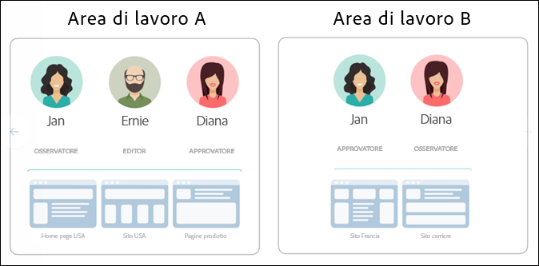
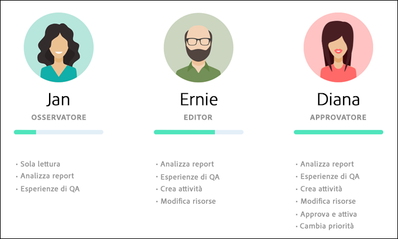
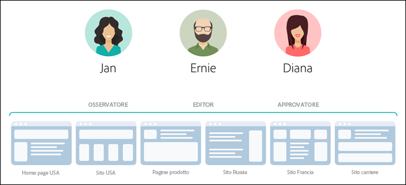
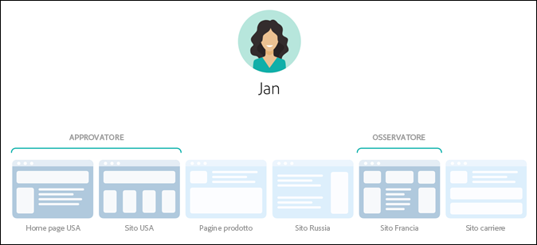
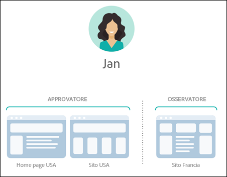
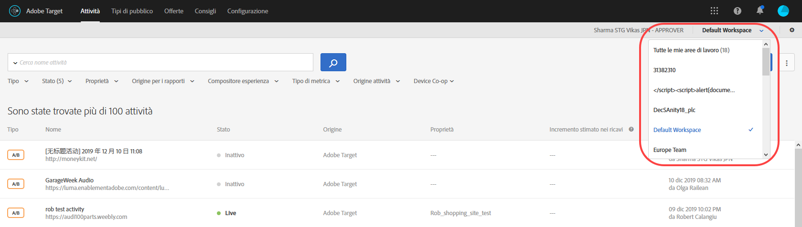
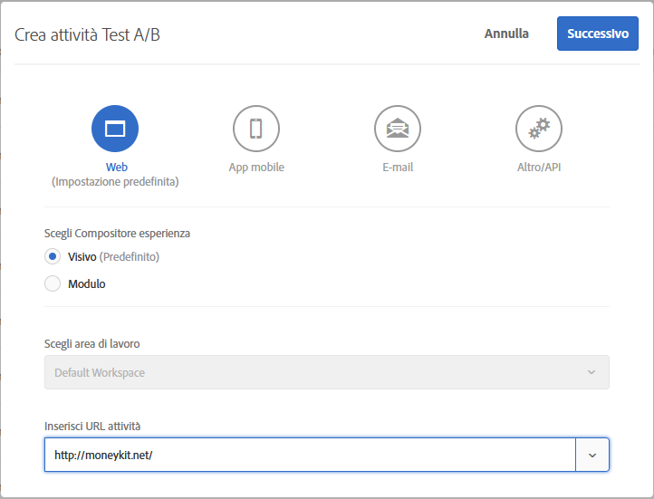
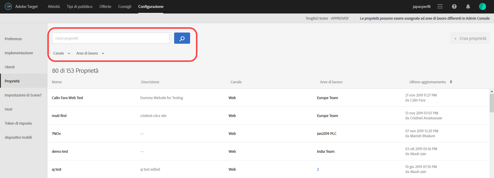

#  Autorizzazioni per utenti Enterprise{#enterprise-user-permissions}

Enterprise user permissions is a means of formal administering enterprise-wide user access to [!DNL Target]. Add users to [!DNL Target], assign permissions based on their roles, and create workspaces for teams based on different departments, global locations, channels, and other logical groupings. You can assign users the roles of [!UICONTROL Observer], [!UICONTROL Editor], or [!UICONTROL Approver].

## Stabilire se si dispone dell&#39;accesso alle autorizzazioni degli utenti Enterprise

>[!NOTE]
>
>Le funzionalità Proprietà e Autorizzazioni sono disponibili come parte della soluzione [!DNL Target] Premium. Non sono disponibili in [!DNL Target] Standard senza una licenza [!DNL Target] Premium.
>
>Your [!DNL Target] implementation can be using any version of at.js or mbox.js.

You can tell whether your organization has a Standard or Premium license by clicking the [!UICONTROL Administration] link at the top of the [!DNL Target] UI.

* **[!DNL Target Standard]Clienti**: Se viene visualizzata la scheda [!UICONTROL Utenti] ([!UICONTROL Amministrazione > Utenti]) (e non la scheda [!UICONTROL Proprietà] ), l&#39;organizzazione dispone di una [!DNL Target Standard] licenza. I clienti [!DNL Target Standard] possono seguire le istruzioni riportate in [Utenti](/help/administrating-target/c-user-management/c-user-management/user-management.md) per aggiungere utenti e assegnare autorizzazioni in [!DNL Adobe Admin Console].

* **[!DNL Target Premium]Clienti**: Se vengono visualizzate la scheda [!UICONTROL Proprietà] ([!UICONTROL Amministrazione > Proprietà]) e la scheda [!UICONTROL Utenti] , l&#39;organizzazione dispone di una [!DNL Target Premium] licenza. I clienti [!DNL Target Premium] devono seguire le istruzioni contenute in questo articolo e in [Configurare le autorizzazioni Enterprise](/help/administrating-target/c-user-management/property-channel/properties-overview.md).

## Prima di iniziare con le autorizzazioni aziendali

>[!IMPORTANT]
>
>Ensure that you read the [Caveats](../../../administrating-target/c-user-management/property-channel/property-channel.md#section_9714311B1CD9497A86F4910F8AE635E2) section below before proceeding with enterprise permissions.

## Terms and definitions used in this section {#section_F8D229544FEA41C3BC2EFD1F95AA0116}

The following terms are used throughout this section and might be new to users wanting to use the Properties and Permissions functionality in [!DNL Target] Premium.

### Proprietà

Properties are similar in nature to those within [!DNL Adobe Platform Launch] in that they use a unique snippet of code to differentiate them.

Una proprietà web è una libreria di regole e un codice incorporato. Una proprietà web può essere un raggruppamento di uno o più domini e sottodomini.

Le proprietà sono abilitate aggiungendo una coppia nome/valore specifica come parametro con qualsiasi chiamata (chiamata Target, chiamata API, ecc.) in [!DNL Target].

Le proprietà appartengono a canali specifici (web, mobile, email o API/altro).

### Area di lavoro (profilo prodotto)

Un’area di lavoro consente a un’azienda di assegnare un gruppo specifico di utenti a un insieme specifico di proprietà. Un’area di lavoro è simile per vari aspetti a una suite di rapporti di [!DNL Adobe Analytics].

Nota: Le aree di lavoro sono note come profili di [!UICONTROL prodotto] nel [!DNL Adobe Admin Console for Enterprise]pannello.

Se fai parte di un’azienda multinazionale, potresti avere un’area di lavoro per le pagine web, le proprietà o i siti europei e un’altra per le pagine web, le proprietà o i siti americani. Se fai parte di un’azienda multi-brand, potresti avere un’area di lavoro diversa per ciascuno dei marchi.

Gli utenti possono fare parte di più aree di lavoro e possono anche avere ruoli diversi all’interno di ogni area di lavoro.

Users can have different views of [!DNL Adobe Target] by moving between workspaces, similar to how [!DNL Analytics] users have different views of [!DNL Analytics] by moving between Report Suites.

Le aree di lavoro possono includere tipi di pubblico, offerte di codice e attività differenti.

Tutti i tipi di pubblico e le attività creati prima della migrazione al nuovo modello di autorizzazioni Enterprise verranno raggruppati nella “Area di lavoro predefinita” descritta di seguito.

All activities created via [!DNL Adobe Experience Manager] (AEM), [!DNL Adobe Mobile Services], and [!DNL Adobe Target Classic] will be part of the &quot;Default Workspace.&quot;

### Area di lavoro predefinita

All existing workspaces (product profiles) within [!DNL Admin Console] are merged into a single workspace called &quot;Default Workspace&quot; during your organization&#39;s migration to the new Enterprise Permissions model.

>[!IMPORTANT]
>
>Non eliminare l’area di lavoro predefinita.

All user roles and access to all [!DNL Target] functionality remains exactly the same as they were prior to the migration to the new Enterprise Permissions model.

### Gruppi di utenti

È possibile creare gruppi di utenti, ad esempio sviluppatori, analisti, addetti al marketing, dirigenti e così via, e assegnare privilegi a più prodotti Adobe e aree di lavoro. Per assegnare a un nuovo membro del team tutti i privilegi appropriati per i diversi prodotti Adobe, sarà sufficiente aggiungerlo a un gruppo di utenti specifico.

### Ruoli e autorizzazioni

I ruoli e le autorizzazioni determinano i livelli di accesso che gli utenti devono creare e gestiscono le attività nell&#39;implementazione del tuo [!DNL Target]. In [!DNL Target] i ruoli includono quanto segue:

| Ruolo | Descrizione |
|--- |--- |
| Approvatore | Può creare, modificare, attivare o interrompere le attività. |
| Editor | può creare e modificare le attività prima che siano in diretta, ma non può approvare l&#39;avvio di un&#39;attività. |
| Osservatore | Può visualizzare le attività, ma non può crearle o modificarle. |
| Editore | Simile al ruolo Osservatore (può visualizzare le attività, ma non può crearle o modificarle). Tuttavia, il ruolo Editore dispone dell&#39;autorizzazione aggiuntiva per attivare le attività. |

### Canale

Il canale si riferisce al tipo di contenuto in cui vengono recapitate le attività di [!DNL Target]: pagine Web, applicazioni mobili, messaggi e-mail e così via.

Quando si crea una nuova attività, questa viene creata nell&#39;area di lavoro attualmente selezionata. Vedrai le opzioni di selezione del canale nella prima finestra di dialogo che ti permette di scegliere il canale desiderato per l&#39;attività: Web, app mobile, e-mail o altro/API.

## Permissions overview {#section_DC2172520DA84605B218A5E9FB6D187A}

Le informazioni seguenti spiegano il modo in cui le autorizzazioni sono state applicate in precedenza in [!DNL Target] e come vengono applicate utilizzando la funzionalità [!UICONTROL Proprietà] e [!UICONTROL Autorizzazioni].

Con la nuova funzionalità [!UICONTROL Autorizzazioni] è possibile creare progetti diversi (denominati “profili di prodotto” in [!DNL Adobe Admin Console for Enterprise]) per assegnare a un singolo utente varie autorizzazioni che ne determinano i diritti di accesso per ciascun progetto. Questi progetti distinti possono essere paragonati al modo in cui le suite di rapporti funzionano in [!DNL Adobe Analytics]. In ogni progetto possono essere inclusi utenti specifici con ruoli specifici applicabili a un insieme di proprietà. Il risultato è che i clienti saranno in grado di limitare l&#39;accesso alla visualizzazione, alla modifica e all&#39;approvazione dei propri utenti in base all&#39;area, all&#39;ambiente (sviluppo, pre-produzione, produzione), al canale o ad altri criteri personalizzati.

Ad esempio, un utente specifico potrebbe avere accesso “approvato” ai siti Web americani, ma solo un accesso di “visualizzazione” sull&#39;applicazione mobile europea. Lo stesso utente potrebbe non avere alcun accesso neppure per visualizzare le attività offerte sulle proprietà Web e mobile nella regione APAC.

Il modello di [!DNL Target] [!UICONTROL Autorizzazioni] corrente dispone di tre ruoli di autorizzazione (osservatore, editor e approvatore), come illustrato nella figura seguente:

Ogni ruolo dispone di diversi livelli di autorizzazioni:

| Ruolo | Descrizione |
|--- |--- |
| Approvatore | Può creare, modificare, attivare o interrompere le attività. |
| Editor | può creare e modificare le attività prima che siano in diretta, ma non può approvare l&#39;avvio di un&#39;attività. |
| Osservatore | Può visualizzare le attività, ma non può crearle o modificarle. |
| Editore | Simile al ruolo Osservatore (può visualizzare le attività, ma non può crearle o modificarle). Tuttavia, il ruolo Editore dispone dell&#39;autorizzazione aggiuntiva per attivare le attività. |
È importante notare che il ruolo di ogni utente si applica a ogni pagina, proprietà o sito dell&#39;account che include i tag di [!DNL Target], come illustrato di seguito:

Il nuovo modello di [!DNL Target] [!UICONTROL Autorizzazioni] presenta gli stessi tre ruoli di autorizzazione (osservatore, editor e approvatore); è tuttavia possibile assegnare separatamente i ruoli delle autorizzazioni di un utente per singole pagine, proprietà o siti, come illustrato di seguito:

In questo esempio, Jan dispone delle autorizzazioni da approvatore per la Homepage e il sito internet degli Stati Uniti e le autorizzazioni da osservatore per il sito francese.

Inoltre Jan non sarà in grado di visualizzare pagine, proprietà o siti di [!DNL Target] per i quali non dispone di autorizzazioni di visualizzazione, come illustrato di seguito:

In questo esempio Jan non può visualizzare le pagine dei prodotti, il sito russo e il sito carriere.

## Scenari di utilizzo {#section_F3CE8576959E4F4CB13BEEED38311DD8}

I seguenti casi di utilizzo possono essere utili per comprendere come le proprietà, i progetti, i ruoli e le autorizzazioni consentono di raggiungere gli obiettivi di marketing con [!DNL Target]:

### Organizzazione multinazionale

Se fai parte di un’azienda multinazionale, potresti avere un’area di lavoro per le pagine web, le proprietà o i siti europei e un’altra per le pagine web, le proprietà o i siti americani. Dopo una riorganizzazione, utilizzando gli utenti tipo nelle illustrazioni di cui sopra, è possibile impostare le aree di lavoro e le autorizzazioni simili alle seguenti:

* **Jan**: Jan è il capo dell’ottimizzazione nel centro di eccellenza per le pagine Web degli Stati Uniti, le proprietà e i siti della sua organizzazione. Molto probabilmente dispone dei diritti di amministratore di sistema nel cloud Adobe Experience Cloud.

   Nel suo ruolo, ha le autorizzazioni di approvatore per la homepage degli Stati Uniti e il sito statunitense. grazie alle autorizzazioni di approvatore può creare, modificare e attivare o arrestare le attività.

   Jan si consulta anche con il team di ottimizzazione in Francia e, pertanto, dispone delle autorizzazioni di osservatore per il sito Francia che le danno un accesso in sola lettura alle attività. Jan può visualizzare le attività, ma non può crearle o modificarle.

   Siccome Jan non ha un ruolo che richiede la sua visualizzazione delle pagine dei prodotti, del sito Russia, o del sito carriere, lei non può vedere le attività per quei siti.

* **Ernie**: Ernie è un Marketing Manager per l’organizzazione ed è responsabile del marketing negli Stati Uniti.

   Siccome Ernie è entrato di recente nell&#39;organizzazione e ha poca esperienza con Target, dispone dei permessi editor per la homepage degli Stati Uniti, il sito degli Stati Uniti, e le pagine dei prodotti. Grazie alle autorizzazioni editor, Ernie può creare e modificare le attività prima che siano attive, ma non può approvare il lancio di un&#39;attività — qualcuno che dispone delle autorizzazioni di approvazione, ad esempio Jan, deve approvare l&#39;attività prima che possa essere messa in produzione.

   Siccome Ernie non ha un ruolo che richiede la sua visualizzazione del sito Russia, del sito Francia, o del sito carriere, non può vedere le attività per quei siti.

* **Diana**: Diana è ora un’analista per l’organizzazione e le sono stati concessi i permessi di osservatore per la homepage degli Stati Uniti, il sito degli Stati Uniti, le pagine dei prodotti, il sito Russia e il sito di Francia, che le consentono un accesso in sola lettura alle attività. Diana può visualizzare le attività, ma non può crearle o modificarle.

   Siccome Diana non ha alcun ruolo che richiede la sua visualizzazione del sito carriere, lei non può vedere le attività per quei siti.

### Organizzazione multi-brand

Se fai parte di un&#39;azienda multi-brand, potresti avere un&#39;area di lavoro separata per le pagine Web, le proprietà o i siti di ogni marca.

Dopo una riorganizzazione, utilizzando gli utenti tipo nelle illustrazioni di cui sopra, è possibile impostare i progetti e le autorizzazioni come di seguito:

* **Jan**: Jan è il capo dell’ottimizzazione nel centro di eccellenza di un’organizzazione sanitaria che opera nell’ambito dei prodotti ospedalieri e dei prodotti di consumo. Molto probabilmente dispone dei diritti di amministratore di sistema nel cloud Adobe Experience Cloud.

   Nel suo ruolo dispone delle autorizzazioni di approvatore per il sito ospedaliero. grazie alle autorizzazioni di approvatore può creare, modificare e attivare o arrestare le attività.

   Jan si consulta inoltre con il team di ottimizzazione nell&#39;ambito dei prodotti di consumo e, pertanto, dispone delle autorizzazioni di osservatore per quel sito, che le consentono l&#39;accesso in sola lettura alle attività. Jan può visualizzare le attività, ma non può crearle o modificarle.

* **Ernie:** Ernie è un Marketing Manager per l’organizzazione ed è responsabile del marketing nell’ambito dei prodotti di consumo.

   Siccome Ernie è entrato di recente nell&#39;organizzazione e ha poca esperienza con Target, dispone dei permessi editor per il sito consumatore. Grazie alle autorizzazioni editor, Ernie può creare e modificare le attività prima che siano attive, ma non può approvare il lancio di un&#39;attività — qualcuno che dispone delle autorizzazioni di approvazione per il sito consumatore, ma non Jan in questo caso, deve approvare l&#39;attività prima che possa essere messa in produzione.

   Siccome Ernie non ha un ruolo che richiede la sua visualizzazione del sito dell&#39;ospedale, non può vedere le attività per quel sito.

* **Diana**: Diana è ora un’analista per l’organizzazione e le sono stati concessi i permessi di osservatore per il sito dell’ospedale e il sito consumatore, che le consentono un accesso in sola lettura alle attività. Diana può visualizzare le attività, ma non può crearle o modificarle.

## Target UI Property and Permissions touchpoints {#section_3414371393BB42999A268628B5456EC9}

La nuova funzionalità delle autorizzazioni può essere vista in varie posizioni nell&#39;interfaccia utente di [!DNL Target].

* **Elenco a discesa nell&#39;area di lavoro (profilo prodotto):** l&#39;elenco a discesa nell&#39;area di lavoro viene visualizzato nella parte superiore delle pagine [!UICONTROL Attività], [!UICONTROL Tipi di pubblico] e [!UICONTROL Offerte]. Seleziona l&#39;area di lavoro desiderata per filtrare l&#39;elenco e visualizzare solo gli elementi nell&#39;area di lavoro selezionata.

   

* **Creazione di attività:** quando si crea una nuova attività, questa viene creata nell&#39;area di lavoro attualmente selezionata. Vedrai le opzioni di selezione del canale nella prima finestra di dialogo che ti permette di scegliere il canale desiderato per l&#39;attività: Web, app mobile, e-mail o altro/API.

   

* **Creazione di pubblico:** quando si crea un nuovo pubblico, questo viene creato nell&#39;area di lavoro attualmente selezionata.
* **Creazione di offerta:** quando si crea una nuova offerta, questa viene creata nell&#39;area di lavoro attualmente selezionata.
* **Pagina Proprietà (Amministrazione > Proprietà):** È possibile utilizzare la casella [!UICONTROL Ricerca] per cercare nell&#39;elenco [!UICONTROL Proprietà] .

   

## Avvertenze {#section_9714311B1CD9497A86F4910F8AE635E2}

Consider the following when using or configuring properties and permissions in [!DNL Target] Premium:

* **Importante**: non eliminare le aree di lavoro con le attività. Se questo accade, collabora con l&#39;assistenza ai clienti per recuperare quelle attività.
* Quando usi la vista Tutte le aree di lavoro:

   * Puoi visualizzare le attività, i destinatari e le offerte per tutti gli spazi di lavoro e le autorizzazioni per accedere.
   * Quando selezioni la vista Tutte le aree di lavoro, viene aggiunta una nuova colonna alla pagina Attività, Tipi di pubblico e Offerte che elenca l&#39;area di lavoro e l&#39;autorizzazione utente associate a quell&#39;elemento (Osservatore, Editor o Collaboratore).
   * Quando crei un&#39;attività, un pubblico o un&#39;offerta nella vista Tutte le aree di lavoro, devi selezionare l&#39;area di lavoro in cui deve essere creato l&#39;elemento. Possono essere selezionate solamente le aree di lavoro per cui si possiedono le autorizzazioni dell&#39;editor o dell&#39;approvatore.
   * Quando copi un&#39;attività, un pubblico o un&#39;offerta nella vista Tutte le aree di lavoro, devi selezionare l&#39;area di lavoro in cui copiare l&#39;elemento. Possono essere selezionate solamente le aree di lavoro per cui si possiedono le autorizzazioni dell&#39;editor o dell&#39;approvatore.

* Qualsiasi impostazione nelle seguenti pagine di amministrazione può essere controllata da qualsiasi approver in qualsiasi area di lavoro:

   * Compositore esperienza visivo
   * Generazione di rapporti
   * Configurazione Scene7
   * Implementazione
   * Proprietà
   * Host
   * Ambienti
   * Token di risposta
   * Utenti

* Gli utenti non possono spostare le risorse da un&#39;area di lavoro (profilo prodotto) a un&#39;altra. Copy, tuttavia, è supportato.
* Quando si visualizzano i tipi di pubblico dalla pagina [!DNL Audiences], questa viene caricata più lentamente del previsto. Se interagite in qualsiasi modo con la barra di ricerca, la pagina dei tipi di pubblico si visualizzerà più velocemente. Si tratta di un problema noto e verrà risolto in un aggiornamento imminente. Questo problema non influisce sulla selezione dei destinatari durante il flusso di lavoro della creazione di attività.
* Le risorse seguenti fanno parte del nuovo modello di autorizzazioni Enterprise:

   * Attività, gruppi di destinatari e offerte di codice create all&#39;interno di Target Standard/Premium dopo che il cliente è abilitato alle autorizzazioni. (Nota: i clienti devono avere il diritto di Target Premium.)
   * Le proprietà possono essere aggiunte alle attività esistenti nell&#39;area di lavoro predefinita. Tuttavia, questo è soggetto a modifiche.
   * Solo le nuove risorse (ad esempio attività, offerte di codice e gruppi di destinatari) create all&#39;interno di Target Premium (dopo l&#39;abilitazione delle autorizzazioni Enterprise) saranno disponibili per limitare le autorizzazioni.
   * Le risorse esterne sono disponibili solo per gli utenti nell&#39;area di lavoro predefinita. Il ruolo di un utente nell&#39;area di lavoro predefinita si applica globalmente (a tutte le richieste Target e a tutte le risorse Target).

* Le risorse seguenti *non* fanno parte del nuovo modello di autorizzazioni Enterprise:

   * Offerte immagine
   * Tutte le risorse di Recommendations, inclusi Libreria criteri, Libreria progettazioni, Catalogo, Configurazione Recommendations.
   * Le risorse esistenti (ad esempio attività, offerte di codice e gruppi di destinatari) create all&#39;interno di Target Premium prima di abilitare le autorizzazioni Enterprise possono essere copiate ma non possono essere spostate in altre aree di lavoro.
   * Le attività, i tipi di pubblico, le offerte basate su codice, le offerte immagini o qualsiasi altra risorsa creata utilizzando le soluzioni o i metodi seguenti non possono essere controllate dal modello di autorizzazioni Enterprise, ma saranno parte dell’Area di lavoro predefinita: Target Classic, Adobe Experience Manager (AEM), Adobe Mobile Services e le risorse create tramite API. Le risorse create tramite API includono le attività, i tipi di pubblico, le offerte basate su codice e le offerte di immagini.
   * Le offerte di immagini (le risorse archiviate in `https://[tenantName].marketing.adobe.com/content/mac/[tenantName]/target/offers.html#image-library` non possono essere controllate dal modello di autorizzazioni Enterprise in questo momento.
   * clickTracking e reindirizzamenti funzionano solo quando il collegamento di destinazione o la pagina di destinazione fanno parte di una proprietà inclusa nell&#39;attività. Inoltre, clickTracking potrebbe non funzionare quando si utilizza la funzione `targetPageParams()`. La funzione suggerita è `targetPageParamsAll()`.

   [!DNL Target] attualmente richiede un token `at_property` per essere presente in qualsiasi pagina in cui si verifica il rilevamento. In the event that the token is (1) not present, (2) not detected at the time of activity setup (within the VEC), or (3) not passed to the clickTracking Target call via the `targetPageParamsAll()` function, the metric will not be incremented and will appear as &quot;0.&quot;

   Lo stesso vale per le attività che utilizzano i reindirizzamenti. La pagina di destinazione deve avere un token `at_property` ed essere riconosciuta al momento della configurazione all&#39;interno di Compositore esperienza visivo.

   In una versione futura, Target lavorerà su pagine in cui non è presente alcun token `at_property` o su pagine in cui è presente un token `at_property` diverso.

* La funzionalità Autorizzazioni Enterprise non è supportata nelle [chiamate API di Adobe I/O](https://developers.adobetarget.com).

## Domande frequenti {#faqs}

Le domande frequenti sulle autorizzazioni Enterprise includono:

### Posso spostare un&#39;attività da un&#39;area di lavoro a un&#39;altra?

Sfortunatamente non è possibile spostare le attività da un&#39;area di lavoro a un&#39;altra. Tuttavia è possibile copiare un&#39;attività in qualsiasi area di lavoro sapendo che i dati di rapporto non verranno riportati. Per ulteriori informazioni, vedere “Copia/modifica di un&#39;attività quando si utilizzano aree di lavoro” in [Copia/modifica di un&#39;attività quando si utilizzano aree di lavoro](../../../c-activities/edit-activity.md#section_45A92E1DD3934523B07E71EF90C4F8B6).

Le attività create prima della migrazione continuano a essere eseguite nello stesso modo nell&#39;area di lavoro predefinita, a meno che non siano proprietà modificate e assegnate. Le attività in un&#39;area di lavoro specifica onoreranno le proprietà assegnate a quell&#39;area di lavoro e, pertanto, il comportamento potrebbe non rimanere uguale a prima della migrazione.

### Perché viene visualizzato un messaggio di errore a indicare che nessuna proprietà è associata a questa attività, anche se è stata assegnata una proprietà?

Se dopo l’implementazione di [!DNL Target] con [!DNL Adobe Launch] si riceve un messaggio di errore per indicare che non è presente alcuna proprietà associata all’attività, passa il parametro `at_property` insieme alla funzione `targetPageParams`.

### Se una pagina di reindirizzamento e l’URL attività appartengono a proprietà diverse, vengono registrate le conversioni con tracciamento dei clic?

Il tracciamento dei clic non viene registrato nelle pagine in cui la pagina e l’URL attività appartengono a proprietà diverse.

Considera lo scenario seguente (applicabile a at.js e mbox.js):

* Pagina1 appartiene a Proprietà1.
* Pagina2 appartiene a Proprietà2.
* Nell’attività, la Pagina 1 reindirizzerà a Pagina 2, contenente le tracce di clic.

Quando un visitatore apre Pagina1 in un browser, viene reindirizzato a Pagina2. Poiché la Pagina2 non è qualificata per consegnare l’attività, la chiamata di Target non contiene le tracce di clic nella risposta.

Se la pagina di reindirizzamento e l’URL attività appartengono alla stessa proprietà, le tracce di clic funzionano come previsto. Per ulteriori informazioni, consulta [Tracciamento dei clic](/help/c-activities/r-success-metrics/click-tracking.md).

## Video di formazione

I video seguenti contengono ulteriori informazioni sui concetti descritti in questo articolo.

### Training Video: Enterprise Permissions Training Video 

Finalità di apprendimento:

* I tre livelli di ruolo disponibili per gli utenti di Adobe Target
* I concetti di Proprietà e Aree di lavoro e come funzionano questi limiti e raggruppamenti per consentire il controllo sui livelli di accesso degli utenti
* Diversi esempi di Proprietà da considerare per la tua organizzazione

>[!VIDEO](https://video.tv.adobe.com/v/19042/)

### Orario ufficio: Aree di lavoro Target Premium

Questo video è una registrazione di “ Office Hours”, un’iniziativa condotta dal team di assistenza clienti Adobe.

* Creazione di un’area di lavoro (profilo di prodotto)
* Creazione delle proprietà
* Aggiunta di utenti
* Aggiornamento dell&#39;implementazione

>[!NOTE]
>
>L’interfaccia utente del menu [!DNL Target] Amministrazione [!UICONTROL (precedentemente] Configurazione ) è stata riprogettata per fornire prestazioni migliori, ridurre il tempo di manutenzione necessario per rilasciare nuove funzioni e migliorare l’esperienza dell’utente nel prodotto. Le informazioni riportate nel seguente video sono generalmente corrette; tuttavia, le opzioni potrebbero trovarsi in posizioni leggermente diverse. I video aggiornati verranno pubblicati a breve.

>[!VIDEO](https://video.tv.adobe.com/v/23643/)
