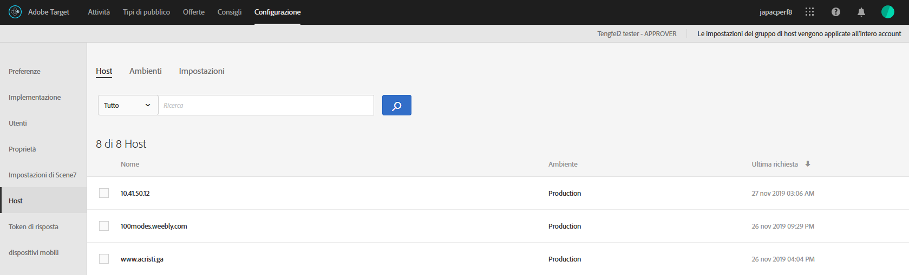

# Host

Organizza i tuoi siti e ambienti di preproduzione per gestirli facilmente e per generare rapporti separati in [!DNL Adobe Target].

L’obiettivo principale della gestione host è quello di garantire che nessun contenuto inattivo venga visualizzato accidentalmente sui siti web. La gestione host consente inoltre di separare i dati dei rapporti per [ambiente](/help/administrating-target/environments.md).

Un host è qualsiasi dominio da cui viene effettuata una richiesta [!DNL Target]. Su un sito web, in genere è la proprietà `location.hostname` dell’URL che effettua la richiesta [!DNL Target].

Per impostazione predefinita, [!DNL Target] non limita un host che può effettuare richieste [!DNL Target] e ricevere risposte [!DNL Target]. Quando i nuovi host eseguono richieste, queste funzionano automaticamente. Questo processo consente anche di eseguire test su domini diversi che non conosci o che non puoi prevedere. Se desideri ignorare questo comportamento predefinito, puoi impostare un inserire nell&#39;elenco Consentiti o un inserire nell&#39;elenco Bloccati per limitare gli host che funzionano con [!DNL Target].

Per gestire gli host, fai clic su **[!UICONTROL Amministrazione]** > **[!UICONTROL Host]**.

## Riconoscere gli host {#concept_0D4B43E23AA9408F8B28A57ED754BF65}

Per riconoscere un host e aggiungerlo all&#39;elenco [!UICONTROL Host] , è necessario soddisfare le seguenti condizioni:

* Almeno una richiesta [!DNL Target] deve esistere sull&#39;host
* Una pagina sull’host deve avere quanto segue:

   * Un preciso riferimento a at.js
   * Una richiesta [!DNL Target] o una richiesta globale generata automaticamente[!DNL Target]

* La pagina con la richiesta [!DNL Target] deve essere visualizzata in un browser

Dopo la visualizzazione della pagina, l’host è elencato nell’elenco [!UICONTROL Host] , che consente di gestirlo in un ambiente e di visualizzare in anteprima e avviare attività e test.

>[!NOTE]
>
>Questo include tutti i server di sviluppo personali.

Dopo aver aggiunto un host all’elenco degli [!UICONTROL host], assicurati che l’host sia riconosciuto.

1. Fai clic su **[!UICONTROL Amministrazione]** > **[!UICONTROL Host]**.
1. Se l’host non è elencato, aggiorna il browser. 

   Per impostazione predefinita, un host appena riconosciuto viene posizionato nell&#39;ambiente [!UICONTROL Produzione]. L&#39;ambiente [!UICONTROL Produzione] è l&#39;ambiente più sicuro perché non consente la visualizzazione delle attività inattive da questi host.

1. (Condizionale) Fai clic sull&#39;icona **[!UICONTROL Sposta]** (  ) per spostare l&#39;host in [!UICONTROL Sviluppo], [!UICONTROL Staging] o in un altro ambiente.

>[!NOTE]
>
>L&#39;ambiente [!UICONTROL Produzione] non può essere eliminato, anche se lo si rinomina. Si presume che in questo ambiente vengano eseguiti attività e test finali e attivi. L’ambiente predefinito non consente di visualizzare le campagne inattive.

## Ordinare o cercare nell’elenco Host {#section_068B23C9D8224EB78BC3B7C8580251B0}

Per ordinare l’elenco [!UICONTROL Host], fai clic su un’intestazione di colonna ([!UICONTROL Nome], [!UICONTROL Ambiente] o [!UICONTROL Ultima richiesta]) per ordinare l’elenco in ordine crescente o decrescente.

Per cercare nell’elenco [!UICONTROL Host], digita un termine di ricerca nella casella [!UICONTROL Cerca host].

## Crea inseriti nell&#39;elenco Consentiti che specificano gli host autorizzati per l’invio di richieste Target a Target. {#allowlist}

È possibile creare un inserire nell&#39;elenco Consentiti che specifichi gli host (domini) autorizzati a inviare richieste [!DNL Target] a [!DNL Target]. Tutti gli altri host che generano richieste ottengono una risposta di errore di autorizzazione con commento. Per impostazione predefinita, qualsiasi host che contiene una richiesta [!DNL Target] si registra con [!DNL Target] nell&#39;ambiente [!UICONTROL Produzione] e ha accesso a tutte le attività attive e approvate. Se non desideri questo approccio, puoi invece utilizzare l’inserire nell&#39;elenco Consentiti per registrare host specifici idonei a effettuare richieste [!DNL Target] e a ricevere contenuti [!DNL Target]. Tutti gli host continuano a essere visualizzati nell’elenco [!UICONTROL Host] e gli ambienti possono ancora essere utilizzati per raggruppare questi host e assegnare livelli diversi a ciascuno di essi, ad esempio se l’host può visualizzare attività attive e/o inattive.

Per creare un inserì nell&#39;elenco Consentiti:

1. Nell’elenco [!UICONTROL Host], fai clic su **[!UICONTROL Autorizza host]**.
1. Abilita l’opzione **[!UICONTROL Abilita host autorizzati per la distribuzione dei contenuti]** .
1. Aggiungi gli host desiderati nella casella **[!UICONTROL L’host contiene]** , a seconda delle tue esigenze.

   È possibile elencare più host, ciascuno sulla propria linea.

1. Aggiungi gli host desiderati nella casella **[!UICONTROL L’host non contiene]**, come desiderato.

   È possibile elencare più host, ciascuno sulla propria linea.

1. Fai clic su **[!UICONTROL Salva]**.

Se una richiesta [!DNL Target] viene effettuata su un host non autorizzato, la chiamata risponde con `/* no display - unauthorized mbox host */`.

>[!IMPORTANT]
>
>**Best practice** sulla sicurezza: Se utilizzi la funzionalità ubox di  [!DNL Target], questo inserire nell&#39;elenco Consentiti controlla anche l’elenco dei domini a cui il   reindirizzamento effettua la scansione. Assicurati di aggiungere eventuali domini a cui desideri reindirizzare quando utilizzi ubox come parte della tua implementazione. Se il inserire nell&#39;elenco Consentiti viene lasciato non specificato, [!DNL Adobe] non è in grado di verificare gli URL di reindirizzamento e di proteggere da potenziali reindirizzamenti dannosi.
>
>L&#39;inserire nell&#39;elenco Consentiti ha la precedenza sugli ambienti. Elimina tutti gli host prima di utilizzare la funzione di inserire nell&#39;elenco Consentiti, nell’elenco degli host vengono visualizzati solo gli host consentiti dall’inserire nell&#39;elenco Consentiti. A questo punto puoi spostare gli host nell’ambiente desiderato.

A volte i domini da altri siti appaiono negli ambienti. Un dominio viene visualizzato nell’elenco se il dominio chiama at.js. Ad esempio, se qualcuno copia una delle tue pagine web sul suo server, tale dominio verrà visualizzato nel tuo ambiente. Potrebbe anche essere possibile vedere domini da motori spider, siti di traduzione linguistica o unità disco locali.

Nei casi in cui `mboxHost` viene passato in una chiamata API, la conversione viene registrata per l’ambiente passato. Se non viene passato alcun ambiente, l’host nella chiamata viene impostato automaticamente su [!UICONTROL Produzione].

Puoi anche creare un elenco Bloccati che specifichi gli host (domini) che non possono inviare richieste [!DNL Target] a [!DNL Target] aggiungendo gli host desiderati nella casella [!UICONTROL L’host non contiene] .

>[!NOTE]
>
>L’elenco [!UICONTROL Host autorizzati] viene utilizzato sia per gli host [!DNL Target] che per gli host di reindirizzamento predefiniti. Aggiungi tutti i domini esistenti approvati per utilizzare l’ [!DNL Adobe Target] JavaScript SDK (at.js) *AND* tutti i domini utilizzati negli URL di reindirizzamento predefiniti di ubox. Aggiungi eventuali nuovi domini simili all’inserire nell&#39;elenco Consentiti in futuro.

## Eliminare un host {#section_F56355BA4BC54B078A1A8179BC954632}

Quando un host non è più necessario, è possibile eliminarlo.

1. Nell&#39;elenco [!UICONTROL Host], fai clic sull&#39;icona **[!UICONTROL Elimina]**.
1. Fai clic su **[!UICONTROL Elimina]** per confermare l’eliminazione.

>[!NOTE]
>
>L’host viene elencato di nuovo se qualcuno passa a una pagina che contiene una richiesta [!DNL Target] sull’host.

## Risoluzione dei problemi relativi agli host {#concept_B3D7583FA4BB480382CC7453529FE1B7}

Se si verificano problemi con gli host, prova i seguenti suggerimenti di risoluzione:

**L’host non viene visualizzato nell’elenco dell’account.**

* Aggiorna la pagina [!UICONTROL Host] nel browser.
* Conferma che la richiesta [!DNL Target] sia corretta, incluso il riferimento at.js.
* Prova ad accedere a una delle [!DNL Target] richieste sull’host. È possibile che nessuna richiesta [!DNL Target] sull&#39;host sia mai stata sottoposta a rendering in un browser.

**Domini casuali o sconosciuti vengono visualizzati nell&#39;elenco [!UICONTROL Host].**

Un dominio viene visualizzato in questo elenco se viene effettuata una richiesta a [!DNL Target] dal dominio. Spesso, è possibile vedere domini da motori spider, siti di traduzione linguistica o unità disco locali. Se il dominio elencato non è tra quelli utilizzati dal team, è possibile fare clic su [!UICONTROL Elimina] per rimuoverlo.

**La mia  [!DNL Target] richiesta restituisce /* no display - unauthorized mbox host */.**

Se una richiesta [!DNL Target] viene effettuata su un host non autorizzato, la richiesta risponde con /* no display - unauthorized mbox host */.
