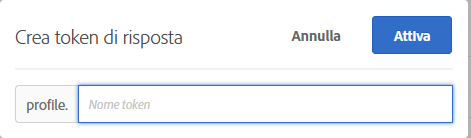

# Token di risposta

I token di risposta ti consentono di trasmettere automaticamente informazioni specifiche di [!DNL Adobe Target] alla pagina web del tuo marchio. Queste informazioni possono includere dettagli sull’attività, l’offerta, l’esperienza, il profilo utente, le informazioni geografiche e altro ancora. Questi dettagli forniscono dati di risposta aggiuntivi da condividere con strumenti interni o di terze parti o da utilizzare per il debug.

I token di risposta consentono di scegliere le variabili (in coppie di valori chiave) da utilizzare e quindi di inviarle come parte di una risposta [!DNL Target]. È possibile abilitare una variabile utilizzando l&#39;interruttore e la variabile viene inviata con le risposte [!DNL Target], che possono essere convalidate nelle chiamate di rete. I token di risposta funzionano anche in modalità [!UICONTROL Anteprima] .

Una differenza fondamentale tra plug-in e token di risposta è che i plug-in distribuiscono JavaScript alla pagina che viene eseguita al momento della consegna. I token di risposta, tuttavia, forniscono un oggetto che può quindi essere letto e agito utilizzando listener di eventi. L’approccio dei token di risposta è più sicuro e consente uno sviluppo e una manutenzione più semplici delle integrazioni di terze parti.

>[!NOTE]
>
>I token di risposta sono disponibili con la versione 2.5.0 o successiva (rilascio pianificato per il 1° giugno 2021) e con at.js versione 1.1 o successiva.[!DNL Adobe Experience Platform Web SDK]

| SDK di Target | Azioni consigliate |
|--- |--- |
| [Tutorial per Adobe Experience Platform Web SDK](/help/c-implementing-target/c-implementing-target-for-client-side-web/aep-web-sdk.md) | Assicurati di utilizzare Platform Web SDK versione 2.5.0 o successiva. Per informazioni su come scaricare la versione più recente di Platform Web SDK, consulta [Installare l’SDK](https://experienceleague.adobe.com/docs/experience-platform/edge/fundamentals/installing-the-sdk.html) nella guida *Panoramica dell’SDK per web Platform* . Per informazioni sulle nuove funzionalità in ogni versione dell’SDK per web di Platform, consulta [Note sulla versione](https://experienceleague.adobe.com/docs/experience-platform/edge/release-notes.html) nella guida *Panoramica dell’SDK per web di Platform* . |
| [at.js](/help/c-implementing-target/c-implementing-target-for-client-side-web/c-how-atjs-works/how-atjs-works.md) | Assicurati di utilizzare at.js nella versione 1.1 o successiva. Per informazioni su come scaricare l’ultima versione di at.js, consulta [Scaricare at.js](/help/c-implementing-target/c-implementing-target-for-client-side-web/how-to-deployatjs/implementing-target-without-a-tag-manager.md). Per informazioni sulle nuove funzionalità in ogni versione di at.js, vedi [Dettagli sulla versione di at.js](/help/c-implementing-target/c-implementing-target-for-client-side-web/target-atjs-versions.md).<br>I clienti che utilizzano at.js sono incoraggiati a utilizzare i token di risposta e ad abbandonare i plug-in. Alcuni plug-in che si basano su metodi interni di mbox.js, ma non in at.js, vengono consegnati ma non riescono. Per ulteriori informazioni, consulta [Limitazioni di at.js](/help/c-implementing-target/c-implementing-target-for-client-side-web/t-mbox-download/c-target-atjs-implementation/target-atjs-limitations.md). |

## Utilizzo dei token di risposta {#section_A9E141DDCBA84308926E68D05FD2AC62}

1. Assicurati di utilizzare Platform Web SDK versione 2.5.0 (o successiva) o at.js versione 1.1 (o successiva).

   Per ulteriori informazioni:

   * **SDK** web per piattaforma: Consulta  [Installare l’](https://experienceleague.adobe.com/docs/experience-platform/edge/fundamentals/installing-the-sdk.html) SDK nella guida  *panoramica* Platform Web SDK.
   * **at.js**: Consulta  [Scaricare at.js](/help/c-implementing-target/c-implementing-target-for-client-side-web/how-to-deployatjs/implementing-target-without-a-tag-manager.md#concept_1E1F958F9CCC4E35AD97581EFAF659E2).

1. In [!DNL Target], fai clic su **[!UICONTROL Amministrazione]** > **[!UICONTROL Token di risposta]**.

   

1. Attiva i token di risposta desiderati, ad esempio `activity.id` e `option.id`.

   Per impostazione predefinita sono disponibili i seguenti parametri:

   | Tipo | Parametro | Note |
   |--- |--- |--- |
   | Profili incorporati | `profile.activeActivities` | Restituisce una matrice dei codici `activityIds` per i quali il visitatore si qualifica. Viene incrementato man mano che gli utenti si qualificano. Ad esempio, in una pagina con due richieste [!DNL Target] che forniscono due diverse attività, la seconda richiesta include entrambe le attività. |
   |  | `profile.isFirstSession` | Restituisce “vero” o “falso”. |
   |  | `profile.isNewSession` | Restituisce “vero” o “falso”. |
   |  | `profile.daysSinceLastVisit` | Restituisce il numero di giorni dall’ultima visita del visitatore. |
   |  | `profile.tntId` | Restituisce il codice tntID del visitatore. |
   |  | `profile.marketingCloudVisitorId` | Restituisce l’ID visitatore di Experience Cloud per il visitatore in oggetto. |
   |  | `profile.thirdPartyId` | Restituisce l’ID di terze parti del visitatore. |
   |  | `profile.categoryAffinity` | Restituisce la categoria preferita del visitatore. |
   |  | `profile.categoryAffinities` | Restituisce una matrice delle 5 categorie principali del visitatore, sotto forma di stringhe. |
   | Attività | `activity.name`<br>`activity.id`<br>`experience.name`<br>`experience.id`<br>`option.name`<br>`option.id` | Dettagli dell’attività corrente. “Opzione” equivale a “offerta”. |
   | Geo | `geo.country`<br>`geo.state`<br>`geo.city`<br>`geo.zip`<br>`geo.dma`<br>`geo.domainName`<br>`geo.ispName`<br>`geo.connectionSpeed`<br>`geo.mobileCarrier` | Consulta [Geo](/help/c-target/c-audiences/c-target-rules/geo.md) per ulteriori informazioni sull’utilizzo del geotargeting nelle attività. |
   | Metodo di allocazione del traffico<br>(si applica solo alle attività [!UICONTROL Targeting automatico] e [!UICONTROL Automated Personalization] ). | `experience.trafficAllocationId` | Restituisce 0 se un visitatore ha ricevuto un’esperienza dal traffico &quot;di controllo&quot; e 1 se ha ricevuto un’esperienza dalla distribuzione del traffico &quot;mirata&quot;. |
   |  | `experience.trafficAllocationType` | Restituisce &quot;control&quot; o &quot;target&quot;. |

   Nell’elenco vengono visualizzati anche gli attributi del profilo utente e gli attributi del cliente.

   >[!NOTE]
   >
   >I parametri con caratteri speciali non vengono visualizzati nell’elenco. Sono supportati solo caratteri alfanumerici e il trattino basso.

1. (Condizionale) Per utilizzare un parametro di profilo come token di risposta, ma il parametro non è stato trasmesso tramite una richiesta [!DNL Target] e quindi non è stato caricato nell&#39;interfaccia utente [!DNL Target], puoi utilizzare il pulsante [!UICONTROL Aggiungi token di risposta] per aggiungere il profilo all&#39;interfaccia utente.

   Fai clic su **[!UICONTROL Aggiungi token di risposta]**, fornisci il nome del token, quindi fai clic su **[!UICONTROL Attiva]**.

   

1. Crea un’attività.

## Ascoltare risposte e leggere token di risposta

Il processo utilizzato per ascoltare le risposte [!DNL Target] e i token di risposta in lettura varia a seconda che si disponga di un’implementazione [!DNL Platform Web SDK] o at.js.

###  [!DNL Platform Web SDK] con la classe di oggetto Handle

Utilizzare la classe dell&#39;oggetto Handle, che dispone di un oggetto metadati e di un oggetto dati per ascoltare le risposte [!DNL Target] e leggere i token di risposta.

L&#39;esempio di risposta seguente aggiunge un gestore di eventi personalizzati [!DNL Platform Web SDK] direttamente alla pagina HTML (la tabella spiega gli oggetti utilizzati nel codice):

| Oggetto | Informazioni |
| --- | --- |
| Tipo - Personalization.decision | Se la decisione è stata presa dal provider [!DNL Target] o Offer Decisioning. |
| DecisionProvider - TGT | TGT-[!DNL Target]. [!DNL Target] fornisce i metadati e i valori del token di risposta alla pagina. |
| Meta | Metadati passati alla pagina. |
| Dati | Valori dei metadati passati alla pagina. |

```html
<html>

<head>
 ...
 <script src="alloy.js"></script>
 <script>
  {
   "requestId": "4d0a7cfd-952c-408c-b3b8-438edc38250a",
   "handle": [{
    "type": "personalization:decisions",
    "payload": [{
     "id": "....",
     "scope": "__view__",
     "scopeDetails": {
      "decisionProvider": "TGT",
      "activity": {
       "id": "..."
      },
      "experience": {
       "id": "...."
      }
     },
     "items": [{
      "id": "123",
      "schema": "https://ns.adobe.com/personalization/dom-action",
      "meta": {
       "activity.id": "...",
       "activity.name": "...",
       "profile.foo": "...",
       "profile.bar": "..."
      },
      "data": {
       "id": "123",
       "type": "setHtml",
       "selector": "#foo",
       "prehidingSelector": "#foo",
       "content": "<div>Hello world</div>"
      }
     }]
    }]
   }]
  }
  });
 </script>
</head>

<body>
 ...
</body>

</html>
```

###  badgeat.js utilizzando eventi personalizzati

Usa gli [eventi personalizzati di at.js](/help/c-implementing-target/c-implementing-target-for-client-side-web/atjs-custom-events.md) per ascoltare la risposta della e leggere i token di risposta.[!DNL Target]

Il codice di esempio seguente aggiunge un gestore di eventi personalizzati di [!DNL at.js] direttamente alla pagina HTML:

```html
<html> 
  <head> 
    .... 
    <script src="at.js"></script> 
    <script> 
      document.addEventListener(adobe.target.event.REQUEST_SUCCEEDED, function(e) { 
        console.log("Request succeeded", e.detail); 
      }); 
    </script> 
  <head> 
  <body> 
  ... 
  </body> 
</html>
```

## Domande frequenti sui token di risposta {#section_3DD5F32C668246289CDF9B4CDE1F536D}

**Quale ruolo è autorizzato ad attivare o disattivare i token di risposta?**

I token di risposta possono essere attivati o disattivati solo dagli utenti con il ruolo [!DNL Target] [!UICONTROL Amministratore] .

**Cosa succede se eseguo [!DNL Platform Web SDK] 2.5.0 (o versioni precedenti)?

Non hai accesso ai token di risposta.

**Cosa succede se eseguo at.js 1.0 (o versioni precedenti)?**

Puoi visualizzare i token di risposta, ma at.js non può utilizzarli.

**[!DNL Target Classic]È possibile avere attivi allo stesso tempo sia plug-in di che i token di risposta?**

Plug-in e token di risposta sono disponibili in parallelo; tuttavia, i plug-in diventeranno obsoleti in futuro.

**I token di risposta vengono consegnati attraverso tutte le  [!DNL Target] risposte o solo tramite  [!DNL Target] le risposte che forniscono un’attività?**

I token di risposta vengono consegnati solo tramite le risposte [!DNL Target] che forniscono un’attività.

**Il mio  [!DNL Target Classic] plug-in includeva JavaScript. Come posso riprodurne la funzionalità utilizzando i token di risposta?**

Durante la migrazione ai token di risposta, questo tipo di JavaScript deve essere mantenuto nel codebase o nella soluzione di gestione dei tag. Puoi attivare questo codice utilizzando gli eventi personalizzati [!DNL Platform Web SDK] o [!DNL at.js] e trasmettere i valori del token di risposta alle funzioni JavaScript.

**Perché il mio parametro profilo/attributi del cliente non viene visualizzato nell’elenco dei token di risposta?**

[!DNL Target] aggiorna normalmente i parametri ogni 15 minuti. Questo aggiornamento dipende dall’azione dell’utente e i dati vengono aggiornati solo quando visualizzi la pagina dei token di risposta. Se i parametri non vengono visualizzati nell’elenco dei token di risposta, [!DNL Target] non ha ancora aggiornato i dati.

Inoltre, se il parametro contiene elementi tranne caratteri non alfanumerici o simboli diversi dai caratteri di sottolineatura, il parametro non viene visualizzato nell’elenco. Attualmente sono supportati solo caratteri alfanumerici e il trattino basso.

**Il token di risposta continua a fornire contenuto se utilizza uno script di profilo eliminato o un parametro di profilo?**

I token di risposta estraggono informazioni dai profili utente e quindi recapitano tali informazioni. Se elimini uno script o un parametro di profilo, le informazioni non vengono necessariamente rimosse dai profili utente. I profili utente contengono ancora i dati corrispondenti allo script del profilo. Il token di risposta continua a fornire il contenuto. Per gli utenti per i quali non sono state salvate tali informazioni nei loro profili o per i nuovi visitatori, tale token non viene consegnato perché i dati non sono presenti nei loro profili.

[!DNL Target] non disattiva automaticamente il token. Se elimini uno script di profilo e non desideri più che il token venga consegnato, devi disattivare il token manualmente.

**Ho rinominato il mio script di profilo, ma il token che utilizza lo script è ancora attivo con il vecchio nome. Perché?**

Come accennato in precedenza, i token di risposta funzionano sulle informazioni del profilo salvate per gli utenti. Anche se hai rinominato il tuo script di profilo, gli utenti che hanno visitato il tuo sito web hanno il vecchio valore dello script di profilo salvato nei loro profili. Il token continua a raccogliere il valore precedente già salvato nei profili utente. Se ora desideri consegnare il contenuto del nuovo nome, devi disattivare il token precedente e attivare quello nuovo.

**Se i miei attributi sono cambiati, quando saranno rimossi dall’elenco?**

[!DNL Target] esegue un aggiornamento degli attributi a intervalli regolari. Gli attributi non attivati vengono rimossi durante l’aggiornamento successivo. Tuttavia, se un attributo è stato attivato ed è stato rimosso, tale script non viene rimosso dall’elenco degli attributi finché non lo si disattiva. Ad esempio, hai rimosso uno script di profilo utilizzato come token. [!DNL Target] rimuove dall’elenco solo gli attributi disattivati quando vengono eliminati o rinominati.

## Invia dati a Google Analytics

Le sezioni seguenti descrivono come inviare dati [!DNL Target] alle Google Analytics. I dati inviati dai token di risposta possono essere inviati ad altre integrazioni di terze parti.

###  badgeInvio di dati a Google Analytics tramite SDK per web di Platform

I dati delle Google Analytics possono essere inviati tramite Platform Web SDK versione 2.5.0 (o successiva) aggiungendo il seguente codice nella pagina HTML:

(Codice in arrivo)

###  at.js Invio di dati a Google Analytics tramite at.js {#section_04AA830826D94D4EBEC741B7C4F86156}

Puoi inviare dati a Google Analytics tramite at.js aggiungendo il seguente codice alla pagina HTML:

```javascript
<script type="text/javascript"> 
  (function(i, s, o, g, r, a, m) { 
    i['GoogleAnalyticsObject'] = r; 
    i[r] = i[r] || function() { 
      (i[r].q = i[r].q || []).push(arguments) 
    }, i[r].l = 1 * new Date(); 
    a = s.createElement(o), 
      m = s.getElementsByTagName(o)[0]; 
    a.async = 1; 
    a.src = g; 
    m.parentNode.insertBefore(a, m) 
  })(window, document, 'script', 'https://www.google-analytics.com/analytics.js', 'ga'); 
  ga('create', 'Google Client Id', 'auto'); 
</script> 
 
<script type="text/javascript"> 
  document.addEventListener(adobe.target.event.REQUEST_SUCCEEDED, function(e) { 
    var tokens = e.detail.responseTokens; 
 
    if (isEmpty(tokens)) { 
      return; 
    } 
 
    var activityNames = []; 
    var experienceNames = []; 
    var uniqueTokens = distinct(tokens); 
 
    uniqueTokens.forEach(function(token) { 
      activityNames.push(token["activity.name"]); 
      experienceNames.push(token["experience.name"]); 
    }); 
 
    ga('send', 'event', { 
      eventCategory: "target", 
      eventAction: experienceNames, 
      eventLabel: activityNames 
    }); 
  }); 
 
  function isEmpty(val) { 
    return (val === undefined || val == null || val.length <= 0) ? true : false; 
  } 
 
  function key(obj) { 
     return Object.keys(obj) 
    .map(function(k) { return k + "" + obj[k]; }) 
    .join(""); 
  } 
 
  function distinct(arr) { 
    var result = arr.reduce(function(acc, e) { 
      acc[key(e)] = e; 
      return acc; 
    }, {}); 
   
    return Object.keys(result) 
    .map(function(k) { return result[k]; }); 
  } 
</script>
```

## Eseguire il debug

Le sezioni seguenti forniscono informazioni sul debug dei token di risposta:

###  at.jsGoogle Analytics e debugging

Il codice seguente consente di eseguire il debug utilizzando Google Analytics:

```javascript
<script type="text/javascript"> 
  (function(i, s, o, g, r, a, m) { 
    i['GoogleAnalyticsObject'] = r; 
    i[r] = i[r] || function() { 
      (i[r].q = i[r].q || []).push(arguments) 
    }, i[r].l = 1 * new Date(); 
    a = s.createElement(o), 
      m = s.getElementsByTagName(o)[0]; 
    a.async = 1; 
    a.src = g; 
    m.parentNode.insertBefore(a, m) 
  })(window, document, 'script', 'https://www.google-analytics.com/analytics.js', 'ga'); 
  ga('create', 'Google Client Id', 'auto'); 
</script> 
 
<script type="text/javascript"> 
  document.addEventListener(adobe.target.event.REQUEST_SUCCEEDED, function(e) { 
    var tokens = e.detail.responseTokens; 
 
    if (isEmpty(tokens)) { 
      return; 
    } 
 
    var activityNames = []; 
    var experienceNames = []; 
    var uniqueTokens = distinct(tokens); 
 
    uniqueTokens.forEach(function(token) { 
      activityNames.push(token["activity.name"]); 
      experienceNames.push(token["experience.name"]); 
    }); 
 
    ga('send', 'event', { 
      eventCategory: "target", 
      eventAction: experienceNames, 
      eventLabel: activityNames 
    }); 
  }); 
 
  function isEmpty(val) { 
    return (val === undefined || val == null || val.length <= 0) ? true : false; 
  } 
 
  function key(obj) { 
     return Object.keys(obj) 
    .map(function(k) { return k + "" + obj[k]; }) 
    .join(""); 
  } 
 
  function distinct(arr) { 
    var result = arr.reduce(function(acc, e) { 
      acc[key(e)] = e; 
      return acc; 
    }, {}); 
   
    return Object.keys(result) 
    .map(function(k) { return result[k]; }); 
  } 
```

### Debug utilizzando l’equivalente del plug-in ttMeta

L’equivalente del plug-in ttMeta per scopi di debug può essere creato aggiungendo il seguente codice alla pagina HTML:

```javascript
<script type="text/javascript" > 
  document.addEventListener(adobe.target.event.REQUEST_SUCCEEDED, function (e) { 
    window.ttMETA= typeof(window.ttMETA)!="undefined" ? window.ttMETA : []; 
 
    var tokens=e.detail.responseTokens; 
 
    if (isEmpty(tokens)) { 
      return; 
    } 
     
    var uniqueTokens = distinct(tokens); 
 
    uniqueTokens.forEach(function(token) { 
      window.ttMETA.push({ 
        'CampaignName': token["activity.name"], 
        'CampaignId' : token["activity.id"], 
        'RecipeName': token["experience.name"], 
        'RecipeId': token["experience.id"], 
        'OfferId': token["option.id"], 
        'OfferName': token["option.name"], 
        'MboxName': e.detail.mbox}); 
      console.log(ttMETA); 
    }); 
  }); 
 
  function isEmpty(val){ 
    return (val === undefined || val == null || val.length <= 0) ? true : false; 
  } 
 
  function key(obj) { 
     return Object.keys(obj) 
    .map(function(k) { return k + "" + obj[k]; }) 
    .join(""); 
  } 
 
  function distinct(arr) { 
    var result = arr.reduce(function(acc, e) { 
      acc[key(e)] = e; 
      return acc; 
    }, {}); 
   
    return Object.keys(result) 
    .map(function(k) { return result[k]; }); 
  } 
</script>
```

##  js: Token di risposta ed eventi personalizzati at.js {#section_3AA0A6C8DBD94A528337A2525E3E05D5}

Il video seguente spiega come utilizzare i token di risposta e gli eventi personalizzati at.js per condividere le informazioni sul profilo da [!DNL Target] a sistemi di terze parti.

>[!NOTE]
>
>L&#39;interfaccia utente del menu [!DNL Target] [!UICONTROL Amministrazione] (precedentemente [!UICONTROL Configurazione]) è stata riprogettata per fornire prestazioni migliori, ridurre il tempo di manutenzione necessario per il rilascio di nuove funzioni e migliorare l&#39;esperienza utente nel prodotto. Le informazioni contenute nel video seguente sono corrette; tuttavia, le opzioni si trovano in posizioni leggermente diverse.

>[!VIDEO](https://video.tv.adobe.com/v/23253/)
