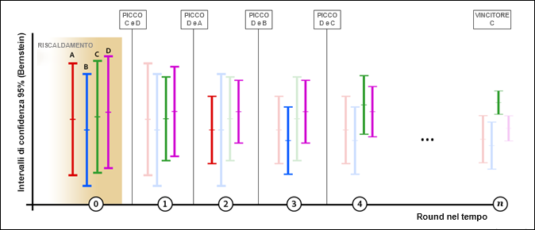

# Panoramica dell’allocazione automatica

Un’attività di allocazione automatica in [!DNL Adobe Target] identifica un vincitore tra due o più esperienze e, di conseguenza, ridistribuisce automaticamente più traffico per aumentare le conversioni, mentre il test continua a essere eseguito e ad apprendere.

Durante la creazione di un&#39;attività A/B tramite il flusso di lavoro guidato in tre passaggi, puoi scegliere l&#39;opzione [!UICONTROL Allocazione automatica all&#39;esperienza migliore] .

## La sfida {#section_85D5A03637204BACA75E19646162ACFF}

I test A/B standard hanno un costo intrinseco. Devi investire del traffico per misurare le prestazioni di ogni esperienza e capire quale sia l’esperienza vincente attraverso l’analisi. La distribuzione del traffico rimane fissa anche dopo aver compreso che alcune esperienze hanno prestazioni migliori di altre. Inoltre, è complicato calcolare la dimensione necessaria del campione, e l’attività deve essere eseguita completamente prima di poter intervenire in base al vincitore. Dopo aver fatto tutto questo, c&#39;è ancora una possibilità che il vincitore identificato non sia un vero vincitore.

## La soluzione: Allocazione automatica {#section_98388996F0584E15BF3A99C57EEB7629}

L’allocazione automatica riduce il costo e il sovraccarico associati al determinare un’esperienza vincente. L’allocazione automatica monitora le prestazioni della metrica obiettivo di tutte le esperienze e invia in modo proporzionale un numero maggiore di nuovi partecipanti alle esperienze che hanno prestazioni migliori. Per l’esplorazione delle altre esperienze viene riservata una quantità adeguata di traffico. È possibile vedere i vantaggi del test nei risultati, anche se l’attività è ancora in esecuzione: l’ottimizzazione si verifica in parallelo all’apprendimento.

L’allocazione automatica sposta gradualmente i visitatori verso esperienze vincenti, invece di richiedere di attendere fino a quando un’attività finisce per determinare un vincitore. Puoi beneficiare di incrementi più rapidi perché potenziali esperienze vincenti vengono mostrate a partecipanti che sarebbero altrimenti stati destinati a esperienze di minor successo.

Un normale test A/B in Target mostra solo confronti a coppie sfidante/controllo. Ad esempio, se un’attività ha le esperienze A, B, C e D, dove A è il controllo, un normale test A/B di Target confronterebbe A con B, A con C e A con D.

In tali test, la maggior parte dei prodotti, tra cui Target, utilizzano il calcolo del test t di Student per ottenere un indice di affidabilità basato sul valore p. Questo valore di affidabilità viene quindi utilizzato per determinare se lo sfidante è sufficientemente diverso dal controllo. Tuttavia, Target non esegue automaticamente i confronti impliciti (B con C, B con D e C con D) necessari per trovare l’esperienza effettivamente “migliore”. Di conseguenza, l’addetto al marketing deve analizzare manualmente i risultati per determinare l’esperienza “migliore”.

L’allocazione automatica esegue tutti i confronti impliciti tra le esperienze e produce un vincitore “reale”. Non vi è alcuna nozione di esperienza di “controllo” nel test.

L’allocazione automatica assegna nuovi visitatori alle esperienze fino a quando l’intervallo di affidabilità della migliore esperienza non si sovrappone a quello di qualsiasi altra esperienza. Normalmente questo processo potrebbe produrre falsi positivi, ma l’allocazione automatica utilizza intervalli di affidabilità in base alla [disuguaglianza di Bernstein](https://en.wikipedia.org/wiki/Bernstein_inequalities_(probability_theory)) che compensa le valutazioni ripetute. A questo punto, abbiamo un vincitore reale. Quando Allocazione automatica si arresta, purché non vi siano dipendenze temporali rilevanti per i visitatori che giungono alla pagina, vi è almeno un 95% di probabilità che Allocazione automatica restituisca un’esperienza la cui vera risposta non sia inferiore all’1% (relativo) rispetto alla vera risposta dell’esperienza vincente.

## Quando utilizzare Allocazione automatica, A/B o Personalizzazione automatizzata  {#section_3F73B0818A634E4AAAA60A37B502BFF9}

* Utilizza l&#39;**Allocazione automatica** quando vuoi ottimizzare l&#39;attività fin dall&#39;inizio e identificare le esperienze vincenti il più rapidamente possibile. Fornendo con maggiore frequenza le esperienze che hanno prestazioni migliori, aumentano le prestazioni complessive di attività.
* Utilizza un **[Test A/B](/help/c-activities/t-test-ab/test-ab.md#task_05E33EB15C4D4459B5EAFF90A94A7977)** standard quando vuoi caratterizzare le prestazioni di tutte le esperienze prima di ottimizzare il sito. Un test A/B ti aiuta a classificare tutte le tue esperienze, mentre l&#39;Allocazione automatica del traffico trova i migliori risultati ma non garantisce la differenziazione fra quelli minori.
* Usa la [Personalizzazione automatizzata](/help/c-activities/t-automated-personalization/automated-personalization.md#task_8AAF837796D74CF893CA2F88BA1491C9) quando desideri algoritmi di ottimizzazione della complessità più elevata, ad esempio modelli di apprendimento automatico che generano stime basate su attributi di profilo individuali. L’Allocazione automatica del traffico esamina il comportamento aggregato delle esperienze (proprio come i test A/B standard) e non distingue tra i visitatori.

## Vantaggi chiave  {#section_0913BF06F73C4794862561388BBDDFF0}

* Mantiene la rigorosità di un test A/B
* Trova un vincitore statisticamente significativo più velocemente rispetto a un test A/B manuale.
* Fornisce un maggiore incremento medio della campagna rispetto a un test A/B manuale.

## Terminologia {#section_670F8785BA894745B43B6D4BFF953188}

I seguenti termini sono utili quando si parla di Allocazione automatica:

**Slot machine:** un approccio all’ottimizzazione ti tipo [slot machine](https://en.wikipedia.org/wiki/Multi-armed_bandit) compensa l’apprendimento esplorativo e il suo sfruttamento.

## Funzionamento dell’algoritmo {#section_ADB69A1C7352462D98849F2918D4FF7B}

La logica complessiva alla base dell&#39;allocazione automatica incorpora sia le prestazioni misurate (come il tasso di conversione) sia intervalli di affidabilità dei dati cumulativi. A differenza di un test A/B standard in cui il traffico è diviso in modo uniforme tra le esperienze, l&#39;allocazione automatica alloca le modifiche del traffico tra le esperienze.

* L&#39;80% dei visitatori è assegnato utilizzando la logica intelligente descritta di seguito.
* Il 20% dei visitatori è assegnato in modo casuale in tutte le esperienze, al fine di adattarsi al cambiamento del comportamento dei visitatori.

L&#39;approccio slot machine consente di riservare alcune esperienze all’esplorazione, sfruttando le esperienze che danno buoni risultati. Un numero maggiore di nuovi visitatori vedrà le esperienze migliori, ma sarà comunque possibile reagire in caso di condizioni mutevoli. Questi modelli si aggiornano almeno una volta all&#39;ora per assicurarsi che il modello reagisca ai dati più recenti.

Man mano che più visitatori accedono all’attività, alcune esperienze iniziano a dimostrarsi di maggior successo e viene quindi incrementato il traffico inviato a tali esperienze. Il 20% del traffico continua a contribuire casualmente all’esplorazione di tutte le esperienze. Se una delle esperienze dalle prestazioni peggiori inizia a ottenere risultati migliori, le viene allocato più traffico. Oppure se il successo di un’attività con ottime prestazioni diminuisce, le viene assegnato meno traffico. Questo si verifica ad esempio se i visitatori cercano informazioni diverse sul tuo sito multimediale a causo di un particolare evento oppure se le offerte speciali del fine settimana nel tuo sito retail generano risultati diversi.

Nell&#39;illustrazione seguente viene mostrato come potrebbe comportarsi l&#39;algoritmo durante un test con quattro esperienze:

L&#39;illustrazione mostra come il traffico assegnato a ogni esperienza progredisca nell&#39;acro di parecchi turni della durata dell&#39;attività, finché non sia possibile determinare un chiaro vincitore.

| Turno | Descrizione |
|--- |--- |
|  | **Turno di riscaldamento (0)**: durante il turno di riscaldamento, ogni esperienza ottiene pari ripartizione del traffico fino a quando ogni esperienza in attività ha un minimo di 1.000 visitatori e 50 conversioni.<ul><li>Esperienza A=25%</li><li>Esperienza B=25%</li><li>Esperienza C=25%</li><li>Esperienza D=25%</li></ul>Dopo che ogni esperienza ottiene 1.000 visitatori e 50 conversioni, Target avvia l&#39;allocazione automatica del traffico. Tutte le allocazioni avvengono in turni e vengono raccolte due esperienze per ogni turno. Solo due esperienze progrediscono al turno successivo: D e C. Progredire significa che alle due esperienze è assegnato l’80% del traffico equamente, mentre le altre due esperienze continuano a partecipare ma con solo il 20% dell’allocazione casuale del traffico generato da nuovi visitatori che accedono all’attività. Tutte le allocazioni vengono aggiornate ogni ora (mostrato in alto per turni lungo l&#39;asse x). Dopo ogni turno, i dati cumulativi vengono confrontati. |
|  | **Turno 1**: durante questo turno, l’80% di traffico è assegnato alle esperienze C e D (40% ciascuna). Il 20% del traffico viene assegnato in modo casuale alle esperienze A, B, C e D (5% ciascuna). Durante questo turno, l&#39;esperienza A registra buoni risultati.<ul><li>L&#39;algoritmo sceglie l&#39;esperienza D per passare al turno successivo perché ha il più alto tasso di conversione (come indicato da sulla scala verticale di ogni attività).</li><li>L&#39;algoritmo sceglie anche l&#39;esperienza A per proseguire perché, tra le esperienze rimanenti, ha il limite superiore più alto dell&#39;intervallo di affidabilità Bernstein al 95%.</li></ul>Le esperienze D e A proseguono. |
|  | **Turno 2**: durante questo turno, l’80% del traffico è assegnato alle esperienze A e D (40% ciascuna). Il 20% del traffico è allocato in modo casuale, quindi A, B, C e D ricevono rispettivamente il 5% del traffico. Durante questo turno, l’esperienza B registra buoni risultati.<ul><li>L&#39;algoritmo sceglie l&#39;esperienza D per passare al turno successivo perché ha il più alto tasso di conversione (come indicato da sulla scala verticale di ogni attività).</li><li>L&#39;algoritmo sceglie anche l&#39;esperienza B per proseguire perché, tra le esperienze rimanenti, ha il limite superiore più alto dell&#39;intervallo di affidabilità Bernstein al 95%.</li></ul>Le esperienze D e B proseguono. |
|  | **Turno 3**: durante questo turno, l’80% di traffico è assegnato alle esperienze B e D (40% ciascuna). Il 20% del traffico è allocato in modo casuale, quindi A, B, C e D ricevono rispettivamente il 5% del traffico. Durante questo turno, l&#39;esperienza D continua a fornire buoni risultati, così come l&#39;esperienza C.<ul><li>L&#39;algoritmo sceglie l&#39;esperienza D per passare al turno successivo perché ha il più alto tasso di conversione (come indicato da sulla scala verticale di ogni attività).</li><li>L&#39;algoritmo sceglie anche l&#39;esperienza C per proseguire perché, tra le esperienze rimanenti, ha il limite superiore più alto dell&#39;intervallo di affidabilità Bernstein al 95%.</li></ul>Le esperienze D e C proseguono. |
|  | **Turno 4**: durante questo turno, l’80% di traffico è assegnato alle esperienze C e D (40% ciascuna). Il 20% del traffico è allocato in modo casuale, quindi A, B, C e D ricevono rispettivamente il 5% del traffico. Durante questo turno, l&#39;esperienza C risulta avere buone prestazioni.<ul><li>L&#39;algoritmo sceglie l&#39;esperienza C per passare al turno successivo perché ha il più alto tasso di conversione (come indicato da sulla scala verticale di ogni attività).</li><li>L&#39;algoritmo sceglie anche l&#39;esperienza D per proseguire perché, tra le esperienze rimanenti, ha il limite superiore più alto dell&#39;intervallo di affidabilità Bernstein al 95%.</li></ul>Le esperienze C e D proseguono. |
|  | **Turno n**: mentre l&#39;attività progredisce, inizia a emergere un&#39;esperienza con prestazioni elevate e il processo continua fino a individuare un&#39;esperienza vincente. Quando l’intervallo di confidenza dell’esperienza con il tasso di conversione più elevato non si sovrappone all’intervallo di confidenza di qualsiasi altra esperienza, questa viene contrassegnata come vincitrice e un [badge compare nella pagina dell’attività](/help/c-activities/automated-traffic-allocation/determine-winner.md) e nell’elenco Attività.<ul><li>L&#39;algoritmo sceglie l’esperienza C come chiaro vincitore</li></ul>A questo punto l&#39;algoritmo indirizza l’80% del traffico all’esperienza C, mentre il 20% del traffico continua a essere indirizzato casualmente a tutte le esperienze (A, B, C e D). In totale, C ottiene l’85% del traffico. Nel caso improbabile che l’intervallo di affidabilità del vincitore inizi a sovrapporsi di nuovo cpn quello di un’altra esperienza, l’algoritmo ritorna al comportamento del turno 4 di cui sopra. **Importante**: se scegliessi manualmente un vincitore in una fase precedente del processo, rischieresti di scegliere l’esperienza sbagliata. Per questo motivo, è consigliabile attendere che l’algoritmo determini l’esperienza vincente. |

>[!NOTE]
>
>Se un’attività ha solo due esperienze, entrambe ottengono la stessa quantità di traffico fino a quando [!DNL Target] non trova un’esperienza vincente con il 75% di affidabilità. A quel punto, 2/3 del traffico è assegnato al vincitore e 1/3 al perdente. In seguito, quando un’esperienza raggiunge il 95% di affidabilità, il 90% di traffico è assegnato al vincitore e il 10% al perdente. Manteniamo sempre del traffico inviato all’esperienza &quot;perdente&quot; per evitare falsi positivi a lungo termine (ovvero mantenere alcune esplorazioni).

Dopo l&#39;attivazione di un&#39;attività [!UICONTROL Allocazione automatica], dall&#39;interfaccia utente non sono consentite le seguenti operazioni:

* Impostazione della modalità di Allocazione traffico su Manuale
* Modifica del tipo di metrica obiettivo
* Modifica delle opzioni nel pannello “Impostazioni avanzate”

## Come funziona l’allocazione automatica

Per ulteriori informazioni, consulta [Allocazione automatica può fornire risultati di test più rapidi e ricavi più elevati rispetto a un test manuale](/help/c-activities/automated-traffic-allocation/faster-results-higher-revenue.md)

## Avvertenze {#section_5C83F89F85C14FD181930AA420435E1D}

**La funzione Allocazione automatica funziona con una sola impostazione di metriche avanzate: Incrementa il conteggio e mantieni l’utente nell’attività**

Le seguenti impostazioni di metriche avanzate non sono supportate: “Incrementa il conteggio, rilascia l’utente e consenti nuovo accesso” e “Incrementa il conteggio, rilascia l’utente e impedisci nuovo accesso”.

**I visitatori di ritorno frequenti possono gonfiare i tassi di conversione dell’esperienza.**

Se un visitatore che vede l’esperienza A torna frequentemente e la sua conversione si verifica più volte, il tasso di conversione (CR) dell’esperienza A aumenta artificialmente. Confronta con questo caso con l’esperienza B, dove si verifica la conversione dei visitatori ma questi non tornano spesso. Di conseguenza, il tasso di conversione di A sembra migliore rispetto al tasso di conversione di B, e i nuovi visitatori hanno quindi maggiori probabilità di essere assegnati ad A anziché a B. Se scegli di eseguire il conteggio una volta per partecipante, il tasso di conversione di A e quello di B potrebbero risultare identici.

Se i visitatori di ritorno sono distribuiti in modo casuale, è più probabile che il loro effetto sui tassi di conversione venga mitigato. Per attenuare questo effetto, è consigliabile modificare il metodo di conteggio della metrica obiettivo per conteggiare ogni partecipante una sola volta.

**Differenzia fra esperienze con prestazioni elevate, non fra quelle con prestazioni inferiori.**

La funzione Allocazione automatica è in grado di distinguere tra le esperienze dalle prestazioni migliori (e trovare un vincitore). Ci potrebbero essere momenti in cui non vi è abbastanza differenziazione tra le esperienze con prestazioni inferiori.

Se desideri produrre una differenziazione statisticamente significativa tra tutte le esperienze, considera l&#39;utilizzo della modalità di Allocazione traffico manuale.

**I tassi di conversione correlati al tempo (o contestualmente variabili) possono distorcere le proporzioni di allocazione.**

Alcuni fattori che possono essere ignorati durante un test A/B standard perché influiscono ugualmente su tutte le esperienze non possono essere ignorati in un test di Allocazione automatica. L&#39;algoritmo è sensibile ai tassi di conversione osservati. Di seguito sono riportati alcuni esempi di fattori che possono influenzare le prestazioni dell&#39;esperienza in modo disuguale:

* Esperienze con rilevanza contestuale (fattore temporale, posizione, genere, ecc.) variabile.

   Ad esempio:

   * “Grazie a Dio è venerdì” genera un maggior numero di conversioni il venerdì.
   * “Accendi il tuo lunedì” genera un maggior numero di conversioni il lunedì.
   * “Preparati per un inverno in montagna” genera un maggior numero di conversioni nelle regioni di montagna o in quelle con inverni più rigorosi.

Queste situazioni possono sfalsare i risultati di un test di Allocazione automatica più che quelli di un test A/B, perché il test A/B analizza i risultati su un periodo più lungo.

* Esperienze con ritardi diversi nella conversione possono essere dovute all’urgenza del messaggio.

   Ad esempio, “i saldi al 30% finiscono oggi” incita il visitatore ad eseguire oggi stesso la conversione, mentre “50% di sconto sul primo acquisto” non crea lo stesso senso di urgenza.

## Domande frequenti {#section_0E72C1D72DE74F589F965D4B1763E5C3}

Consulta le seguenti domande frequenti e risposte mentre lavori con le attività [!UICONTROL Allocazione automatica] :

### Analytics for Adobe Target (A4T) supporta le attività di allocazione automatica?

Sì. Per ulteriori informazioni, consulta [Supporto A4T per attività di allocazione automatica e targeting automatico](/help/c-integrating-target-with-mac/a4t/a4t-at-aa.md).

###  I visitatori di ritorno vengono riallocati automaticamente alle esperienze con prestazioni elevate?

No. Solo i nuovi visitatori vengono allocati automaticamente. I visitatori di ritorno continuano a vedere la loro esperienza originale. Questo protegge la validità del test A/B.

###  In che modo l’algoritmo tratta i falsi positivi?

L’algoritmo garantisce un&#39;affidabilità del 95% o un tasso di falsa positività del 5% se si attende che appaia il badge del vincitore.

### Quando Allocazione automatica inizia ad allocare il traffico?

L’algoritmo inizia a funzionare dopo che tutte le esperienze nell’attività hanno un minimo di 1.000 visitatori e 50 conversioni.

### Quanto aggressivamente viene applicato l’algoritmo?

L’80% del traffico viene servito con Allocazione automatica e il 20% del traffico viene servito in modo casuale. Quando viene identificato un vincitore, a tutto l&#39;80% del traffico viene veicolata l’esperienza vincente, mentre tutte le esperienze continuano a ricevere un certo traffico come parte del 20%, compresa quella vincente.

### Le esperienze perdenti vengono mostrate?

Sì. Con un approccio di tipo slot machine, almeno il 20% del traffico è riservato all’esplorazione di modifiche nei pattern o nei tassi di conversione in tutte le esperienze.

### Cosa succede alle attività con tempi di conversione lunghi?

Fintanto che tutte le esperienze ottimizzate avranno ritardi simili, il comportamento è lo stesso di un&#39;attività con un ciclo di conversione più veloce. Tuttavia sarà necessario più tempo per raggiungere la soglia di 50 conversiono superata la quale inizierà il processo di allocazione del traffico.

###  Quali sono le differenze tra Allocazione automatica e Personalizzazione automatizzata?

La funzione Personalizzazione automatizzata utilizza gli attributi del profilo di ogni visitatore per determinare l&#39;esperienza migliore. In tal modo, non solo ottimizza, ma personalizza anche l’attività per quell’utente.

La funzione Allocazione automatica, invece, è un test A/B che produce un vincitore aggregato (l’esperienza più popolare, ma non necessariamente più efficace per ogni visitatore).

###  I visitatori di ritorno gonfiano il tasso di conversione sulla metrica di successo? 

Attualmente, la logica favorisce i visitatori che si convertono rapidamente o che effettuano visite frequenti. Questo perché tali visitatori aumentano temporaneamente il tasso di conversione complessivo dell’esperienza a cui appartengono. L’algoritmo si regola frequentemente, quindi l’aumento del tasso di conversione viene amplificato in ogni istantanea. Se il sito riceve molti di visitatori di ritorno, le loro conversioni possono potenzialmente aumentare il tasso di conversione globale per l’esperienza a cui appartengono. C&#39;è una buona probabilità che i visitatori di ritorno siano distribuiti in modo casuale, nel qual caso l’effetto aggregato (aumento dell’incremento) è mitigato. Per attenuare questo effetto, è consigliabile modificare il metodo di conteggio della metrica di sucesso per conteggiare ogni partecipante una sola volta.

### Posso utilizzare il Calcolatore dimensione campione quando utilizzo Allocazione automatica, per stimare in quanto tempo verrà identificato il vincitore?

Puoi utilizzare il [Calcolatore dimensione campione](https://docs.adobe.com/content/target-microsite/testcalculator.html) esistente per stimare per quanto tempo verrà eseguito il test. (Come per il tradizionale test A/B, applica la correzione Bonferroni se stai testando più di due offerte o più di una metrica/ipotesi di conversione.) Questo calcolatore è progettato per i tradizionali test A/B a orizzonte fisso e fornisce solo una stima. L’utilizzo del calcolatore per un’attività di allocazione automatica è facoltativo perché l’allocazione automatica dichiarerà un vincitore. Non è necessario scegliere un punto fisso per esaminare i risultati del test. I valori forniti sono sempre statisticamente validi. Nei nostri esperimenti, abbiamo trovato quanto segue:
* Quando si sottopongono a test esattamente due esperienze, l’allocazione automatica trova un vincitore più rapidamente rispetto al test a orizzonte fisso (ovvero l’intervallo temporale suggerito dal calcolatore delle dimensioni del campione) quando la differenza di prestazioni tra le esperienze è grande, ma potrebbe richiedere più tempo per identificare un vincitore quando la differenza di prestazioni tra le esperienze è piccola. In questi casi, i test a orizzonte fisso sarebbero generalmente terminati senza un risultato statisticamente significativo.
* Quando si sottopongono a test più di due esperienze, l’allocazione automatica trova un vincitore più rapidamente rispetto al test a orizzonte fisso (ovvero l’intervallo temporale suggerito dal calcolatore delle dimensioni del campione) quando una singola esperienza esegue con maggiore efficienza tutte le altre esperienze. Quando due o più esperienze sono entrambe &quot;vincenti&quot; rispetto ad altre esperienze ma strettamente associate tra loro, l’allocazione automatica potrebbe richiedere un tempo aggiuntivo per determinare quale sia superiore. In questi casi, i test a orizzonte fisso si sarebbero generalmente conclusi concludendo che le esperienze &quot;vincenti&quot; erano migliori delle esperienze con prestazioni peggiori, ma non hanno identificato quale fosse superiore.

### È necessario rimuovere un’esperienza insoddisfacente da un’attività di allocazione automatica per velocizzare il processo di determinazione di un vincitore?

Non c&#39;è alcun motivo per rimuovere un&#39;esperienza insoddisfacente. L’allocazione automatica distribuisce automaticamente esperienze con prestazioni elevate più spesso e fornisce invece esperienze con prestazioni meno frequenti. Lasciare un’esperienza insoddisfacente nell’attività non influisce in modo significativo sulla velocità per determinare un vincitore.

Il 20% dei visitatori viene assegnato in modo casuale attraverso tutte le esperienze. La quantità di traffico destinata a un’esperienza con prestazioni inferiori è minima (20% diviso per il numero di esperienze).

### Posso cambiare la metrica di obiettivo a metà strada attraverso un&#39;attività di allocazione automatica? {#change-metric}

Non è consigliabile modificare la metrica obiettivo a metà strada all’interno di un’attività. Anche se è possibile modificare la metrica dell’obiettivo durante un’attività utilizzando l’ [!DNL Target] interfaccia utente, è sempre necessario avviare una nuova attività. Non forniamo alcuna garanzia su ciò che accade se modifichi la metrica dell’obiettivo in un’attività dopo l’esecuzione.

Questa raccomandazione si applica alle attività [!UICONTROL Allocazione automatica], [!UICONTROL Targeting automatico] e [!UICONTROL Automated Personalization] che utilizzano [!DNL Target] o [!DNL Analytics] (A4T) come origine per la generazione di rapporti.

### È possibile utilizzare l’opzione Ripristina dati dei rapporti durante l’esecuzione di un’attività di allocazione automatica?

Non è consigliato utilizzare l’opzione [!UICONTROL Ripristina dati rapporto] per le attività [!UICONTROL Allocazione automatica] . Anche se rimuove i dati di reporting visibili, questa opzione non rimuove tutti i record di formazione dal modello [!UICONTROL Allocazione automatica]. Invece di utilizzare l&#39;opzione [!UICONTROL Ripristina dati rapporto] per le attività [!UICONTROL Allocazione automatica], crea una nuova attività e disattiva l&#39;attività originale. (Nota: Questa guida si applica anche alle attività [!UICONTROL Targeting automatico] e [!UICONTROL Automated Personalization].)

### Come vengono generati i modelli di allocazione automatica per quanto riguarda gli ambienti?

[!UICONTROL L’] allocazione automatica crea modelli in base al comportamento di traffico e conversione registrato solo nell’ambiente predefinito. Per impostazione predefinita, [!UICONTROL Produzione] è l&#39;ambiente predefinito, ma può essere modificato in Target [Amministrazione > Ambienti](/help/administrating-target/environments.md).

Se un hit si verifica in un altro ambiente (non predefinito), il traffico verrà distribuito in base al comportamento di conversione osservato nell’ambiente predefinito. Il risultato di tale hit (conversione o non conversione) verrà registrato a scopo di reporting ma non verrà preso in considerazione nel modello [!UICONTROL Allocazione automatica] .

Quando selezioni un altro ambiente, il rapporto mostra il traffico e le conversioni per tale ambiente. L’ambiente selezionato predefinito per un rapporto sarà sempre quello predefinito a livello di account selezionato. L’ambiente predefinito non può essere impostato per attività.

## Video di formazione {#section_893E5B36DC4A415C9B1D287F51FCCB83}

I video seguenti contengono ulteriori informazioni sui concetti descritti in questo articolo.

### Flusso di lavoro di un&#39;attività - Targeting (2:14)  

Questo video include informazioni su come impostare l&#39;allocazione del traffico.

* Assegnare un pubblico all’attività
* Limitare il traffico verso l’alto o il basso
* Selezionare il metodo di allocazione del traffico
* Allocare il traffico tra diverse esperienze

>[!VIDEO](https://video.tv.adobe.com/v/17385)

### Creazione di test A/B (8:36) 

In questo video viene illustrato come creare un test A/A utilizzando il flusso di lavoro guidato in tre passaggi di Target. L’allocazione automatica del traffico è trattata a partire dal minuto 4:45.

* Creare un’attività A/B in Adobe Target
* Allocare il traffico con suddivisione manuale o automatica del traffico

>[!VIDEO](https://video.tv.adobe.com/v/17391)
