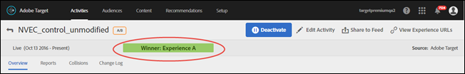

# Determinare un vincitore{#determine-a-winner}

Gli indicatori nell’interfaccia utente di Target consentono di determinare l’esperienza migliore in un’attività di allocazione automatica A/B.

Molti addetti al marketing commettono l’errore di dichiarare un’esperienza vincente prima che i risultati indichino chiaramente quale sia l’esperienza migliore. Ora abbiamo reso più facile determinare il vincitore.

## Visualizzazione del badge vincitore nell'interfaccia utente di Target {#section_24007470CF5B4D30A06610CE8DD23CE3}

Quando utilizzi la funzione di [!UICONTROL Allocazione automatica], [!DNL Target] mostra un badge nella parte superiore della pagina dell'attività che indica “Ancora nessun vincitore” finché l'attività non raggiunge il numero minimo di conversioni con sufficiente affidabilità.

Quando viene dichiarata l'esperienza migliore, in [!DNL Target] appare la scritta “Vincitore: esperienza X”.

>[!NOTE]
>
>Le attività di Allocazione automatica sono progettate per trovare la migliore esperienza tra tutte le opzioni e non solo per fare confronti in coppia con il controllo.

## Garanzie statistiche di Allocazione automatica {#section_7AF3B93E90BA4B80BC9FC4783B6A389C}

Al termine di un'attività A/B, Allocazione automatica garantisce che il vincitore determinato abbia un tasso di falso positivo efficace del 5%. Questo significa che solo per il 5% del tempo, il vincitore determinato non è in realtà la migliore esperienza tra tutte le esperienze nell'attività. Per un test A/A (con esperienze identiche), concludiamo un test inferiore al 5% del tempo. Il comportamento previsto per un test A/A (con esperienze identiche) è l'esecuzione indefinita e quindi il badge del vincitore non dovrebbe mai apparire.

Non utilizziamo l’affidabilità basata sul valore p per l'Allocazione automatica.

La colonna Affidabilità in un'attività di Allocazione automatica (illustrata di seguito) visualizza la probabilità che un'esperienza sia il vincitore entro l'1% di margine di errore (cioè l'algoritmo utilizza un effetto minimo rilevabile dell'1% tra il tasso di conversione migliore e il secondo migliore). L'algoritmo utilizza la [disuguaglianza di Bernstein](https://en.wikipedia.org/wiki/Bernstein_inequalities_(probability_theory)) per calcolare questa probabilità.

I test A/B normali calcolano l’affidabilità in base ai valori p. L'Allocazione automatica non utilizza i valori p. I valori p calcolano “liberamente” la probabilità che una determinata esperienza sia diversa dal controllo. Questi valori p possono essere utilizzati solo per determinare se un'esperienza potrebbe essere diversa dal controllo. Questi valori non possono essere utilizzati per determinare se un'esperienza è diversa da un'altra esperienza (non controllo).

Nell'illustrazione seguente viene mostrata un'attività che non ha ancora un vincitore:

Nell'illustrazione seguente viene mostrata un'attività che ha un vincitore:

## Domande frequenti {#section_C8E068512A93458D8C006760B1C0B6A2}

**L’attività è in corso da un paio di giorni. Perché tutti i valori di affidabilità mostrano ancora 0%?**

Nella colonna [!UICONTROL Affidabilità] del rapporto per tutte le attività viene visualizzato 0% per i seguenti motivi:

* I test A/B manuali e l'allocazione automatica utilizzano statistiche diverse per visualizzare i valori di affidabilità.

   I test A/B manuali utilizzano valori p basati sul [test t di Student](https://en.wikipedia.org/wiki/Student%27s_t-test). Un valore P è la probabilità di trovare la differenza osservata (o più estrema) tra un'esperienza e il controllo, dato che in realtà non esiste una differenza simile. Questi valori P possono essere utilizzati solo per determinare se i dati osservati sono coerenti con un'esperienza specifica e il controllo è lo stesso. Questi valori non possono essere utilizzati per determinare se un'esperienza è diversa da un'altra esperienza (non controllo).

   L'allocazione automatica mostra la probabilità che una determinata esperienza sia un vero vincitore in tutte le esperienze dell'attività. Questo significa che solo un'esperienza vincente (che è più probabile che sia il vincitore), avrà un valore di affidabilità diverso da zero. Tutte le altre hanno più probabilità di essere perdenti e presentano il valore 0%.

* L'allocazione automatica inizia a mostrare un valore di affidabilità solo dopo che l'esperienza vincente avrà raccolto il 60% di affidabilità. L'allocazione automatica è approssimativamente due volte più veloce di un normale test A/B. Puoi determinare quanto tempo richiede un normale test A/B con il [calcolatore della dimensione del campione](https://docs.adobe.com/content/target-microsite/testcalculator.html): inserisci il tasso di conversione del controllo in “Tasso di conversione di base”, “5%” per “Incremento” e 95% per “Affidabilità”. In genere, i valori di affidabilità iniziano a comparire dopo che ogni esperienza ha accumulato almeno il 50% dei campioni richiesti per esperienza. Questo ti dà un'idea di quando potrai iniziare a vedere valori di affidabilità.
* Se il rapporto presenta 0% per tutte le esperienze, è probabile che sia ancora troppo presto nel corso dell’attività.

