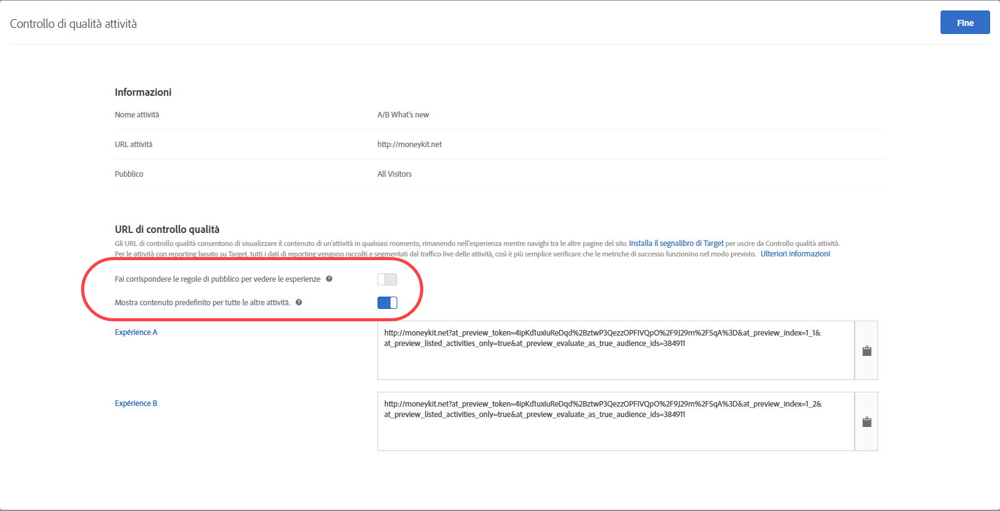

# Controllo di qualità delle attività

Gli URL di controllo qualità in [!DNL Adobe Target] consentono di verificare in modo semplice e completo la qualità delle attività tramite collegamenti di anteprima che restano invariati, l’eventuale definizione di un pubblico di destinazione e rapporti di controllo qualità mantenuti separati dai dati delle attività live.

## Panoramica {#section_11B761A522A14E61978275772210A4C2}

Il controllo di qualità delle attività permette di testare completamente le attività Target prima di pubblicarle. La funzionalità Controllo di qualità attività include:

* Collegamenti da condividere con i membri del gruppo, che non cambiano mai né richiedono di essere generati di nuovo, anche in seguito a modifiche apportate alle esperienze o attività.. Questo consente di testare completamente le attività nell’intero percorso dell’utente.
* Possibilità di rispettare o meno le condizioni di pubblico, per testare i criteri di targeting o per ignorarli al fine di verificare come si presentano le esperienze senza dover soddisfare le condizioni di pubblico.
* Il rapporto di controllo qualità viene acquisito per permettere agli addetti al marketing di confermare che le metriche aumentano come previsto, e i relativi dati sono tenuti separati dai rapporti di produzione (per la generazione di rapporti non A4T).
* Possibilità di visualizzare in anteprima un’esperienza in isolamento o in combinazione con altre attività live che soddisfano i criteri di consegna (pagina/richiesta Target/pubblico).
* Capacità di eseguire il controllo qualità sull’intero percorso dell’utente. Puoi accedere al tuo sito una volta con il collegamento di controllo qualità e quindi navigare nell’intero sito in modalità di controllo qualità dell’attività. Resterai in tale modalità fino alla fine della sessione o fino a quando utilizzi il [Bookmarklet di controllo qualità di Target](/help/c-activities/c-activity-qa/activity-qa-bookmark.md#concept_A8A3551A4B5342079AFEED5ECF93E879) per uscire dalla modalità di controllo qualità dell’attività. Questa funzionalità è particolarmente utile per le attività che si estendono su più pagine web.

   >[!NOTE]
   >
   >Questo vale per le implementazioni at.js con versione 2.** xor in seguito. Per at.js 1.** ximplementations, questo vale solo se il browser del visitatore non blocca i cookie di terze parti.

## Accesso e condivisione di un URL di controllo qualità {#section_1C59BAA247B247BDB125D1BE8EAD4547}

1. Dalla pagina [!UICONTROL Panoramica] di un&#39;attività, fai clic sul collegamento **[!UICONTROL Controllo di qualità delle attività]** .

   

1. Configura le seguenti impostazioni:

   

   * **Fai corrispondere le regole di pubblico per vedere le esperienze:** in alcuni casi puoi voler verificare che la corrispondenza del pubblico funzioni. In altri, potresti voler controllare solo come si presenta un’attività. Se questa impostazione viene attivata, i soggetti del test devono soddisfare i requisiti di targeting per risultare idonei a visualizzare le esperienze. Per le attività di targeting di esperienza (XT), viene fornito un singolo URL di attività. Se il visitatore soddisfa le regole di targeting, l’esperienza verrà visualizzata.

      Se questa impostazione è disattivata, quando si fa clic sui collegamenti le esperienze vengono sempre visualizzate, anche se le regole non sono soddisfatte. Durante il controllo qualità, puoi attivare e disattivare questa opzioni per richiedere o ignorare il rispetto delle regole di targeting del pubblico.

   * **Mostra contenuto predefinito per tutte le altre attività:** se questa opzione è attivata, il contenuto predefinito viene visualizzato per tutte le altre attività (ad esempio, l’anteprima verrà visualizzata in isolamento senza considerare tutte le altre attività live presenti nella stessa pagina/[!DNL Target] richiesta).

      Se questa impostazione è disattivata, considera quanto segue:

      * Se ci sono conflitti tra l’attività che stai testando e altre attività live, valgono le [normali regole di priorità](/help/c-activities/priority.md#concept_1780C11FEA57440499F0047DD6900E0F). Per questa ragione, potrebbe non essere possibile visualizzare l’attività che intendi sottoporre al controllo qualità.
      * Le metriche vengono incrementate per le attività visualizzate, ma solo nell’ambiente di reporting ai fini del controllo qualità.

1. Fai clic su **[!UICONTROL Fine]** per salvare le modifiche.
1. Condividi gli URL dei collegamenti dell’attività con i membri dell’azienda per eseguire i test.

   I collegamenti dell’attività non scadono mai e non è necessario inviarli nuovamente se qualcuno apporta modifiche a un’attività o a un’esperienza. Tuttavia, se invece di modificare l’attività applichi un pubblico diverso dalla libreria dei tipi di pubblico, viene generato un nuovo collegamento che sarà necessario condividere.

   Ogni URL di collegamento dell’attività (per Exp A, Exp B ecc.) consente di avviare il percorso dell’utente dall’esperienza corrispondente. Puoi fare clic sull’URL generato per un’esperienza e quindi procedere con la normale navigazione sul sito per visualizzare le esperienze su più pagine (se esistono più pagine). Per ogni esperienza viene generato un solo URL, anche se l’esperienza si estende su più pagine (test di modelli o test multipagina).

   Puoi navigare sul sito per vedere le altre pagine perché il controllo qualità dell’attività è persistente. Questo vale per le implementazioni at.js con versione 2.** xor in seguito. Per at.js 1.** ximplementations, questo vale solo se il browser del visitatore non blocca i cookie di terze parti.

1. Per visualizzare i rapporti generati dagli URL di collegamento di un’attività, fai clic sulla pagina **[!UICONTROL Rapporti]** dell’attività, poi sull’icona **[!UICONTROL Impostazioni]** (), quindi seleziona **[!UICONTROL Modalità Controllo di qualità]** dall’elenco a discesa **[!UICONTROL Ambiente]**.

## Considerazioni {#section_B256EDD7BFEC4A6DA72A8A6ABD196D78}

* Il collegamento [!UICONTROL Controllo di qualità attività] viene visualizzato nella pagina [!UICONTROL Panoramica] di tutti i tipi di attività eccetto Personalizzazione automatica. 
* I collegamenti di anteprima Controllo di qualità delle attività per le attività salvate potrebbero non venire caricati se nel tuo account sono presenti troppe attività salvate. Riprova a generare i collegamenti di anteprima. Per evitare che questo problema si verifichi di nuovo, archivia le attività salvate che non vengono più utilizzate attivamente.
* Gli URL controllo qualità delle attività sono disponibili per le attività in cui Analytics è impostato come origine per la creazione di rapporti (A4T). I risultati generati durante l’esecuzione del controllo qualità utilizzando la funzione Controllo di qualità attività confluiranno nella stessa suite di rapporti dei dati dell’attività, anche dopo che l’attività sarà stata pubblicata.
* La funzione Controllo di qualità attività non visualizza i contenuti di attività archiviate o scadute. Se si disattiva un’attività terminata, è necessario salvare nuovamente l&#39;attività affinché la funzione Controllo di qualità attività funzioni.
* Le attività importate in Target Standard/Premium (da Target Classic, ad esempio) non supportano gli URL di controllo qualità.
* Nelle attività di allocazione automatica, targeting automatico e consigli, le visite acquisite durante il controllo qualità non influenzeranno il modello.
* Poiché la funzione Controllo di qualità attività è persistente, dopo aver navigato su un sito web in modalità di controllo qualità sarà possibile visualizzare il sito come un normale visitatore solo dopo che sessione di Target sarà scaduta o dopo che l’uscita forzata dalla modalità di controllo qualità. Utilizza il [Bookmarklet di controllo qualità di Target](/help/c-activities/c-activity-qa/activity-qa-bookmark.md#concept_A8A3551A4B5342079AFEED5ECF93E879) per uscire dalla modalità di controllo qualità dell’attività.

   Puoi anche forzare manualmente l’uscita dalla modalità di controllo qualità caricando una pagina del sito con il parametro `at_preview_token` con un valore vuoto (ad esempio, `https://www.mysite.com/?at_preview_token=`).

* Se hai specificato un URL durante la creazione dei [perfezionamenti dell’attività nel Compositore basato su modulo](/help/c-experiences/form-experience-composer.md#task_FAC842A6535045B68B4C1AD3E657E56E) o nelle [opzioni di consegna della pagina nel Compositore esperienza visivo](/help/c-experiences/c-visual-experience-composer/viztarget-options.md#reference_3BD1BEEAFA584A749ED2D08F14732E81), l’URL del controllo qualità non funzionerà perché il controllo qualità dell’attività aggiunge parametri all’URL. Per risolvere questo problema, fai clic su URL di controllo qualità per passare al sito, rimuovi dall’URL i parametri aggiunti, quindi carica il nuovo l’URL.
* Se disponi di at.js 1.*x*, la modalità di controllo qualità delle attività non sarà persistente se utilizzi Safari o un altro browser che blocca i cookie di terze parti. In questi casi è necessario aggiungere i parametri di anteprima a ciascun URL a cui si accede. Lo stesso vale se hai implementato [CNAME](/help/c-implementing-target/c-considerations-before-you-implement-target/implement-cname-support-in-target.md).
* Se un’attività utilizza più tipi di pubblico per le esperienze (ad esempio, se nella stessa attività sono inclusi un sito britannico e uno statunitense), i collegamenti di controllo qualità non vengono generati per le quattro combinazioni (Esperienza A/sito US, Esperienza A/sito UK, Esperienza B/sito US, Esperienza B/sito UK). Vengono creati solo due collegamenti di controllo qualità (Esperienza A ed Esperienza B) e la pagina verrà visualizzata dagli utenti che risultano idonei per il pubblico appropriato. Un visitatore britannico per il controllo qualità non può vedere il sito US.
* Tutti i parametri e i valori `at_preview` sono già codificati nell’URL. Nella maggior parte dei casi tutto funziona come previsto; tuttavia, alcuni clienti potrebbero usare bilanciatori di carico o server web che tentano di codificare nuovamente i parametri della stringa di query.

   A causa di questa doppia codifica, quando si tenta di decodificare il token `at_preview_token`, Target non può estrarre il valore corretto del token e l’anteprima non funziona.

   Si consiglia di parlare con il team IT per assicurarsi che tutti i parametri di anteprima siano inseriti nell&#39;elenco Consentiti in modo che tali valori non vengano trasformati in alcun modo.

   Nella tabella seguente sono elencati i parametri che possono essere inseriti nell&#39;elenco Consentiti nel dominio:

   | Parametro | Tipo | Valore | Descrizione |
   |--- |--- |--- |--- |
   | `at_preview_token` | Stringa crittografata | Obbligatorio; nessun valore predefinito | Un&#39;entità cifrata che contiene l&#39;elenco degli ID delle campagne che possono essere eseguiti in modalità QA. |
   | `at_preview_index` | Stringa | Vuoto | Il formato del parametro è `<campaignIndex>` o `<campaignIndex>_< experienceIndex>` Entrambi gli indici iniziano con 1. |
   | `at_preview_listed_activities_only` | Boolean (true/false) | Valore predefinito: false | Se “true”, vengono elaborate tutte le campagne specificate nei parametri `at_preview_index`. Se “false”, vengono elaborate tutte le campagne della pagina, anche se non sono state specificate nel token di anteprima. |
   | `at_preview_evaluate_as_true_audience_ids` | Stringa | Vuoto | Elenco degli ID dei segmenti separati da underscore (&quot;_&quot;) che devono sempre (a livello di targeting e di reporting) essere valutati come &quot;true&quot; nell&#39;ambito della richiesta [!DNL Target]. |
   | `_AT_Debug` | Stringa | Finestra o console | Log della console o nuova finestra. |
   | `adobe_mc_ref` |  |  | Passa l&#39;URL di riferimento della pagina predefinita alla nuova pagina. Se utilizzato con `AppMeasurement.js` versione 2.1 (o successiva), [!DNL Adobe Analytics] utilizza questo valore di parametro come URL di riferimento nella nuova pagina. |
   | `adobe_mc_sdid` |  |  | Passa il [!DNL Supplemental Data Id] (SDID) e il [!DNL Experience Cloud Org Id] dalla pagina predefinita alla nuova pagina affinché Analytics for Target (A4T) “unisca” la richiesta di Target nella pagina predefinita con la richiesta di Analytics nella nuova pagina. |

* L’interfaccia utente della modalità ci controllo qualità di Target mostra solo il primo URL di un’esperienza in un’attività multipagina. Si presume infatti che si sta creando un test di percorso e che passerai dall’URL1 all’URL2. Tuttavia, se desideri passare all’URL2 indipendentemente, copia tutti i parametri URL forniti per l’URL1 e applicali all’URL2 dopo aver inserito un segno &quot;?&quot;, come nell’URL1.
