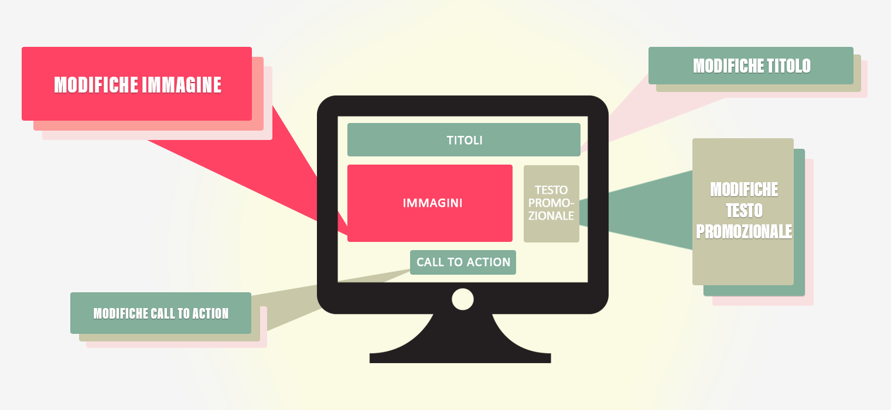

# Panoramica sul test multivariato

Il [!UICONTROL test multivariato] (MVT) in [!DNL Adobe Target] confronta diverse combinazioni di offerte negli elementi di una pagina per determinare quale combinazione funziona meglio per un pubblico specifico e identifica gli elementi che hanno un maggior impatto sul successo dell’attività.

## MVT overview {#section_C73A2D1409EC42C9B0EDD4B976651C5E}

Un test multivariato aiuta a scoprire l’influenza relativa che specifici elementi hanno sulla conversione, rispetto ad altri elementi della pagina. Può anche essere utile per perfezionare una combinazione di elementi che so è dimostrata efficace.

Un vantaggio fornito da un test multivariato rispetto a un test A/B è la capacità di mostrare quali elementi sulla pagina hanno la maggiore influenza sulla conversione. Questo è anche noto come “effetto principale”. Si tratta di informazioni utili che, ad esempio, consentono di determinare dove posizionare il contenuto da mettere in evidenza.

Mediante i test multivariati è inoltre possibile individuare effetti compositi tra due o più elementi di una pagina. Ad esempio, un particolare annuncio potrebbe produrre più conversioni quando viene combinato con un determinato banner o immagine protagonista. Questo è anche noto come “effetto di interazione”.

In [!DNL Target] vengono utilizzati test multivariati fattoriali completi per facilitare l’ottimizzazione del contenuto. Un test multivariato fattoriale completo verifica tutte le possibili combinazioni di contenuto con uguale probabilità. Ad esempio, in presenza di due elementi di pagina con tre offerte ciascuno, le possibili combinazioni sono nove (3x3). Tre elementi, due dei quali includono tre offerte possibili e uno due offerte, offrono 18 opzioni (3x3x2).

In Target ogni combinazione corrisponde a un’esperienza. Il test multivariato confronta ogni esperienza in modo da fornire informazioni sulla loro efficacia. Al contempo, vengono raccolti e analizzati dati per comprendere in che modo le singole posizioni e le offerte influenzano la metrica di successo.

A causa del numero di combinazioni che possono essere generate, un test multivariato richiede più tempo e traffico di un test A/B. La pagina deve ricevere abbastanza traffico per produrre risultati statisticamente significativi per ogni esperienza. Per ottenere risultati utili, è necessario comprendere la quantità di traffico ricevuto dalla pagina e includere nel test un numero ottimale di combinazioni per una durata di tempo appropriata per ottenere i risultati richiesti. Mediante il [Calcolatore di traffico](../../c-activities/c-multivariate-testing/t-create-multivariate-test/traffic-estimator.md#task_71AA6922AFD447EA8C5E610A78ABA714) di Target puoi progettare facilmente un test adeguato al traffico. Prima di utilizzare il Calcolatore di traffico, devi disporre di statistiche valide che mostrino il numero di impression e di conversioni ricevute normalmente dal sito. Considera i livelli di traffico giornalieri. Più esperienze sono incluse in un’attività, più traffico deve includere l’attività o più a lungo l’attività deve essere eseguita. Se il traffico non è molto elevato, sottoponi a test un numero limitato di combinazioni; in caso contrario, il tempo richiesto per produrre risultati significativi potrebbe essere eccessivo per risultare utile.

## MVT terminology {#section_DF475CA7F34B4CFDB7BE7363761D64AE}

Quando configuri un test multivariato, è utile comprendere alcuni termini di base.

In questo settore esistono più termini utilizzati in modi diversi. Questa sezione definisce i termini utilizzati da [!DNL Target].

**Combinazione**: le varianti di contenuto create quando esegui il test su più opzioni di contenuto in più posizioni. Ad esempio, in presenza di tre posizioni con tre opzioni di contenuto ciascuna, le possibili combinazioni sono 27 (3x3x3). Un visitatore del sito vedrà una combinazione, detta anche esperienza.

**Contenuto**: il testo o l’immagine che include una variante di test all’interno di una posizione. In un test multivariato vengono confrontate una serie di opzioni di contenuto, in più posizioni. Nella metodologia MVT, il contenuto è a volte denominato *livello*.

**Elemento:** elemento DOM contenente varianti di contenuto da testare nel test MVT. Vedi anche *Posizione*.

**Posizione:** area di contenuto specifica in una pagina, spesso contenuta in un singolo elemento DOM. Nella metodologia MVT, una posizione è a volte indicata come *fattore*. Un testo multivariato fattoriale completo mette a confronto tutte le possibili combinazioni di offerte nelle posizioni.

## When to use MVT vs A/B {#section_3D2B966B6671406C861A1843EA41D28C}

Puoi usare i test multivariati insieme ai test A/B per ottimizzare la pagina. Alcuni esempi di situazioni in cui può essere utile utilizzarli insieme:

* Utilizza un test A/B per ottimizzare il layout di pagina, seguito da un test MVT per determinare il contenuto ottimale in ciascun elemento della pagina.

   Un test A/B può fornire un feedback importante sul layout, mentre i test MVT sono ideali per il test del contenuto all’interno degli elementi nel design della pagina. L’esecuzione di un test A/B sul layout prima di sottoporre a test più opzioni di contenuto consente di determinare il layout ottimale e il contenuto più incisivo.

* Utilizza un test MVT per determinare quale elemento è il più importante, facendolo seguire da un test A/B maggiormente concentrato su tale elemento.

   Quando il numero di esperienze diverse supera cinque e si estende su due o più elementi, è consigliabile considerare un test MVT prima di eseguire i test A/B. I test multivariati mostrano quali aree della pagina hanno più probabilità di migliorare la conversione. Questi sono gli elementi sui quali un addetto al marketing dovrebbe concentrarsi. Ad esempio, il test MVT potrebbe indicare che l’invito all’azione è l’elemento più importante per soddisfare gli obiettivi. Una volta determinati gli elementi e il contenuto più utili per raggiungere gli obiettivi, puoi eseguire un test A/B per perfezionare ulteriormente i risultati, ad esempio per sottoporre a test reciproco due immagini specifiche, o confrontare il testo o i colori di un invito all’azione. Facendo seguire un test MVT da uno o più test A/B, puoi determinare il contenuto migliore possibile per i risultati desiderati.

## Considerazioni {#section_979FE3F398654C1EA1C86E7DBC9A8DAD}

* Utilizza un test MVT quando disponi di almeno tre elementi. Se il numero è inferiore, esegui una serie di test A/B.
* Seleziona gli elementi di pagina che ritieni avranno il maggiore impatto sui risultati.
* Evita di includere troppi elementi o posizioni in un test. Maggiore è il numero, maggiore sarà la durata del test.
* Pianifica la progettazione del test in anticipo. Non è consigliabile modificare un test dopo averlo attivato e aver iniziato a raccogliere e analizzare i dati.
* È consigliabile che gli elementi siano indipendenti l’uno dall’altro.

   Ad esempio, non testare il layout e il contenuto nello stesso test.

* Pianifica un tempo aggiuntivo per l’attività di QA, a causa dell’aumento del numero di esperienze. Potete anche utilizzare il test fattoriale parziale per ridurre la quantità di traffico necessaria per un test multivariato. Per ulteriori informazioni, vedi Test fattoriale parziale di seguito:

## Test fattoriale parziale

[!DNL Target] offre test multivariati fattoriali completi come opzione di attività incorporata. Nella statistica, nel Design of Experiments (DOE, progettazione di esperimenti) si utilizzano diversi approcci, o design, per determinare quali fattori influenzano i risultati. One such approach is the [Taguchi Method](https://en.wikipedia.org/wiki/Taguchi_methods) for partial-factorial testing. Taguchi permette agli addetti al marketing di fare una serie di presupposti che riducono il numero di permutazioni di esperienze da testare, e quindi diminuisce i requisiti di traffico per un test multivariato. Puoi sfruttare questo approccio di funzionalità e test in [!DNL Target] utilizzando [questo foglio di calcolo offline](/help/assets/MVT-Taguchi-Partial-Factorial-Design-02102017.xlsx).

Se il tuo team utilizza altri approcci DOE, puoi utilizzare questo foglio di calcolo come implementazione di riferimento per progetti di esperimento personalizzati.

Quando utilizzi il foglio di calcolo per calcoli offline, considera i seguenti suggerimenti:

* Scegli gli elementi che desideri modificare e il numero di versioni di ogni elemento (3x2, 4x3 e così via).
* Manteni coerente la numerazione. Ad esempio, se il pulsante è l’Elemento 1 e le opzioni sono Blu, Verde e Giallo, il pulsante blu sarà 1-1, il pulsante verde 1-2 e il pulsante giallo 1-3.
* Il foglio di calcolo offline fornisce il numero adatto di esperienze necessarie (quattro per un 3x2, nove per un 4x3, e così via).
* Crea le esperienze nel flusso di lavoro A/B con il [Compositore esperienza visivo](/help/c-experiences/experiences.md). Puoi usare codice personalizzato, modificare l’HTML, la modalità WYSIWYG o qualsiasi combinazione di questi mezzi.
* Al termine dell’attività (in base al calcolatore delle dimensioni del campione), immetti i risultati nel foglio di calcolo per ottenere gli altri dettagli.

Per ulteriori considerazioni e best practice, vedi [Best practice relative ai test multivariati](../../c-activities/c-multivariate-testing/best-practices.md#reference_53635817FFB741EF8C4E56CC70688EDD).

## Video di formazione:

I video seguenti contengono ulteriori informazioni sui concetti descritti in questo articolo.

### Tipi di attività (9:03) 

Questo video introduttivo descrive i tipi di attività disponibili in Target Standard/Premium. Il test multivariato è trattato a partire dal minuto 4:20.

* Descrizione dei tipi di attività inclusi in [!DNL Adobe Target]
* Selezionare il tipo di attività appropriato per i tuoi obiettivi
* Descrizione del flusso di lavoro guidato in tre passaggi da applicare a tutti i tipi di attività

>[!VIDEO](https://video.tv.adobe.com/v/17386)

### Creazione di test multivariati (9:25) badge 

Questo video è utile per comprendere, pianificare e creare un test multivariato utilizzando il flusso di lavoro guidato in tre passaggi di Target.

* Definizione e progettazione di un test multivariato
* Creazione di un test multivariato

>[!VIDEO](https://video.tv.adobe.com/v/17395)