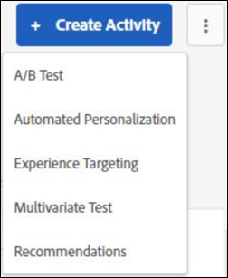
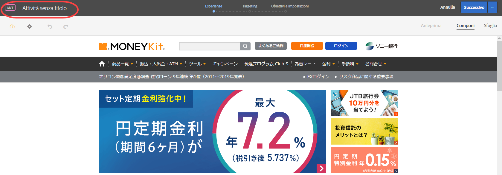
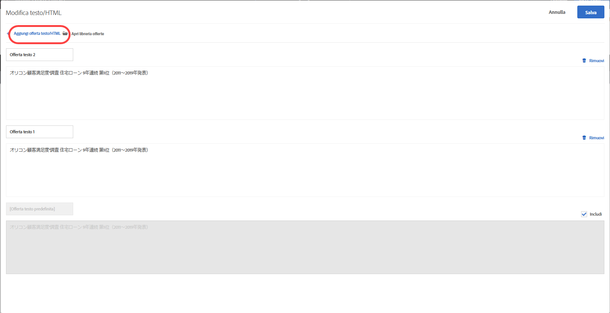
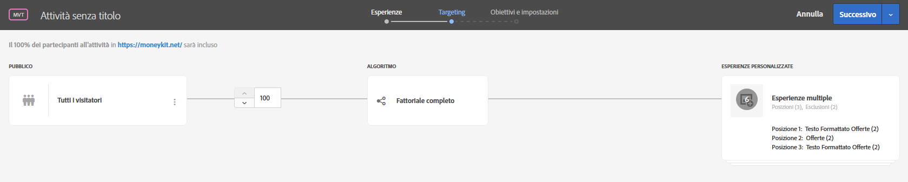
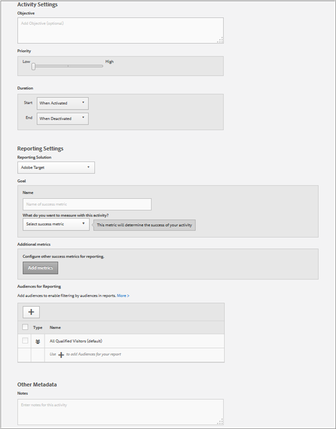

# Creazione di un test multivariato{#create-a-multivariate-test}

Il Compositore esperienza visivo in Target è utile per creare i test direttamente su una pagina abilitata per Target e modificare parti della pagina in Target.

L&#39;editor point-and-click di Target consente di scegliere qualsiasi posizione e di aggiungere offerte multiple.

Il test multivariato richiede una prima pagina di rapporto. In altre parole, il test viene eseguito su un URL specifico, con l&#39;esperienza progettata per tale pagina.

1. Fai clic su **[!UICONTROL Crea attività]** &gt; **[!UICONTROL Test multivariato]**.

   

1. [Specifica l&#39;URL](../../../c-activities/c-multivariate-testing/t-create-multivariate-test/url.md#concept_C12E4A85FF3B4E518E3110F6CF1AF9C0) per la pagina da sottoporre a test, quindi fai clic su **[!UICONTROL Crea attività]**.

   

   >[!NOTE]
   >
   >Utilizza un URL completo, incluso il prefisso HTTP o HTTPS.

   Se viene visualizzato un messaggio che richiede di abilitare i contenuti misti nel browser, segui le istruzioni incluse nel messaggio. Dopo aver abilitato i contenuti misti nel browser, riparti dal passaggio 1.

   Viene visualizzato il Compositore esperienza visivo.

   Per informazioni sulla risoluzione dei problemi relativi al Compositore esperienza visivo, consulta [Risoluzione dei problemi relativi al Compositore esperienza visivo](../../../c-experiences/c-visual-experience-composer/r-troubleshoot-composer/troubleshoot-composer.md#reference_77743144F10143A3A89D56E116D296E4).
1. Digita un nome per l&#39;attività.

   

   I seguenti caratteri non sono consentiti nel nome di un’attività:

   | Carattere | Descrizione |
   |--- |--- |
   | / | Barra |
   | ? | Punto interrogativo |
   | # | Cancelletto |
   | : | Due punti |
   | = | Uguale |
   | + | Più |
   | - | Meno |
   | @ | Chiocciola |

1. [Crea le offerte in ogni posizione](../../../c-activities/c-multivariate-testing/t-create-multivariate-test/add-offers.md#concept_DCE6B45C30F7419B8EC17AFDEE8D8AA6).

   

   Puoi aggiungere i seguenti tipi di offerte:

   * HTML
   * Immagine 
   * Testo

1. [Visualizzare l&#39;anteprima delle esperienze](../../../c-activities/c-multivariate-testing/t-create-multivariate-test/preview-experiences.md#task_21A700587E88453A9FC2210C0DE53A28).

   

   Puoi visualizzare ogni esperienza, escludendo quelle da non includere nel test.
1. [Utilizza Il Calcolatore del traffico](../../../c-activities/c-multivariate-testing/t-create-multivariate-test/traffic-estimator.md#task_71AA6922AFD447EA8C5E610A78ABA714) per verificare la fattibilità del piano di test.

     

1. Scegli il pubblico e la percentuale di visitatori validi che dovranno accedere all’attività.

   

   Ad esempio, puoi limitare l’accesso al 50% di tutti i visitatori o 45% del pubblico “Californians”.

   >[!NOTE]
   >
   >Oltre a selezionare un pubblico esistente, puoi combinare più tipi di pubblico per creare un pubblico combinato ad hoc anziché crearne uno nuovo. Per ulteriori informazioni, consulta [Combinazione di più tipi di pubblico](../../../c-target/combining-multiple-audiences.md#concept_A7386F1EA4394BD2AB72399C225981E5).

1. [Rivedi il riepilogo del test](../../../c-activities/c-multivariate-testing/t-create-multivariate-test/test-summary.md#reference_971AB225963A4DC18EEB5B0E20F0A4A7) e apporta eventuali modifiche, quindi fai clic su **[!UICONTROL Avanti]**.

   

1. [Specifica obiettivi e impostazioni](../../../c-activities/c-multivariate-testing/t-create-multivariate-test/goals-and-settings.md#reference_B25389FD6F3A4989801E740364B089CC) per il test.

   

1. Fai clic su **[!UICONTROL Salva e chiudi]** per creare l’attività.

## Video di formazione: Creazione di test multivariati (09:25)

In questo video viene illustrato come pianificare e creare un test multivariato utilizzando il flusso di lavoro guidato a tre passaggi di Target.

* Definizione e progettazione di un test multivariato
* Creazione di un test multivariato

>[!VIDEO](https://video.tv.adobe.com/v/17395)
