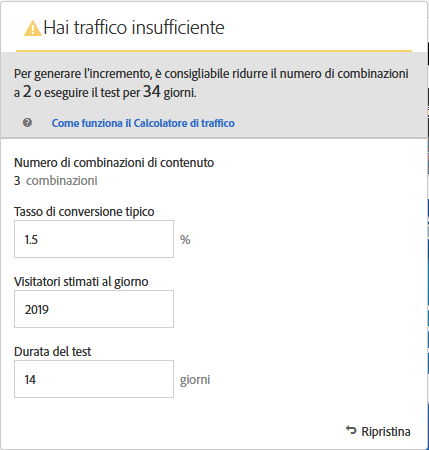
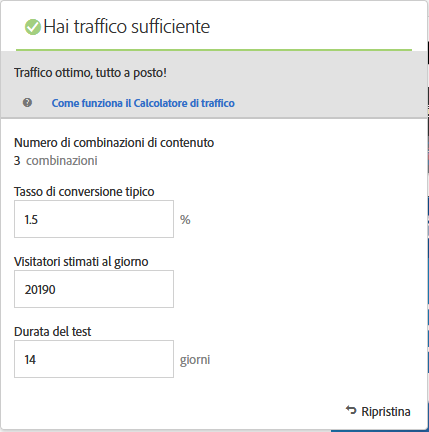

# Creazione di un test multivariato{#create-a-multivariate-test}

Il [!UICONTROL Compositore esperienza visivo] in [!DNL Target] è utile per creare i test direttamente su una pagina abilitata per e modificare parti della pagina in [!DNL Target].

L’editor rapido di Target consente di scegliere qualsiasi posizione e di aggiungere offerte multiple.

Il [!UICONTROL test multivariato] richiede un rapporto di tipo “page-first”. In altre parole, il test viene eseguito su un URL specifico, con l’esperienza progettata per tale pagina.

1. Fate clic su **[!UICONTROL Crea attività]** > **[!UICONTROL Test multivariato]**.

   

   >[!NOTE]
   >
   >I tipi di attività disponibili dipendono dall’account Target. Alcuni tipi di attività potrebbero non essere visualizzati nell’elenco. Ad esempio, [!UICONTROL Personalizzazione automatizzata] è una [funzione disponibile in Target Premium](/help/c-intro/intro.md#premium).
   >
   >Per ulteriori informazioni sui vari tipi di attività disponibili in [!DNL Target] e sulle loro differenze, consulta [Attività](../../../c-activities/activities.md#concept_D317A95A1AB54674BA7AB65C7985BA03). Consulta [Tipi di attività di Target](/help/c-activities/target-activities-guide.md) per aiutarti a stabilire il tipo di attività più adatto per le tue esigenze.

1. Se necessario, seleziona **[!UICONTROL Visivo (impostazione predefinita)]**.

   

   >[!NOTE]
   >
   >Per informazioni sulla risoluzione dei problemi relativi al Compositore esperienza visivo, consulta [Risoluzione dei problemi relativi al Compositore esperienza visivo](/help/c-experiences/c-visual-experience-composer/r-troubleshoot-composer/troubleshoot-composer.md).
   >
   >L’opzione [!UICONTROL Choose Workplace] (Scegli luogo di lavoro) nell’illustrazione precedente è una funzione di [Target Premium](/help/c-intro/intro.md). Se la tua organizzazione dispone di una licenza di Target Standard, questa opzione non è disponibile.

1. (Condizionale) Se sei un cliente Target Premium, [scegli un’area di lavoro](/help/administrating-target/c-user-management/property-channel/property-channel.md).

1. [Specifica l’URL](../../../c-activities/c-multivariate-testing/t-create-multivariate-test/url.md#concept_C12E4A85FF3B4E518E3110F6CF1AF9C0) per la pagina da testare, quindi fai clic su **[!UICONTROL Successivo]**.

   >[!NOTE]
   >
   >Utilizza un URL completo, incluso il prefisso HTTP o HTTPS.

   Se viene visualizzato un messaggio che richiede di abilitare i contenuti misti nel browser, segui le istruzioni incluse nel messaggio. Dopo aver abilitato i contenuti misti nel browser, riparti dal passaggio 1.

   Viene visualizzato il Compositore esperienza visivo.

1. Digita un nome per l’attività.

   

   I seguenti caratteri non sono consentiti nel nome di un’attività:

   | Carattere | Descrizione |
   |--- |--- |
   | / | Barra |
   | ? | Punto interrogativo |
   | # | Cancelletto |
   | : | Due punti |
   | = | Uguale |
   | + | Più |
   | - | Meno |
   | @ | Chiocciola |

1. [Crea le offerte in ogni posizione](../../../c-activities/c-multivariate-testing/t-create-multivariate-test/add-offers.md#concept_DCE6B45C30F7419B8EC17AFDEE8D8AA6).

   

   Puoi aggiungere i seguenti tipi di offerte:

   * HTML
   * Immagine
   * Testo

1. Fai clic su **[!UICONTROL Anteprima]** per [visualizzare l’anteprima delle esperienze](/help/c-activities/c-multivariate-testing/t-create-multivariate-test/preview-experiences.md).

   

   Puoi visualizzare ogni esperienza, escludendo quelle da non includere nel test. Per escludere una o più esperienze, seleziona le relative caselle di controllo e fai clic su **[!UICONTROL Escludi]**.

   

1. [Utilizza Il Calcolatore del traffico](../../../c-activities/c-multivariate-testing/t-create-multivariate-test/traffic-estimator.md#task_71AA6922AFD447EA8C5E610A78ABA714) per verificare la fattibilità del piano di test.

   

   L’illustrazione seguente indica che l’attività non dispone di traffico sufficiente.

   

   L’illustrazione seguente indica che l’attività non dispone di traffico sufficiente.

   

1. Fai clic su **[!UICONTROL Successivo]** per passare alla pagina [!UICONTROL Targeting.]

1. Scegli il pubblico e la percentuale di visitatori validi che dovranno accedere all’attività.

   

   Ad esempio, puoi limitare l’accesso al 50% di tutti i visitatori o 45% del pubblico “Californians”.

   >[!NOTE]
   >
   >Oltre a selezionare un pubblico esistente, puoi combinare più tipi di pubblico per creare un pubblico combinato ad hoc anziché crearne uno nuovo. Per ulteriori informazioni, consulta [Combinazione di più tipi di pubblico](../../../c-target/combining-multiple-audiences.md#concept_A7386F1EA4394BD2AB72399C225981E5).

1. [Rivedi il riepilogo del test](../../../c-activities/c-multivariate-testing/t-create-multivariate-test/test-summary.md#reference_971AB225963A4DC18EEB5B0E20F0A4A7) e apporta eventuali modifiche, quindi fai clic su **[!UICONTROL Successivo]**.

1. [Specifica obiettivi e impostazioni](../../../c-activities/c-multivariate-testing/t-create-multivariate-test/goals-and-settings.md#reference_B25389FD6F3A4989801E740364B089CC) per il test.

1. Fai clic su **[!UICONTROL Salva e chiudi]** per creare l’attività.

## Video di formazione: Creazione di test multivariati (9:25) badge 

In questo video viene illustrato come pianificare e creare un test multivariato utilizzando il flusso di lavoro guidato a tre passaggi di Target.

* Definizione e progettazione di un test multivariato
* Creazione di un test multivariato

>[!VIDEO](https://video.tv.adobe.com/v/17395)
