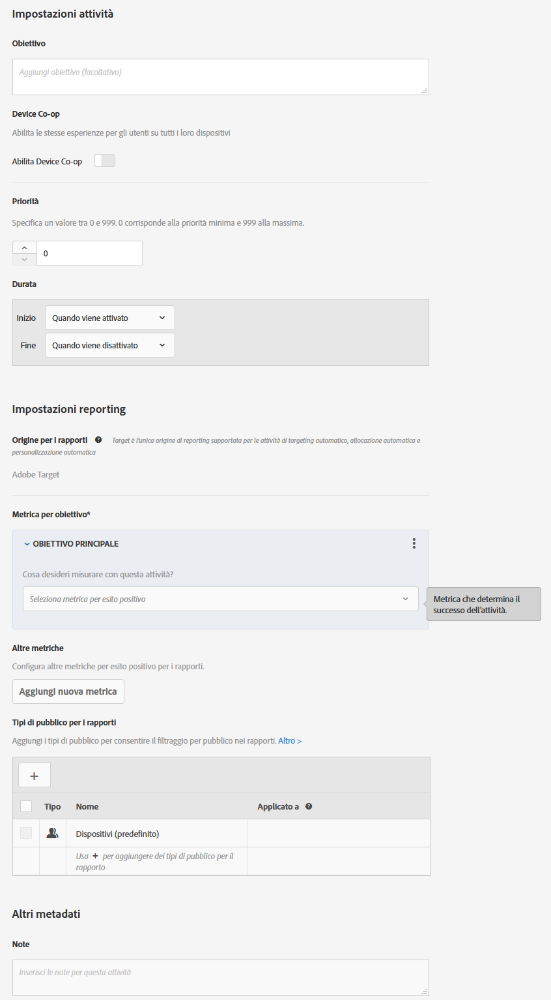

# Obiettivi e impostazioni{#goals-and-settings}

Nella pagina Obiettivi e impostazioni è possibile inserire le informazioni sugli obiettivi del test.

* Impostazioni attività
* Impostazioni reporting
* Altri metadati

Le impostazioni disponibili dipendono dall’utilizzo di Target o Analytics come origine di dati.

## Impostazioni delle attività {#section_DCBDC354261F420EBD4B43EA34947BAC}

Sono disponibili le seguenti opzioni:

### Finalità

Specifica una finalità facoltativa. La finalità può essere costituita da qualsiasi informazione che consenta a te e agli altri membri del gruppo di identificare la campagna.

### Priorità

L’interfaccia utente e le opzioni per Priorità variano a seconda delle impostazioni. È possibile utilizzare le impostazioni legacy Bassa, Media o Alta, oppure attivare la priorità precisa da 0 a 999.

La priorità è utilizzata se più attività vengono assegnate alla stessa posizione con lo stesso pubblico. Se due o più attività vengono assegnate alla posizione, viene visualizzata l’attività con priorità maggiore.

If this option is not enabled in S[!UICONTROL Administration] > [!UICONTROL Reporting] (the default), specify a priority: Low, Medium, or High.

To enable fine-grained priorities, click [!UICONTROL Administration] > [!UICONTROL Reporting], then toggle the Enable Fine-Grained Priorities option to the &quot;On&quot; position.

Se questa opzione è abilitata, specifica un valore compreso tra 0 e 999:

* 0 = Bassa
* 999 = Alta

Per le attività create con le versioni precedenti di Target Standard/Premium, la priorità Bassa viene convertita in 0, la priorità Media in 5 e la priorità Alta in 10. Se necessario, è possibile modificare questi valori.

>[!NOTE]
>
>Prima di poter disabilitare questa opzione dopo aver utilizzato le priorità precise, tutte le priorità devono essere impostate su 0, 5 o 10.

### Durata

L’attività può iniziare dopo l’approvazione, oppure è possibile impostare una data e un’ora specifiche. Analogamente, l’attività può terminare quando viene disattivata, oppure è possibile impostare una data e un’ora specifiche. Il selettore dell’ora è nel formato 24 ore e la mezzanotte è indicata come 00:00. Il fuso orario è impostato sul fuso configurato nel browser. Per utilizzare un fuso orario diverso, imposta il browser su un altro fuso orario e riavvia il browser.

## Impostazioni reporting {#section_13119392051044FBA6387D9B3B1C43CF}

Sono disponibili le seguenti opzioni:

### Soluzione di reporting

Specifica se i dati vengono raccolti da Adobe Target o da Adobe Analytics. Consulta [Adobe Analytics come origine per la generazione di rapporti per Target](/help/c-integrating-target-with-mac/a4t/a4t.md) per scoprire le differenze tra le soluzioni di reporting e i vantaggi di ciascuna.

Quando si seleziona Analytics come origine per la generazione di rapporti per Target, si seleziona la suite di rapporti di Analytics che dovrà ricevere i dati relativi all’attività di Target. Scegli innanzitutto una delle società Analytics associate al tuo account, quindi, seleziona la suite di rapporti idonea all’attività. Puoi selezionare solo le suite di rapporti impostate per la connessione ad Adobe Target. Se non visualizzi la suite di rapporti desiderata, disconnettiti, accedi di nuovo ad Adobe Experience Cloud e riprova. Se la suite di rapporti continua a non essere elencata, contatta l’Assistenza clienti.

Analytics for Target richiede un server di tracciamento per riportare correttamente i risultati. Un server di tracciamento predefinito verrà visualizzato nel campo Server di tracciamento. Se si utilizzano più server di tracciamento, è necessario verificare di aver inserito in questo campo quello corretto. Consulta [Utilizzo di un server di tracciamento di Analytics](../../../c-integrating-target-with-mac/a4t/analytics-tracking-server.md#task_72077BA7E93C4A65A715A18F32228823) per ulteriori informazioni.

Se una soluzione di reporting è specificata nelle impostazioni del tuo account, viene utilizzata tale soluzione e questa impostazione non è visibile.

>[!NOTE]
>
>Al fine di mantenere coerenza dei rapporti, non è possibile cambiare l’origine per i rapporti una volta che l’attività è diventata attiva.

### Obiettivo

Seleziona l’azione che deve essere eseguita da un visitatore per raggiungere l’obiettivo. Ad esempio, scegli una metrica di conversione, quindi imposta i parametri che determinano il raggiungimento del successo.

>[!NOTE]
>
>Se la soluzione di reporting è impostata su Analytics, l’unica metrica di obiettivo disponibile è Conversione. Le metriche di Analytics non possono essere selezionate come obiettivo.

Quando si seleziona la metrica di successo, viene visualizzato un selettore. Utilizza questo selettore per scegliere le specifiche per la metrica di successo.

Se attivato, il campo del Valore stimato di una conversione (non disponibile per la metrica Punteggio di pagina) fornisce un valore per l’obiettivo, ma non per altre metriche. Questo valore consente a Target di calcolare un incremento stimato dei ricavi. Questo campo è facoltativo; tuttavia, i ricavi incrementali per eventuali metriche non collegate ai ricavi non possono essere calcolate senza di esso. Per tutte le metriche collegate ai ricavi (Ricavo per visitatore, Valore ordine medio, Vendite totali e Ordini), la stima utilizza Ricavo per visitatore. I dati sono di tipo valuta.

Dopo aver raggiunto l’obiettivo dell’attività, un visitatore continua a vedere il contenuto dell’attività, a meno che il visitatore non sia idoneo per un’attività di priorità maggiore. Se il visitatore raggiunge nuovamente l’obiettivo, viene conteggiato come un’altra conversione. Nota: questo è diverso dal comportamento predefinito in Target Classic, in cui i visitatori sono conteggiati come nuovi se vedono il test di nuovo.

### Altre metriche

Consente di creare metriche di successo aggiuntive.

Questa impostazione non è disponibile se la soluzione di reporting è impostata su Analytics. In questo caso, si applicano le metriche definite per la suite di rapporti di Analytics.

Tipi di pubblico per i rapporti

### Per impostazione predefinita, nei rapporti sono mostrati i risultati per tutti i visitatori idonei. È possibile aggiungere tipi di pubblico per i rapporti per visualizzare solo le informazioni su tipi di pubblico specifici.

## Impostazioni avanzate {#section_E2FE441AFB324E498793ABB025ED9974}

Le impostazioni avanzate sono disponibili per le metriche obiettivo di test multivariato.

>[!NOTE]
>
>Se utilizzi Adobe Analytics come origine per la generazione dei rapporti, le impostazioni vengono gestite dal server Analytics. L’opzione Impostazioni avanzate non sarà disponibile.

### Quali sono le metriche di successo da raggiungere prima di incrementare questa metrica?

Utilizza questa opzione per contare solo chi raggiunge la metrica di successo se in precedenza aveva raggiunto una metrica di successo diversa. Ad esempio potresti rendere valida una conversione di test solo se un visitatore fa clic sull’offerta o raggiunge una determinata pagina prima della conversione.

È possibile fornire una dipendenza da più metriche e decidere se, per incrementare il conteggio, la metrica deve essere raggiunta o non raggiunta.

È necessario definire entrambe le metriche (o più metriche) di successo prima di renderle interdipendenti tra loro.

L’opzione Aggiungi dipendenza consente di incrementare la metrica di successo nel caso in cui un’altra metrica di successo venga raggiunta o meno.

Per aggiungere una dipendenza:

1. Dopo aver aggiunto le metriche aggiuntive, fai clic su **[!UICONTROL Impostazioni avanzate]**.
2. Fai clic sull’opzione Aggiungi dipendenza:

   

3. Trascina e rilascia le metriche desiderate dal riquadro di sinistra a quello di destra, quindi fai clic su **[!UICONTROL Raggiunto]** per scegliere tra Raggiunto e Non raggiunto.

   

È possibile modificare o rimuovere le dipendenze dopo averle aggiunte.

### Cosa accade dopo che un utente incontra questa metrica per obiettivo?

Dopo che un visitatore raggiunge la metrica obiettivo, sono disponibili tre opzioni:

* Seleziona Incrementa il conteggio e mantieni utente attivo per specificare la modalità di incremento del conteggio.
* Seleziona Incrementa il conteggio, rilascia l’utente e consenti nuovo accesso per specificare l’esperienza che l’utente vedrà se accede di nuovo all’attività.
* Seleziona Incrementa il conteggio, rilascia l’utente e impedisci nuovo accesso per specificare cosa vedrà l’utente al posto del contenuto dell’attività.

Consulta [Metriche di successo](../../../c-activities/r-success-metrics/success-metrics.md#reference_D011575C85DA48E989A244593D9B9924) per ulteriori informazioni sulle impostazioni avanzate.

## Altri metadati {#section_2E8917BEFB954480A4206B9E9E917F80}

Sono disponibili le seguenti impostazioni:

### Note

Inserisci informazioni sull’attività, utili per te o per gli altri membri del gruppo. Il riquadro Note può essere ridimensionato.

## Video di formazione

I video seguenti contengono ulteriori informazioni sui concetti descritti in questo articolo.

### Etichetta 

Questo video include informazioni sulle impostazioni delle attività.

* Inserire una finalità per l’attività
* Impostare il livello di priorità delle attività
* Orari di inizio e fine dell’attività
* Aggiungere tipi di pubblico da usare come filtri nella generazione di rapporti
* Inserire delle note per le attività

>[!VIDEO](https://video.tv.adobe.com/v/17381)

### Creazione di test multivariati (9:25) badge 

In questo video viene illustrato come creare un test multivariato utilizzando il flusso di lavoro guidato in tre passaggi di Target. Obiettivi e impostazioni sono trattati a partire dal minuto 07:00.

* Definizione e progettazione di un test multivariato
* Creazione di un test multivariato

>[!VIDEO](https://video.tv.adobe.com/v/17395)