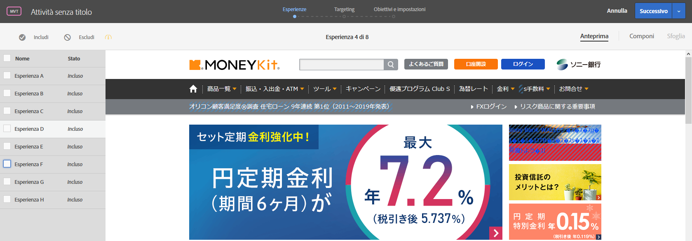

# Visualizzare un&#39;anteprima delle esperienze per un test multivariato

Dato che in [!UICONTROL Test multivariato] in [!DNL Adobe Target] vengono messe a confronto più esperienze su una pagina, è utile visualizzare un&#39;anteprima della pagina con ogni esperienza.

1. Nel Compositore esperienza visivo, fai clic su **[!UICONTROL Anteprima]**.

   Viene visualizzato un elenco di tutte le esperienze.

   

1. Fai clic su una delle esperienze nell&#39;elenco per visualizzarla.

1. Per escludere una o più esperienze dal test multivariato, selezionale, quindi fai clic su **[!UICONTROL Escludi]**.

   

   Potrebbe essere utile escludere un&#39;esperienza che mostra varianti in conflitto o che non è esteticamente equilibrata.

   >[!NOTE]
   >
   >Quando si creano test multivariati, è ora possibile escludere più del 10% di esperienze dal test; in questo caso, per effettuare l’analisi è necessario utilizzare la generazione rapporti non in linea.

   Per impostazione predefinita, tutte le esperienze sono incluse nel test multivariato. Per includere una esperienza che è stata esclusa, selezionala e fai clic su **[!UICONTROL Includi]**.

Fai clic su **[!UICONTROL Esci da modalità anteprima]** per tornare a Compositore esperienza in modo da poter apportare modifiche, o fai clic su **[!UICONTROL Continua]** per passare al riepilogo del test.
