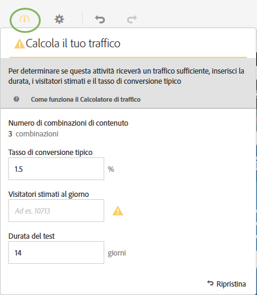
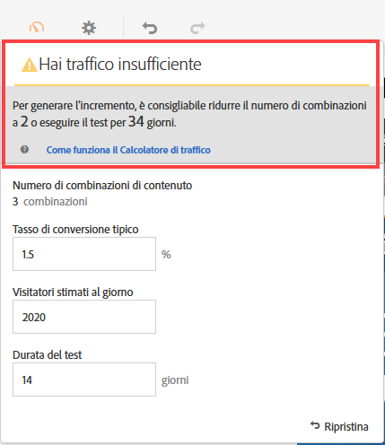
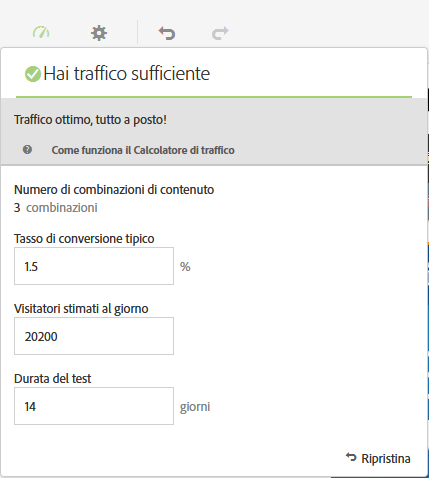

# Stimare il traffico necessario per il successo del test{#estimate-the-traffic-required-for-a-successful-test}

Dato che in un test multivariato vengono messe a confronto più esperienze, è importante sapere quanto traffico è necessario per generare risultati significativi. Il Calcolatore di traffico utilizza le statistiche sulla pagina e il numero di esperienze sottoposte al test per stimare la quantità di traffico e la durata del test necessarie per la sua riuscita.

Mediante il Calcolatore del traffico viene prevista la dimensione del campione necessaria per garantire quanto segue:

* 95% di affidabilità

   Questo indica che la possibilità che venga segnalato un falso positivo in assenza di un incremento reale è del 5% (100% - livello di affidabilità).
* 80% di potenza statistica

   Questo significa che il test ha una probabilità dell&#39;80% di rilevare un incremento reale pari al 25% o più.
* Incremento rilevabile con affidabilità minima del 25%

   In Target viene calcolato il traffico necessario per ottenere probabilità dell&#39;80% di rilevare un incremento reale pari al 25% o più.

Il test utilizza la correzione di Bonferroni in caso di confronti multipli. Questo metodo è noto per essere di tipo conservativo, il che risulta controbilanciato dall&#39;imposizione di un incremento rilevabile con affidabilità minima relativamente ampio.

Il Calcolatore del traffico fornisce un feedback che consente di sapere se disponi di traffico sufficiente affinché il test progettato abbia successo.

1. In Compositore esperienza, fai clic sull’icona **[!UICONTROL Traffico]**.

   Viene visualizzato il Calcolatore del traffico. Fai nuovamente clic sull’icona **[!UICONTROL Traffico]** per nascondere il Calcolatore del traffico.

   

1. Indica il tasso di conversione tipico, i visitatori stimati al giorno e la durata del test.

   * [!UICONTROL Numero di combinazioni di contenuto]: calcolato automaticamente in base al numero di esperienze create come parte dell’attività, dopo eventuali esclusioni.
   * [!UICONTROL Tasso di conversione tipico]: il tasso di conversione è espresso in percentuale, in base alla stima o ai dati passati derivati dal sistema di analisi.
   * [!UICONTROL Visitatori stimati al giorno]: è il numero di visitatori che probabilmente visualizzeranno la pagina in base ai criteri di targeting. Può essere basato sui dati di analisi.
   * [!UICONTROL Durata del test]: il numero di giorni desiderati per l’esecuzione dell’attività.

   Nel Calcolatore del traffico questi dati statistici vengono utilizzati per determinare quali aggiustamenti sono necessari per eseguire un test di successo.

   Nella parte superiore del Calcolatore del traffico, vengono calcolati i valori inseriti e visualizzati i risultati.

   

   Modificando i valori, si modifica anche la stima. Ad esempio, se stai sottoponendo a test un numero elevato di esperienze e il tasso di conversione e le impression sono troppo ridotti, il Calcolatore del traffico mostra quanto dovrà durare l&#39;esecuzione del test perché questo abbia successo. Oppure, se il traffico è limitato, nel Calcolatore del traffico potrebbe venire suggerito un numero inferiore di esperienze, in modo che sia possibile eseguire il test per il numero desiderato di giorni.

   Se il traffico non è sufficiente, puoi eseguire una o entrambe le operazioni seguenti:

   * Ridurre il numero di combinazioni di offerte e il numero di posizioni.
   * Impostare la durata del test.

   Adegua i valori finché il Calcolatore del traffico indica che il traffico è sufficiente, quindi progetta il test di conseguenza.

   

