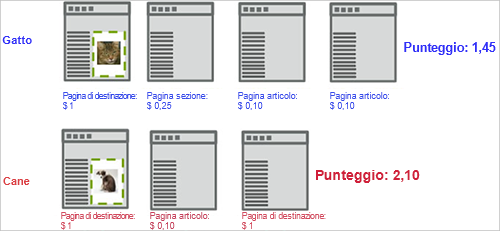
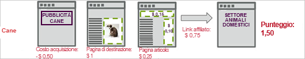

# Punteggio di acquisizione

La metrica di coinvolgimento Capture Score in [!DNL Adobe Target] calcola un punteggio aggregato basato sul valore assegnato alle pagine visitate sul sito, dal momento in cui il visitatore vede per la prima volta la prima richiesta di visualizzazione della campagna [!DNL Target].

Nell&#39;esempio seguente viene illustrato come viene calcolato il coinvolgimento del punteggio in una campagna che verifica due esperienze, una con l&#39;immagine di un gatto e l&#39;altra con l&#39;immagine di un cane.

In questo esempio, il primo visitatore sperimenta l&#39;esperienza del gatto. Si supponga che una richiesta globale [!DNL Target] trasmetta una valutazione della pagina in base al valore della pagina. Se l&#39;esperto di marketing ha acquisito il coinvolgimento nel conteggio delle pagine in una metrica di successo associata a `**any Target request**`, il punteggio della visita si accumula per qualsiasi richiesta visualizzata dopo la richiesta di visualizzazione intorno all&#39;immagine del gatto.

La prima pagina aggiunge 1 al punteggio, la seconda pagina 0,25, la terza 0,10 e la quarta 0,10 per un totale di 1,45. Questo potrebbe essere interpretato come valuta o punti. In una visita diversa, un visitatore sperimenta l&#39;esperienza del cane e anche se il visitatore vede meno pagine, il punteggio è 2,10, quindi maggiore di altre visite, perché il visitatore ha visualizzato pagine con maggiore valore.

Prendi in considerazione i costi di acquisizione e i ricavi del collegamento di affiliazione passando adbox e reindirizzamenti, come descritto nel seguente flusso di pagina. Notate che, in questo esempio, entrambe le richieste [!DNL Target] sulla pagina dell&#39;articolo superano una valutazione, probabilmente rappresentando una CPM nota.

## Assegnazione di una valutazione di pagina

Puoi assegnare un valore a qualsiasi pagina del tuo sito in base a ciò al valore della pagina. Ad esempio, un sito di cucina potrebbe essere in grado di vendere annunci pubblicitari per più soldi sulle pagine di articoli caratteristiche rispetto alla sezione esperienza. Gli articoli caratteristici sono più importanti della sezione esperienza. Il Punteggio di pagina consente di sviluppare un “valore” complessivo di una visita, in modo che la persona che legge più articoli caratteristici ottenga più “punti” di qualcuno che sfoglia solo le esperienze.

Esistono due metodi per assegnare un punteggio a una pagina:

* Nella richiesta [!DNL Target], create un parametro denominato `mboxPageValue`.

   Esempio: `('global_mbox', 'mboxPageValue=10');`

   Il valore specificato viene aggiunto alla valutazione ogni volta che viene visualizzata la pagina con la richiesta [!DNL Target]. Se più richieste sulla pagina includono dei valori di punteggio, la valutazione della pagina corrisponde al totale di tutti i valori di richiesta. `mboxPageValue` è un parametro riservato utilizzato per trasmettere valori in una richiesta Target per acquisire un punteggio di coinvolgimento. Possono essere trasmessi valori positivi e negativi. La somma è calcolata alla fine della visita di ogni visitatore per calcolare il punteggio totale per la visita.

* Passa il parametro `?mboxPageValue=n` nell’URL della pagina.

   Esempio: `https://www.mydomain.com?mboxPageValue=5`

   Utilizzando questo metodo, il valore specificato viene aggiunto alla valutazione per ogni richiesta [!DNL Target] sulla pagina. Ad esempio, se trasmettete il parametro `?mboxPageValue=10`e sulla pagina sono presenti tre richieste [!DNL Target], la valutazione della pagina sarà 30.

>[!NOTE]
>
>Le richieste di destinazione che si trovano sopra la prima richiesta di visualizzazione dell&#39;attività [!DNL Target] non saranno incluse nella valutazione.

Come procedura ottimale si consiglia di assegnare valori nella richiesta [!DNL Target]. Questo consente di essere precisi nei valori misurati, a seconda del contenuto di ogni richiesta.

>[!NOTE]
>
>Per semplificare la manutenzione, è possibile configurare le assegnazioni di valore del Punteggio di pagina del sito nel file [!DNL at.js] o [!DNL mbox.js] con una logica condizionale JavaScript. Questo elimina la necessità di aggiungere altro codice alle tue pagine. Contatta il tuo consulente dell&#39;account per l&#39;assistenza.

È possibile combinare i due metodi, ma questo potrebbe causare un punteggio più alto del previsto. Ad esempio, se assegnate un valore di 10 a ciascuna delle tre richieste [!DNL Target] e nessun punteggio a una quarta richiesta, quindi passate il parametro URL `?mboxPageValue=5`, il punteggio della pagina sarà 50, 30 per le tre richieste con valori assegnati e 5 per ciascuna delle quattro richieste sulla pagina.

Il contatore inizia con la prima richiesta di visualizzazione, non con la richiesta di ingresso. Ad esempio, se immettete l&#39;attività nella home page che non dispone di una richiesta di visualizzazione, e quindi il collegamento alla pagina del catalogo contenente una richiesta di visualizzazione, il contatore inizia quando passate alla pagina del catalogo.

Inoltre puoi passare in valori negativi su alcune pagine che costano o non è opportuno che un visitatore le veda. Anche i valori negativi influiscono sul punteggio complessivo. Questa tecnica può essere utilizzata su una pagina che i visitatori raggiungono da un annuncio, in modo da sapere quanto è stato il CPC. Oppure, per esempio, può essere utilizzata per una pagina di supporto o di contatto, dalla quale sai che i visitatori potrebbero chiamare o richiedere assistenza.
