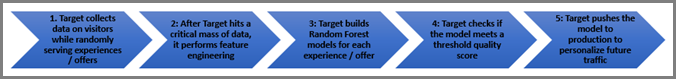

#  Algoritmo Foresta casuale{#random-forest-algorithm}

“Foresta casuale” è l’algoritmo di personalizzazione principale di Target, utilizzato sia nella Personalizzazione automatizzata, sia nel Targeting automatico. I metodi di raggruppamento come Foresta casuale si basano su più algoritmi di apprendimento per ottenere prestazioni predittive migliori rispetto agli algoritmi di apprendimento costituenti. L’algoritmo Foresta casuale nel sistema di Personalizzazione automatizzata è un metodo di classificazione o regressione che si basa sulla costruzione di un elevato numero di alberi decisionali durante la fase di apprendimento.

Quando si pensa alle statistiche, si potrebbe pensare a un unico modello di regressione utilizzato per prevedere un risultato. L&#39;ultima ricerca sui dati scientifici suggerisce che i “metodi di raggruppamento”, in cui vengono creati più modelli dallo stesso insieme di dati e quindi combinati in modo intelligente, producono risultati migliori di quanto prevedano in base a un solo modello.

L&#39;algoritmo di Foresta casuale è l&#39;algoritmo chiave di personalizzazione sottostante utilizzato nelle attività di Personalizzazione automatizzata e di Targeting automatico. Foresta casuale unisce centinaia di alberi decisionali per arrivare ad una previsione migliore di quanto un singolo albero possa fare da solo.

## Che cos&#39;è un Albero decisionale? {#section_7F5865D8064447F4856FED426243FDAC}

L&#39;obiettivo di una struttura decisionale è quello di abbattere tutti i dati di visita disponibili da cui un sistema può imparare e poi raggruppare i dati in cui le visite all&#39;interno di ogni gruppo sono più simili possibile l&#39;una all&#39;altra per quanto riguarda la metrica di obiettivo. Attraverso i gruppi, tuttavia, le visite sono il più possibile diverse, rispetto alla metrica di obiettivo (ad esempio il tasso di conversione). L&#39;albero decisionale esamina le diverse variabili che ha nell&#39;insieme di apprendimento per determinare come dividere i dati in un MECE (mutualmente-esclusivo-collettivamente-esaustivo) in questi gruppi (o “foglie”) per massimizzare questo obiettivo.

Facciamo semplice esempio e supponiamo di avere solo due variabili di input:

* Genere (con due valori potenziali, Maschio o Femmina)
* Cap (con cinque valori potenziali nel nostro piccolo insieme di dati: 11111, 22222, 33333, 44444 o 55555)

La metrica di obiettivo è la conversione, quindi l&#39;albero in primo luogo determina quale delle due variabili spiega la più grande quantità di variazione nel tasso di conversione dei dati di visita.

Diciamo che il codice postale è più predittivo. Questa variabile forma il primo “ramo” dell&#39;albero. L&#39;albero decisionale determinerebbe quindi come suddividere i dati di visita, ad esempio il tasso di conversione dei dati all&#39;interno di ogni suddivisione era il più simile possibile e il tasso di conversione tra le suddivisioni era il più diverso possibile. Nel nostro esempio, assumiamo che 11111, 22222, 33333 siano una divisione e 44444 e 55555 siano una seconda divisione.

Questa azione sarebbe il primo livello del nostro albero decisionale:

L&#39;albero decisionale porrebbe la domanda: “Qual è la variabile più predittiva?” Nel nostro esempio, abbiamo solo due variabili, quindi la risposta qui è chiaramente di genere. L&#39;albero ora cercherebbe di completare un esercizio simile per dividere i dati *all&#39;interno di ogni ramo*. Per prima cosa, consideriamo il ramo 11111, 22222 e 33333. In questi codici di avviamento postale, se ci fosse una differenza di conversione tra uomini e donne, ci sarebbero due foglie (uomini e donne) e questo ramo sarebbe completo. Nell&#39;altro ramo, 44444 e 55555, supponiamo che non ci sia differenza statistica tra le conversioni di donne e uomini. In questo caso, il primo ramo diventa la divisione finale.

Il nostro esempio comporterebbe l&#39;albero sottostante:

## Come vengono utilizzati gli alberi decisionali da Foresta casuale? {#section_536C105EF9F540C096D60450CAC6F627}

Gli alberi decisionali possono essere un potente strumento statistico. Tuttavia, hanno alcuni svantaggi. Il problema maggiore è che si adattano “troppo” ai dati, in questo modo un singolo albero predice male i dati futuri che non sono stati utilizzati per generare l&#39;albero iniziale. Questa sfida è conosciuta come il [compromesso bias-variance](https://en.wikipedia.org/wiki/Bias%E2%80%93variance_tradeoff) nell&#39;apprendimento statistico. Gli algoritmi di Foresta casuale aiutano a superare questa sfida. Al livello più alto, una Foresta casuale è una raccolta di alberi decisionali che vengono generati in modo leggermente diverso sullo stesso insieme di dati che “vota” insieme per produrre un modello migliore rispetto a un singolo albero. Gli alberi sono generati selezionando casualmente un sottoinsieme di dati di visite con la sostituzione (nota come insaccamento), così come un sottoinsieme degli attributi, in modo che la foresta sia costituita da alberi decisionali leggermente diversi. Questo metodo introduce piccole variazioni nelle strutture create in Foresta casuale. L&#39;aggiunta in questa quantità controllata di varianza consente di migliorare la precisione predittiva dell&#39;algoritmo.

## Come viene utilizzato Foresta casuale dagli algoritmi di personalizzazione di Target? {#section_32FB53CAD8DF40FB9C0F1217FBDBB691}

**Come vengono generati i modelli**

Nel diagramma seguente viene riepilogato il modo in cui vengono generati i modelli per le attività di Targeting automatico o Personalizzazione automatizzata:

1. Target raccoglie i dati sui visitatori, mentre serve esperienze/offerte in modo casuale
1. Una volta che Target raggiunge una massa critica di dati, svolge funzioni ingegneristiche
1. Target genera modelli di Foresta casuale per ogni esperienza/offerta
1. Target verifica se il modello soddisfa un punteggio della soglia di qualità
1. Target rilascia il modello in produzione per personalizzare il traffico futuro

Target, tramite i dati che raccoglie automaticamente, così come i dati personalizzati forniti da te, genera i suoi algoritmi di personalizzazione. Questi modelli prevedono la migliore esperienza o offerta da mostrare ai visitatori. In genere, un modello viene generato a livello di esperienza (se è un&#39;attività di Targeting automatico) o di offerta (se è un&#39;attività di Personalizzazione automatizzata). Target sceglie quindi di mostrare l&#39;esperienza o l&#39;offerta che produce la metrica di successo più alta stimata (ad esempio il tasso di conversione). Questi modelli devono essere appresi su visite fornite casualmente prima di poter essere utilizzati per la previsione. Di conseguenza, quando un&#39;attività inizia prima, anche ai visitatori che si trovano nel gruppo personalizzato vengono mostrate casualmente diverse esperienze o offerte fino a quando gli algoritmi di personalizzazione sono pronti.

Ogni modello deve essere convalidato per garantire che preveda correttamente il comportamento dei visitatori prima che venga utilizzato nell&#39;attività. I modelli vengono convalidati in base all&#39;AUC (area sotto la curva). A causa della necessità di convalida, l&#39;ora esatta in cui un modello inizierà a fornire esperienze personalizzate dipende dai dettagli dei dati. In pratica, per scopi di pianificazione del traffico, di solito richiede più del numero minimo di conversioni prima che ogni modello sia valido.

Quando un modello diventa valido per un&#39;esperienza o un&#39;offerta, l&#39;icona dell&#39;orologio a sinistra del nome dell&#39;esperienza/offerta diventa una spunta verde. Quando esistono modelli validi per almeno due esperienze/offerte, alcune visite iniziano a diventare personalizzate.

**Trasformazione funzionale **

Prima che i dati passino attraverso l&#39;algoritmo di personalizzazione, subisce una trasformazione di funzionalità, che può essere pensata come la preparazione dei dati raccolti tra quelli di apprendimento per l&#39;utilizzo da parte dei modelli di personalizzazione.

Le trasformazioni di funzionalità dipendono dal tipo di attributo. Pricipalmente, esistono due tipi di attributi (o “funzionalità” come sono descritti a volte dagli scienziati di dati):

* **Categoriche:** le funzionalità categoriche non possono essere conteggiate ma possono essere ordinate in gruppi diversi. Potrebbero essere caratteristiche come paese, genere, o codice postale.
* **Numeriche:** le funzionalità numeriche possono essere misurate o conteggiate, ad esempio età, reddito e così via.

Per le funzionalità categoriche, viene mantenuto un insieme di tutte le funzionalità possibili e la probabilità di trasformazione viene utilizzata per ridurre la dimensione dei dati. Per le caratteristiche numeriche, il ridimensionamento assicura che le funzioni siano confrontabili a livello globale.

**Apprendimento di bilanciamento contro Personalizzazione con slot machine**

Una volta che Target ha generato modelli di personalizzazione per personalizzare il traffico, c&#39;è un chiaro compromesso che devi affrontare per i futuri visitatori della tua attività: dovresti personalizzare tutto il traffico in base al modello attuale o continuare a imparare dai nuovi visitatori fornendo loro offerte casuali? Vuoi assicurarti che l&#39;algoritmo di personalizzazione apprenda sempre nuove tendenze nei visitatori, personalizzando contemporaneamente la maggior parte del traffico.

Target ti aiuta a raggiungere questo obiettivo con la slot machine. La slot machine assicura che il modello “spenda” sempre una piccola frazione di traffico per continuare ad apprendere per tutta la durata dell&#39;attività di apprendimento e per prevenire lo sfruttamento eccessivo delle tendenze precedentemente apprese.

Nel mondo della scienza dei dati, il problema della slot machine (MAB) è un classico esempio di esplorazione contro il dilemma di sfruttamento in cui viene fornito un insieme di slot machine, ognuna con probabilità di vincita sconosciuta. L&#39;idea fondamentale consiste nello sviluppare una strategia, che si traduce nel giocare con la leva con la probabilità più elevata di successo, in modo da massimizzare la vincita totale ottenuta. Questo problema viene utilizzato nel sistema per il punteggio online dopo la generazione dei modelli online. Questo facilita l&#39;apprendimento online durante l&#39;esplorazione. L&#39;attuale algoritmo MAB è l&#39;algoritmo epsilon (ε) greedy. In questo algoritmo viene scelta la leva migliore con probabilità 1- ε. Inoltre, qualsiasi altra leva viene scelta a caso con probabilità ε.
