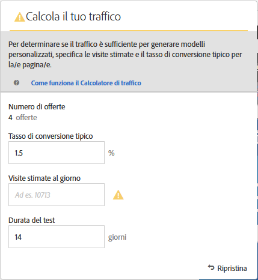
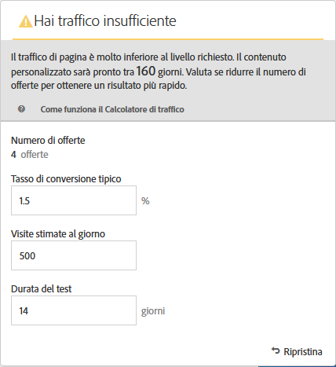
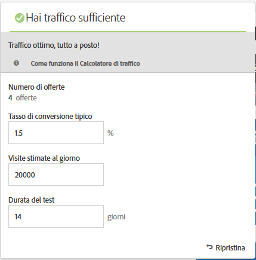

#  Stimare il traffico necessario per il successo

[!UICONTROL Traffic Estimator] fornisce un feedback che ti consente di sapere se il traffico è sufficiente perché l&#39;attività [!DNL Adobe Target] abbia successo.

Poiché un&#39;attività [!UICONTROL  Automated Personalization] utilizza più combinazioni di offerte, è importante sapere quanto traffico è necessario per fornire risultati significativi. [!UICONTROL Traffic Estimator] utilizza le statistiche sulla pagina e il numero di esperienze in fase di test per stimare la quantità di traffico e la durata del test necessari per garantire il successo dell&#39;attività.

[!UICONTROL Traffic Estimator] determina se il traffico è sufficiente per generare modelli personalizzati, confrontando le impression stimate della pagina e il tasso di conversione tipico per le pagine. Idealmente, per il successo di un&#39;attività, la corretta dimensione del campione garantisce che il contenuto personalizzato sia pronto entro il 50% della durata dell&#39;attività o in 14 giorni, a seconda del minore tra questi due valori. In questo modo, si ha un tempo sufficiente per ottenere contenuti personalizzati e stabilire quale distribuire.

Ricorda che [!DNL Target] fornisce esperienze in modo casuale fino alla creazione degli algoritmi di personalizzazione. L&#39;icona a forma di segno di spunta accanto a ciascuna offerta mostra quando il modello per tale offerta è pronto e [!DNL Target] è in grado di iniziare a distribuire contenuti personalizzati. Poiché l&#39;incremento è previsto solo una volta che i modelli sono pronti, l&#39;indicazione visiva consente di stabilire la giusta previsione. Utilizzate [!UICONTROL Traffic Estimator] in [!UICONTROL Visual Experience Composer] (VEC) per ottenere una guida su quando i modelli saranno pronti.

## Utilizzo di Traffic Estimator (Utilità di stima traffico)

1. In [!UICONTROL Visual Experience Composer (Compositore esperienza visivo)], fate clic su **[!UICONTROL Traffic]**.

   

   Viene aperto [!UICONTROL Traffic Estimator]. Fai di nuovo clic su **[!UICONTROL Traffico]**[!UICONTROL  per nascondere il Calcolatore del traffico].

   

1. Indica il tasso di conversione tipico (o il tasso di conversione previsto per questa attività), le impression di attività stimate al giorno e la durata del test.

   * **Numero di offerte**: Calcolato automaticamente in base al numero di esperienze create come parte dell&#39;attività dopo eventuali esclusioni.
   * **Tasso** di conversione tipico: Il tasso di conversione è espresso come percentuale, in base alla stima o ai dati passati del sistema di analisi.
   * **Visite stimate al giorno**: È il numero di visite giornaliere da parte dei visitatori in grado di visualizzare l&#39;attività, in base ai criteri di targeting. Può essere basato sui dati di analisi. Questo numero dovrebbe indicare le visite, non i visitatori univoci.
   * **Durata del test**: il numero di giorni desiderati per l’esecuzione dell’attività.

   La [!UICONTROL Traffic Estimato]r utilizza queste statistiche per determinare quali aggiustamenti sono necessari per eseguire un test di successo.

   Vicino alla parte superiore di [!UICONTROL Traffic Estimator], i valori inseriti vengono calcolati e i risultati visualizzati.

   

   Modificando i valori, si modifica anche la stima. Ad esempio, se state sottoponendo a test un numero elevato di combinazioni e il tasso di conversione e le impression sono troppo bassi, in [!UICONTROL Traffic Estimator] viene indicato per quanto tempo l&#39;esecuzione del test dovrà essere completata correttamente. Oppure, se il traffico è limitato, il [!UICONTROL Traffic Estimator] potrebbe suggerire un numero inferiore di combinazioni di offerte in modo da poter eseguire il test per il numero desiderato di giorni.

   Se non disponi di traffico sufficiente, puoi eseguire una o tutte le operazioni seguenti:

   * Prendete in considerazione l&#39;utilizzo di un&#39;attività [Auto-Target](/help/c-activities/auto-target/auto-target-to-optimize.md) invece di [!UICONTROL  Automated Personalization] per creare esperienze con diverse modifiche alle offerte in una singola variante dell&#39;esperienza.
   * Ridurre il numero di combinazioni di offerte all&#39;interno dell&#39;attività [!UICONTROL  Automated Personalization].
   * Aumenta la durata dell&#39;attività.

   Regolare i numeri fino a quando [!UICONTROL Traffic Estimator] indica che il traffico è sufficiente, quindi progettare il test di conseguenza.

   

   Se il traffico è sufficiente, l&#39;icona [!UICONTROL Traffic] mostra un segno di spunta verde. Se è insufficiente, l&#39;icona mostra un&#39;etichetta di avviso di colore rosso.

## Domande frequenti su Traffic Estimator (Utilità di stima traffico)

Quando lavorate con [!UICONTROL Traffic Estimator], considerate le seguenti domande frequenti:

### Perché [!DNL Target] non crea modelli personalizzati quando la mia attività AP ha abbastanza traffico?

In alcune circostanze, il traffico potrebbe essere sufficientemente ampio da consentire la creazione di un modello personalizzato, ma tale traffico potrebbe informare [!DNL Target] che non esiste alcuna differenza significativa tra il modello personalizzato e quello casuale. Anche se il modello è costruito in [!DNL Target] e testato, non verrà distribuito perché il modello non è significativamente migliore di quello casuale.

Un possibile motivo per cui il modello non è migliore del casuale potrebbe essere che le offerte non sono significativamente diverse tra loro. In questo caso, potete provare a rendere le offerte più diverse dal punto di vista visivo se i messaggi sono simili, oppure provare a modificare i messaggi stessi.
