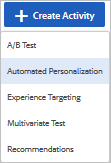
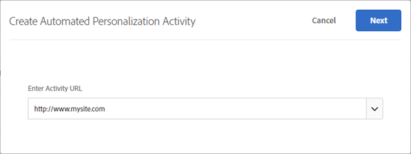
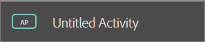
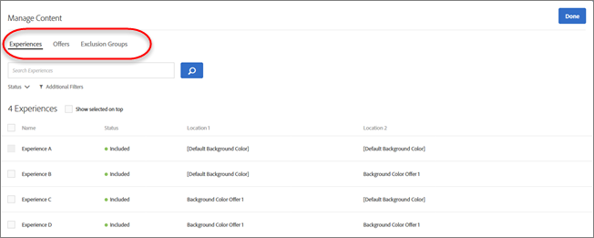
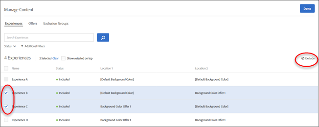
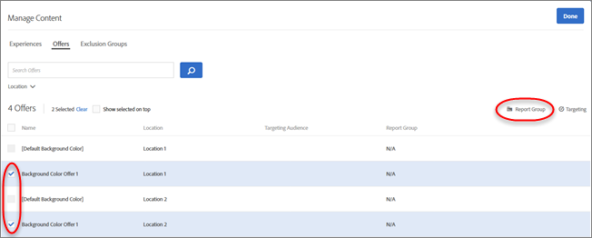
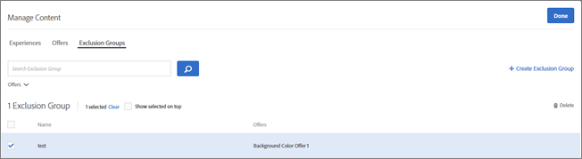
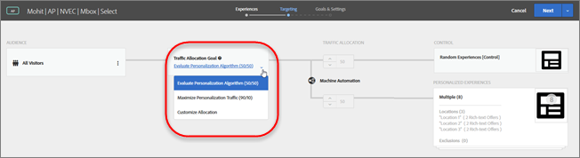

#  Creare un’attività di personalizzazione automatizzata{#create-an-automated-personalization-activity}

Il flusso di lavoro per le attività di Personalizzazione automatizzata è diverso da quello per gli altri tipi di attività.

1. Nell’elenco Attività di Target Standard, fai clic su **[!UICONTROL Crea attività]** &gt; **[!UICONTROL Personalizzazione automatizzata]**.

   

1. Specificare il canale desiderato: web.

   È possibile anche scegliere app per dispositivi mobili, e-mail, o altro/API.

1. Per utilizzare il Compositore esperienza visivo (VEC), fai clic su **[!UICONTROL Visivo (impostazione predefinita)]**.

   Se preferisci utilizzare il Compositore esperienza basato su moduli, seleziona **[!UICONTROL Modulo]**.

   Per ulteriori informazioni su entrambi i compositori, consulta [Esperienze](../../c-experiences/experiences.md#concept_A2E10F6AFB3D4AEAB6951EE14688848D).
1. Verifica o inserisci l’URL di attività, quindi fai clic su **[!UICONTROL Avanti]**.

   >[!NOTE]
   >
   >[!DNL Target] non distingue tra protocolli URL ( [!DNL https] e [!DNL http]). Di conseguenza, [!DNL `http://www.adobe.com`] e [!DNL `https://wwww.adobe.com`] sono entrambi validi.

   La pagina con l’URL specificato viene visualizzata nel Compositore esperienza visivo.

   

   Per informazioni sulla risoluzione dei problemi relativi al Compositore esperienza visivo, consulta [Risoluzione dei problemi relativi al Compositore esperienza visivo](../../c-experiences/c-visual-experience-composer/r-troubleshoot-composer/troubleshoot-composer.md#reference_77743144F10143A3A89D56E116D296E4).
1. Per assegnare un nome all’attività, fai clic sul campo Nome e digita il nome dell&#39;attività.

   

   I seguenti caratteri non sono consentiti nel nome di un’attività:

   | Carattere | Descrizione |
   |--- |--- |
   | / | Barra |
   | ? | Punto interrogativo |
   | # | Cancelletto |
   | : | Due punti |
   | = | Uguale |
   | + | Più |
   | - | Meno |
   | @ | Chiocciola |

1. Modifica gli elementi della pagina come descritto in [Esperienze](../../c-experiences/experiences.md#concept_A2E10F6AFB3D4AEAB6951EE14688848D), quindi fai clic su **[!UICONTROL Avanti]**.

   È possibile selezionare più immagini contemporaneamente dal gestore delle risorse. In questo modo è possibile visualizzare rapidamente la pagina con ciascuna delle immagini configurate per l&#39;attività. Inoltre è possibile modificare facilmente gli elementi di testo nelle offerte. Quando si modifica un elemento, su tale elemento vengono visualizzate delle barre per indicare che è stato modificato.

1. Fai clic su **[!UICONTROL Gestisci contenuto]** per configurare le combinazioni disponibili.

   Una finestra di dialogo appare con tre opzioni nella parte superiore dello schermo: esperienze, offerte e gruppi di esclusione.

   

   >[!NOTE]
   >
   >Anche se è possibile creare fino a 30.000 esperienze in un’attività Personalizzazione automatizzata, l’attività fornisce migliori prestazioni quando si utilizzano meno di 5.000 esperienze.

   L&#39;elenco [!UICONTROL Esperienze] mostra ogni parte del contenuto selezionata per l&#39;attività e la posizione a cui è assegnata. È possibile escludere esperienze specifiche passando con il puntatore del mouse sopra l&#39;esperienza desiderata e facendo quindi clic sull&#39;icona Escludi oppure escludere/includere esperienze in blocco selezionando la casella di spunta per le esperienze rilevanti e facendo quindi clic sull&#39;icona Escludi nell&#39;angolo in alto a destra della finestra di dialogo.

   

   È possibile filtrare la visualizzazione dell&#39;elenco per vedere solo le attività escluse o incluse, facendo clic sull&#39;elenco a discesa **Stato**.
1. Fai clic su **[!UICONTROL Offerte]** per selezionare parti di contenuto e assegnarle a [gruppi di rapporti](../../c-reports/offer-reporting-groups-in-automated-personalization.md#concept_194128C0B56B4B26AAB57DB49892960C).

   Utilizza l&#39;elenco [!UICONTROL Posizione] per filtrare le offerte in base alla posizione. Utilizza l&#39;elenco [!UICONTROL Gruppo di rapporti] per filtrare le offerte in base ai gruppi di rapporti. È inoltre possibile utilizzare l&#39;elenco [!UICONTROL Gruppo di rapporti] per filtrare le [!UICONTROL Offerte non assegnate] così da poter assegnare un gruppo di rapporti a un&#39;offerta attualmente non assegnata ad alcun gruppo di rapporti.

   È possibile aggiungere esperienze specifiche a un gruppo di rapporti passando con il puntatore del mouse sull&#39;offerta desiderata e facendo quindi clic sull&#39;icona della cartella oppure includere esperienze in blocco selezionando la casella di controllo relativa alle esperienze rilevanti e facendo quindi clic sull&#39;icona della cartella Gruppo di rapporti nell&#39;angolo in alto a destra della finestra di dialogo.

   

   È importante comprendere che i gruppi di rapporti incidono sul modo in cui Target genera i propri modelli. Di conseguenza, è consigliabile utilizzare i gruppi di rapporti solo se si prevede di sostituire o aggiungere nuove offerte mentre l&#39;attività è in corso. Se una nuova offerta viene introdotta in un&#39;attività in corso, inserire la nuova offerta in un gruppo con offerte analoghe esistenti permette alla macchina di utilizzare i dati già raccolti per le altre offerte del suo gruppo così da conoscere la nuova offerta. È sconsigliabile mettere tutte le offerte in un unico gruppo di rapporti.

   Per informazioni su come indirizzare un&#39;offerta a tipi di pubblico specifici, consulta  [Offerte Personalizzazione automatizzata di Target](../../c-activities/t-automated-personalization/ap-target-offers.md#task_F207ED7A41B84FD39BB6FCBFABF4B23E).
1. (Facoltativo) Fai clic su **[!UICONTROL Offerte]** per selezionare parti di contenuto e assegnarle a gruppi di reporting o per consentire solamente a determinati visitatori di visualizzare alcune offerte con targeting.

   Per ulteriori informazioni, consulta [Gruppi di reporting delle offerte in Personalizzazione automatizzata](../../c-reports/offer-reporting-groups-in-automated-personalization.md#concept_194128C0B56B4B26AAB57DB49892960C).

   Per informazioni su come realizzare offerte mirate a tipi di pubblico specifici, consulta [Offerte mirate di Personalizzazione automatizzata](../../c-activities/t-automated-personalization/ap-target-offers.md#task_F207ED7A41B84FD39BB6FCBFABF4B23E).
1. (Facoltativo) Fai clic su **[!UICONTROL Gruppi di esclusione]** per scegliere le combinazioni di elementi che desideri escludere dall’attività.

   

   Anche se è possibile creare fino a 30.000 esperienze in un test di Personalizzazione automatizzata, l&#39;algoritmo fornisce prestazioni migliori quando si utilizzano meno di 10.000 esperienze.

   Se nell&#39;attività non sono presenti gruppi di esclusione, fai clic su **Crea gruppo di esclusione**. È possibile filtrare l&#39;attività per creare un elenco che mostra solo le combinazioni che desideri escludere. Denomina il gruppo di esclusione e fai clic su **Salva**.

   Per modificare un gruppo di esclusione esistente, posiziona il puntatore del mouse sul gruppo che desideri modificare, quindi fai clic sull&#39;icona a forma di matita.
1. Una volta completata l’impostazione del contenuto dell’attività, fai clic su **[!UICONTROL Fine]**.
1. Se hai già utilizzato altri tipi di attività di Target, la fase di **Targeting** ti risulterà familiare. Qui puoi selezionare un pubblico e specificare la percentuale di visitatori che vedranno l&#39;esperienza di controllo facendo clic sull&#39;elenco a discesa **[!UICONTROL Personalizza allocazione]**, quindi fai clic su **Successivo**.

   L’elenco a discesa [!UICONTROL Personalizza allocazione] consente di scegliere tra le seguenti opzioni:

   

   * **Valuta algoritmo di personalizzazione (50/50):** se l&#39;obiettivo è quello di testare l&#39;algoritmo, assegna il 50% dei visitatori all&#39;algoritmo di controllo e l&#39;altro 50% a quello di destinazione. Questa suddivisione fornisce la stima più accurata dell’incremento.
   * **Massimizza traffico personalizzazione (90/10):** se il tuo obiettivo è invece quello di creare un’attività “sempre attiva”, inserisci dal 10% al 30% dei visitatori nel controllo affinché ci siano abbastanza dati per consentire agli algoritmi di continuare a imparare nel tempo. In questo caso, considera che la personalizzazione di una proporzione maggiore del traffico va a scapito della precisione nell’incremento rilevato.
   * **Personalizza allocazione** dividi manualmente la percentuale come desiderato.
   L&#39;esperienza di controllo fornisce un confronto per determinare l&#39;incremento fornito dal test automatizzato.

   Nella personalizzazione automatizzata le prestazioni vengono sempre misurate in base al confronto con un gruppo di controllo. La migliore prassi è quella di collocare almeno il 10% dei partecipanti nel gruppo di controllo. Se l&#39;obiettivo è quello di verificare se l&#39;algoritmo di personalizzazione sui dati stia fornendo migliori prestazioni rispetto all&#39;assenza di personalizzazione (vale a dire, il controllo eseguito in modo casuale), allora il modo più veloce e preciso per raggiungere questo obiettivo è la suddivisione di un 50% e l&#39;altro 50% del traffico tra il controllo e l&#39;algoritmo di personalizzazione. Se desideri massimizzare la quantità di traffico personalizzato e sei meno interessato a conoscere l&#39;incremento esatto generato dall&#39;attività, allora il modo più veloce e preciso per raggiungere questo obiettivo è la suddivisione del 10% e del 90% del traffico tra il controllo e l&#39;algoritmo di personalizzazione.

   >[!NOTE]
   >
   >Nelle attività di personalizzazione automatizzata, i criteri di ingresso (destinazione URL, regole modello e destinazione pubblico) vengono valutati per ogni richiesta. Nelle versioni precedenti, i criteri di ingresso venivano valutati una volta a sessione.

1. Fai clic su **[!UICONTROL Continua]** per visualizzare la pagina **[!UICONTROL Obiettivi e impostazioni]**.
1. Configura l’attività con le impostazioni seguenti, quindi fai clic su **[!UICONTROL Salva e chiudi]**.

   | Impostazione | Descrizione |
   |--- |--- |
   | Nome | Assegna un nome all’attività. Attribuisci all&#39;attività un nome sufficientemente descrittivo da consentire ai membri del gruppo di riconoscerla nell&#39;elenco delle attività.  Consultate la tabella qui sopra per vedere quali caratteri non sono consentiti nel nome di un’attività. |
   | Finalità | (Facoltativo) Inserire la finalità del test. La finalità aiuta a ricordare lo scopo dell&#39;attività. |
   | Priorità | L’interfaccia utente e le opzioni per Priorità variano a seconda delle impostazioni. È possibile utilizzare le impostazioni legacy Bassa, Media o Alta, oppure attivare la priorità granulare da 0 a 999. La priorità è utilizzata se più attività vengono assegnate alla stessa posizione con lo stesso pubblico. Se due o più attività vengono assegnate alla posizione, viene visualizzata l’attività con priorità maggiore. Se questa opzione non è abilitata in Configurazione (impostazione predefinita), specifica una priorità: Bassa, Media o Alta. Per abilitare le priorità dettagliate, fai clic su [!UICONTROL Configurazione], quindi attiva l’opzione [!UICONTROL Abilita priorità precise]. Se questa opzione è abilitata, specifica un valore compreso tra 0 e 999:<ul><li>0 = Bassa</li><li>999 = Alta</li></ul>Per le attività create con le versioni precedenti di Target Standard/Premium, la priorità Bassa viene convertita in 0, la priorità Media in 5 e la priorità Alta in 10. Se necessario, è possibile modificare questi valori. **Nota**: prima di poter disabilitare questa opzione dopo aver utilizzato le priorità precise, tutte le priorità devono essere impostate su 0, 5 o 10. |
   | Durata | Imposta le date di inizio e di fine dell&#39;attività. |
   | Obiettivo di ottimizzazione | Specifica l&#39;obiettivo di ottimizzazione, costituito da due parametri:<ul><li>Ciò che desideri misurare con l&#39;attività</li><li>L&#39;azione intrapresa da un partecipante a un&#39;attività che dimostra che l&#39;obiettivo è stato raggiunto.</li></ul>È possibile scegliere di assegnare un nome all&#39;obiettivo di ottimizzazione, selezionando i tre punti a destra di “Il mio obiettivo principale”. Le attività personalizzazione automatizzata sono in grado di misurare conversione, RPV e AOV. La conversione può essere ottenuta mediante la visualizzazione di una pagina o di una mbox. È possibile inoltre il tracciamento dei clic. L’obiettivo principale diventa anche la metrica di modellazione, utilizzata dal sistema di modellazione per calcolare il successo dell’esperienza. I visitatori possono essere mantenuti nell&#39;attività per scopi di tracciamento, dopo aver raggiunto l&#39;obiettivo di modellazione. Ad esempio, spesso per aumentare il numero di clic si ricorre a un’attività di Personalizzazione automatizzata che viene impostata come obiettivo di modellazione. Tuttavia è importante capire in che modo un maggior numero di clic porti alla conversione finale, perciò è essenziale effettuare il tracciamento fino alla conversione finale. È possibile fornire la dipendenza su più metriche insieme alla flessibilità necessaria, per scegliere se la metrica debba essere raggiunta o meno per incrementare il conteggio. È necessario definire entrambe le metriche (o più metriche) di successo prima di renderle interdipendenti tra loro. L’opzione Aggiungi dipendenza consente di incrementare la metrica di successo nel caso in cui un’altra metrica di successo venga raggiunta o meno. Per aggiungere una dipendenza:<ol><li>Dopo aver aggiunto ulteriori metriche, fai clic su [!UICONTROL Impostazioni avanzate] sotto il menu a tre punti a destra di Obiettivo aggiuntivo.</li><li>Fai clic sull’opzione [!UICONTROL Aggiungi dipendenza] nella parte inferiore della sezione [!UICONTROL Impostazioni reporting].</li><li>Trascina e rilascia le metriche desiderate dal riquadro di sinistra a quello di destra, quindi fai clic su [!UICONTROL Raggiunto] per scegliere tra [!UICONTROL Raggiunto] e [!UICONTROL Non raggiunto]</li></ol>È possibile modificare o rimuovere le dipendenze dopo averle aggiunte. |
   | Metrica di conversione | Per impostazione predefinita, la metrica di conversione è identica alla metrica di obiettivo ottimizzata. Tuttavia, puoi definire una metrica di conversione separata deselezionando l&#39; [!UICONTROL opzione Come obiettivo] ottimizzazione. |
   | Altre metriche | Indica eventuali metriche di reporting aggiuntive da utilizzare. Puoi aggiungere metriche di conversione o ricavi. **Nota**: la metrica di coinvolgimento non è supportata anche come metrica aggiuntiva. L&#39;interfaccia utente potrebbe consentire di selezionare la metrica di coinvolgimento, ma i dati non verranno visualizzati in modo accurato nei rapporti. |
   | Tipi di pubblico per i rapporti | Aggiungi tipi di pubblico per poter filtrare i rapporti in base al pubblico. Per impostazione predefinita, il rapporto mostra risultati per tutti i visitatori idonei. Aggiungi dei tipi di pubblico per filtrare i risultati per sottoinsiemi più specifici di visitatori. **Nota**: a differenza di altri tipi di attività, la personalizzazione automatizzata non può utilizzare Adobe Analytics come origine per la generazione di rapporti. |
   | Note | Inserisci informazioni sull’attività, utili per te o per gli altri membri del gruppo. Il riquadro delle note è ridimensionabile. |

   Nota che quando denomini o rinomini una metrica, i seguenti caratteri non sono consentiti:

   | Carattere | Descrizione |
   |--- |--- |
   | / | Barra |
   | ? | Punto interrogativo |
   | # | Cancelletto |
   | : | Due punti |
   | = | Uguale |
   | + | Più |
   | - | Meno |
   | @ | Chiocciola |

Dopo aver fatto clic su **[!UICONTROL Crea]** verrà visualizzato il riepilogo attività. Fai clic su **Anteprima esperienze** per poter vedere in anteprima l&#39;aspetto che avranno le tue esperienze quando saranno distribuite. Appare un riquadro a comparsa che puoi utilizzare per visualizzare e condividere i collegamenti alle esperienze di Personalizzazione automatizzata sul tuo sito per ottenere una “anteprima fedele” al di fuori del Compositore esperienza visivo di Target. Per condividere l’anteprima, è necessario condividere i collegamenti dal messaggio. Non è possibile fare clic su un collegamento e poi copiare l&#39;URL direttamente dalla pagina, perché l&#39;URL contiene un parametro che visualizza la pagina correttamente solo quando si accede alla pagina dal collegamento nel messaggio.

Per informazioni sull&#39;attività di reporting, consulta  [Rapporti per Personalizzazione automatizzata](../../c-reports/reports-ap.md#concept_C02BAFC922114A44846998FD956E345A).
