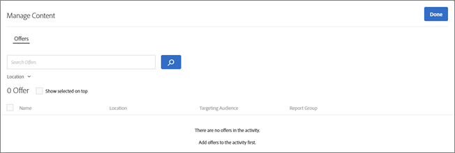
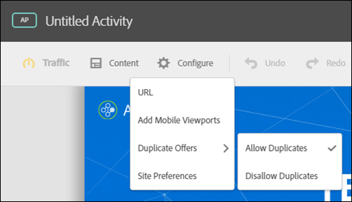
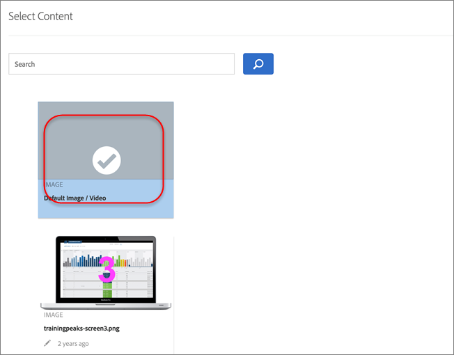

# Gestire le esclusioni{#manage-exclusions}

Gestire i gruppi di esclusione e le offerte duplicate nelle attività di personalizzazione automatizzata.

## Creare gruppi di esclusione {#task_AAAA6C7239A84F7696C8492F04B575A2}

Crea dei gruppi di esclusione nelle attività di Personalizzazione automatizzata per escludere automaticamente esperienze con specifiche offerte.

I gruppi di esclusione sono un ottimo modo per garantire che le offerte incompatibili non siano presentate nella stessa esperienza in percorsi diversi. Ad esempio, supponiamo di avere due offerte: una è per il 20% di sconto di tutte le merci e l&#39;altro è per il 15% di sconto. Non vorresti mai che queste due offerte fossero presentate ai visitatori nella stessa esperienza. Se si aggiungono queste due offerte a un gruppo di esclusione, è possibile assicurarsi che questo non sarà mai il caso.

**Per creare un gruppo di esclusione:**

1. Durante la creazione o la modifica di un’attività di Personalizzazione automatizzata, fai clic su **[!UICONTROL Gestione contenuto]** nella barra dell’intestazione.
1. Nella finestra di dialogo [!UICONTROL Gestione contenuto] fai clic su **[!UICONTROL Gruppi di esclusione]**.

   

   Se sono stati precedentemente creati gruppi di esclusione, questi vengono visualizzati nell&#39;elenco. Se non è stato ancora creato un gruppo di esclusione, viene richiesto di crearne uno.
1. Fai clic su **[!UICONTROL Crea gruppo di esclusione.]**

   

1. (Obbligatorio) Specifica un nome descrittivo per il gruppo di esclusione.

   Un nome descrittivo aiuta te od altri ad individuare rapidamente e capire lo scopo di un gruppo.

1. Individua e seleziona le offerte desiderate da aggiungere al gruppo di esclusione.

   È possibile selezionare più offerte dalla stessa posizione in un gruppo di esclusione.

1. Fai clic su **[!UICONTROL Salva]**.

Le offerte del gruppo di esclusione saranno escluse in maniera automatizzata dalle stesse esperienze in corso.

## Escludere le offerte duplicate  {#concept_4EF78013F80E48EFA024AE0274C9F037}

Evita che le offerte della libreria vengano duplicate quando sono utilizzate in posizioni diverse nelle attività di [!UICONTROL Personalizzazione automatizzata].

Si potrebbe avere un&#39;attività, ad esempio, con sei percorsi in una pagina con 12 offerte. Esiste la possibilità che la stessa offerta possa essere collocata in uno o più percorsi nell&#39;attività. Questa funzionalità impedisce la visualizzazione di offerte duplicate contemporaneamente in percorsi diversi all&#39;interno della stessa attività.

Clicca su **[!UICONTROL Configura]** &gt; **[!UICONTROL Offerte duplicate]**, quindi fai clic su **[!UICONTROL Consenti duplicati]** o **[!UICONTROL Non consentire duplicati]**.

## Escludere esperienze specifiche {#task_C17D36EF58AF4908B17A3D84CA6DE85A}

Escludi specifiche esperienze se desideri escludere dall’attività di Personalizzazione automatizzata determinate combinazioni di offerte.

Ci potrebbero essere alcune combinazioni che non funzionano bene insieme, o si potrebbe limitare il numero di esperienze testate per ridurre i requisiti di traffico per l&#39;attività.

1. Durante la creazione o la modifica di un&#39;attività di Personalizzazione automatizzata, fai clic su **Gestione contenuto** nella barra dell&#39;intestazione. 

   L&#39;elenco [!UICONTROL Esperienze] mostra ogni esperienza generata dalle permutazioni di tutte le opzioni di contenuto e percorso.

1. Escludi le esperienze, se lo desideri.

   È possibile escludere esperienze specifiche passando sopra l&#39;esperienza desiderata e cliccando sull&#39;icona Escludi.

   

   Oppure è possibile escludere e includere esperienze in blocco selezionando la casella di spunta per le esperienze rilevanti e quindi cliccando su **Escludi** nell&#39;angolo in alto a destra della finestra di dialogo. Il pulsante Escludi viene visualizzato quando si verificano una o più esperienze.

   

   Per filtrare questo elenco in modo da visualizzare solo le attività escluse o incluse, fai clic sul menu a discesa [!UICONTROL Stato].

   Le esperienze saranno ora escluse dall&#39;attività e il loro [!UICONTROL Stato] appare come [!UICONTROL Escluso].

   

## Escludere il contenuto predefinito  {#task_DCB4528989DF4C05A3A4729E5891D18F}

In alcuni casi, potrebbe non essere necessario includere il contenuto predefinito come parte dell’attività di Personalizzazione automatizzata. La modalità di accesso a questa impostazione è diversa dalla creazione dei gruppi di esclusione. Puoi utilizzare questo metodo per disporre di una sola offerta (diversa dal contenuto predefinito) in una posizione come parte dell’attività di Personalizzazione automatizzata.

L&#39;esclusione del contenuto predefinito è un ottimo modo per modificare l&#39;aspetto del resto della pagina in base alle offerte che si stanno testando con l&#39;attività di Personalizzazione automatizzata. Ad esempio, si supponga di voler corrispondere alla tavolozza dei colori delle offerte che si stanno testando, di modificare il colore di sfondo della pagina ed escludere il colore di sfondo predefinito.

**Per escludere il contenuto predefinito utilizzando il Compositore di esperienza visiva:**

1. Durante la creazione o la modifica di un’attività di Personalizzazione automatizzata, seleziona il contenuto che desideri sostituire e clicca per accedere a **[!UICONTROL Cambia testo/HTML]** o **[!UICONTROL Modifica immagine]** o **[!UICONTROL Modifica colore di sfondo]**.
1. Nella finestra di dialogo, crea il nuovo contenuto e deseleziona **Includi** a destra del contenuto predefinito (o deseleziona Immagine/video predefinito nella schermata Seleziona contenuto).

   A seconda del tipo di contenuto/offerta, la casella di controllo [!UICONTROL Includi] è in un percorso leggermente diverso.

   Per contenuto testo/HTML:

   

   Per contenuto immagine/video:

   

   Per colore dello sfondo:

   

1. Fai clic su **[!UICONTROL Salva]**.

   È possibile visualizzare le esperienze create dalle offerte specificate in [!UICONTROL Gestione contenuto]. Noterai che non vengono create esperienze in [!UICONTROL Gestione contenuto] utilizzando l&#39;offerta predefinita esclusa.

   

**Per escludere il contenuto predefinito utilizzando il Compositore esperienza basato su moduli:**

1. Durante la creazione o la modifica di un’attività di Personalizzazione automatizzata, clicca su **[!UICONTROL Modifica testo/HTML]** o **[!UICONTROL Modifica offerta immagine]** in **[!UICONTROL Contenuto]**.
1. Nella finestra di dialogo, crea il nuovo contenuto e deseleziona **[!UICONTROL Includi]** a destra del contenuto predefinito (o deseleziona Immagine/video predefinito nella schermata Seleziona contenuto).

   A seconda del tipo di contenuto od offerta, la casella di controllo Includi sarà in un luogo leggermente diverso.

   Per contenuto testo/HTML:

   

   Per contenuto immagine/video:

   

1. Fai clic su **[!UICONTROL Salva]**.

   È possibile visualizzare le esperienze create dalle offerte specificate in [!UICONTROL Gestione contenuto]. Noterai che non vengono create esperienze in [!UICONTROL Gestione contenuto] utilizzando l&#39;offerta predefinita esclusa.

   
