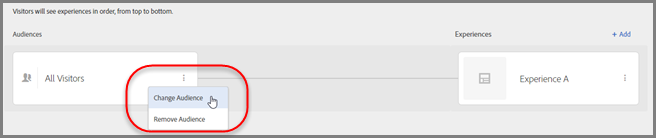

# Creare un’attività Targeting esperienze{#create-an-experience-targeting-activity}

Utilizza il Compositore esperienza visivo per creare un’attività Targeting esperienze su una pagina abilitata per Target e modificarne alcune parti della pagina in Target.

1. Dall’elenco [!UICONTROL Attività], fai clic su **[!UICONTROL Crea attività]** &gt; **[!UICONTROL Targeting delle esperienze]**.

   

   >[!NOTE]
   >
   >I tipi di attività disponibili dipendono dall’account Target. Alcuni tipi di attività potrebbero non essere visualizzati nell&#39;elenco.

   Per informazioni sui tipi di attività, vedi [Attività](../../../c-activities/activities.md#concept_D317A95A1AB54674BA7AB65C7985BA03).
1. Inserisci l’[URL di attività](../../../c-activities/t-experience-target/t-xt-create/xt-activity-url.md#concept_D28549AAA0A14E3BB5F05F32BE8ABC90), quindi fai clic su **[!UICONTROL Avanti]**.

   

   Se l&#39;account è configurato con un URL predefinito, tale URL verrà visualizzato come impostazione predefinita. È possibile passare dall’URL predefinito a un altro.

   Per informazioni sulla risoluzione dei problemi relativi al Compositore esperienza visivo, consulta [Risoluzione dei problemi relativi al Compositore esperienza visivo](../../../c-experiences/c-visual-experience-composer/r-troubleshoot-composer/troubleshoot-composer.md#reference_77743144F10143A3A89D56E116D296E4).

   Se preferisci utilizzare il Compositore esperienza basato su moduli, seleziona tale opzione. Consulta [Compositore esperienza basato su moduli](https://marketing.adobe.com/resources/help/it_IT/target/target/t_form_experience_composer.html).

   Verrà aperto il Compositore esperienza visivo, con la pagina specificata nell&#39;URL.
1. Digita un nome per l&#39;attività nello spazio fornito.

   

   I seguenti caratteri non sono consentiti nel nome di un’attività:

   | Carattere | Descrizione |
   |--- |--- |
   | `/` | Barra |
   | `?` | Punto interrogativo |
   | `#` | Cancelletto |
   | `:` | Due punti |
   | `=` | Uguale |
   | `+` | Più |
   | `-` | Meno |
   | `@` | Chiocciola |

1. [Crea nuove esperienze](../../../c-activities/t-experience-target/t-xt-create/xt-add-experience.md#task_454646F2895242D3B92DC395A0CE1A00) modificando gli elementi nella pagina.

   Nel Compositore esperienza (vedi [Esperienze](../../../c-experiences/experiences.md#concept_1D011219034B492BB03C08B3BB80E3F0)) viene aperta la pagina specificata in Preferenze account. Per visualizzare una pagina diversa fai clic sull’icona del globo e immetti l’URL nella casella Seleziona URL nel Compositore esperienza, quindi fai clic su **[!UICONTROL Continua]**. Se hai inserito un URL per un sito che non include il codice JavaScript di Target Standard, non puoi selezionare elementi di pagina.

   Per impostazione predefinita, il Compositore esperienza visivo non consente di modificare gli elementi contenenti JavaScript, ad esempio i banner rotanti. È possibile disattivare JavaScript per poter modificare tali elementi utilizzando il Compositore esperienza visivo.

   >[!NOTE]
   >
   >Se modifichi l’URL dopo aver apportato modifiche a una pagina per una o più esperienze, l’esperienza viene reimpostata utilizzando la nuova pagina e le modifiche apportate andranno perse.

   Quando passi il puntatore del mouse sopra gli elementi della pagina, gli elementi vengono evidenziati. Qualsiasi elemento evidenziato può essere modificato utilizzando il Compositore esperienza.

   Se hai creato una mbox sulla pagina utilizzando Target Classic (in precedenza Test&amp;Target), questa viene visualizzata come un elemento che mostra il nome della mbox, e può essere modificata come qualsiasi altro elemento.

   >[!NOTE]
   >
   >Se distribuisci un’immagine da un’origine diversa dalla pagina principale (ad esempio un’immagine in hosting su akamai.net e distribuita a dell.com), l’immagine non viene visualizzata nella miniatura della pagina mostrata nel diagramma di flusso.

1. Fai clic su **[!UICONTROL Successivo]**.

   Viene visualizzato il diagramma di flusso.

   

   Il diagramma di flusso ti guida attraverso le fasi di selezione del pubblico per l’attività e creazione di esperienze.
1. Porta il cursore sul pubblico, fai clic sull’icona **[!UICONTROL Modifica]** (tre puntini di sospensione verticali) visualizzata, fai clic su **[!UICONTROL Sostituisci pubblico]**, quindi seleziona il pubblico per la prima esperienza nell’attività.

   

   Viene visualizzata la libreria dei tipi di pubblico. La libreria del pubblico include tipi di pubblico definiti in precedenza, inclusi alcuni di utilizzo comune già integrati in Target. È possibile selezionare un pubblico dalla libreria, oppure [creare un nuovo pubblico](../../../c-target/c-audiences/audiences.md#concept_65BE870D290E412D8BBF557EEA67C271). Per mostrare la stessa esperienza a tutti i partecipanti, scegli Tutti i visitatori.

   >[!NOTE]
   >
   >Oltre a selezionare un pubblico esistente, puoi combinare più tipi di pubblico per creare un pubblico combinato ad hoc anziché crearne uno nuovo. Per ulteriori informazioni, consulta [Combinazione di più tipi di pubblico](../../../c-target/combining-multiple-audiences.md#concept_A7386F1EA4394BD2AB72399C225981E5).

   Durante la creazione di un pubblico, puoi selezionare una posizione (mbox) e specificarne i parametri. In Parametri personalizzati, seleziona la mbox e specifica i parametri desiderati.

   >[!NOTE]
   >
   >Quando apri l’elenco dei tipi di pubblico e questi sono stati importati da almeno 10 minuti, vengono importati automaticamente in background.

   Puoi fare clic sull&#39;icona di [!UICONTROL Modifica] (tre puntini di sospensione verticali) visualizzata, quindi fare clic su [!UICONTROL Rimuovi pubblico] per rimuovere un pubblico esistente.
1. Fai clic su **[!UICONTROL Aggiungi targeting esperienza]**.

   >[!NOTE]
   >
   >Se stai eseguendo il targeting di un&#39;esperienza per un pubblico, è necessario selezionare il pubblico prima di poter aggiungere un’esperienza. Viene visualizzato un messaggio per ricordarti di scegliere il pubblico.

1. (Facoltativo) Fai clic su **[!UICONTROL Aggiungi]** e configura ulteriori esperienze con targeting.

   

   Fai clic su **[!UICONTROL Successivo]** dopo aver completato il passaggio.
1. Specifica [obiettivi e impostazioni](../../../c-activities/t-experience-target/t-xt-create/xt-goals-and-settings.md#reference_B25389FD6F3A4989801E740364B089CC) per l’attività.

   

1. Fai clic su **[!UICONTROL Salva e chiudi]**.
