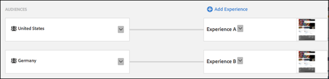
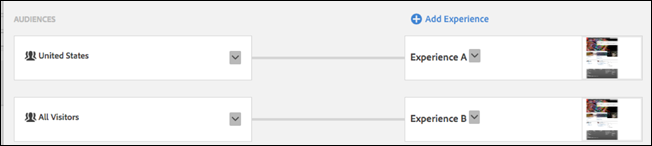
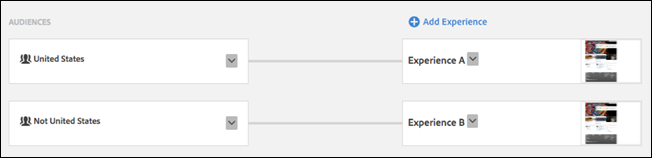
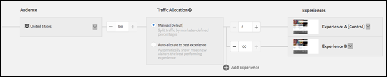

# Passare ad altre esperienze nel targeting delle esperienze{#switching-experiences-in-experience-targeting}

Informazioni su come i visitatori possono passare da un’esperienza all’altra in un’attività Targeting esperienze (XT) mentre i loro profili evolvono.

>[!NOTE]
>
>**21 settembre 2017**
>
>Con la versione del 21 settembre, in Target cambierà il modo in cui gli utenti vengono inseriti nelle esperienze di attività di targeting delle esperienze (XT) (campagne Pagina di destinazione in Target Classic). Per tutte le attività nuove ed esistenti sia in Target Standard/Premium che in Target Classic, gli utenti devono soddisfare le regole del targeting delle esperienze su ogni impression per poter continuare a vedere il contenuto dell’esperienza ed essere conteggiati nei rapporti. In precedenza, se l’utente non era più qualificato per alcuna esperienza, avrebbe continuato a vedere il contenuto dell’ultima esperienza per la quale si era qualificato, e ad essere conteggiato nei rapporti per tale esperienza.
>
>Con questa versione tale modifica avverrà automaticamente per tutte le attività esistenti e per ogni nuova attività creata dopo il rilascio. Se desideri continuare con il metodo precedente (prima del 21 settembre), puoi creare il pubblico utilizzando script di profilo in modo che un utente debba soddisfare una condizione solo una volta per continuare a rientrare in tale pubblico in futuro. Quindi, utilizza questo pubblico per ogni esperienza nell’attività.

Il targeting delle esperienze permette di controllare l’esperienza che viene visualizzata dai visitatori con l’evolversi del loro profilo. Di seguito sono elencati alcuni scenari in cui i profili dei visitatori possono evolversi e per i quali potresti voler presentare contenuti diversi:

| Scenario | Dettagli |
|--- |--- |
| Posizione geografica | Quando un visitatore si sposta per lavoro o per piacere, può accedere al sito web o all’app mobile da posizioni geografiche diverse. |
| Stato del cliente | Il visitatore può essere considerato potenziale cliente prima di creare un account o acquistare un prodotto. |
| Affinità tra categorie | La funzione di [affinità tra categorie](/help/c-target/c-visitor-profile/category-affinity.md) in Target acquisisce automaticamente le categorie visitate dagli utenti e quindi calcola l’affinità degli utenti per la categoria a scopo di targeting. Ad esempio, a un visitatore che ha visualizzato diversi articoli del sito web su un particolare argomento, potrebbero essere presentati altri contenuti correlati a tale argomento. |
| Giorno della settimana | All’avvicinarsi del fine settimana, potresti mostrare ai visitatori contenuti su film, ristoranti o altre forme di intrattenimento. |

Per sfruttare queste funzionalità in [!DNL Target], è importante comprendere le seguenti informazioni mentre si lavora con le attività XT:

* **La priorità è controllata dall’ordine delle esperienze, dall’alto verso il basso.** Se un visitatore è qualificato per più di due tipi di pubblico, riceverà contenuti dall’esperienza con priorità più elevata.
* **I visitatori potranno passare da un’esperienza all’altra in un’attività XT se iniziano a qualificarsi per il pubblico di un’esperienza a priorità più elevata.**

   Ad esempio, nella seguente configurazione attività, un visitatore ha visitato il tuo sito web dagli Stati Uniti e poi si è recato in Germania, dove ha visitato il tuo sito web una seconda volta. Durante la prima visita, questo visitatore si è qualificato per l’Esperienza A (Stati Uniti). Dopo aver visitato il tuo sito web dalla Germania, lo stesso visitatore è passato all’Esperienza B (Germania).

   

* **Un visitatore potrà anche passare da un’esperienza all’altra se non si qualifica più per il pubblico attuale e inizia invece a qualificarsi per un’esperienza a priorità più bassa.**
* **Se il visitatore non si qualifica più per l’esperienza attuale, né si qualifica per un’altra esperienza, vedrà il contenuto predefinito.**

   Ad esempio, nella seguente configurazione attività, un visitatore ha visitato il tuo sito web dagli Stati Uniti e poi si è recato in Francia, dove ha visitato il tuo sito web una seconda volta. Durante la prima visita, questo visitatore si è qualificato per l’Esperienza A (Stati Uniti). Dopo aver visitato il tuo sito web dalla Francia, rimarrà nell’esperienza originale.

   

* **Un’esperienza rivolta a &quot;Tutti i visitatori&quot; può essere utilizzata come ultima esperienza nell’attività di targeting delle esperienze per includere i visitatori che non sono rientrati in nessun’altra esperienza. Se un’esperienza rivolta a &quot;Tutti i Visitatori&quot; non è l’ultima dell’ordine, verranno comunque valutate le altre esperienze che la seguono.**

   Ad esempio, nella seguente configurazione attività, un visitatore ha visitato il tuo sito web dagli Stati Uniti e poi si è recato in Germania, dove ha visitato il tuo sito web una seconda volta. Durante la prima visita, questo visitatore si è qualificato per l’Esperienza A (Stati Uniti). Dopo aver visitato il tuo sito web dalla Germania, questo visitatore rimarrà nell’Esperienza A (Stati Uniti).

   

   Se preferisci evitare questa situazione, puoi creare un nuovo pubblico definito esplicitamente come l’inverso del pubblico di destinazione, come illustrato di seguito:

   

* **Con un’attività XT con una sola esperienza, i visitatori rimarranno in un’esperienza anche se non si qualificheranno più per il pubblico che li ha portati in tale esperienza.**

   Se preferisci evitare questa situazione, puoi creare un’altra esperienza rivolta al pubblico inverso (per esempio, &quot;Non Stati Uniti&quot; in contrapposizione a &quot;Stati Uniti&quot;). In alternativa, puoi creare un’attività A/B destinata al pubblico desiderato con un’allocazione del traffico del 100%, come mostrato di seguito:

   

* **La priorità delle esperienze è definita dall’ordine (dall’alto verso il basso) in cui vengono visualizzate nell’interfaccia utente di Target.**

   È un aspetto importante da tenere presente negli scenari in cui un visitatore potrebbe qualificarsi per più di un pubblico. Ad esempio, supponiamo di avere due esperienze: una rivolta ai visitatori “Stati Uniti” e l’altra ai visitatori “New York”; un visitatore da New York si qualifica per entrambi i tipi di pubblico. Devi quindi assicurarti che l’esperienza “New York” sia definita prima dell’esperienza “Stati Uniti” nell’interfaccia utente di Target. In tal modo l’esperienza “New York” più mirata avrà una priorità più alta, come illustrato nell’esempio seguente:

   

