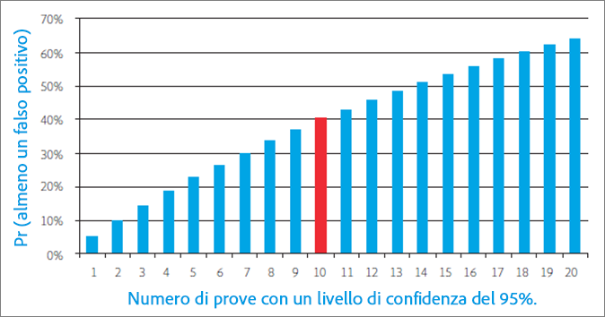
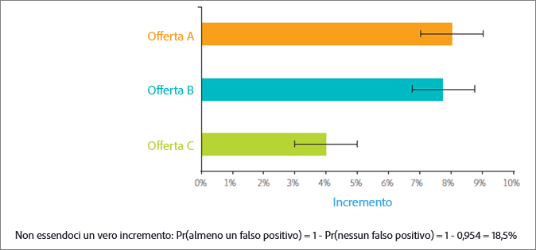
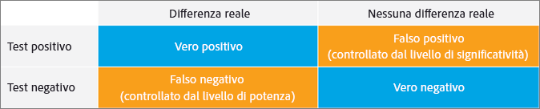
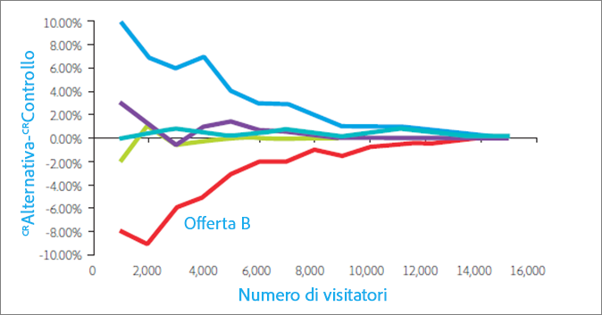
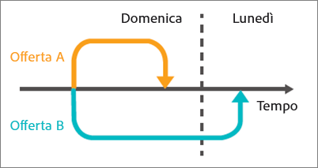
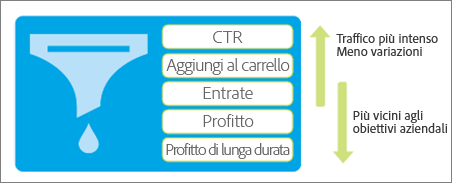

# Dieci insidie frequenti per i test A/B e come evitarle

I test A/B in [!DNL Adobe Target] costituiscono la spina dorsale della maggior parte dei programmi di ottimizzazione del marketing digitale, consentendo agli esperti di marketing di offrire esperienze ottimizzate e mirate ai visitatori e ai clienti. Questa sezione descrive dieci delle insidie più significative a cui le aziende sono soggette durante l&#39;esecuzione di test A/B. Illustra inoltre metodi per evitare tali insidie, in modo da ottenere un maggiore ROI attraverso le attività di testing e una maggiore fiducia nei risultati evidenziati dai test A/B.

## Pitfall 1: Ignorare gli effetti del livello di rilevanza {#section_55F5577A13C6470BA1417C2B735C6B1D}

Quanto è probabile che il test riporti una differenza significativa nel tasso di conversione tra due offerte, quando in realtà non c&#39;è? Questo è ciò che il *livello di significatività* di un test aiuta a determinare. Tali risultati fuorvianti sono spesso chiamati un falso positivo e, nel mondo delle statistiche, sono chiamati un errore di Tipo I (se si rifiuta erroneamente l&#39;ipotesi null che è effettivamente vera).

Quando si specifica il livello di significatività di un test A/B, si sta effettuando un compromesso tra la tolleranza di accettare che un&#39;esperienza sia migliore rispetto alle altre quando in realtà non lo è (errore di Tipo I o “falso positivo”) e non vedere differenza statistica tra le esperienze quando in realtà c&#39;è (errore di Tipo II o “falso negativo”). Il *livello di affidabilità* viene determinato prima dell&#39;esecuzione di un test.

L&#39;*intervallo di affidabilità*, che viene determinato dopo il completamento di un test, è influenzato da tre fattori chiave: la dimensione del campione del test, il livello di significatività e la deviazione standard della popolazione. Poiché l&#39;addetto al marketing ha selezionato il livello di importanza prima della progettazione del test e la deviazione standard della popolazione non può essere influenzata, l&#39;unico fattore “controllabile” è la dimensione del campione. In fase di progettazione del test è quindi importante determinare la dimensione del campione necessaria per un intervallo di affidabilità accettabile e quanto tempo occorre per raggiungere tale dimensione del campione.

Un altro termine direttamente correlato, il *livello di affidabilità*, adotta invece un approccio di tipo “bicchiere mezzo pieno”. Piuttosto che indicare la probabilità che si otterrà un falso positivo, come per il livello di significatività, il livello di affidabilità rappresenta la probabilità che il test non faccia tale errore.

Livello di affidabilità e livello di significatività sono direttamente correlati perché:

100% - livello di affidabilità = livello di significatività

Nel test A/B, gli addetti al marketing utilizzano spesso livelli di affidabilità del 95%. Chiaramente, sulla base dell&#39;equazione di cui sopra, che corrisponde ad un livello di significatività del 5%. Sottoporre a test con un livello di affidabilità del 95% significa avere una probabilità del 5% di rilevare un incremento statisticamente significativo, anche quando in realtà non c&#39;è differenza tra le offerte.

Come illustrato nel grafico riportato di seguito, più test si eseguono, più è probabile che almeno uno di questi test si tradurrà in un falso positivo. Ad esempio, se si eseguono 10 test utilizzando un livello di affidabilità del 95%, vi è circa un 40% di probabilità di rilevare uno o più falsi positivi (dato che non esiste un vero e proprio incremento: Pr (di almeno un falso positivo) = 1 - Pr (di nessun falso positivo) = 1 - 0,95^10 = 40%).

In un&#39;azienda di marketing, 95% di solito costituisce un compromesso ragionevole tra il rischio di un falso positivo e falsi negativi.

Tuttavia, due situazioni garantiscono una particolare attenzione al livello di significatività e alle sue implicazioni per i risultati dei test: la segmentazione post-test e il test di offerte multiple.

* **Segmentazione post-test:** gli addetti al marketing spesso dividono e tagliano i risultati di un test basato sui segmenti di visitatori dopo la conclusione del test A/B. I segmenti comuni includono tipo di browser, tipo di dispositivo, aree geografiche, ora del giorno e visitatori nuovi rispetto a quelli di ritorno. Questa pratica, nota come segmentazione post-test, fornisce un&#39;eccellente intuizione nei segmenti di visitatori. A sua volta, gli addetti al marketing possono utilizzare queste intuizioni per creare contenuti più mirati e più rilevanti e differenziati.

   Se non c&#39;è una reale differenza nel tasso di conversione, ogni volta che si sottopone a test un segmento, la probabilità di un falso positivo è uguale al livello di significatività. Come accennato, più test si eseguono, maggiore è la probabilità che si verificherà almeno un falso positivo tra questi test. In sostanza, ogni segmento di post-test rappresenta un test separato. Con un livello di significatività del 5%, in media ti imbatti in un falso positivo ogni volta che guardi 20 segmenti post-test. Il grafico di cui sopra mostra come aumenta tale probabilità.

   Come accennato, più test si eseguono, maggiore è la probabilità che si verificherà almeno un falso positivo tra questi test. In sostanza, ogni segmento post-test rappresenta un test separato, che aumenta la probabilità di un falso positivo. Questo aumento può essere ancora più significativo se i segmenti sono correlati.

   Non basta semplicemente non fare la segmentazione post-test? No, i segmenti post-test sono preziosi. Al contrario, per evitare questo problema cumulativo di falso positivo con la segmentazione di post-test, dopo aver identificato un segmento di post-test, è consigliabile sottoporlo ad un nuovo test. In alternativa, è possibile applicare la correzione Bonferroni, discussa di seguito.

* **Test di offerte multiple:** gli addetti al marketing spesso sottopongono a test più di due offerte (o esperienze) tra loro. Ecco perché a volte vedi soluzioni di test A/B chiamati test A/B/n, dove n è il numero di offerte che si sta sottoponendo a test contemporaneamente.

   È importante notare che *ogni* offerta sottoposta a test ha un tasso di falso positivo pari al livello di significatività, come descritto sopra. Esegui effettivamente più test quando diverse offerte sono contrapposte l&#39;una all&#39;altra all&#39;interno di un singolo ambiente di test. Ad esempio, se confronti cinque offerte in un test A/B/C/D/E, formi effettivamente quattro confronti: tra il controllo e B, tra il controllo e C, tra il controllo e D, tra il controllo ed E. Con un livello di affidabilità del 95%, rispetto a una la probabilità di un falso positivo del 5%, si ha effettivamente 18,5%. 2

   Per mantenere il livello di affidabilità globale al 95% ed evitare questo problema, si applica la correzione Bonferroni. Con questa correzione, è sufficiente dividere il livello di significatività per il numero di confronti per ottenere il livello di significatività necessario per raggiungere un livello di affidabilità del 95%.

   Applicando la correzione Bonferroni all&#39;esempio precedente, si utilizzerebbe un livello di significatività di 5%/4 = 1,25%, che corrisponde al livello di affidabilità del 98,75% per un singolo test (100%-1,25% = 98,75%). Quando si hanno quattro test, come nell&#39;esempio precedente, questa regolazione mantiene il livello di affidabilità effettivo al 95%.

## Pitfall 2: Dichiarare vincitori di test di offerta multipli senza differenze statisticamente significative {#section_FA83977C71DB4F69B3D438AF850EF3B6}

Con il test di offerta multipla, gli addetti al marketing dichiarano spesso l&#39;offerta con il più alto elevatore come il vincitore della prova, anche se non c&#39;è differenza statisticamente significativa fra il vincitore e il secondo classificato. Questa situazione si verifica quando la differenza tra le alternative è minore della differenza tra le alternative e il controllo. La figura seguente illustra questo concetto, con le barre di errore nere che rappresentano gli intervalli di affidabilità del 95% dell&#39;incremento. Il reale incremento per ogni offerta rispetto all&#39;offerta di controllo ha il 95% di probabilità di rientrare nell&#39;intervallo di affidabilità, indicato dalle barre di errore.

Le offerte A e B hanno il più alto incremento osservato durante il test e sarebbe improbabile che l&#39;offerta C risulti migliore di tali offerte in un test futuro, perché l&#39;intervallo di affidabilità di C non coincide nemmeno in parte con gli intervalli di affidabilità di A o B. Tuttavia, anche se l&#39;offerta A ha l&#39;incremento osservato più alto durante il test, è abbastanza probabile che l&#39;offerta B possa dare risultati migliori in un test futuro, perché vi è un’area di sovrapposizione nei rispettivi intervalli di affidabilità.

In questo caso entrambe le offerte A e B dovrebbero essere considerate i vincitori del test.

In genere non è possibile eseguire il test abbastanza a lungo da identificare le prestazioni reali relative delle alternative e spesso la differenza di prestazioni tra le alternative è troppo piccola per incidere notevolmente sul tasso di conversione. In questi casi, è possibile interpretare il risultato come un pareggio e utilizzare altre considerazioni, ad esempio la strategia o l&#39;allineamento con altri elementi della pagina, per determinare quale offerta implementare. Con test multipli, è necessario essere aperti a più di un vincitore, che in alcuni casi presenta notevoli possibilità per la direzione da prendere con lo sviluppo del sito web.

Nota che per identificare l&#39;offerta con il più alto tasso di conversione, si devono confrontare tutte le offerte con ogni altra offerta. Nell&#39;esempio precedente, si dispone di n = 5 offerte. Pertanto è necessario effettuare n(n-1)/2 confronti ossia 5*(5-1)/2 = 10 confronti. In questo caso, la correzione Bonferroni richiede che il livello di significatività del test sia 5%/10 = 0,5%, il che corrisponde a un livello di affidabilità del 99,5%. Tuttavia, un livello di affidabilità elevato potrebbe richiedere di eseguire il test per un periodo di tempo eccessivo.

## Pitfall 3: Ignorare gli effetti della potenza statistica {#section_0D517079B7D547CCAA75F80981CBE12A}

La potenza statistica è la probabilità che un test rilevi una reale differenza nel tasso di conversione tra le offerte. A causa della natura casuale o “stocastica” degli eventi di conversione, un test potrebbe non mostrare una differenza statisticamente significativa, anche quando esiste una reale differenza nel tasso di conversione tra due offerte nel lungo periodo. Chiamala sfortuna o caso. Il mancato rilevamento di una reale differenza nel tasso di conversione è chiamato un falso negativo o un errore di Tipo II.

Esistono due fattori chiave che determinano la potenza di un test. La prima è la dimensione del campione, cioè il numero di visitatori inclusi nel test. La seconda è l&#39;entità della differenza di tasso di conversione che vuoi che il test rilevi. Forse è un po&#39; intuitivo, ma se sei interessato a rilevare solo grandi differenze di tasso di conversione, c&#39;è una probabilità molto più alta che il test rilevi effettivamente tali grandi differenze, un po&#39; come cercare di individuare un elefante o una mosca in soggiorno, guardando attraverso un tubo di carta. Lungo queste linee, minore è la differenza da rilevare, maggiore è la dimensione del campione e, quindi, più tempo sarà necessario per ottenere la dimensione del campione richiesta.

Oggi gli addetti al marketing tendono a condurre molti test con una potenza statistica insufficiente. In altre parole, utilizzano un campione troppo ridotto. Ciò significa che hanno meno probabilità di rilevare dei positivi, anche quando esiste realmente una differenza notevole nel tasso di conversione. In realtà, se esegui continuamente test con potenza ridotta, il numero di falsi positivi può essere paragonabile o addirittura dominare il numero di veri positivi. Questo comporta spesso l&#39;introduzione di cambiamenti neutri a un sito (una perdita di tempo) o addirittura di cambiamenti che riducono i tassi di conversione.

Per evitare di condurre test con potenza statistica insufficiente, considera che uno standard tipico per un test con potenza adeguata include un livello di affidabilità del 95% e una potenza statistica dell&#39;80%. Tale test offre una probabilità del 95% di evitare un falso positivo e un 80% di probabilità di evitare un falso negativo.

## Passaggio 4: Utilizzo di test a una coda {#section_8BB136D1DD6341FA9772F4C31E9AA37C}

I test a una coda richiedono una differenza più ridotta osservata nei tassi di conversione tra le offerte per chiamare un vincitore a un certo livello di significatività. Questo sembra interessante perché i vincitori possono essere chiamati prima e più spesso di quando si effettuano test a due code. Ma in linea con il detto “nessuno dà niente per niente”, i test a una coda hanno un costo.

In un test a una coda, si verifica se l&#39;offerta B è migliore dell&#39;offerta A. La direzione del test deve essere determinata prima dell&#39;inizio dell stesso o “a priori” come si dice in statistica. In altre parole, è necessario decidere se verificare che B sia migliore di A o A sia migliore di B *prima* di iniziare il test. Tuttavia, se esamini i risultati del test A/B e vedi che B sta facendo meglio di A e *poi* decidi di eseguire un test a una coda per verificare se tale differenza è statisticamente significativa, stai violando le ipotesi dietro il test statistico. Violare i presupposti del test significa che gli intervalli di affidabilità sono inaffidabili e il test ha un tasso più elevato di falsi positivi di quanto ci si aspetterebbe.

Potresti visualizzare un test a una coda che mette un&#39;offerta sotto processo con un giudice che ha già la sua idea. In un test a una coda, hai già deciso quale sarà l&#39;offerta vincente e lo dimostri, piuttosto che dare ad ogni esperienza una pari possibilità di dimostrasi come il vincitore. I test a una coda devono essere utilizzati solo nelle rare situazioni in cui si è interessati solo se un&#39;offerta è migliore rispetto agli altri e non il contrario. Per evitare il problema del test a una coda, utilizza una soluzione di test A/B che utilizza sempre test a due code, ad esempio [!DNL Adobe Target].

## Pitfall 5: Test di monitoraggio {#section_EA42F8D5967B439284D863C46706A1BA}

Gli addetti al marketings controllano frequentemente i test A/B finché il test non determina un risultato significativo. Dopotutto, perché ttoporre a test dopo aver raggiunto l&#39;importanza statistica?

Sfortunatamente, non è così semplice. Infatti il monitoraggio dei risultati influenza negativamente la rilevanza statistica del test. In realtà aumenta notevolmente la probabilità di falsi positivi e rende gli intervalli di affidabilità inaffidabili.

Potrebbe sembrare confuso. Sembra che stiamo dicendo che solo guardando i risultati a metà test, puoi fargli perdere il loro significato statistico. Non è esattamente quello che succede. Il seguente esempio spiega perché.

Supponiamo di simulare 10.000 eventi di conversione di due offerte, entrambe con tassi di conversione del 10%. Poiché i tassi di conversione sono uguali, non dovresti rilevare alcuna differenza nell’incremento di conversione quando sottoponi a test le due offerte tra loro. Con un intervallo di affidabilità del 95%, il test dà il tasso di falso positivo del 5% previsto quando viene valutato dopo che sono state raccolte tutte le 10.000 osservazioni. Quindi, se eseguiamo 100 di questi test, in media otterremo cinque falsi positivi (in realtà, tutti i positivi sono falsi in questo esempio, perché non vi è alcuna differenza nel tasso di conversione tra le due offerte). Tuttavia, se valutiamo il test 10 volte durante l&#39;esecuzione, ogni 1.000 osservazioni, si scopre che il tasso di falso positivo salta al 16%. Il monitoraggio del test ha più che triplicato il rischio di falsi positivi. Come è possibile?

Per capire perché ciò avviene, è necessario considerare le diverse azioni intraprese quando viene rilevato un risultato significativo e quando non viene rilevato. Quando viene rilevato un risultato statisticamente significativo, il test viene interrotto e viene dichiarato un vincitore. Tuttavia, se il risultato non è statisticamente significativo, il test continuerà. Questa situazione favorisce fortemente un esito positivo e quindi distorce l&#39;effettivo livello di significatività del test.

Per evitare questo problema, prima di avviare un test è necessario determinare un periodo di tempo adeguato in cui il test verrà eseguito. È bene tenere d’occhio i risultati del test in corso, per assicurarsi che sia implementato correttamente. Tuttavia, non bisogna trarre conclusioni o arrestare il test prima che sia stato raggiunto il numero richiesto di visitatori. In altre parole, non sbirciare.

## Pitfall 6: Arresto anticipato dei test {#section_DF01A97275E44CA5859D825E0DE2F49F}

Si potrebbe essere tentati di interrompere un test se nei primi giorni del test, una delle offerte ha risultati nettamente migliori o peggiori delle altre. Tuttavia, con un numero ridotto di osservazioni, c&#39;è un&#39;alta probabilità che un incremento positivo o negativo sia imputabile unicamente al caso, perché il tasso di conversione è calcolato dalla media di un numero basso di visitatori. Man mano che il test raccoglie più punti di dati, i tassi di conversione convergono verso i loro reali valori a lungo termine.

La figura seguente mostra cinque offerte che hanno lo stesso tasso di conversione a lungo termine. L&#39;offerta B ha avuto un tasso di conversione scarso per i primi 2.000 visitatori e ci vuole molto tempo prima che il tasso di conversione stimato corrisponda al reale tasso a lungo termine.

Questo fenomeno è noto come “regressione alla media” e può portare a una delusione quando un&#39;offerta che ha dato buoni risultati nei giorni iniziali di un test non riesce a mantenere tale livello di prestazioni nel lungo periodo. Inoltre, se una buona offerta non viene implementata a causa di risultati inizialmente scarsi ma di natura del tutto casuale, si rischia di perdere opportunità di business.

Anche in questo caso, il modo migliore per evitare questo tipo di errori consiste nel determinare un numero adeguato di visitatori prima di avviare il test, e lasciare quindi che il test venga eseguito finché tale numero di visitatori adeguato sia stato esposto alle offerte in oggetto.

## Pitfall 7: Modifica dell&#39;allocazione del traffico durante il periodo di test {#allocation}

È consigliabile non modificare le percentuali di allocazione del traffico durante il periodo di test, in quanto ciò potrebbe distorcere i risultati del test fino alla normalizzazione dei dati.
Ad esempio, supponete di disporre di un&#39;attività Test A/B in cui l&#39;80% del traffico è assegnato all&#39;Esperienza A (controllo) e il 20% del traffico è assegnato all&#39;Esperienza B. Durante il periodo di test, l&#39;allocazione viene modificata al 50% per ogni esperienza. Alcuni giorni dopo, cambiate l&#39;allocazione del traffico in 100% per l&#39;Esperienza B.

In questo scenario, come vengono assegnati gli utenti alle esperienze?

Se modificate manualmente la suddivisione dell&#39;allocazione a 100% per l&#39;Esperienza B, i visitatori originariamente assegnati all&#39;Esperienza A (il controllo) rimarranno nell&#39;esperienza inizialmente assegnata (Esperienza A). Il cambiamento nell&#39;allocazione del traffico ha un impatto solo sui nuovi operatori.

Se desiderate modificare le percentuali o influenzare notevolmente il flusso di visitatori in ogni esperienza, è consigliabile creare una nuova attività o copiare l&#39;attività e quindi modificare le percentuali di allocazione del traffico.

Se modificate le percentuali per esperienze diverse durante il periodo di test, la normalizzazione dei dati richiede alcuni giorni, soprattutto se molti acquirenti restituiscono i visitatori.
Come altro esempio, se l&#39;allocazione del traffico del test A/B è divisa tra 50/50 e successivamente si modifica la suddivisione in 80/20, per i primi giorni dopo tale modifica i risultati potrebbero apparire distorti. Se il tempo medio di conversione è elevato, il che significa che per un acquisto sono necessarie diverse ore o persino giorni, queste conversioni ritardate possono influenzare i rapporti. Così, in quella prima esperienza in cui il numero è passato dal 50% all&#39;80%, e il tempo medio di conversione è di due giorni, solo i visitatori dal 50% della popolazione si stanno convertendo il primo giorno del test, anche se oggi l&#39;80% della popolazione sta entrando nell&#39;esperienza. Questo fa sembrare il tasso di conversione precipitato, ma si normalizzerà di nuovo dopo che l&#39;80% dei visitatori ha impiegato due giorni per la conversione.

## Pitfall 8: Mancata considerazione degli effetti di novità {#section_90F0D24C40294A8F801B1A6D6DEF9003}

Se un test non viene eseguito per il tempo necessario, possono verificarsi anche altre cose inaspettate. Questa volta il problema non legato alla statistica, ma semplicemente alla normale reazione al cambiamento da parte dei visitatori. Se cambi una parte consolidata del sito web, i visitatori di ritorno potrebbero, in un primo momento, essere meno coinvolti dalla nuova offerta per via di un cambiamento al loro flusso di lavoro abituale. Questo può causare un temporaneo calo nelle prestazioni di una nuova offerta superiore, fino a quando i visitatori di ritorno si abituano; è un piccolo prezzo da pagare in considerazione dei guadagni a lungo termine che si potrà trarre dall&#39;offerta superiore.

Per determinare se le scarse prestazioni della nuova offerta sono dovute all’effetto “novità” o perché è realmente inferiore, è possibile segmentare i visitatori in nuovi e di ritorno, e confrontare i tassi di conversione di questi due segmenti. Se si tratta dell’effetto “novità”, la nuova offerta risulterà vincente per il segmento dei nuovi visitatori. Quando poi i visitatori di ritorno si saranno abituati ai nuovi cambiamenti, l’offerta risulterà vincente anche per loro.

L’effetto novità può anche funzionare al contrario. I visitatori spesso reagiscono positivamente a un cambiamento, solo perché introduce qualcosa di nuovo. Dopo un po&#39;, passata lla novità, il tasso di conversione scende. Questo effetto è più difficile da identificare, ma può essere rilevata da un attento monitoraggio dei cambiamenti nel tasso di conversione.

## Pitfall 9: Mancata considerazione delle differenze nel periodo di riflessione {#section_B166731B5BEE4E578816E351ECDEA992}

Il periodo di considerazione è il periodo di tempo da quando la soluzione di test A/B presenta un&#39;offerta a un visitatore a quando il visitatore si converte. Ciò può essere importante con le offerte che interessano sostanzialmente il periodo preso in esame, per esempio, un&#39;offerta che implica una scadenza, quale “offerta a tempo limitato, acquista entro domenica”.

Tali offerte spingono i visitatori a convertire prima e saranno favorite se il test viene interrotto immediatamente dopo la scadenza dell&#39;offerta, perché l&#39;offerta alternativa potrebbe avere una scadenza più lunga o non averne e quindi avere un periodo di esame più lungo. L&#39;alternativa otterrebbe conversioni nel periodo dopo la fine del test, ma se si interrompe il test alla fine della scadenza, non vengono conteggiate ulteriori conversioni nel tasso di conversione del test.

La figura seguente mostra due offerte che due visitatori diversi vedono allo stesso tempo in una domenica pomeriggio. Il periodo di considerazione per l&#39;offerta a è breve e il visitatore converte più tardi nello stesso giorno. Tuttavia, l&#39;offerta B ha un periodo di esame più lungo e il visitatore che ha visto offerta B riflette sull&#39;offerta per un po&#39; e finisce per convertire il lunedì mattina. Se si interrompe il test domenica notte, la conversione associata all&#39;offerta A viene conteggiata per offrire una metrica di conversione, mentre la conversione associata all&#39;offerta B non viene conteggiata alla metrica di conversione di B. Ciò mette l&#39;offerta B in uno svantaggio significativo.

Per evitare questa insidia, lascia un certo tempo per i visitatori che sono stati esposti alle offerte di test per la conversione dopo che è stata interrotta una nuova voce nel test. Questo passaggio dà un equo confronto delle offerte.

## Pitfall 10: Utilizzo di metriche che non riflettono gli obiettivi aziendali {#section_F0CD6DC7993B4A6F9BEEBB31CD1D9BEE}

Gli addetti al marketing potrebbero essere tentati di utilizzare metriche di conversione ad alto traffico e a bassa varianza nella canalizzazione superiore, ad esempio il CTR (tasso di click-through), per raggiungere un numero adeguato di conversioni di test più velocemente. Tuttavia, valuta attentamente se il CTR è un proxy adeguato per l&#39;obiettivo di business che desideri raggiungere. Offerte con CTR più alto possono portare facilmente a minori ricavi. Questo può accadere quando le offerte attraggono i visitatori con una propensione più bassa a comprare o quando l&#39;offerta stessa, ad esempio un&#39;offerta di sconto, porta semplicemente a minori ricavi.

Considera l&#39;offerta di sci di seguito. Genera un CTR molto più elevato rispetto all&#39;offerta del ciclismo, ma poiché i visitatori spendono in media molto di più quando seguono l&#39;offerta del ciclismo, il ricavo atteso per un’offerta di ciclismo presentata a un dato visitatore è più alto. Pertanto, un test A/B con metrica CTR potrebbe scegliere un&#39;offerta che non massimizza i ricavi, che rappresentano la finalità aziendale fondamentale.

Per evitare questo problema, monitora con attenzione le metriche aziendali per identificare l&#39;impatto commerciale delle offerte o, meglio ancora, utilizza se possibile una metrica più vicina all&#39;obiettivo aziendale.

## Conclusione: Successo con il test A/B riconoscendo e aggirando le insidie {#section_54D33248163A481EBD4421A786FE2B15}

Dopo aver appreso le comuni insidie dei test A/B, ci auguriamo che tu possa identificare quando e dove potresti esserne caduto vittima. Speriamo anche di averti fornito una migliore comprensione di alcuni dei concetti di statistiche e probabilità coinvolti nei test A/B che spesso si percepiscono come di dominio di persone laureate in matematica.

I passaggi riportati di seguito consentono di evitare queste insidie e concentrarsi sul raggiungimento di risultati migliori del test A/B:

* Considera con attenzione la metrica giusta per il test sulla base di obiettivi aziendali rilevanti.
* Decidi un livello di affidabilità prima dell&#39;inizio del test e attieniti a questa soglia quando valuti i risultati dopo la fine del test.
* Calcola la dimensione del campione (numero di visitatori) prima dell&#39;avvio del test.
* Attendi il raggiungimento della dimensione del campione calcolato prima di interrompere il test.
* Regola il livello di affidabilità quando effettui la segmentazione post-test o la valutazione di più alternative, ad esempio utilizzando la correzione Bonferroni.

