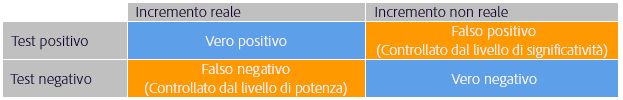
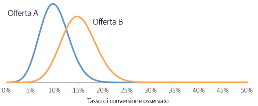
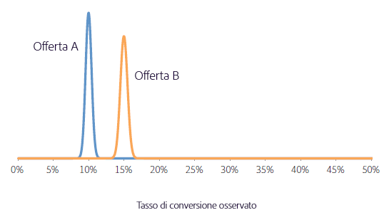

# Per quanto tempo si deve eseguire un test A/B?{#how-long-should-you-run-an-a-b-test}

Un test A/B di successo richiede un numero adeguato di visitatori (dimensioni del campione) per migliorare il tasso di conversione, ma come si fa a sapere per quanto tempo eseguire un test A/B? Questo articolo contiene informazioni sulle attività di allocazione automatica e sul calcolatore dimensioni campione di Target per garantire che l&#39;attività disponga di un numero sufficiente di visitatori per raggiungere gli obiettivi.

Si potrebbe essere tentati di interrompere un&#39;attività se nei primi giorni dell’attività, una delle offerte ha risultati nettamente migliori o peggiori delle altre. Tuttavia, con un numero ridotto di osservazioni, c&#39;è un&#39;alta probabilità che un incremento positivo o negativo sia imputabile al caso, perché il tasso di conversione è calcolato dalla media di un numero basso di visitatori. Man mano che l’attività raccoglie più punti di dati, i tassi di conversione convergono verso i loro reali valori a lungo termine.

Arrestare prematuramente un&#39;attività è una delle nove insidie significative in cui si può incappare durante l&#39;esecuzione di un test A/B. Per ulteriori informazioni, consulta [Nove insidie frequenti per i test A/B e come evitarle](../../c-activities/t-test-ab/common-ab-testing-pitfalls.md#concept_578A7947C9554868B30F12DFF9E3F8E3).

Target fornisce degli strumenti per garantire che l’attività abbia una dimensione campione abbastanza grande da raggiungere gli obiettivi di conversione:

* **Allocazione automatica:** un’attività di allocazione automatica è un tipo di test A/B che identifica un vincitore tra due o più esperienze e, di conseguenza, ridistribuisce automaticamente più traffico per aumentare le conversioni, mentre il test continua a essere eseguito e ad apprendere.

   I test A/B standard hanno un costo intrinseco. Devi investire del traffico per misurare le prestazioni di ogni esperienza e capire quale sia l’esperienza vincente attraverso l’analisi. La distribuzione del traffico rimane fissa anche dopo aver compreso che alcune esperienze hanno prestazioni migliori di altre. Inoltre, è complicato calcolare la dimensione necessaria del campione, e l’attività deve essere eseguita completamente prima di poter intervenire in base al vincitore. Dopo aver fatto tutto questo, c&#39;è ancora una possibilità che il vincitore identificato non sia un vero vincitore.

   La soluzione è l’allocazione automatica. L’allocazione automatica riduce il costo e il sovraccarico associati al determinare un’esperienza vincente. L’allocazione automatica monitora le prestazioni della metrica obiettivo di tutte le esperienze e invia in modo proporzionale un numero maggiore di nuovi partecipanti alle esperienze che hanno prestazioni migliori. Per l’esplorazione delle altre esperienze viene riservata una quantità adeguata di traffico. È possibile vedere i vantaggi del test nei risultati, anche se l’attività è ancora in esecuzione: l’ottimizzazione si verifica in parallelo all’apprendimento.

   L’allocazione automatica sposta gradualmente i visitatori verso esperienze vincenti, invece di richiedere di attendere fino a quando un’attività finisce per determinare un vincitore. Puoi beneficiare di incrementi più rapidi perché potenziali esperienze vincenti vengono mostrate a partecipanti che sarebbero altrimenti stati destinati a esperienze di minor successo.

   Quando utilizzi la funzione di Allocazione automatica, Target mostra un badge nella parte superiore della pagina dell&#39;attività che indica “Ancora nessun vincitore” finché l&#39;attività non raggiunge il numero minimo di conversioni con sufficiente affidabilità. Target dichiara quindi l&#39;esperienza vincente mostrando un badge nella parte superiore della pagina dell&#39;attività.

   Per ulteriori informazioni, consulta [Allocazione automatica](../../c-activities/automated-traffic-allocation/automated-traffic-allocation.md#concept_A1407678796B4C569E94CBA8A9F7F5D4).

* **Calcolatore dimensioni campione di Target:** se si sceglie di utilizzare un test A/B manuale invece dell’allocazione automatica, il calcolatore delle dimensioni del campione di Target consente di determinare le dimensioni del campione necessarie per un test di successo. Un test A/B manuale è un test orizzontale fisso, quindi la calcolatrice è estremamente utile. L&#39;utilizzo del calcolatore per un&#39;attività di allocazione automatica è facoltativo perché l&#39;allocazione automatica dichiarerà un vincitore. La calcolatrice fornisce una stima approssimativa della dimensione del campione necessaria. Continua a leggere per ulteriori informazioni su come utilizzare il calcolatore.

## Calcolatore delle dimensioni del campione di Adobe Target {#section_6B8725BD704C4AFE939EF2A6B6E834E6}

Before setting up your A/B test, access the Adobe Target [sample size calculator](https://docs.adobe.com/content/target-microsite/testcalculator.html).

È importante determinare un campione di dimensioni (numero di visitatori) adeguate prima di eseguire un test A/B, al fine di stabilire per quanto tempo il test dovrà essere eseguito prima di valutarne i risultati. Il semplice monitoraggio del test fino a raggiungere la rilevanza statistica risulta in una notevole sottostima dell’intervallo di affidabilità e rende il test inaffidabile. Questo accade perché, quando viene rilevato un risultato statisticamente significativo, il test viene interrotto e viene dichiarato un vincitore. Tuttavia, se il risultato non è statisticamente significativo, il test continuerà. Questa procedura favorisce fortemente un esito positivo, aumentando il livello dei falsi positivi e quindi distorcendo il livello di significatività effettiva del test.

Può quindi comportare un numero elevato di falsi positivi e portare all’implementazione di offerte che non forniscono l’incremento previsto nel lungo periodo. Un incremento scarso di per sé è un risultato insoddisfacente, ma una conseguenza ancora più grave è che, nel corso del tempo, l’impossibilità di prevedere con precisione l’incremento erode la fiducia dell’organizzazione nell’uso dei test.

Questo articolo illustra i fattori che devono essere controbilanciati nel determinare una dimensione del campione e presenta un calcolatore sotto forma di foglio di calcolo utile per stimare le dimensioni campione appropriate. Grazie al calcolo della dimensione del campione tramite il Calcolatore dimensioni campione (disponibile dal collegamento fornito in precedenza) prima dell’inizio di ogni test A/B, potrai contare su test A/B di qualità elevata che rispettano gli standard statistici.

Un test A/B si basa su cinque parametri definiti dall’utente. Questi parametri sono interconnessi in modo che, quando ne vengono definiti quattro, il quinto può essere ricavato:

* Rilevanza statistica
* Potenza statistica
* Incremento rilevabile con affidabilità minima
* Tasso di conversione linea di base
* Numero di visitatori

Per un test A/B, la rilevanza statistica, la potenza statistica, l’incremento rilevabile con affidabilità minima e il tasso di conversione linea di base sono impostati dall’analista; il numero di visitatori richiesti viene quindi calcolato a partire da queste cifre. Questo articolo illustra questi elementi e fornisce delle linee guida utili per determinarli per un test specifico.

La figura seguente illustra i quattro possibili risultati di un test A/B:

È auspicabile evitare falsi positivi o falsi negativi, ma un test statistico non può garantirlo. È sempre possibile che le tendenze osservate non siano rappresentative dei tassi di conversione sottostanti. Ad esempio, in un test per verificare se è più probabile che una moneta dia testa o croce, è possibile ottenere 10 teste su 10 lanci. La significatività statistica e la potenza aiutano a quantificare il numero di falsi positivi e falsi negativi e consentono di mantenerli a livelli ragionevoli per un determinato test.

## Rilevanza statistica {#section_8230FB9C6D1241D8B1786B72B379C3CD}

Il livello di significatività di un test determina la probabilità che il test riporti una differenza significativa nei tassi di conversione tra due offerte diverse, quando in realtà la differenza è nulla. Questo è noto come falso positivo o errore di tipo I. Il livello di significatività è una soglia specificata dall’utente che costituisce un compromesso tra tolleranza per falsi positivi e numero di visitatori da includere nel test.

In un test A/B, si presume inizialmente che entrambe le offerte abbiano lo stesso tasso di conversione. La probabilità del risultato osservato è quindi calcolata sulla base di questo presupposto. Se questa probabilità (il valore p) è inferiore a una soglia predefinita (il livello di significatività), in Target viene concluso che l’ipotesi iniziale, ovvero che entrambe le offerte hanno lo stesso tasso di conversione, è errata e quindi che i tassi di conversione di A e B sono statisticamente differenti per dato livello di significatività.

Un livello di significatività comunemente utilizzato nei test A/B è pari al 5%, che corrisponde a un livello di affidabilità del 95% (livello di affidabilità = 100% - livello di significatività). Un livello di affidabilità del 95% significa che, a ogni esecuzione di un test, esiste una possibilità del 5% di rilevare un incremento statisticamente significativo, anche se non esiste alcuna differenza tra le offerte.

La tabella seguente riassume alcune interpretazioni tipiche del livello di affidabilità:

| Livello di affidabilità | Interpretazione |
|--- |--- |
| &lt; 90% | Nessuna evidenza che esista una differenza tra i tassi di conversione |
| 90-95% | Evidenza debole che esista una differenza tra i tassi di conversione |
| 95-99% | Evidenza moderata che esista una differenza tra i tassi di conversione |
| 99-99,9% | Evidenza forte che esista una differenza tra i tassi di conversione |
| +99,9% | Evidenza molto forte che esista una differenza tra i tassi di conversione |

Si consiglia di utilizzare sempre un livello di affidabilità del 95% o superiore.

È opportuno utilizzare il livello massimo di affidabilità possibile, in modo che il test generi pochi falsi positivi. Tuttavia, un livello di affidabilità più elevato richiede un numero di visitatori più ampio, il che aumenta il tempo necessario per eseguire il test. Inoltre, un aumento del livello di affidabilità genera una riduzione della potenza statistica.

## Potenza statistica {#section_1169C27F8E4643719D38FB9D6EBEB535}

La potenza statistica di un test A/B è la probabilità di individuare una differenza effettiva nel tasso di conversione di una certa portata. A causa della natura casuale (stocastica) degli eventi di conversione, è possibile che una differenza statisticamente significativa non venga osservata, per semplice casualità, anche se esiste una differenza reale nel tasso di conversione tra le due offerte. Questo è detto falso negativo o errore di tipo II.

La potenza statistica viene spesso ignorata perché la sua determinazione, a differenza della rilevanza statistica, non è necessaria per eseguire un test A/B. Tuttavia, ignorando la potenza statistica esiste una possibilità notevole che le differenze reali tra i tassi di conversione delle diverse offerte non vengano rilevate dal test, a causa di un campione di dimensioni insufficienti. Questo determina una preponderanza di falsi positivi nei test.

È auspicabile disporre di una potenza statistica elevata in modo che il test abbia un’alta probabilità di individuare una differenza reale nei tassi di conversione e generi un minor numero di falsi negativi. Tuttavia, un numero di visitatori più elevato è necessario per aumentare la potenza statistica della rilevazione di eventuali incrementi, il che aumenta il tempo necessario per eseguire il test.

Per la potenza statistica viene spesso utilizzato un valore pari all’80%: significa che il test ha una probabilità dell’80% di rilevare una differenza uguale all’incremento rilevabile con affidabilità minima. Il test ha una minore probabilità di rilevare incrementi più piccoli e una maggiore probabilità di rilevare incrementi più ampi.

## Incremento rilevabile con affidabilità minima {#section_6101367EE9634C298410BBC2148E33A9}

La maggioranza delle organizzazioni desidera misurare la differenza minima possibile nel tasso di conversione, perché anche un incremento minimo vale la pena di essere implementato. Tuttavia, perché il test A/B abbia una probabilità elevata di individuare un incremento molto ridotto, il numero di visitatori che deve essere incluso nel test dovrà essere elevatissimo. Questo perché, se la differenza nel tasso di conversione è limitata, entrambi i tassi devono essere stimati con precisione elevata per individuare la differenza, il che richiede un numero elevato di visitatori. Pertanto, l’incremento rilevabile con affidabilità minima deve essere determinato in base ai requisiti di business, considerando un compromesso tra la rilevazione di incrementi limitati e l’esecuzione del test per periodi di tempo più lunghi.

Supponiamo ad esempio che due offerte (A e B) abbiano tassi di conversione effettivi rispettivamente del 10% e del 15%. Se queste offerte vengono mostrate a 100 visitatori ognuna, esiste una probabilità del 95% di osservare tassi di conversione compresi tra il 4% e il 16% per l’offerta A e tra l’8% e il 22% per l’offerta B, a causa della natura stocastica delle conversioni. Questi intervalli sono noti in statistica come intervalli di affidabilità o di confidenza. Essi rappresentano l’affidabilità della precisione dei tassi di conversione stimati. Maggiore è la dimensione del campione (più visitatori), maggiore è la certezza che le stime dei tassi di conversione siano precise.

L’immagine in basso mostra le distribuzioni delle probabilità.

A motivo dell’ampia sovrapposizione tra i due intervalli, il test non può determinare se i tassi di conversione siano diversi. Pertanto, con questo test su 100 visitatori non è possibile distinguere tra le due offerte. Tuttavia, se si espongono le offerte a 5.000 visitatori ciascuna, esiste una probabilità del 95% che i tassi di conversione osservati siano compresi negli intervalli rispettivamente tra il 9% e l’11% e tra il 14% e il 16%.

In questo caso, è molto improbabile che il test arrivi a conclusioni errate; quindi, il test con 5.000 visitatori è in grado di distinguere tra le due offerte. Il test con 5.000 visitatori ha un intervallo di affidabilità di circa +/-1%. Questo significa che il test può rilevare differenze di circa l’1%. Pertanto, sarebbero necessari ancora più visitatori se i tassi di conversione effettivi delle offerte fossero, ad esempio, del 10% e del 10,5%, anziché del 10% e del 15%.

## Tasso di conversione linea di base {#section_39380C9CA3C649B6BE6E1F8A06178B05}

Il tasso di conversione linea di base è il tasso di conversione dell’offerta di controllo (offerta A). Spesso, si può ottenere un’idea valida del livello di conversione per l’offerta in base all’esperienza precedente. Se non è questo il caso, ad esempio se si tratta di un nuovo tipo di offerta o risorsa creativa, puoi eseguire il test per un giorno circa, in modo da ottenere una stima approssimativa del tasso di conversione linea di base, da utilizzare poi per calcolare la dimensione del campione.

## Stima della dimensione del campione {#section_19009F165505429E95291E6976E498DD}

Può essere difficile trovare il giusto equilibrio tra costi di opportunità dell’esecuzione di un test per un tempo prolungato e il rischio di falsi positivi e falsi negativi. Ovviamente è importante sia evitare decisioni errate sia rimanere troppo vincolati da standard di test eccessivamente rigidi o rigorosi. Come regola generale, sono consigliati un livello di affidabilità del 95% e una potenza statistica dell’80%.

Nel Calcolatore dimensione campione (disponibile dal collegamento fornito in precedenza) dovrai decidere l’importanza statistica (valore consigliato: 95%) e la potenza statistica (valore consigliato: 80%). Dopo che avrai inserito il tasso di conversione linea di base e il traffico giornaliero per tutte le offerte, il foglio di calcolo fornisce il numero di visitatori necessari per rilevare un incremento pari a 1%, 2%, 5%, 10%, 15% e 20% con una probabilità pari alla potenza specificata del test. Il foglio di calcolo consente anche di specificare un valore personalizzato per l’incremento rilevabile con affidabilità minima. Inoltre, il foglio indica il numero di settimane richieste per il test in base al livello di traffico immesso. Il numero di settimane è arrotondato alla settimana intera più vicina, per evitare che effetti collegati a giorni della settimana specifici influenzino i risultati.

Esiste un compromesso tra l’incremento minimo che può essere identificato in modo affidabile dal test e il numero richiesto di visitatori. L’immagine qui sotto, che è valida per un tasso di conversione linea di base (il controllo) del 5%, mostra ricavi marcatamente decrescenti all’aumentare del numero di visitatori. L’incremento minimo che può essere rilevato in modo affidabile migliora enormemente quando si aggiungono i primi visitatori al test, ma richiede un numero sempre maggiore di visitatori per migliorare il test. L’immagine aiuta a trovare un compromesso adeguato tra il tempo necessario per eseguire il test (determinato dal numero di visitatori richiesti e dal traffico del sito) e l’incremento minimo rilevabile in modo affidabile.

In questo esempio, potresti decidere che la capacità di rilevare un incremento del 5% (corrispondente a un tasso di conversione dell’offerta alternativa di (100% + 5%) * 5% = 5,25%) in 80 test su 100 sia adeguata e che quindi sia necessario un campione di 100.000 visitatori per ogni offerta. Se il sito ha 20.000 visitatori al giorno e stai eseguendo un test per due offerte, il test deve essere eseguito per un numero di giorni pari a 2 * 100.000/20.000, ossia 10 giorni, prima che sia possibile determinare se l’offerta alternativa è significativamente superiore all’offerta di controllo, dal punto di vista statistico. È sempre consigliabile arrotondare sempre il tempo necessario alla settimana intera più vicina, per evitare effetti legati a un singolo giorno della settimana. Così, in questo esempio, il test verrà eseguito per due settimane prima di valutare i risultati.

## Metrica Ricavo per visita {#section_C704C0861C9B4641AB02E911648D2DC2}

Quando utilizzi la metrica Ricavo per visita (RPV), viene aggiunta un’origine di varianza ulteriore, perché RPV è il prodotto del ricavo per ordine e del tasso di conversione (RPV = ricavo/n° visitatori = (ricavo per ordine * n° ordini)/n° visitatori = ricavo per ordine * (n° visitatori * CTR)/n° visitatori = ricavo per ordine * CTR), ciascuno con la propria varianza. La varianza del tasso di conversione può essere stimata direttamente utilizzando un modello matematico, ma la varianza dei ricavi per ordine è specifica per la campagna. Utilizza quindi questa varianza nota rispetto alle campagne passate oppure esegui il test A/B per qualche giorno per valutare la varianza nei ricavi. La varianza è calcolata in base ai valori di Somma vendite, Somma vendite al quadrato e Numero di visitatori, reperibili nel file CSV scaricabile. Una volta stabilito questo valore, utilizza il foglio di calcolo per calcolare il tempo necessario per completare il test.

Con il Calcolatore dimensione campione (disponibile dal collegamento fornito in precedenza) puoi configurare più facilmente la metrica RPV. Quando apri il calcolatore, viene visualizzata una scheda con l’etichetta Metrica RPV. Per usare la versione RPV del calcolatore, ti serviranno le seguenti informazioni:

* Numero di visitatori dell’offerta di controllo
* Ricavi totali dell’offerta di controllo

   Assicurati di aver selezionato il filtro di ordine estremo.
* La somma dei ricavi al quadrato per l’offerta di controllo

   Assicurati di aver selezionato il filtro di ordine estremo.

In generale, l’utilizzo della metrica RPV richiede il 20-30% di tempo in più per raggiungere lo stesso livello di affidabilità statistica per lo stesso livello di incremento misurato, perché RPV ha la varianza aggiunta data da diverse dimensioni d’ordine per conversione. Considera questo aspetto quando scegli di basare la tua decisione finale sul tasso di conversione diretto e sulla metrica RPV.

## Correzione per il confronto tra più offerte {#section_1474113764224D0B85472D8B023CCA15}

Ogni volta che confronti due offerte, la possibilità di ottenere un falso positivo (osservando una differenza statisticamente significativa anche quando non c’è alcuna differenza nel tasso di conversione) è pari al livello di significatività. Ad esempio, in presenza di cinque offerte, A/B/C/D/E, dove A è l’offerta di controllo, vengono effettuati quattro confronti (tra il controllo e B, tra il controllo e C, tra il controllo e D e tra il controllo ed E), e la probabilità di un falso positivo è pari al 18,5% anche quando il livello di affidabilità è del 95%, in quanto Pr (almeno un falso positivo) = 1 - Pr (nessun falso positivo) = 1 - 0,95= 18,5%. Un falso positivo è definito in questo contesto come l’indicazione che il controllo è migliore dell’alternativa, o viceversa, quando in realtà non c’è differenza tra i due.

## Conclusione {#section_AEA2427B90AE4E9395C7FF4F9C5CA066}

Con l’utilizzo di un’attività di allocazione automatica, Target identifica un vincitore tra due o più esperienze e ridistribuisce automaticamente più traffico di conseguenza per aumentare le conversioni, mentre il test continua a essere eseguito e ad apprendere. L’allocazione automatica semplifica il raggiungimento degli obiettivi di conversione eliminando le supposizioni.

Utilizzando il Calcolatore dimensione campione (disponibile dal collegamento fornito in precedenza) illustrato in questo articolo ed eseguendo il test per il tempo suggerito, puoi contare su test A/B di qualità elevata, conformi ai livelli di falsi positivi e falsi negativi stabiliti come adeguati per il test specifico. Questo assicura che i test siano coerenti e in grado di rilevare in modo affidabile l’incremento ricercato.
