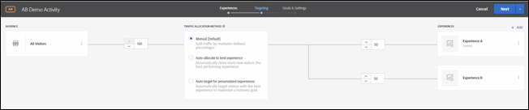
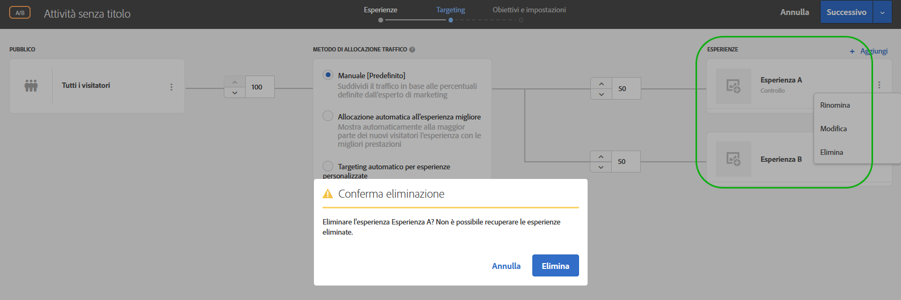
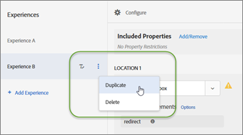

# Aggiungi esperienza{#add-experience}

Il Compositore esperienza visivo offre un’interfaccia visiva per la modifica delle esperienze sulla pagina.

Per ulteriori dettagli sulle esperienze, vedi [Esperienze](../../../c-experiences/experiences.md#concept_A2E10F6AFB3D4AEAB6951EE14688848D).

1. Fai clic su **[!UICONTROL Aggiungi esperienza]**.

   >[!NOTE]
   >
   >Se stai eseguendo il targeting di un&#39;esperienza per un pubblico, è necessario selezionare il pubblico prima di poter aggiungere un’esperienza. Viene visualizzato un messaggio per ricordarti di scegliere il pubblico.

1. Quando richiesto, immetti l&#39;URL attività. Digita l’URL completo (comprensivo di `https://`), quindi fai clic su **[!UICONTROL Continua]**.

   Nel Compositore esperienza (vedi [Esperienze](../../../c-experiences/experiences.md#concept_1D011219034B492BB03C08B3BB80E3F0)) viene aperta la pagina specificata in Preferenze account. Per visualizzare una pagina diversa fai clic sull’icona del globo e immetti l’URL nella casella Seleziona URL nel Compositore esperienza, quindi fai clic su **[!UICONTROL Continua]**. Se hai inserito un URL per un sito che non include il codice JavaScript di Target Standard, non puoi selezionare elementi di pagina.

   Per impostazione predefinita, il Compositore esperienza visivo non consente di modificare gli elementi contenenti JavaScript, ad esempio i banner rotanti. È possibile disattivare JavaScript per poter modificare tali elementi utilizzando il Compositore esperienza visivo.

   >[!NOTE]
   >
   >Se modifichi l’URL dopo aver apportato modifiche a una pagina per una o più esperienze, l’esperienza viene reimpostata utilizzando la nuova pagina e le modifiche apportate andranno perse.

1. Seleziona gli elementi da modificare e apporta le modifiche desiderate.

   Quando passi il puntatore del mouse sopra gli elementi della pagina, gli elementi vengono evidenziati. Qualsiasi elemento evidenziato può essere modificato utilizzando il Compositore esperienza.

   Se hai creato una mbox sulla pagina utilizzando Target Classic (in precedenza Test&amp;Target), questa viene visualizzata come un elemento che mostra il nome della mbox, e può essere modificata come qualsiasi altro elemento.

   Per un elenco delle azioni che possono essere eseguite su un elemento nella pagina visualizzata per modificare l&#39;esperienza, consulta [Opzioni del Compositore esperienza visivo](/help/c-experiences/c-visual-experience-composer/viztarget-options.md).

   >[!NOTE]
   >
   >Se distribuisci un’immagine da un’origine diversa dalla pagina principale (ad esempio un’immagine in hosting su akamai.net e distribuita a dell.com), l’immagine non viene visualizzata nella miniatura della pagina mostrata nel diagramma di flusso.

1. Fai clic sul pulsante con il segno di spunta una volta terminata la progettazione dell&#39;esperienza.

   Il diagramma dell&#39;attività mostra quanto segue:

   

   Se un’esperienza include contenuto di diversi domini, la miniatura potrebbe non essere visualizzata correttamente ed essere sostituita da un’icona.

1. Specifica la percentuale di visitatori che visualizzano ogni esperienza nell&#39;attività.

   Puoi mostrare più esperienze allo stesso pubblico. Viene visualizzato un diagramma che mostra il pubblico selezionato e le esperienze aggiunte all’attività. Specifica la percentuale di volte che ogni esperienza deve essere visualizzata. Puoi suddividere le percentuali in modo uniforme tra tutte le esperienze, oppure specificare percentuali maggiori o minori per ogni esperienza. Il totale per tutte le esperienze deve essere uguale al 100%. Puoi inoltre fare clic su **[!UICONTROL Aggiungi esperienza]** per aggiungere un’altra esperienza all’attività.

   Fai clic su **[!UICONTROL Successivo]** dopo aver completato il passaggio.

## Rinominare, modificare o eliminare un’esperienza

Ricorda che puoi fare clic sull&#39;icona Altro (tre puntini di sospensione verticali) in un&#39;esperienza in un&#39;attività di un test A/B o targeting di esperienza (XT) e scegliere tra le seguenti opzioni, a seconda delle necessità:

* Rinomina
* Modifica
* Elimina

Nota che quando denomini o rinomini un’esperienza, i seguenti caratteri non sono consentiti:

| Carattere | Descrizione |
|--- |--- |
| / | Barra |
| ? | Punto interrogativo |
| # | Cancelletto |
| : | Due punti |
| = | Uguale |
| + | Più |
| - | Meno |
| @ | Chiocciola |

## Duplicare un’esperienza

È possibile copiare un’esperienza in un Test A/B così da poter apportare modifiche minori senza dover ricreare l’esperienza da zero.

Nella pagina **[!UICONTROL Esperienze]** (il primo passaggio del flusso di lavoro guidato in tre passaggi), fai clic sui tre puntini di sospensione verticali &gt; **[!UICONTROL Duplica]**.

## Video di formazione: Utilizzo del Compositore esperienza visivo

Il video qui sotto fornisce informazioni sull&#39;utilizzo delle opzioni del Compositore esperienza visivo. (7:17)

* Modificare il contenuto di una pagina
* Modificare il layout di una pagina

>[!VIDEO](https://video.tv.adobe.com/v/17399)
