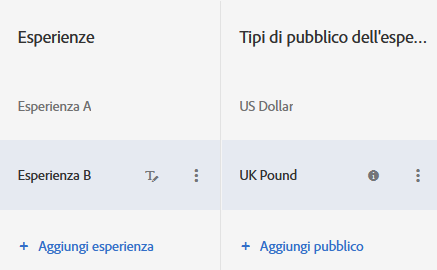

# Esperienza con più tipi di pubblico un testo A/B{#multiple-experience-versions-in-an-a-b-test}

È possibile indirizzare diverse versioni di una stessa esperienza a tipi di pubblico diversi nelle attività A/B. È possibile impostare più tipi di pubblico per un’esperienza nel Compositore esperienza visivo o nel Compositore esperienza basato su moduli.

Gli utenti possono passare da un pubblico dell&#39;esperienza all&#39;altro quando cambiano profilo. Non sono bloccati nella stessa esperienza per l&#39;intero ciclo di vita dell&#39;attività.

Ad esempio, se il sito utilizza una progettazione coerente tra pagine o prodotti e si desidera utilizzare la stessa esperienza per più destinatari (ad esempio, i visitatori che utilizzano browser in diverse lingue), è possibile impostare più versioni dell&#39;esperienza. È presentare la stessa esperienza a inglesi e giapponesi, l&#39;unica differenza è che il testo è nella lingua del visitatore. Vengono raccolti i dati dell&#39;esperienza, a prescindere dalla lingua; in questo modo, il rapporto mostra le prestazioni dell&#39;esperienza, anziché della versione.

Senza la possibilità di impostare le versioni dell&#39;esperienza, è necessario impostare diversi test per ogni lingua (in questo esempio), quindi aggregare manualmente i risultati per cercare di ottenere un quadro delle prestazioni di una singola esperienza con entrambe le lingue. Tale metodo produce risultati meno accurati. Per alcuni test, questi calcoli potrebbero persino non essere utili per via della casualizzazione dei visitatori.

Con la creazione di diverse versioni di un&#39;esperienza, si ricevono informazioni più accurate senza la necessità di calcoli manuali e ipotesi.

**Scenario**

Stai testando due esperienze, un banner con targeting geografico contro un banner generico. Il banner per ogni area geografica deve essere diverso, ma lo scopo generale del test è determinare se il geotargeting sia migliore del generico. Se si impostasse un&#39;esperienza separata per ogni posizione, si valuterebbero effettivamente le prestazioni di un&#39;area geografica rispetto all&#39;altra, piuttosto che determinare se il geotargeting aiuti a soddisfare gli obiettivi di successo rispetto al banner generico.

In questo caso, sono necessarie le versioni dell&#39;esperienza specifiche per area geografica, in modo da poter valutare l&#39;esperienza con targeting geografico rispetto a una senza.

1. [Crea un&#39;attività A/B](/help/c-activities/t-test-ab/t-test-create-ab/test-create-ab.md) come si farebbe normalmente.

   Al momento di configurare l’esperienza che avrà più versioni, seleziona il pubblico per ogni versione, come illustrato nei passaggi seguenti.

1. Seleziona l&#39;esperienza, quindi fai clic su **[!UICONTROL Configura]** > **[!UICONTROL Tipi di pubblico]** > **[!UICONTROL Più tipi di pubblico]**.

   

1. Fai clic su **[!UICONTROL Aggiungi pubblico]** quindi seleziona il primo pubblico a cui desideri rivolgerti. Ripeti per ogni pubblico.

   

   Se il pubblico non esiste ancora, fai clic su [Crea pubblico](../../../c-target/c-audiences/create-audience.md#task_E18BD77A9A8F4ED0AC50569F94556558) e configuralo.

   Se un visitatore è adeguato per più di un pubblico, il contenuto viene respinto per tutti i tipi di pubblico e l&#39;ultimo nell&#39;elenco esegue effettivamente il rendering sulla pagina.

1. Continua a configurare l’attività.

**Best practice**

* Scegli tipi di pubblico che si escludono a vicenda. Se l&#39;attività è stata creata nel Compositore esperienza visivo, nel caso in cui un visitatore corrisponda a più di un pubblico, il contenuto per ogni pubblico viene respinto e il contenuto per l&#39;ultimo pubblico in elenco è visualizzato nella pagina.
* Il pubblico di accesso all&#39;attività definito nel diagramma viene combinato con il pubblico di esperienza utilizzando una condizione E. Per accedere all&#39;attività, un visitatore deve essere idoneo al pubblico di attività e uno dei tipi di pubblico dell&#39;esperienza.
* Aggiungi gli stessi tipi di pubblico come segmenti per i rapporti. In questo modo, puoi analizzare i risultati del test ad alto livello di esperienza di A rispetto a B e al livello inferiore di esperienza di A rispetto a B per il solo “browser lang ja_JP”. Tale procedimento funziona solo per i rapporti basati su Target e Analytics.

