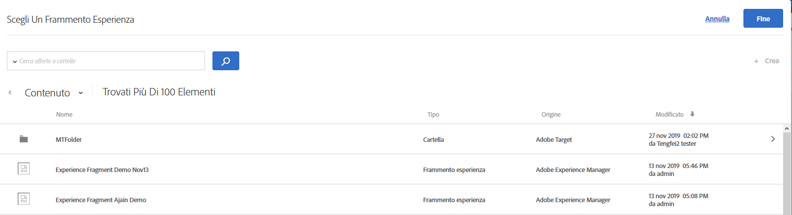

# Frammenti esperienza AEM

Informazioni sull&#39;utilizzo di frammenti esperienza creati in [!DNL Adobe Experience Manager] (AEM) nelle attività [!DNL Target] per facilitare l&#39;ottimizzazione o la personalizzazione.

>[!NOTE]
>
>Questa funzione richiede un cliente [!DNL Adobe Experience Manager] ([!DNL AEM]). Per ulteriori informazioni, consulta [“Risoluzione dei problemi”](/help/c-experiences/c-manage-content/aem-experience-fragments.md#section_AE6F0971E1574B3AA324003599B96E5A).

## Panoramica {#section_95A91830530F493B81C5C9CDB9B783EA}

L&#39;utilizzo di frammenti esperienza creati in [!DNL AEM] nelle attività [!DNL Target] consente di combinare la facilità d&#39;uso e la potenza di [!DNL AEM] con le potenti funzionalità di Automated Intelligence (AI) e di machine Learning (ML) in [!DNL Target] per sottoporre a test e personalizzare esperienze su scala.

[!DNL AEM] riunisce tutti i contenuti e le risorse in una posizione centrale per alimentare la tua strategia di personalizzazione. [!DNL AEM] consente di creare facilmente contenuti per desktop, tablet e dispositivi mobili in un&#39;unica posizione senza scrivere codice. Non è necessario creare pagine per ogni dispositivo. [!DNL AEM] regola automaticamente ogni esperienza utilizzando il contenuto.

[!DNL Target] consente di fornire esperienze personalizzate in scala su una combinazione di approcci di apprendimento automatico basati sulle regole e guidati da intelligenze automatizzate che incorporano variabili comportamentali, contestuali e offline. Con [!DNL Target] è possibile impostare ed eseguire facilmente le attività [A/B Test](/help/c-activities/t-test-ab/test-ab.md) e [Multivariato](/help/c-activities/c-multivariate-testing/multivariate-testing.md) (MVT) per determinare le migliori offerte, contenuti ed esperienze.

Frammenti di esperienza rappresentano un enorme passo avanti per collegare i creatori e i manager di contenuto/esperienza e professionisti di personalizzazione e ottimizzazione che stanno guidando i risultati di business tramite [!DNL Target].

## Requisiti {#section_AE6F0971E1574B3AA324003599B96E5A}

Devi essere provvisto della funzionalità frammenti di esperienza all&#39;interno di [!DNL Target]. Inoltre, è necessario utilizzare [!DNL AEM] 6.3 con il service pack appropriato o [!DNL AEM] 6.4 (o versione successiva). Il rappresentante del tuo account può aiutarti a rispettare i requisiti per utilizzare questa funzione:

* [!DNL Adobe Experience Manager] 6.4 (o successivo).
* [!DNL Adobe Experience Manager] 6.3 SP2 (o successivo).
* [!DNL Adobe Target Standard] o  [!DNL Adobe Target Premium] account.
* Contattate l&#39;Assistenza clienti [ Adobe Target](/help/cmp-resources-and-contact-information.md#reference_ACA3391A00EF467B87930A450050077C) per abilitare l&#39;integrazione e fornire i dettagli di autenticazione.

## Creazione e configurazione di frammenti esperienza in [!DNL AEM] {#section_745C8EFE29F547A2958FDBF61A5ADF7B}

Per utilizzare i frammenti esperienza [!DNL AEM] in [!DNL Target], è necessario effettuare le seguenti operazioni:

### Passaggio 1: Integrare [!DNL AEM] con [!DNL Target]

Per ulteriori informazioni, consulta:

* **[!DNL AEM]6.3**:  [Scegliere  Adobe Analytics e  Adobe ](https://docs.adobe.com/docs/en/aem/6-3/administer/integration/marketing-cloud/opt-in.html) Target nella  _documentazione di_ Adobe Experience Manager 6.3.
* **[!DNL AEM]6.4**:  [Scegliere  Adobe Analytics e  Adobe ](https://helpx.adobe.com/experience-manager/6-4/sites/administering/using/opt-in.html) Target nella  _documentazione di_ Adobe Experience Manager 6.4.
* **[!DNL AEM]6.5**:  [Scegliere  Adobe Analytics e  Adobe ](https://helpx.adobe.com/experience-manager/6-5/sites/administering/using/opt-in.html) Target nella  *documentazione di* Adobe Experience Manager 6.5.

### Passaggio 2: creare il frammento di esperienza

I frammenti di esperienza sono creati in [!DNL AEM]. Per ulteriori informazioni, consulta:

* **[!DNL AEM]6.3**:  [Frammenti esperienza ](https://docs.adobe.com/docs/en/aem/6-3/author/experience-fragments.html) nella  *documentazione di* Adobe Experience Manager 6.3.
* **[!DNL AEM]6.4**:  [Frammenti esperienza ](https://helpx.adobe.com/experience-manager/6-4/sites/authoring/using/experience-fragments.html) nella  *documentazione di* Adobe Experience Manager 6.4.
* **[!DNL AEM]6.5**:  [Frammenti esperienza ](https://helpx.adobe.com/experience-manager/6-5/sites/authoring/using/experience-fragments.html) nella  *documentazione di* Adobe Experience Manager 6.5.

### Passaggio 3: Configurare [!DNL AEM] per condividere il frammento esperienza con [!DNL Target]

1. Dall&#39;interno di [!DNL AEM], selezionate il frammento esperienza desiderato o la cartella che lo contiene, quindi fate clic su **[!UICONTROL Proprietà]**.
2. Fa clic sulla scheda **[!UICONTROL Servizi cloud]**, poi, dall&#39;elenco a discesa **[!UICONTROL Configurazione del servizio cloud]**, seleziona **[!UICONTROL Adobe Target]**.

   >[!NOTE]
   >
   >Il passaggio precedente presuppone che qualcuno nell&#39;organizzazione abbia creato la configurazione [!DNL Adobe Target].

3. Fai clic su **[!UICONTROL Salva e chiudi]**.

### Passaggio 4: pubblicare il frammento esperienza ed esportarlo in [!DNL Target]

A seconda della versione [!DNL AEM], consulta i seguenti collegamenti per istruzioni dettagliate:

* **[!DNL AEM]6.3**:  [Esportazione di un frammento esperienza in ](https://helpx.adobe.com/experience-manager/6-3/sites/administering/using/experience-fragments-target.html) Target nella  *documentazione di* Adobe Experience Manager 6.3.
* **[!DNL AEM]6.4**:  [Esportazione di un frammento esperienza in ](https://experienceleague.adobe.com/docs/experience-manager-64/administering/integration/experience-fragments-target.html) Target nella  *documentazione di* Adobe Experience Manager 6.4.
* **[!DNL AEM]6.5**:  [Esportazione di un frammento esperienza in ](https://helpx.adobe.com/experience-manager/6-5/sites/administering/using/experience-fragments-target.html) Target nella  *documentazione di* Adobe Experience Manager 6.5.

## Utilizzo di frammenti esperienza nelle attività di Target {#section_17CE4BE6B2B74CCEBAE0C68DEB84ABB9}

Dopo aver eseguito le attività precedenti, il frammento di esperienza viene visualizzato nella pagina [!UICONTROL Offerte] di [!DNL Target].

>[!NOTE]
>
>[!DNL Target] cerca attualmente frammenti di esperienza per importare ogni dieci minuti. Il frammento esperienza importato dovrebbe essere disponibile in [!DNL Target] entro dieci minuti, ma questo intervallo di tempo dovrebbe ridurre il tempo necessario per il futuro.

>[!IMPORTANT]
>
>Il frammento esperienza è attualmente importato in [!DNL Target] come offerta HTML. La versione &quot;principale&quot; del frammento esperienza rimane in [!DNL AEM]. Non è possibile modificare il frammento di esperienza in [!DNL Target].

Puoi passare il puntatore del mouse su un frammento esperienza nell&#39;elenco, quindi fare clic sull&#39;icona [!UICONTROL Visualizza]  per visualizzare ulteriori informazioni sul frammento esperienza, compreso l&#39;URL di consegna dell&#39;offerta pubblica e il percorso [!DNL AEM].

È possibile utilizzare i frammenti esperienza nelle attività [!DNL Target] utilizzando [Visual Experience Composer](/help/c-experiences/c-visual-experience-composer/visual-experience-composer.md) (VEC) o [Form-Based Experience Composer](/help/c-experiences/form-experience-composer.md).

>[!NOTE]
>
>Per utilizzare completamente le funzionalità [!DNL Target] AI e ML, è possibile selezionare [Allocazione automatica](/help/c-activities/automated-traffic-allocation/automated-traffic-allocation.md#concept_A1407678796B4C569E94CBA8A9F7F5D4) o [Allocazione automatica](/help/c-activities/automated-traffic-allocation/automated-traffic-allocation.md) durante la creazione di un test A/B.

**Per utilizzare i frammenti esperienza con il VEC:**

1. In [!DNL Target], durante la creazione o la modifica di un&#39;esperienza in [Visual Experience Composer](/help/c-experiences/experiences.md#concept_A2E10F6AFB3D4AEAB6951EE14688848D), fate clic sul percorso nella pagina in cui desiderate inserire il contenuto [!DNL AEM], quindi selezionate l&#39;opzione desiderata per visualizzare l&#39;elenco [!UICONTROL Choose an Experience Fragment] (Scegli un frammento esperienza).

   * [!UICONTROL Inserisci prima]
   * [!UICONTROL Inserisci dopo]
   * [!UICONTROL Sostituire con un frammento esperienza]

   L’elenco [!UICONTROL Frammenti esperienza][!DNL AEM] presenta tutti i contenuti creati in che ora sono disponibili in modo nativo in [!DNL Target].

   >[!NOTE]
   >
   >L’opzione [!UICONTROL Scambia con frammento esperienza] non è disponibile per le immagini. Se vuoi utilizzare questa opzione con un’immagine, fai clic sull’elemento che la contiene.

   

1. Selezionate il frammento esperienza desiderato, quindi fate clic su **[!UICONTROL Fine]**.
1. Termina la configurazione dell’attività.

   Per ulteriori informazioni sulla configurazione dei vari tipi di attività, consulta i seguenti argomenti:

   * **Test A/B:** [Creare un test A/B](/help/c-activities/t-test-ab/t-test-create-ab/test-create-ab.md)
   * **Allocazione automatica:** [Allocazione automatica](/help/c-activities/automated-traffic-allocation/automated-traffic-allocation.md#concept_A1407678796B4C569E94CBA8A9F7F5D4)
   * **Auto-Target:** [Auto-Target](/help/c-activities/auto-target/auto-target-to-optimize.md)
   * **Personalizzazione automatizzata (AP):** [Creazione di un’attività di personalizzazione automatica](/help/c-activities/t-automated-personalization/create-ap-activity.md#task_8AAF837796D74CF893CA2F88BA1491C9)
   * **Targeting delle esperienze (XT):** [Creare un’attività di targeting delle esperienze](/help/c-activities/t-experience-target/t-xt-create/xt-create.md#task_D6B3429AC31549E1A70EDF04B3DDC765)
   * **Test multivariato (MVT):** [Creare un test multivariato](/help/c-activities/c-multivariate-testing/t-create-multivariate-test/create-multivariate-test.md#task_BF870FA60A8245AB8F0B775BE32EA710)
   * **Recommendationfs:** [Creare un’attività di Recommendations](/help/c-recommendations/t-create-recs-activity/create-recs-activity.md#task_6874328773C64C44A73F0A130AD3F96F)

**Per utilizzare i frammenti esperienza con Experience Composer basato su modulo:**

1. In [!DNL Target], durante la creazione o la modifica di un&#39;esperienza in [Form-Based Experience Composer](/help/c-experiences/form-experience-composer.md#task_FAC842A6535045B68B4C1AD3E657E56E), selezionate il percorso nella pagina in cui desiderate inserire il contenuto [!DNL AEM], quindi selezionate **[!UICONTROL Change Experience Fragment]** per visualizzare l&#39;elenco [!UICONTROL Choose an Experience Fragment] (Scegli un frammento esperienza).

   

   L’elenco [!UICONTROL Frammenti esperienza][!DNL AEM] presenta tutti i contenuti creati in che ora sono disponibili in modo nativo in [!DNL Target].

1. Seleziona il frammento di esperienza desiderato, quindi fai clic su **[!UICONTROL Salva]**.
1. Termina la configurazione dell’attività.

## Considerazioni {#considerations}

* [!DNL Target] cerca attualmente frammenti di esperienza per importare ogni dieci minuti. Il frammento esperienza importato dovrebbe essere disponibile in [!DNL Target] entro dieci minuti, ma questo intervallo di tempo dovrebbe ridurre il tempo necessario per il futuro.
* Il frammento esperienza è attualmente importato in [!DNL Target] come offerta HTML. La versione &quot;principale&quot; del frammento esperienza rimane in [!DNL AEM]. Non è possibile modificare il frammento di esperienza in [!DNL Target].
* Potete importare le offerte JSON come frammenti esperienza in [!DNL Target]. Tuttavia, queste offerte vengono importate come offerte HTML. Le offerte JSON (frammenti esperienza) non sono attualmente completamente supportate nell&#39;interfaccia utente di [!DNL Target].
* Non è possibile creare frammenti esperienza utilizzando  I/O Adobe. È necessario creare frammenti esperienza utilizzando AEM, come spiegato in precedenza.

## Video di formazione: Utilizzo di AEM frammenti esperienza con  Adobe Target  {#section_C0EDC54063464F41A182492D2045BC64}

Il seguente video illustra come impostare e utilizzare i frammenti esperienza:

>[!VIDEO](https://video.tv.adobe.com/v/22383)

>[!NOTE]
>
>La funzionalità [!DNL AEM] del collegamento profondo di cui si parla in 4:54 è stata rimossa.

Per ulteriori informazioni, vedere [Utilizzo di frammenti esperienza con  Adobe Target](https://experienceleague.adobe.com/docs/experience-manager-learn/sites/personalization/experience-fragment-target-offer-feature-video-use.html) nella pagina *AEM Sites Video e Tutorials*.
