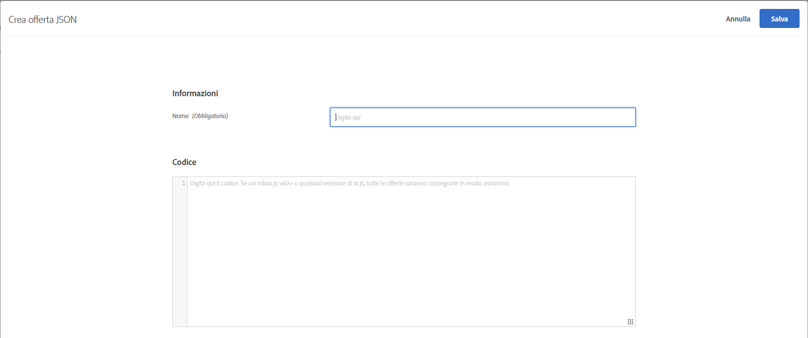
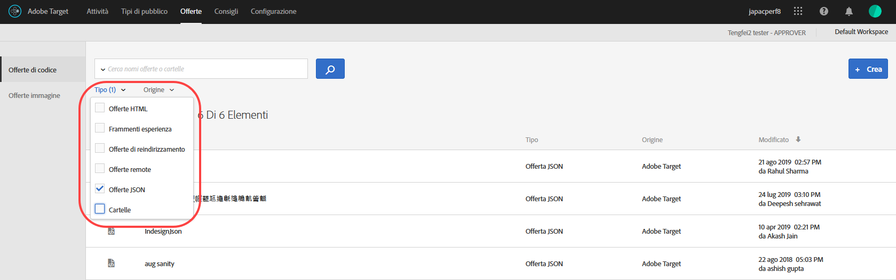

# Creare offerte JSON{#create-json-offers}

Create offerte JSON nella [!UICONTROL libreria di offerte] in [!DNL Adobe Target] per l&#39;utilizzo in [!UICONTROL Form-Based Experience Composer].

Le offerte JSON possono essere utilizzate nelle attività basate su moduli, consentendo l&#39;utilizzo di casi in cui [!DNL Target] deve decidere di inviare un&#39;offerta in formato JSON da utilizzare in SPA framework o integrazioni lato server.

## Considerazioni JSON

Quando lavori con le offerte JSON, considera quanto segue:

* Le offerte JSON sono attualmente disponibili solo per le attività [!UICONTROL A/B Test] e [!UICONTROL Experience Targeting] (XT).
* Le offerte JSON possono essere utilizzate solo in [attività basate su moduli](/help/c-experiences/form-experience-composer.md).
* L’offerta JSON può essere recuperata direttamente quando utilizzi API lato server, SDK per dispositivi mobili o SDK per NodeJS.
* Nel browser, le offerte JSON possono essere recuperate SOLO tramite at.js 1.2.3 (o versione successiva) e utilizzando [getOffer()](/help/c-implementing-target/c-implementing-target-for-client-side-web/adobe-target-getoffer.md) filtrando le azioni tramite l’azione `setJson`.
* Le offerte JSON vengono consegnate come oggetti JSON nativi anziché come stringhe. I consumatori di questi oggetti non devono più gestire gli oggetti come stringhe e convertirli in oggetti JSON.
* Le offerte JSON non vengono applicate automaticamente, a differenza di altre offerte (come le offerte HTML), perché sono offerte non visive. Gli sviluppatori devono scrivere il codice per ottenere l’offerta in modo esplicito utilizzando [getOffer()](/help/c-implementing-target/c-implementing-target-for-client-side-web/adobe-target-getoffer.md).
* Le offerte JSON non sono supportate se utilizzi mbox.js.

## Creare un&#39;offerta JSON {#section_BB9C72D59DEA4EFB97A906AE7569AD7A}

1. Fare clic su **[!UICONTROL Offerte]** > **[!UICONTROL Offerte codice]**.

   

1. Fai clic su **[!UICONTROL Crea]** > **[!UICONTROL Offerta JSON]**.

   

1. Digita un nome per l’offerta.
1. Digita o incolla il codice JSON nella casella **[!UICONTROL Codice]**.
1. Fai clic su **[!UICONTROL Salva]**.

## Esempio JSON {#section_A54F7BB2B55D4B7ABCD5002E0C72D8C9}

Le offerte JSON sono supportate solo nelle attività create utilizzando [Form-Based Experience Composer](/help/c-experiences/form-experience-composer.md). Attualmente le offerte JSON possono essere utilizzate solo tramite chiamate API dirette.

Di seguito è riportato un esempio:

```json
adobe.target.getOffer({ 
  mbox: "some-mbox", 
  success: function(actions) { 
    console.log('Success', actions); 
  }, 
  error: function(status, error) { 
    console.log('Error', status, error); 
  } 
});
```

Le azioni passate al callback di successo sono una matrice di oggetti. Supponiamo di avere una singola offerta JSON, con il seguente contenuto:

```json
{ 
  "demo": {"a": 1, "b": 2} 
}
```

La matrice di azioni avrà questa struttura:

```json
[ 
 { 
   action: "setJson", 
   content: [{ 
     "demo": {"a": 1, "b": 2} 
   }] 
 }  
]
```

Per estrarre l&#39;offerta JSON, ripetete le azioni e cercate l&#39;azione con l&#39;azione `setJson`, quindi ripetete l&#39;operazione nell&#39;array di contenuti.

## Caso di utilizzo {#section_85B07907B51A43239C8E3498EF58B1E5}

Supponiamo che la seguente offerta JSON arrivi alla tua pagina web:

```json
{ 
    "_id": "5a65d24d8fafc966921e9169", 
    "index": 0, 
    "guid": "7c006504-c6f7-468d-a46f-f72531ea454c", 
    "isActive": true, 
    "balance": "$2,075.06", 
    "picture": "https://placehold.it/32x32", 
    "tags": [ 
      "esse", 
      "commodo", 
      "excepteur", 
    ], 
    "friends": [ 
      { 
        "id": 0, 
        "name": "Carla Lyons" 
      }, 
      { 
        "id": 1, 
        "name": "Ollie Mooney" 
      }, 
    ], 
    "greeting": "Hello, Stephenson Fernandez! You have 4 unread messages.", 
    "favoriteFruit": "strawberry" 
} 
  
```

Nel codice seguente viene illustrato come accedere all’attributo “greeting”:

```json
adobe.target.getOffer({   
  "mbox": "name_of_mbox", 
  "params": {}, 
  "success": function(offer) {           
        console.log(offer[0].content[0].greeting); 
  },   
  "error": function(status, error) {           
      console.log('Error', status, error); 
  } 
});
```

## Filtrare le offerte in base al tipo di offerta JSON {#section_52533555BCE6420C8A95EB4EB8907BDE}

Potete filtrare la libreria [!UICONTROL Offerte] in base al tipo di offerta JSON facendo clic sull&#39;elenco a discesa **[!UICONTROL Tipo]**, quindi selezionando la casella di controllo **[!UICONTROL JSON]**.



