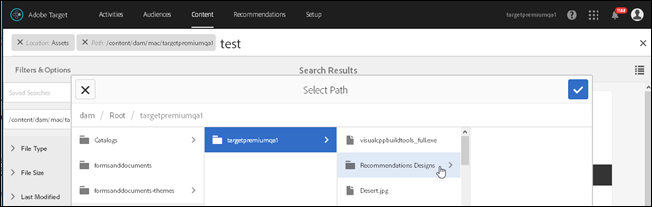

# Ricercare contenuti e creare raccolte avanzate{#search-content-and-create-smart-collections}

Cerca le risorse per parole chiave e salva cartelle di ricerca, o Raccolte avanzate, che vengono aggiornate automaticamente con i risultati della ricerca.

Questa sezione contiene le seguenti informazioni:

* [Ricerca di risorse per parole chiave ](/help/c-experiences/c-manage-content/filter-and-search-content.md#section_2465A71BC95942588F586B1EC8B9E5DB)
* [Salvataggio di una raccolta avanzata ](/help/c-experiences/c-manage-content/filter-and-search-content.md#section_5C95159543B5405EB8C8E47B518DF4AB)

## Ricerca di risorse per parole chiave {#section_2465A71BC95942588F586B1EC8B9E5DB}

1. Per accedere alla [!UICONTROL libreria delle risorse], fai clic su **[!UICONTROL Offerte]** > **[!UICONTROL Offerte immagine]**.

   Per visualizzare le risorse in un formato scheda, fai clic sull&#39;icona [!UICONTROL Vista scheda] nell&#39;angolo superiore destro.

   Oppure

   Per visualizzare le risorse in un formato elenco, fai clic sull&#39;icona [!UICONTROL Vista elenco] nell&#39;angolo superiore destro.

1. Per visualizzare la casella di ricerca, fai clic sull&#39;icona **[!UICONTROL Solo contenuto]** nell&#39;angolo superiore sinistro.

   

1. Nella casella di ricerca, digita una parola chiave per le risorse che desideri individuare, quindi premi Invio.

## Salvataggio di una raccolta avanzata  {#section_5C95159543B5405EB8C8E47B518DF4AB}

Puoi creare ricerche salvate, denominate raccolte avanzate, per risparmiare tempo durante l&#39;esecuzione di ricerche simili. In una ricerca salvata viene creata una raccolta avanzata che si aggiorna automaticamente con i risultati di ricerca.

1. Per accedere alla [!UICONTROL libreria delle risorse], fai clic su **[!UICONTROL Offerte]** > **[!UICONTROL Offerte immagine]**.

   

1. Per visualizzare il pannello **[!UICONTROL Filtri e opzioni]** nella barra sinistra, fai clic sull&#39;icona [!UICONTROL Solo contenuto] nell&#39;angolo superiore sinistro.
1. Per visualizzare la finestra di dialogo **[!UICONTROL Seleziona percorso]**, fai clic sull&#39;icona [!UICONTROL Sfoglia].

   

1. Individua e seleziona la cartella su cui desideri basare la raccolta avanzata, quindi fai clic sull&#39;icona **[!UICONTROL Conferma]**.

   

1. (Facoltativo) Seleziona tra le varie opzioni per restringere il filtro, ad esempio tipo di file e dimensioni.
1. Per visualizzare le opzioni di salvataggio, fai clic su **[!UICONTROL Salva raccolta avanzata]** nella parte inferiore del pannello [!UICONTROL Filtri e opzioni].

   

1. Specifica un nome per la raccolta avanzata. Seleziona la casella di controllo **[!UICONTROL Pubblico]** se desideri garantire l&#39;accesso a questa raccolta avanzata a tutti gli utenti nel tuo account di [!DNL Target], quindi fai clic su **[!UICONTROL Salva]**.

   La raccolta avanzata viene aggiunta all&#39;elenco delle ricerche salvate per un utilizzo futuro:

   

Puoi modificare una raccolta avanzata salvata selezionandola dall&#39;elenco a discesa [!UICONTROL Ricerche salvate], aprendola e facendo clic su [!UICONTROL Modifica raccolta avanzata].
