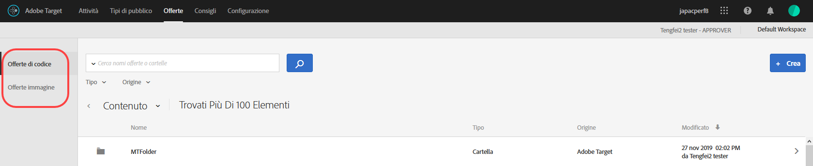
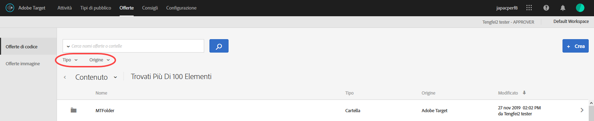
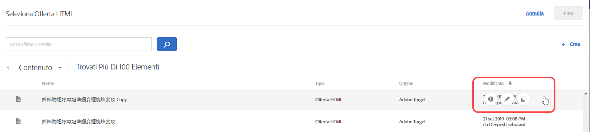
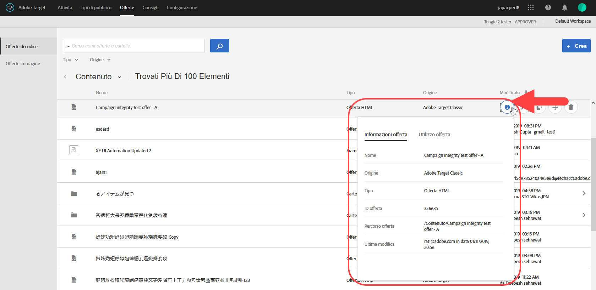
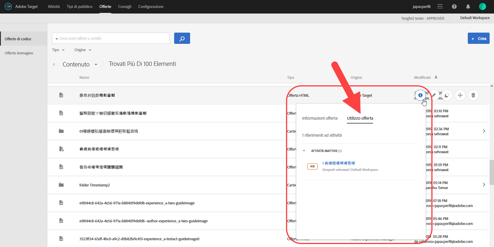
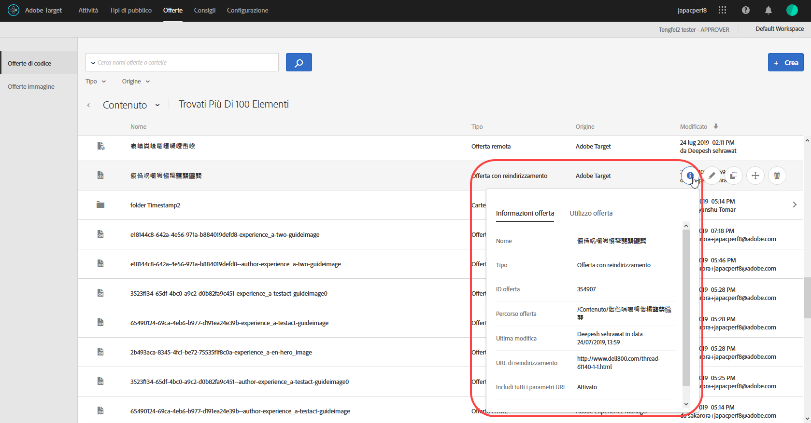
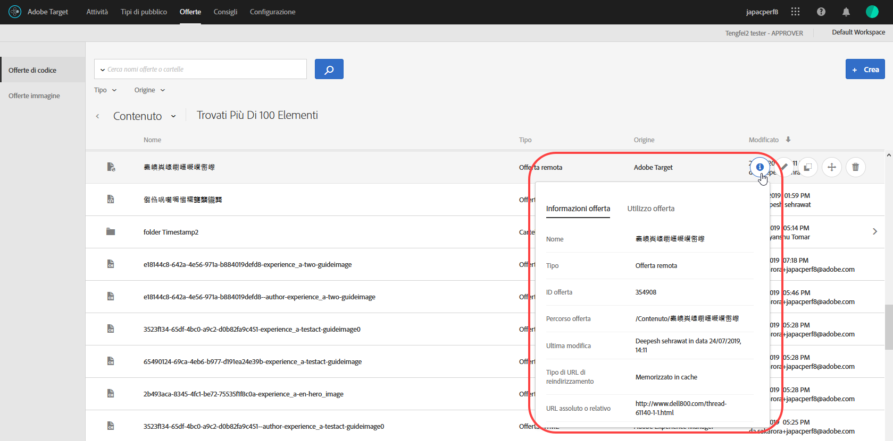

# Offerte{#offers}

Gestisci il contenuto delle offerte basate su codice e su immagine tramite la libreria delle offerte.

>[!NOTE]
>
>Nella versione di gennaio 2017, le offerte create tramite [!DNL Target Classic], [!DNL Adobe Experience Manager] (AEM), [!DNL Adobe Mobile Services] (AMS) e API sono visibili nell’interfaccia utente di [!DNL Target Standard/Premium]. Le offerte aggiornate negli ultimi due anni con questi metodi saranno visibili (cioè da gennaio 2015 in poi). La sincronizzazione iniziale si verificherà la prima volta che un utente dell’organizzazione aprirà la pagina [!UICONTROL Offerte]. Il tempo necessario per la sincronizzazione iniziale dipende dalla quantità di dati. Dopo la sincronizzazione iniziale, i dati verranno sincronizzati in modo incrementale. Se prima di questa versione usavi codici e immagini nella stessa cartella, [!DNL Target] li divide in due cartelle duplicate. La data e l’ora di aggiornamento si riferiscono all’ora in cui è stata effettuata la migrazione della cartella, e non riflette la data in cui è stata creata originariamente la cartella.

Fai clic su **[!UICONTROL Offerte]** per aprire la libreria. La libreria contiene le offerte che sono state impostate tramite [!DNL Target Standard/Premium], [!DNL Target Classic], [!DNL Adobe Experience Manager] (AEM), [!DNL Adobe Mobile Services] (AMS) e API. Le offerte create in [!DNL Target Classic] o altre soluzioni sono modificabili in [!DNL Target Standard/Premium].

La pagina [!UICONTROL Offerte] ha due schede lungo il lato destro, Offerte di codice e Offerte di immagine, che consentono di visualizzare le offerte per tipo.

È possibile filtrare le offerte per tipo (offerta HTML, offerta di reindirizzamento, offerta remota o cartella) e per origine (Adobe Target, Adobe Target Classic, Adobe Experience Manager, Adobe Mobile Services o API).

È possibile modificare o copiare una cartella o un’offerta passando il cursore del mouse sull’elemento desiderato e facendo clic sulle icone Modifica o Copia.

## Visualizzazione delle definizioni delle offerte {#section_6B059DD121434E6292CAB393507D010E}

È possibile visualizzare i dettagli della definizione di un’offerta in una scheda a comparsa nella libreria delle offerte, senza aprire l’offerta stessa.

Ad esempio, se passi il mouse su un’offerta nell’elenco dei contenuti e fai clic sull’icona delle informazioni, puoi accedere alla seguente scheda di definizione dell’offerta:

Sono disponibili le seguenti informazioni:

* Nome
* Origine
* Tipo
* ID offerta
* Percorso offerta
* Ultima modifica

Fai clic sulla scheda [!UICONTROL Utilizzo offerta] per visualizzare le attività che fanno riferimento a un’offerta di codice nella scheda a comparsa della definizione di ogni offerta. Questa funzionalità non è applicabile alle offerte di immagine. In questo modo puoi evitare un impatto su altre attività mentre modifichi le offerte. Le informazioni includono Attività live e Attività inattive.

Di seguito è illustrata la scheda di definizione di un’offerta di reindirizzamento:

Sono disponibili le seguenti informazioni:

* Nome
* Origine
* Tipo
* ID offerta
* Percorso offerta
* Ultima modifica
* URL di reindirizzamento
* Includi tutti i parametri URL (opzione attivata o disattivata)
* Pass ID sessione mbox (opzione attivata o disattivata)

Di seguito è illustrata la scheda di definizione di un’offerta remota:

Sono disponibili le seguenti informazioni:

* Nome
* Origine
* Tipo
* ID offerta
* Percorso offerta
* Ultima modifica
* Tipo di URL di reindirizzamento
* URL assoluto o relativo

## Video di formazione: L’archivio dei contenuti 

Questo video include informazioni sulla gestione delle offerte.

* Connessione tra la [libreria delle risorse di Experience Cloud](https://experienceleague.adobe.com/docs/core-services/interface/assets/creative-cloud.html) e la libreria dei contenuti di Target
* Offerte HTML personalizzate
* Offerta HTML personalizzata nel Compositore esperienza visivo

>[!VIDEO](https://video.tv.adobe.com/v/17387)