# Modifiche

Informazioni sulla pagina Modifiche in [!DNL Adobe Target] che consente di visualizzare le modifiche alla pagina e di aggiungere ulteriori modifiche (selettore CSS, Mbox e Codice personalizzato).

La pagina delle modifiche mostra tutte le modifiche apportate alla pagina in Compositore esperienza visivo (VEC) e consente di apportare ulteriori modifiche facendo clic su ciascun elemento della pagina e [selezionando un&#39;azione](/help/c-experiences/c-visual-experience-composer/viztarget-options.md#reference_3BD1BEEAFA584A749ED2D08F14732E81). Ogni modifica apportata viene visualizzata come un&#39;azione o un elemento separato [!UICONTROL nell&#39;elenco delle modifiche]. Puoi anche aggiungere modifiche, compresi i seguenti tipi di modifica: Selettore CSS, Mbox. e Codice personalizzato.

## Panoramica sulle modifiche {#section_EE27E7572AA74397BBDED563B2B3D509}

Nella pagina [!UICONTROL Modifiche] vengono visualizzate tutte le modifiche apportate alla pagina nel Compositore esperienza visivo. Ogni modifica apportata viene visualizzata come un’azione o un elemento separato [!UICONTROL nell’elenco delle modifiche].

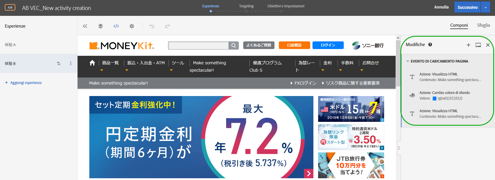

Utilizza la pagina Modifiche per apportare piccole modifiche al selettore scelto da Target quando utilizzi il Compositore esperienza visivo per configurare il modo in cui viene distribuito il contenuto. È possibile modificare sia il contenuto che un attributo HTML. È inoltre possibile modificare il codice per creare l&#39;equivalente di un&#39;offerta HTML all&#39;interno di una mbox.

Utilizza la pagina Modifiche per:

* Visualizzare un&#39;azione intrapresa nel compositore visivo.

   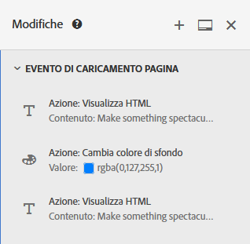

* Modificare un&#39;azione esistente. Passa il mouse sulla modifica desiderata, quindi fai clic sull&#39;icona **[!UICONTROL Modifica]**.

   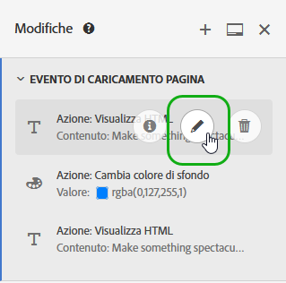

   Apporta le modifiche.

   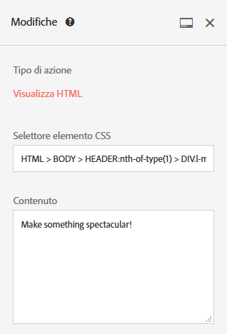

* Elimina un&#39;azione esistente. Passa il mouse sulla modifica desiderata, quindi fai clic sull&#39;icona **[!UICONTROL Elimina]**.

   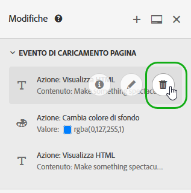

* Aggiungi una nuova modifica. Fai clic su **[!UICONTROL Aggiungi modifica]** o sull&#39;icona +, quindi specifica le modifiche come descritto di seguito.

   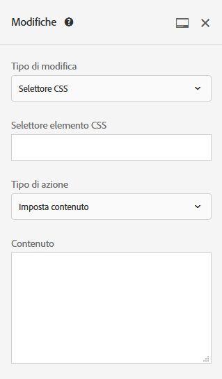

   Dopo la creazione di una modifica, Target visualizza un&#39;icona + nella parte superiore del pannello Modifiche, invece che nel pulsante Aggiungi modifica nella parte inferiore del pannello.

* Ancora il pannello Modifiche in verticale lungo il lato dell’interfaccia di Target oppure in orizzontale lungo il bordo inferiore. Fai clic sull&#39;icona [!UICONTROL Ancora] per passare tra le due impostazioni.

   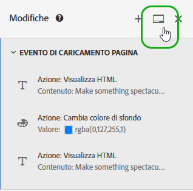

   Nella figura seguente viene illustrato il pannello Modifiche ancorato nella parte inferiore dello schermo:

   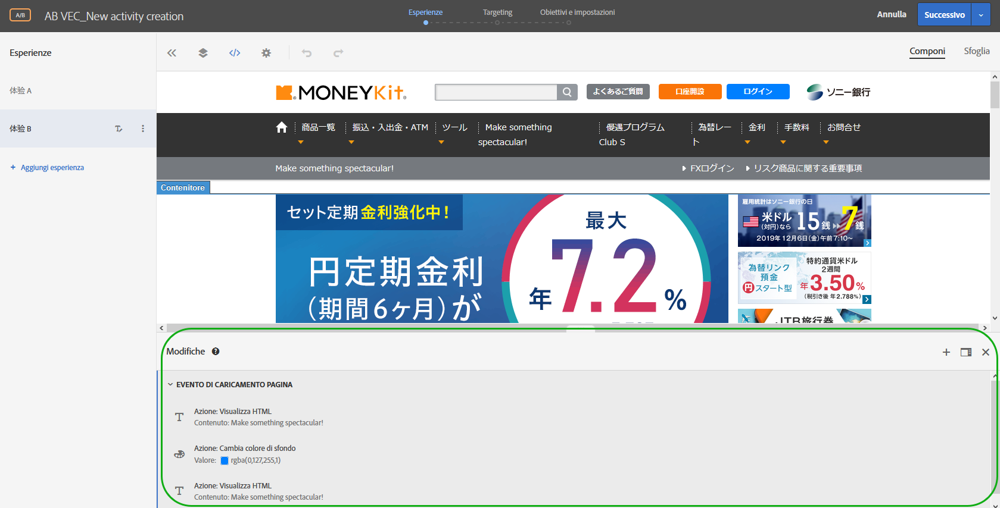

## Aggiungere modifiche {#section_C7ABCD5731A048CB8F90EDC31A32EDF9}

1. Per visualizzare la pagina delle [!UICONTROL modifiche] per un’esperienza selezionata, nella compositore esperienza visivo fai clic sull’icona &lt;/> **[!UICONTROL Modifiche]**.

   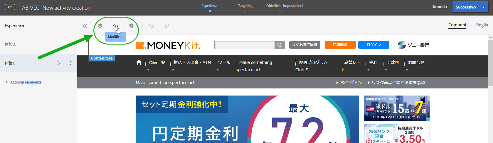

   >[!NOTE]
   >
   >Per aprire il pannello Modifiche nel Compositore esperienza basato su modulo, crea o modifica un’offerta HTML. Per ulteriori informazioni, consulta [Compositore esperienza basato su moduli](/help/c-experiences/form-experience-composer.md#task_FAC842A6535045B68B4C1AD3E657E56E).

   Viene visualizzata la pagina delle [!UICONTROL modifiche], che suddivide lo schermo tra la modalità visiva e il pannello Modifiche a destra. Fai clic sull’icona [!UICONTROL Ancora] per ancorare il pannello Modifiche in verticale lungo il lato dell’interfaccia di Target oppure in orizzontale lungo il bordo inferiore. Nota che l&#39;esperienza A nella figura seguente non ha modifiche precedenti.

   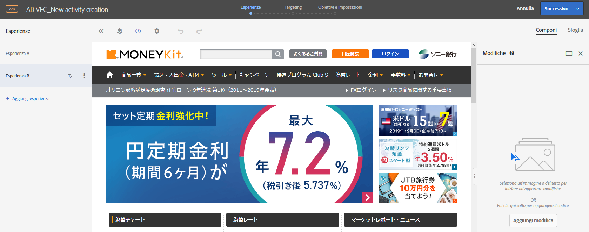

   L&#39;esperienza B mostra le modifiche precedenti nel pannello [!UICONTROL Modifiche] a destra.

   

1. Per aggiungere una modifica:

   * Se non è stata apportata alcuna modifica precedente, fai clic sul pulsante **[!UICONTROL Aggiungi modifica]** nella parte inferiore del pannello [!UICONTROL Modifica] sul lato destro.
   * Se hai apportato modifiche precedenti, fai clic sull&#39;icona + nella parte superiore del pannello [!UICONTROL Modifiche] sul lato destro.

   Il pannello Modifiche visualizza:

   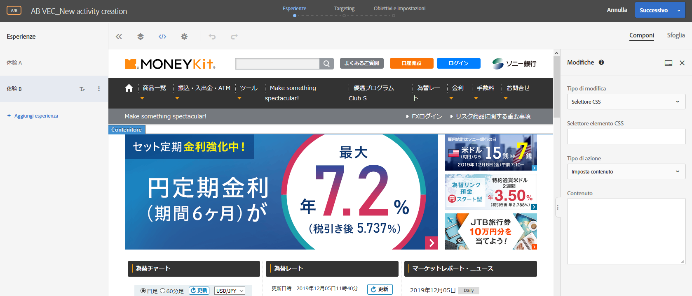

1. Dall&#39;elenco a discesa **[!UICONTROL Tipo di modifica]**, scegli il tipo desiderato:

   | Tipo di modifica | Dettagli |
   |--- |--- |
   | Selettore CSS | Nella casella Selettore elemento CSS, specifica l&#39;elemento CSS che desideri modificare, seleziona un tipo di azione (Imposta contenuto o Imposta attributo), quindi compila le informazioni richieste e il contenuto desiderato. |
   | Mbox | Specifica il nome mbox e il contenuto desiderato. |
   | Codice personalizzato | Specifica un nome facoltativo, seleziona o deseleziona l’opzione [!UICONTROL Aggiungi codice nella sezione `<HEAD>`], quindi aggiungi il codice personalizzato.<br>Se selezioni [!UICONTROL Aggiungi codice nella sezione `<HEAD>`], il codice personalizzato viene aggiunto alla sezione `<head>` e l’esecuzione non attende il corpo o eventi di caricamento della pagina. Aggiungi solo gli elementi `<script>` e `<style>`. L’aggiunta di tag `<div>` e di altri elementi potrebbe causare la comparsa di elementi `<head>` rimanenti nel `<body>`. Se utilizzi mbox.js versione 60 o successiva o qualsiasi versione di at.js, tutte le offerte verranno recapitate in modo asincrono.<br> Se deselezioni [!UICONTROL Aggiungi codice nella sezione `<HEAD>`], il codice personalizzato viene eseguito subito dopo il tag `<body>`. Racchiudi tutto il codice in un unico `<div>` per conservare la struttura DOM. Se utilizzi mbox.js versione 60 o successiva o qualsiasi versione di at.js, tutte le offerte verranno recapitate in modo asincrono.<br>**Nota**: gli script vengono eseguiti in modo asincrono. Ciò significa che non è possibile, ad esempio, utilizzare `document.write` o metodi di scripting simili.<br>Il codice personalizzato fornisce un&#39;interfaccia non visiva per visualizzare, modificare e aggiungere nuove azioni nel Compositore esperienza visivo, nel Compositore esperienza basato su moduli e nell&#39;editor di offerte HTML. Il pannello fornisce una visualizzazione del codice di un&#39;esperienza e facilita la creazione di esperienze più complesse, l&#39;ottimizzazione di quelle esistenti e la risoluzione di problemi.<br>Il codice personalizzato è destinato agli utenti avanzati che hanno dimestichezza con HTML, JavaScript e CSS. La visualizzazione codice consente di modificare o perfezionare le modifiche o correggere i problemi del selettore. Può inoltre essere utilizzato per aggiungere nuove azioni e un codice personalizzato. È possibile aggiungere più di un codice personalizzato e facoltativamente assegnare un nome a ciascuno di essi.<br>**Nota**: il codice personalizzato è attualmente disponibile solo per attività A/B e per l’esperienza di targeting (XT). Il codice personalizzato è disabilitato in caso di sovrapposizione e se viene applicata un&#39;offerta di reindirizzamento.<br>Il codice personalizzato supporta i seguenti casi di utilizzo:<ul><li>Aggiunta di JavaScript, HTML o CSS personalizzati da eseguire nella parte superiore della pagina</li><li>Visualizzazione o modifica del codice generato dal Compositore esperienza visivo dopo aver apportato modifiche</li><li>Impostazione del contenuto HTML per un selettore (solo selettore CSS)</li><li>Impostazione di un attributo su un elemento HTML</li><li>Aggiunta di contenuto dell&#39;offerta da consegnare in una mbox regionale</li><li>Scambio su DOM-ready, utilizzando jQuery</li><li>Scambio su DOM-ready, non jQuery (non supporta Internet Explorer 8)</li><li>Scambio con meccanismo DOM tramite plug-in “elementOnLoad”</li><li>Reindirizzamento personalizzato</li></ul>Il codice personalizzato fornisce:<ul><li>Numeri di linea per un migliore uso.</li><li>Colorazione della sintassi che consente di evitare errori di sintassi nelle offerte HTML.</li><li>La possibilità di creare più codici personalizzati e fornire un nome facoltativo per ciascuno di essi. La creazione di più codici personalizzati semplifica il debug futuro. Invece di creare un codice personalizzato per eseguire diverse modifiche, puoi creare un codice personalizzato distinto per ogni modifica con un nome descrittivo. L&#39;uso di codici personalizzati separati rende le modifiche più modulari e gestibili. Tieni presente che l&#39;esecuzione di più codici personalizzati in un&#39;attività non è garantita nella sequenza in cui sono stati creati.</li></ul>Il pannello Modifiche suddivide lo schermo tra la modalità visiva e la modalità codice. Entrambe le modalità rimangono sincronizzate. Ogni modifica apportata visivamente ha una riga corrispondente nella vista Codice. Allo stesso modo, ogni modifica inserita nella vista Codice viene visualizzata nell&#39;esperienza visiva. Facendo clic su una qualsiasi riga della vista Codice, viene selezionato l&#39;elemento corrispondente nella pagina visiva.<br>Il codice personalizzato supporta HTML, script e stili. Qualsiasi codice HTML o script valido può essere aggiunto o modificato. |

1. Aggiungi ulteriori modifiche in base alle esigenze.

## Casi di utilizzo del codice personalizzato {#section_26CB3360097D400FB02E20AE5FDBA352}

Il pannello **[!UICONTROL Codice personalizzato]** contiene il codice eseguito all&#39;inizio del caricamento della pagina.

Puoi eseguire il codice JavaScript nel tag `<head>`. L’esecuzione del codice non attende che il tag `<body>` sia presente nel DOM.

I selettori per le azioni visive successive dipendono dagli elementi HTML aggiunti in questa scheda.

Il pannello Codice personalizzato viene comunemente utilizzato per aggiungere JavaScript o CSS all&#39;inizio della pagina.

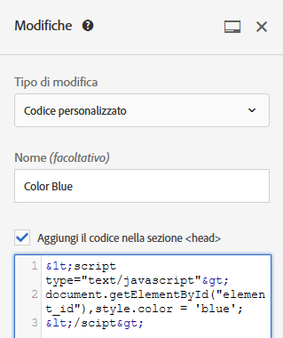

Utilizza la scheda **[!UICONTROL Codice personalizzato]** per:

* Utilizzare JavaScript in linea o per un collegamento a un file JavaScript esterno

   Ad esempio, per modificare il colore di un elemento:

   ```javascript
   <script type="text/javascript"> 
   document.getElementById("element_id").style.color = "blue"; 
   </script> 
   ```

* Configurare uno stile in linea o un collegamento a un foglio di stile esterno

   Ad esempio, per definire una classe per un elemento sovrapposto:

   ```html
   <style> 
   .overlay 
   { position: absolute; top:0; left: 0; right: 0; bottom: 0; background: red; } 
   </style> 
   ```

* Aggiungere frammenti HTML per definire nuovi elementi

   Ad esempio, utilizza il seguente frammento HTML per creare una sovrapposizione `<div>` utilizzando la classe CSS definita sopra:

   ```html
   <div class="overlay"></div>
   ```

* Scambio su DOM-ready, utilizzando jQuery

   ```javascript
   <style>#default_content {visibility:hidden;}</style> 
   <script> 
   jQuery( document ).ready(function() { 
       jQuery("#default_content").html( "<span style='color:red'>Hello <strong>Again</strong></span>" ); 
       jQuery("#default_content").css("visibility","visible"); 
   }); 
   </script> 
   ```

* Scambio su DOM-ready, non jQuery (non supporta Internet Explorer 8)

   ```javascript
   <style>#default_content {visibility:hidden;}</style> 
   <script> 
   document.addEventListener("DOMContentLoaded", function(event) {  
       document.getElementById("default_content").innerHTML = "<span style='color:red'>Hello <strong>Again</strong></span>"; 
       document.getElementById("default_content").style.visibility="visible"; 
   }); 
   </script> 
   ```

* Scambio con meccanismo DOM tramite plug-in `elementOnLoad`

   Il vantaggio di questo è che lo scambio avviene prima rispetto al DOM-ready. Il plug-in gestisce le operazioni che portano alla condizione di pre-nascosto e rivelato, e richiede un ID sull&#39;elemento.

   ```javascript
   <style>#default_content {visibility:hidden;}</style> 
   <script> 
   /*elementOnLoad DOM Swizzling v3 ==>Mbox.js Extra Javascript*/window.elementOnLoad=function(e,l){var m=document.getElementById(e);if(m){setTimeout(function(){l(m);setTimeout(function(){m.style.visibility='visible';m.style.display='block'},20)},20)}else{setTimeout(function(){elementOnLoad(e,l)},20)}},addEvent=function(a){var d=document,w=window,wa=w.addEventListener,da=d.addEventListener,e='load',o='on'+e;if(wa){wa(e,a,false)}else if(da){da(e,a,false)}else if(d.attachEvent){w.attachEvent(o,a)}};addEvent(function(){setTimeout("elementOnLoad=function(){}",500)}); 
   elementOnLoad('default_content',function(e){ 
       e.innerHTML = "<span style='color:red'>Hello <strong>Again</strong></span>"; 
   }); 
   </script> 
   ```

* Reindirizzamento personalizzato passando parametri esistenti, parametro `s_tnt` (per l&#39;integrazione legacy di Analytics), parametri di riferimento e sessione mbox

   ```javascript
   <style type="text/css">body{display:none!important;}</style> 
   <script type="text/javascript"> 
    var qs='';window.location.search?qs=window.location.search+'&':qs='?'; 
    window.location.replace('//www.mywebsite.com/'+qs+'s_tnt=${campaign.id}:${campaign.recipe.id}:${campaign.recipe.trafficType}&s_tntref='+encodeURIComponent(document.referrer)+'&mboxSession='+mboxFactoryDefault.getSessionId().getId()+''+window.location.hash+''); 
   </script> 
   ```

* Aggiungi i modelli Adobe Target Experience per il codice personalizzato. I modelli di esperienza di Target sono esempi precodificati con input configurabili da utilizzare per casi di utilizzo ricorrenti per gli addetti al marketing. Questi modelli di esperienza sono disponibili gratuitamente per gli sviluppatori e i rivenditori come punto di partenza per eseguire alcuni casi comuni di utilizzo esterno in Adobe Target (tramite il Compositore esperienza visivo o il Compositore esperienza basato su modulo). I casi di utilizzo includono lightbox, giostre, countdown e altro ancora.

   Per ulteriori informazioni, consulta [Modelli di esperienza](/help/c-experiences/c-visual-experience-composer/c-vec-code-editor/experience-templates.md#concept_109BBD7EABC04DD39E6B7B1687786652).

## Tecniche consigliate per il codice personalizzato {#section_10DFFD9FB92A43C1BB444A45E0272B28}

**Racchiudi sempre il codice personalizzato in un elemento.**

Ad esempio:

```html
<div id="custom-code"> 
// My Code goes here 
</div>
```

Nel caso in cui siano necessarie modifiche, apporta modifiche all&#39;interno di questo contenitore.

Se non è più necessario il codice personalizzato, è sufficiente lasciare vuoto questo contenitore, ma non rimuoverlo. Ciò assicura che altre modifiche di esperienza non siano influenzate.

**Non utilizzare l&#39;ID elemento “CDQID” per apportare modifiche alla pagina eseguita nell&#39;editor di codice.**

Target applica un nuovo ID elemento con il valore “CDQID” a qualsiasi elemento della pagina modificato da Target. Poiché questo ID viene applicato da Target, non deve essere utilizzato per ulteriori modifiche o regolazioni nell&#39;editor di codice.

**Non eseguire azioni document.write negli script di codice personalizzati.**

Gli script vengono eseguiti in modo asincrono. Questo causa spesso la comparsa delle azioni `document.write` nel punto sbagliato della pagina. L&#39;utilizzo di `document.write` negli script creati nel codice personalizzato non è consigliato.

**Se crei un elemento e quindi lo modifichi, non eliminare l&#39;elemento originale.**

Ogni modifica crea un nuovo elemento nel pannello Modifiche. La seconda azione modifica l&#39;elemento 1: se lo elimini, questa azione non avrà più niente da modificare, risultando nella mancata applicazione della modifica. Per ulteriori informazioni, consulta “Risoluzione dei problemi”.

**Presta attenzione se utilizzi la funzionalità di codice personalizzato per due attività con targeting allo stesso URL.**

Se utilizzi la funzione codice personalizzato per due attività con targeting allo stesso URL, JavaScript viene integrato nella pagina da entrambe le attività. Target determina automaticamente l&#39;ordine del contenuto recapitato. Assicurati che il codice non dipenda dal posizionamento. Spetta a te verificare che non vi siano conflitti nel codice.

## Risoluzione dei problemi relativi al Codice personalizzato  {#section_6C965CBC31C348D7AA5B57B63DAB9E7F}

**Ho ricevuto un avviso rispetto al fatto che un&#39;azione non può essere applicata a causa di modifiche strutturali a una pagina. Cosa significa?**

Questo messaggio indica che la struttura della pagina è cambiata dall&#39;ultimo salvataggio dell&#39;attività.

I selettori mancanti potrebbero essere raggiunti utilizzando la modalità Sfoglia. È consigliabile eliminare e quindi ricreare ogni esperienza per assicurarsi che il contenuto venga visualizzato come previsto, come indicato nel messaggio di avviso.


***Quando elimino un elemento, viene visualizzato un avviso che indica che “L&#39;eliminazione di questa azione può influire sulle azioni successive.” Cosa significa?***

Ad esempio, supponiamo che tu abbia eseguito due azioni:

* Aggiunta di una classe all&#39;elemento 1
* Modifica del codice HTML dell&#39;elemento 1

Ogni modifica crea un nuovo elemento nel pannello Modifiche. La seconda azione modifica l&#39;elemento 1: se lo elimini, la seconda azione non avrà più niente da modificare, risultando nella mancata applicazione della modifica.

In altre parole, se aggiungi un elemento con testo e modifichi tale elemento con un testo diverso in un&#39;azione separata, il pannello Modifiche mostrerà entrambe le azioni come elementi distinti. Durante la modifica dell&#39;elemento è stato creato un nuovo elemento, contenente il testo modificato, che modifica l&#39;elemento originale creato. Se elimini l&#39;elemento originale, il testo modificato non sarà in grado di trovare l&#39;elemento modificato e non verrà visualizzato. Il secondo elemento rimarrà nell&#39;elenco senza tuttavia influire sulla pagina, poiché l&#39;elemento da modificare non esiste più.

***Un elemento che ho creato usando `document.write` in uno script non appare dove previsto.***

Gli script vengono eseguiti in modo asincrono. Questo causa spesso la comparsa delle azioni `document.write` nel punto sbagliato della pagina. Adobe consiglia di non utilizzare `document.write` negli script creati nel codice personalizzato.

***Il mio JavaScript mostra gli errori nel codice personalizzato.***

Qualsiasi JavaScript in linea che non è un JavaScript valido mostra gli errori nel codice personalizzato.

***Non è possibile annullare una modifica nel codice personalizzato.***

Attualmente, l&#39;annullamento non è supportato per le azioni di modifica ed eliminazione dal pannello Modifiche e nel codice personalizzato. L&#39;annullamento di una di queste operazioni potrebbe comportare l&#39;incoerenza dell&#39;esperienza con le azioni effettive visibili nel codice personalizzato all&#39;interno del Compositore esperienza visivo. Tuttavia, le azioni nel codice personalizzato sono nello stato corretto e non vi è alcuna conseguenza sulla consegna. Questo è un problema di interfaccia utente. Per aggiornare l&#39;esperienza, salvarla e riaprirla, oppure andare al passaggio successivo e tornare indietro. Una di queste azioni ricarica l&#39;esperienza e quindi viene visualizzata come previsto ed è coerente con le azioni nel pannello Modifiche.

**Il codice personalizzato non produce i risultati previsti in Internet Explorer 8.**

Target non supporta più IE8.
