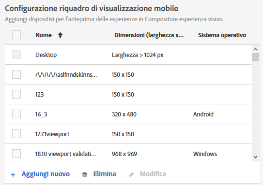
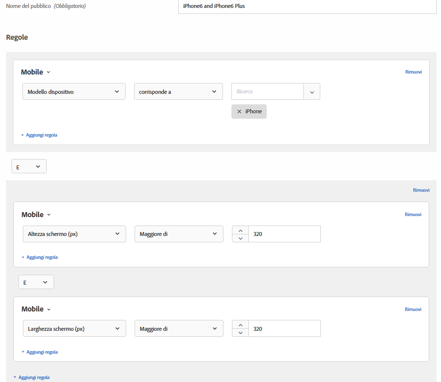

# Mobile Viewports for responsive experiences{#mobile-viewports-for-responsive-experiences}

Mobile viewports help you preview how your [!DNL Target] activities appear on screens of various sizes.

La funzione di anteprima della finestra del visualizzatore per dispositivi mobili è progettata per i siti reattivi che possono essere visualizzati correttamente su vari dispositivi, finestre o dimensioni dello schermo. I siti reattivi si adattano e si adattano automaticamente a qualsiasi dimensione dello schermo, compresi desktop, laptop, tablet o telefoni cellulari.

>[!NOTE]
>
> * I riquadri di visualizzazione per dispositivi mobili si utilizzano quando il sito è reattivo e gli stessi elementi presenti nella pagina del desktop vengono utilizzati nella versione mobile della pagina in una configurazione diversa. If you have a separate mobile site with a separate structure, such as `m.mysite.com`, use a [multipage activity](../../c-experiences/c-visual-experience-composer/multipage-activity.md#concept_277E096063E14813AC5D8EDFA1D2ED48) instead.
   >
   >
* I riquadri di visualizzazione per dispositivi mobili non sono disponibili se sovrapposti da una sovrapposizione di offerta di reindirizzamento.

Un riquadro di visualizzazione è definito dalla dimensione del rettangolo compilato da una pagina web sullo schermo. È la dimensione della finestra del browser, senza le barre di scorrimento e la barra degli strumenti. I browser utilizzano i “pixel CSS”. Per molti dispositivi, ad esempio quelli con schermi Retina, il riquadri di visualizzazione è più piccolo della risoluzione del dispositivo pubblicizzato.

Di seguito sono mostrati i riquadri di visualizzazione e le risoluzioni per alcuni dispositivi popolari. Ricordati di utilizzare la dimensione del riquadro di visualizzazione in [!DNL Target]. Ci sono vari siti web che elencano le misure del riquadro di visualizzazione dei dispositivi più popolari. Ad esempio, consultate [https://viewportsizer.com/devices/](https://viewportsizer.com/devices/) o consultare il sito Web del produttore del dispositivo.

| Dispositivo | Dimensioni riquadro di visualizzazione | Risoluzione del dispositivo |
|---|---|---|
| iPhone SE | 375 x 667 (larghezza x altezza) | 750 x 1334 (larghezza x altezza) |
| iPhone 11 Pro Max | 414 x 896 (larghezza x altezza) | 1242 x 2688 (larghezza x altezza) |
| iPhone 11 Xs Max | 414 x 896 (larghezza x altezza) | 1242 x 2688 (larghezza x altezza) |
| iPhone 11 | 414 x 896 (larghezza x altezza) | 828 x 1792 (larghezza x altezza) |
| iPhone 11 Xr | 414 x 896 (larghezza x altezza) | 828 x 1792 (larghezza x altezza) |
| iPhone 11 Pro | 375 x 812 (larghezza x altezza) | 1125 x 2436 (larghezza x altezza) |
| iPhone 11 X | 375 x 812 (larghezza x altezza) | 1125 x 2436 (larghezza x altezza) |
| iPhone 11 Xs | 375 x 812 (larghezza x altezza) | 1125 x 2436 (larghezza x altezza) |
| iPhone X | 375 x 812 (larghezza x altezza) | 1125 x 2436 (larghezza x altezza) |
| iPhone 8 Plus | 414 x 736 (larghezza x altezza) | 1080 x 1920 (larghezza x altezza) |
| iPhone 8 | 375 x 667 (larghezza x altezza) | 750 x 1334 (larghezza x altezza) |
| iPhone 7 Plus | 414 x 736 (larghezza x altezza) | 1080 x 1920 (larghezza x altezza) |
| iPhone 7 | 375 x 667 (larghezza x altezza) | 750 x 1334 (larghezza x altezza) |
| iPhone 6s Più | 414 x 736 (larghezza x altezza) | 1080 x 1920 (larghezza x altezza) |
| iPhone 6s | 375 x 667 (larghezza x altezza) | 750 x 1334 (larghezza x altezza) |
| iPhone 6 Plus | 414 x 736 (larghezza x altezza) | 1080 x 1920 (larghezza x altezza) |
| iPhone 6 | 375 x 667 (larghezza x altezza) | 750 x 1334 (larghezza x altezza) |
| iPad Pro | 1024 x 1366 (larghezza x altezza) | 2048 x 2732 (larghezza x altezza) |
| iPad di terza e quarta generazione | 768 x 1024 (larghezza x altezza) | 1536 x 2048 (larghezza x altezza) |
| iPad Air 1 e 2 | 768 x 1024 (larghezza x altezza) | 1536 x 2048 (larghezza x altezza) |
| iPad Mini | 768 x 1024 (larghezza x altezza) | 768 x 1024 (larghezza x altezza) |
| iPad Mini 2 e 3 | 768 x 1024 (larghezza x altezza) | 1536 x 2048 (larghezza x altezza) |
| Nexus 6P | 411 x 731 (larghezza x altezza) | 1440 x 2560 (larghezza x altezza) |
| Nexus 5X | 411 x 731 (larghezza x altezza) | 1080 x 1920 (larghezza x altezza) |
| Google Pixel | 411 x 731 (larghezza x altezza) | 1080 x 1920 (larghezza x altezza) |
| Google Pixel XL | 411 x 731 (larghezza x altezza) | 1440 x 2560 (larghezza x altezza) |
| Google Pixel 2 | 411 x 731 (larghezza x altezza) | 1080 x 1920 (larghezza x altezza) |
| Google Pixel 2 XL | 411 x 823 (larghezza x altezza) | 1440 x 2880 (larghezza x altezza) |
| Samsung Galaxy Note 5 | 480 x 853 (larghezza x altezza) | 1440 x 2560 (larghezza x altezza) |
| LG G5 | 480 x 853 (larghezza x altezza) | 1440 x 2560 (larghezza x altezza) |
| One Plus 3 | 480 x 853 (larghezza x altezza) | 1080 x 1920 (larghezza x altezza) |
| Samsung Galaxy S9 | 360 x 740 (larghezza x altezza) | 1440 x 2960 (larghezza x altezza) |
| Samsung Galaxy S9+ | 360 x 740 (larghezza x altezza) | 1440 x 2960 (larghezza x altezza) |
| Samsung Galaxy S8 | 360 x 740 (larghezza x altezza) | 1440 x 2960 (larghezza x altezza) |
| Samsung Galaxy S8+ | 360 x 740 (larghezza x altezza) | 1440 x 2960 (larghezza x altezza) |
| Samsung Galaxy S7 | 360 x 640 (larghezza x altezza) | 1440 x 2560 (larghezza x altezza) |
| Samsung Galaxy S7 Edge | 360 x 640 (larghezza x altezza) | 1440 x 2560 (larghezza x altezza) |
| Nexus 7 (2013) | 600 x 960 (larghezza x altezza) | 1200 x 1920 (larghezza x altezza) |
| Nexus 9 | 768 x 1024 (larghezza x altezza) | 1536 x 2048 (larghezza x altezza) |
| Samsung Galaxy Tab 10 | 800 x 1280 (larghezza x altezza) | 800 x 1280 (larghezza x altezza) |
| Chromebook Pixel | 1280 x 850 (larghezza x altezza) | 2560 x 1700 (larghezza x altezza) |

Se desideri inviare un&#39;attività a persone su un determinato dispositivo, scegli il pubblico appropriato per tale dispositivo nel diagramma delle attività. Utilizza il Compositore web per dispositivi mobili per modificare la pagina nell&#39;attività relativa a tale dispositivo. Se desideri eseguire un&#39;attività in tutta l&#39;esperienza digitale e assicurarti che si guardi bene su tutti i dispositivi, non applicare il targeting, e utilizza i riquadri per dispositivi mobili per visualizzare in anteprima l&#39;attività su ogni dimensione dello schermo.

Se disponi di un sito reattivo, in genere il sito è progettato per aprirsi in una visualizzazione diversa quando si accede da un dispositivo con una dimensione dello schermo specifica. Le dimensioni dello schermo che attivano le nuove visualizzazioni sono noti come Punti di interruzione CSS. I punti di interruzione CSS sono punti in cui il contenuto del sito Web risponde in base alla larghezza del dispositivo, per visualizzare il layout ottimale per i visitatori. I punti di interruzione CSS sono denominati anche query [multimediali](https://developer.mozilla.org/en-US/docs/Web/CSS/Media_Queries/Using_media_queries).

Save your CSS breakpoints in [!DNL Target] so you can preview your experiences for each view you define. Each of these experiences is displayed in a mobile viewport in the [!DNL Target] interface. Apri la visualizzazione per ogni dimensione dello schermo cliccando sul riquadro di visualizzazione corrispondente nella parte superiore del display.

Se il sito non è reattivo, è comunque possibile utilizzare il Compositore web per dispositivi mobili per visualizzare un sito, se l&#39;attività è destinata a un dispositivo specifico.

>[!IMPORTANT]
>
>Sebbene sia possibile modificare un&#39;esperienza dall&#39;interno dei visualizzatori per dispositivi mobili, queste modifiche si applicano a tutte le finestre e ai dispositivi, non solo alla finestra in cui si sta lavorando. Analogamente, la modifica di un&#39;esperienza nella normale visualizzazione desktop cambia la pagina per tutte le dimensioni dello schermo, non solo la visualizzazione sul desktop. Attualmente, non sono supportate le modifiche di pagina specifiche per un riquadro di visualizzazione.

## Mobile viewport configuration {#task_B4B161499DC0470584ED922A4D20FCAB}

Configura tutti i riquadri di visualizzazione per dispositivi mobili che desideri rendere disponibili quando crei le tue esperienze.

1. Fate clic su **[!UICONTROL Amministrazione]** > **[!UICONTROL Visual Experience Composer (Compositore esperienza visivo)]**.
1. Per aggiungere una nuova finestra mobile, fate clic su **[!UICONTROL Aggiungi]** nella sezione di configurazione **[!UICONTROL delle finestre]** Mobile.

   

   To change the configuration of an existing mobile viewport, select that viewport, then click the [!UICONTROL Edit] (pencil) icon.

1. Inserisci un nome per il riquadro di visualizzazione per dispositivi mobili.

   Assegna alla tua finestra mobile un nome descrittivo facile da riconoscere. Il nome può essere lungo fino a 36 caratteri.

1. Inserisci le dimensioni dello schermo del dispositivo mobile, sia della larghezza che dell&#39;altezza.

   La larghezza può essere compresa tra 150 e 968 pixel. L&#39;altezza può essere compresa tra 150 e 1280 pixel.

1. (Facoltativo) Seleziona il sistema operativo del dispositivo.

   Opzioni:

   * Android
   * iOS
   * Windows
   * Symbian
   * Blackberry

   Se utilizzi il [Compositore esperienza avanzato](../../c-experiences/experiences.md#section_34265986611B4AB8A0E4D6ACC25EF91D) e scegli un sistema operativo,  emulerà tale dispositivo quando visualizzerai la pagina. [!DNL Target] If, for example, there is a different look and feel for Android than iOS on your responsive site, [!DNL Target] mimics that behavior.

1. Fai clic su **[!UICONTROL Salva]**.

## Create a responsive experience {#task_D6332438B5EE48CCA8AF199270F1CAEF}

Add mobile viewports to your [!DNL Target] activities to create responsive experiences for mobile screens.

1. Create l&#39;attività desiderata.
1. In Compositore esperienza visivo, fai clic sull’icona a forma di ruota dentata **[!UICONTROL Impostazioni]**, quindi seleziona **[!UICONTROL Aggiungi riquadri di visualizzazione per dispositivi mobili]**.

   

1. Fai clic sull’icona **[!UICONTROL Dispositivi]**, quindi attiva tutti i dispositivi che devono avere un riquadro di visualizzazione per dispositivi mobili.

   

   Le finestre mobili sono elencate dalla più piccola alla più grande secondo la larghezza.

1. Modifica le finestre mobili come desiderati.

   Le modifiche apportate all&#39;esperienza (ad esempio, se si modifica il testo in un&#39;intestazione) vengono applicate all&#39;esperienza su tutti i dispositivi.

   Sposta il mouse sul nome di una finestra per visualizzarne le dimensioni.

   

1. Se necessario, per alternare tra le modalità verticale e orizzontale, fate clic sull’icona di orientamento desiderata.

   

## Use Case: Target two iPhone versions {#task_CC3144BF5BA54034996E1D3DB0BC1A35}

Questo esempio di utilizzo mostra come configurare le esperienze per due versioni per iPhone: iPhone 6 e iPhone 6 Plus.

1. Fate clic su **[!UICONTROL Amministrazione]** > **[!UICONTROL Visual Experience Composer (Compositore esperienza visivo)]**.
1. In the **[!UICONTROL Mobile Viewport Configuration]** section, create mobile viewports for iPhone 6 and iPhone 6 plus.

   Utilizza le impostazioni seguenti per ciascun riquadro di visualizzazione:

   | Nome | Larghezza | Altezza | Sistema operativo |
   |---|---|---|---|
   | iPhone 6 | 375 | 667 | iOS |
   | iPhone 6 Plus | 414 | 736 | iOS |

   

1. Create un&#39;attività con l&#39;esperienza di cui desiderate eseguire il targeting.
1. Seleziona l’esperienza da indirizzare ai visitatori che accedono al sito da un iPhone 6 o iPhone 6 Plus.
1. Quando selezioni il tuo target, fai clic su **[!UICONTROL Crea pubblico]**, quindi configura un pubblico come illustrato di seguito:

   

   Poiché il telefono potrebbe essere ruotato in orizzontale, con altezza e larghezza entrambi maggiori di 320 puoi creare una condizione che solo i modelli 6 e 6 Plus sono in grado di soddisfare, quando viene combinata con il modello di dispositivo iPhone.
1. Fai clic su **[!UICONTROL Salva]**.
1. Continua a impostare la tua attività come di consueto.

## Video di formazione

I video seguenti contengono ulteriori informazioni sui concetti descritti in questo articolo.

### Compositore esperienza visivo (2 di 2) (7:29) 

Il video demo seguente include informazioni sull&#39;utilizzo del Compositore esperienza visivo per lavorare con i riquadri di visualizzazione per dispositivi mobili:

* Rinominare e duplicare un’esperienza
* Creare un’esperienza con reindirizzamento
* Indirizzare un’attività a un singolo URL o a un gruppo di URL
* Creare un’attività multipagina
* Creare un’esperienza e visualizzarne l’anteprima per i siti web reattivi
* Evidenziare tipi di elementi con le sovrapposizioni

>[!VIDEO](https://video.tv.adobe.com/v/17401)

### Preferenze account in  badge 

Questo video contiene informazioni sulla configurazione di finestre mobili, a partire dalle 4:40 del video.

>[!VIDEO](https://video.tv.adobe.com/v/17379)