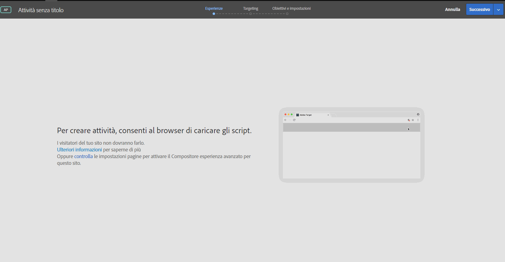

# Enabling mixed content in your browser{#enabling-mixed-content-in-your-browser}

Il contenuto misto si verifica se il contenuto HTTPS (protetto) ** e HTTP (non sicuro) viene caricato per visualizzare la stessa pagina Web e la richiesta iniziale è stata protetta tramite HTTPS.

I browser più recenti potrebbero bloccare la visualizzazione di una pagina o visualizzare messaggi di avviso in caso di combinazione di contenuto protetto e contenuto non protetto.

If the [!UICONTROL Visual Experience Composer] (VEC) in [!DNL Target] tries to open a page containing mixed content, a message displays showing how to disable blocking in your browser so you can open an HTTP site or a site that has mixed calls (HTTPS and HTTP).

In precedenza, quando i contenuti misti non erano consentiti, era comunque possibile eseguire alcune azioni nel passaggio 1 del flusso di lavoro guidato in tre passaggi durante la creazione di attività. [!DNL Target]Ora blocca le azioni nel passaggio 1. Quando viene visualizzato questo messaggio, è necessario abilitare il contenuto misto prima di continuare a creare l&#39;attività.

Le impostazioni di sicurezza del browser potrebbero bloccare i contenuto misti o non protetti (HTTP) caricati in una pagina o in un frame protetti (HTTPS) (come, ad esempio Compositore esperienza visivo). Se non si desidera disabilitare le impostazioni di sicurezza del browser, è necessario disporre di un sito web HTTPS.

Se il sito web è in esecuzione su un dominio non protetto (HTTP), è necessario consentire al Compositore esperienza visivo di caricare i contenuti misti attivi.

>[!NOTE]
>
>Consentire l’utilizzo di contenuti misti influenza solo il Compositore esperienza visivo e non il sito attivo.

Per ulteriori informazioni, vedi la sezione sui [contenuto misti](https://developer.mozilla.org/en-US/docs/Web/Security/Mixed_content) nel sito web di *Mozilla Developer Network* (MDN).

## Enabling mixed content in Google Chrome {#task_FF297A08F66E47A588C14FD67C037B3A}

Se visitate un sito tramite una connessione protetta, Chrome verifica che il contenuto della pagina Web sia stato trasmesso in modo sicuro.

Consulta [Gestire gli avvisi per i siti non sicuri](https://support.google.com/chrome/answer/1342714?hl=en) nella guida di Google Chrome.

Se utilizzate il VEC con la versione più recente di Chrome (versione 79.0.3945.117 o successiva), dovete aggiornare le impostazioni del sito. I visitatori del sito non devono completare questi passaggi.

1. Fate clic sull&#39;icona Blocca o Avviso, quindi fate clic su Impostazioni **** sito.

   

1. Scorri fino al contenuto **** non protetto, quindi usa l&#39;elenco a discesa per cambiare &quot;Blocca (predefinito)&quot; in &quot;Consenti&quot;.

   

1. Ricaricare la pagina VEC.

## Enabling mixed content in Mozilla Firefox {#task_5448763B8DC941FD80F84041AEF0A14D}

Per impostazione predefinita, Firefox blocca le pagine che contengono un misto di contenuti protetti e non protetti. Si consiglia di modificare definitivamente questa impostazione per utilizzare [!DNL Target]. I visitatori del sito non devono completare questi passaggi.

1. In Firefox, digita `about:config` nella barra degli indirizzi.
1. Conferma il messaggio di avvertenza visualizzato da Firefox.

   

1. Nella barra di ricerca digita `block_active`.

   

1. Fai doppio clic su ` **[!UICONTROL security.mixed_content.block_active_content]**`.

   Il valore cambia da “Vero” a “Falso”. Quando il valore è impostato su “Falso”, l&#39;operazione è completata.

   

È consigliabile riavviare il computer dopo aver modificato questa impostazione.

## Abilitazione di contenuti misti in Microsoft Edge

Se visitate un sito tramite una connessione protetta, Edge verifica che il contenuto della pagina Web sia stato trasmesso in modo sicuro.

Se utilizzate il VEC con la versione più recente di Edge, dovete aggiornare le impostazioni del sito. I visitatori del sito non devono completare questi passaggi.

1. Fate clic sull&#39;icona Blocca o Avviso, quindi fate clic su Autorizzazioni **** sito.

   

1. Scorri fino al contenuto **** non protetto, quindi usa l&#39;elenco a discesa per cambiare &quot;Blocca (predefinito)&quot; in &quot;Consenti&quot;.

   

1. Ricaricare la pagina VEC.