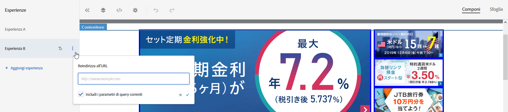

# Reindirizzamento a un URL

Utilizzate l&#39;opzione [!UICONTROL Reindirizza a URL] in [!DNL Adobe Target] per inviare il visitatore a una pagina diversa invece di mostrare il contenuto sulla stessa pagina.

Supponi di dover sottoporre a test due pagine completamente diverse, anziché semplici contenuti all&#39;interno di una pagina. In questo caso, il test A/B confronta la pagina A con la pagina B. Configura una campagna di test A/B con due esperienze: una che punta alla pagina predefinita A e l&#39;altra con reindirizza alla pagina B. Nel menu Azione esperienza, che si trova facendo clic sull&#39;etichetta della lettera dell&#39;esperienza, scegli **[!UICONTROL Reindirizza a URL]** e specifica l&#39;URL della pagina B. L&#39;offerta viene configurata per reindirizzare il visitatore a una pagina diversa.

Nell&#39;offerta di reindirizzamento viene eseguito il codice JavaScript per reindirizzare il browser. Tale codice utilizza il metodo `window.location.replace();`, in modo tale che la pagina a cui il visitatore è reindirizzato non venga memorizzata nella cronologia del browser. Questo consente al visitatore di utilizzare il pulsante “Indietro” nel browser.

Le offerte di reindirizzamento implicano alcune limitazioni:

* Per le offerte di reindirizzamento nelle attività che utilizzano A4T, l&#39;implementazione deve soddisfare determinati requisiti minimi. Inoltre, è necessario conoscere alcune informazioni importanti. Per ulteriori informazioni, consulta [Offerte di reindirizzamento - Domande frequenti su A4T](/help/c-integrating-target-with-mac/a4t/r-a4t-faq/a4t-faq-redirect-offers.md#concept_21BF213F10E1414A9DCD4A98AF207905).
* Quando si utilizza il Compositore esperienza basato su moduli, le offerte di reindirizzamento non devono essere utilizzate su elementi mbox che fanno parte della pagina. Un&#39;offerta di reindirizzamento deve essere utilizzata solo a partire da un tag script che fa parte del codice HTML `<head>`. Dovresti sempre utilizzare la funzione di creazione automatica e impostare l&#39;offerta di reindirizzamento per l&#39;elemento mbox globale.

>[!NOTE]
>
>Per trasmettere il valore referente della pagina di destinazione, è consigliabile utilizzare un’offerta HTML anziché un’offerta di reindirizzamento.

Per creare un&#39;offerta di reindirizzamento:

1. Crea un&#39;esperienza.
1. Posiziona il puntatore del mouse su un&#39;esperienza con il cursore, quindi fai clic sull&#39;icona Reindirizza all&#39;URL ().

   

1. Digita l’URL.
1. Se desiderato, seleziona l&#39;opzione per includere i parametri di query correnti.

   Se questa opzione è selezionata, tutto ciò che segue il carattere ? nell&#39;URL del visitatore viene aggiunto in coda all&#39;URL di reindirizzamento al momento del reindirizzamento.

   Questa opzione è selezionata per impostazione predefinita.
1. (Facoltativo) Crea regole aggiuntive.

   Le regole aggiuntive possono essere basate su uno dei seguenti elementi:

   * URL
   * Dominio
   * Percorso
   * Frammento hash (#)
   * Query
   * Parametro mbox
   È possibile aggiungere altre regole all’URL attività mediante l’operatore E oppure O. Tutte le regole aggiunte vengono valutate tra loro con E.
