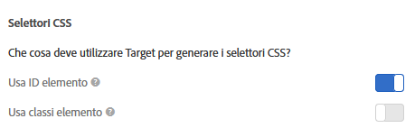

# Selettori di elementi utilizzati nel Compositore esperienza visivo

Un selettore di elementi è un’espressione CSS che può identificare uno o più elementi.

Puoi trovare informazioni di base sui selettori CSS nel documento sui [selettori](https://developer.mozilla.org/en-US/docs/Web/Guide/CSS/Getting_started/Selectors) in Mozilla Developer Network (MDN).

Puoi specificare se utilizzare l’ID o la classe degli elementi nelle preferenze dell’account. Fate clic su **[!UICONTROL Amministrazione > Visual Experience Composer (Compositore esperienza visivo)]**, quindi scegliete i selettori CSS preferiti.



>[!NOTE]
>
>Le classi di elementi sono disponibili come selettori nelle attività per test A/B, Personalizzazione automatizzata e test multivariati.

Per informazioni su quando utilizzare selettori CSS e quando utilizzare ID univoci, consulta [Best practice e limitazioni del Compositore esperienza visivo](/help/c-experiences/c-visual-experience-composer/experience-composer-best-practices.md#concept_E284B3F704C04406B174D9050A2528A6).

## Come Adobe Target genera un selettore per un elemento {#section_D89D954BCBFB486CA081BE183776A475}

Target utilizza un semplice algoritmo per creare un selettore. Ecco una brevissima spiegazione della logica di generazione:

1. Se un elemento ha un ID, ad esempio `id="container"`, allora il selettore per l’elemento è `#container`.

   Ad esempio:

   ```html
   <div class="wrapper">
     <div id="container"> <!-- Selector is computed for this element -->
       <ul class="navigation">
         <li class="item active"> Home </li>
         <li class="item"> Men </li>
         <li class="item"> Women </li>
         <li class="item"> Kids </li>
       </ul>
     </div>
   </div>
   ```

1. Se un elemento contiene un attributo di classe, Target tenta di sfruttare la prima classe di qualsiasi classe presente nell’elemento.

   Target tenta di analizzare l’elemento padre fino a quando non trova l’elemento `<HTML>` o un elemento con un ID. Ogni volta che un elemento contiene un ID e il selettore viene calcolato sul suo discendente, l’ID di questo elemento contribuisce al selettore.

   Ad esempio:

   ```html
   <div class="wrapper">
     <div id="container"> <!-- id is present here. It contributes to selector -->
       <ul class="navigation">
         <li class="item active"> Home </li> <!-- Selector is computed for this element -->
         <li class="item"> Men </li>
         <li class="item"> Women </li>
         <li class="item"> Kids </li>
       </ul>
     </div>
   </div>
   ```

   In questo esempio:

   Selettore: `#container` > `ul.navigation:eq(0)` > `li.item:eq(0)` (“ > ” indica l’elemento figlio diretto).

   `eq` comunica all’indice che c’è un elemento con &quot;tagName=UL&quot; e che la prima classe è `navigation`. Pertanto, l’`index` è 0. Per ulteriori informazioni, leggi l’articolo sui [selettori](https://developer.mozilla.org/en-US/docs/Web/Guide/CSS/Getting_started/Selectors) in MDN.

1. Se un elemento non contiene una classe, Target utilizza `tagName` per l’elemento ed analizza l’elemento padre fino a quando non viene trovato l’elemento `<HTML>` o un elemento con un ID.

   Ad esempio:

   ```html
   <div class="wrapper">
     <div id="container"> <!-- id is present here. It contributes to selector -->
       <ul class="navigation">
         <li> Home </li>
         <li> Men </li>
         <li class="active"> Women </li>
         <li> Kids </li><!-- Selector is computed for this element -->
       </ul>
     </div>
   </div>
   ```

   Selettore: `#container` > `ul.navigation(0)` > `li:nth-of-type(4)`

   Puoi scoprire di più su [nth-of-type nella pagina web dei trucchi per CSS](https://css-tricks.com/almanac/selectors/n/nth-of-type/).

Nel processo sopra indicato:

* È possibile utilizzare qualsiasi selettore CSS purché identifichi in modo univoco un elemento nel DOM.
* L’approccio sopra indicato è quello utilizzato da Target. Target non impone di utilizzare questo approccio. È possibile aggiungere qualsiasi selettore purché il punto #1 sia rispettato.
* È possibile utilizzare qualsiasi attributo nel selettore. Questo documento utilizza solo il nome della classe come esempio.

