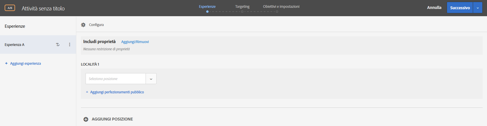
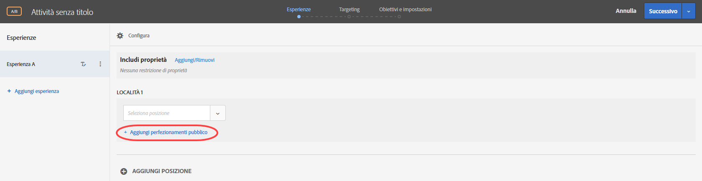
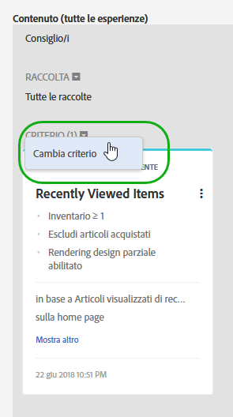
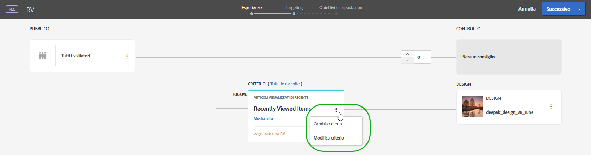

# Compositore esperienza basato su moduli

Il [!DNL Adobe Target] [!UICONTROL Compositore esperienza basato su moduli] è un’interfaccia non visiva per la creazione di esperienze e offerte, utile per creare esperienze da utilizzare in test A/B, targeting delle esperienze, Automated Personalization e attività Recommendations quando il compositore esperienza visivo non è disponibile o se non risulta pratico. Ad esempio, puoi utilizzare il compositore basato su moduli per creare esperienze e offerte da distribuire tramite e-mail, chioschi e assistenti vocali.

Se stai creando un’attività di consigli, non ci sono esperienze. Scegli i test di verifica e progettazione. Se scegli più criteri o progettazioni, Target genera automaticamente le esperienze.

1. Fai clic su **[!UICONTROL Crea attività]**, quindi seleziona il tipo di attività che desideri creare.

   Il Compositore esperienza basato su moduli è disponibile per test A/B, targeting di esperienza, personalizzazione automatizzata e attività di consigli.
1. Seleziona **[!UICONTROL Compositore esperienza basato su moduli]** dalla finestra di dialogo [!UICONTROL Crea attività] .

1. (Condizionale) Scegli un’area di lavoro e una proprietà.

1. Fai clic su **[!UICONTROL Successivo]**.

   Si apre il Compositore esperienza basato su moduli.

   

   La schermata è diversa se si sta creando un’attività di consigli. Le attività di consigli non includono esperienze.
1. Assegna un nome all&#39;attività facendo clic su &quot;[!UICONTROL Attività senza titolo]&quot;.
1. Seleziona una posizione.

   Quando si fa clic nella casella [!UICONTROL Seleziona posizione], viene visualizzato un elenco delle posizioni disponibili. Seleziona una di queste posizioni. Per scegliere la posizione globale fornita tramite target.js, seleziona “target-global-mbox”.

   È inoltre possibile immettere una posizione non elencata. Tale opzione può essere utile se la mbox non è ancora stata creata o visualizzata su una pagina. Digita il nome della posizione. Presta attenzione quando inserisci una posizione che non esiste ancora. Se l&#39;ortografia o l’uso di maiuscole/minuscole non corrisponde quando viene effettuata la chiamata mbox, l’attività non verrà consegnata. Le posizioni inserite manualmente vengono salvate nell’elenco delle posizioni disponibili. La prossima volta che tenti di selezionare una posizione immessa manualmente, questa sarà disponibile dall&#39;elenco a discesa [!UICONTROL Seleziona posizione] per tale attività.

   >[!NOTE]
   >
   >La creazione di una posizione immessa manualmente durante la creazione dell’attività non crea automaticamente una nuova posizione. Il nome della posizione viene salvato solo nel contesto dell’attività . La posizione viene creata quando è presente una chiamata di consegna del contenuto. In seguito alla creazione della posizione, questa sarà disponibile per l’utilizzo in altre attività, per la creazione di tipi di pubblico, ecc. dall’elenco a discesa delle posizioni disponibili.

1. Fai clic su **[!UICONTROL Aggiungi perfezionamenti pubblico]**, quindi scegli uno o più tipi di [pubblico](/help/c-target/target.md#concept_A782F8481A5041EBA75103CB26376522) per questa attività.

   

   Nel Compositore esperienza basato su moduli, i Perfezionamenti sono stati sostituiti da funzionalità di pubblico complete. I perfezionamenti per le attività esistenti sono stati trasferiti ai tipi di [pubblico per sola attività](/help/c-target/creating-activity-only-audience.md#concept_A6BADCF530ED4AE1852E677FEBE68483).
1. Seleziona il tipo di contenuto da visualizzare in tale posizione.

   

1. Specifica il contenuto per il tipo selezionato.

   **Modifica offerta HTML:** scegli un’offerta HTML.

   **Modifica Offerte immagine:** scegli un’immagine salvata nella libreria di contenuti di Target.

   È inoltre possibile aggiungere un collegamento a un&#39;immagine (click-through, destinazione e così via.)

   1. Fai clic su [!UICONTROL Cambia offerta immagine].
   1. Seleziona l&#39;immagine desiderata, quindi fai clic su [!UICONTROL Modifica collegamenti].
   1. Specifica l&#39;URL o la pagina desiderata nel sito, quindi fai clic su [!UICONTROL Aggiorna].

   **Modifica offerta JSON:** scegli un’offerta JSON.

   **Modifica frammento esperienza:** scegli un frammento esperienza.

   **Modifica offerta di reindirizzamento:** scegli un’offerta di reindirizzamento. Per ulteriori informazioni, consulta [Creare offerte di reindirizzamento](/help/c-experiences/c-manage-content/offer-redirect.md).

   **Modifica offerta remota:** scegli un’offerta remota. Per ulteriori informazioni, consulta [Creare offerte remote](/help/c-experiences/c-manage-content/about-remote-offers.md).

   **Crea offerta HTML:**

   1. Fai clic su [!UICONTROL Offerte], quindi seleziona la scheda [!UICONTROL Offerte di codice].
   1. Fai clic su [!UICONTROL Crea] > [!UICONTROL Offerta HTML].
   1. Digita un nome per l’offerta.
   1. Digita o incolla il codice HTML nella casella Codice.
   1. Fai clic su [!UICONTROL Salva].

   **Crea offerta JSON:**

   1. Fai clic su [!UICONTROL Offerte], quindi seleziona la scheda [!UICONTROL Offerte di codice].
   1. Fai clic su [!UICONTROL Crea] > [!UICONTROL Offerta JSON].
   1. Digita un nome per l’offerta.
   1. Digita o incolla il codice JSON nella casella Codice.
   1. Fai clic su [!UICONTROL Salva].

   Per un&#39;attività Consigli, l&#39;elenco a discesa del contenuto fornisce l&#39;opzione Aggiungi consiglio. Fai clic su **[!UICONTROL Aggiungi consiglio]**, quindi seleziona il tipo di pagina. Quindi segui i passi consueti descritti per [creare un’attività di consigli](/help/c-recommendations/t-create-recs-activity/create-recs-activity.md).

   Durante la selezione dei criteri di consigli nel compositore esperienza basato su moduli, è ora disponibile un collegamento diretto alla scheda dei criteri selezionati per poter modificare in modo semplice e veloce i criteri.

   

   Dalla pagina di targeting del workflow guidato in tre fasi di Target:

   

1. (Facoltativo, per attività AB, Automated Personalization e Targeting esperienza) Per ripetere questo processo per posizioni aggiuntive, fai clic su **[!UICONTROL Aggiungi posizione]** e configura la posizione e il contenuto.
1. Fai clic su **[!UICONTROL Avanti]**, quindi completa i passaggi di creazione dell&#39;attività come di consueto per il tipo di attività.

* [Creare un test A/B](/help/c-activities/t-test-ab/t-test-create-ab/test-create-ab.md)
* [Creare un’attività Targeting delle esperienze](/help/c-activities/t-experience-target/t-xt-create/xt-create.md#task_D6B3429AC31549E1A70EDF04B3DDC765)
* [Creare un’attività Consigli](/help/c-recommendations/t-create-recs-activity/create-recs-activity.md#task_6874328773C64C44A73F0A130AD3F96F)

## Video di formazione: Compositore basato su modulo  

Questo video fornisce una demo del Compositore esperienza basato su moduli.

* Creare un’attività utilizzando il Compositore esperienza basato su moduli
* Quando utilizzare il Compositore esperienza basato su moduli o il Compositore esperienza visivo
* Indirizzare una posizione con i perfezionamenti

>[!VIDEO](https://video.tv.adobe.com/v/17390)
