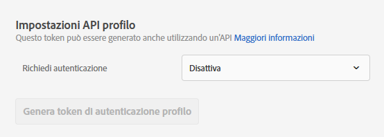
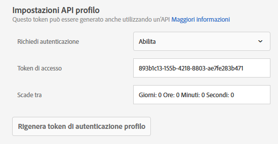

# Impostazioni API del profilo

Abilitare o disabilitare l&#39;autenticazione per gli aggiornamenti batch tramite  API Adobe Target e generare un token di autenticazione del profilo.

[!DNL Adobe Target] crea e conserva un profilo per ogni singolo utente. This profile is stored on the [!DNL Target] edge cluster and is updated in real time after every visit; however, you can update a profile individually or in bulk via API.

Per una maggiore sicurezza, puoi scegliere che l’intestazione della richiesta di aggiornamento collettivo dell’API debba contenere un token di accesso valido.

**Per richiedere l’autenticazione e generare un token di accesso utilizzando l’interfaccia utente di Target:**

1. Fate clic su **[!UICONTROL Amministrazione]** > **[!UICONTROL Implementazione]**.
1. In API **** profilo (Profile API **[!UICONTROL ) fate scorrere l’opzione]** Richiedi autenticazioneper passare alla posizione abilitata o disabilitata.

   

1. (Conditional) If you enabled authentication requirements, click **[!UICONTROL Generate New Profile Authentication Token]**.

   

   La scadenza del token è indicata nella casella [!UICONTROL Scade tra].

   Per generare un token di autenticazione è necessario disporre di una delle seguenti autorizzazioni utente:

   * Almeno l&#39;autorizzazione [!UICONTROL Editor] (o [!UICONTROL Approver])

      Per ulteriori informazioni per [!DNL Target Standard] i clienti, consultate [Specificare ruoli e autorizzazioni](/help/administrating-target/c-user-management/c-user-management/user-management.md#roles-permissions) in *Utenti*. Per ulteriori informazioni per [!DNL Target Premium] i clienti, consultate [Configurare le autorizzazioni](/help/administrating-target/c-user-management/property-channel/properties-overview.md)enterprise.

   * Ruolo amministratore nell’area di lavoro/a livello di profilo di prodotto

      Le aree di lavoro sono disponibili solo per [!DNL Target Premium] i clienti. For more information, see [Configure enterprise permissions](/help/administrating-target/c-user-management/property-channel/properties-overview.md).

   * Diritti di amministratore (autorizzazione Sysadmin) a livello di [!DNL Adobe Target] prodotto
   >[!NOTE]
   >
   >Puoi anche generare un token di autenticazione profilo tramite API. Per ulteriori informazioni, vedi [Profili](https://developers.adobetarget.com/api/#profiles) sul [sito web per sviluppatori di Adobe Target](https://developers.adobetarget.com/).

1. Copia il token e includilo nell’intestazione della richiesta nel formato: &quot;Authorization&quot; : &quot;Bearer&quot;.

Click [!UICONTROL Generate New Profile Authentication Token] to regenerate the token as needed.

>[!IMPORTANT]
>
>Se si reimposta il token, le chiamate API che utilizzano il token attuale non riusciranno. Sarà necessario aggiornare tutti gli script o le applicazioni che utilizzano tale token.
