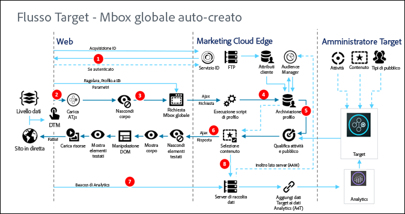

# Funzionamento di at.js{#how-at-js-works}

Per implementare [!DNL Adobe Target] lato client, è necessario utilizzare la libreria at. js.

In un&#39;implementazione lato client di [!DNL Adobe Target], [!DNL Target] distribuisce le esperienze associate a un&#39;attività direttamente al browser client. Il browser determina quale esperienza visualizzare e visualizzarla. Con un&#39;implementazione sul lato client, potete utilizzare un editor WYSIWYG, [Visual Experience Composer (Compositore](/help/c-experiences/c-visual-experience-composer/visual-experience-composer.md) esperienza visivo) o un&#39;interfaccia non visiva, il [Composer](/help/c-experiences/form-experience-composer.md)esperienza basato su modulo, per creare esperienze di test e personalizzazione.

## Che cos&#39;è at. js?

la [libreria at.js](/help/c-implementing-target/c-implementing-target-for-client-side-web/t-mbox-download/c-target-atjs-implementation/target-atjs-implementation.md#concept_8AC8D169E02944B1A547A0CAD97EAC17) è la nuova libreria di implementazione per Target. La libreria at.js migliora i tempi di caricamento delle pagine per le implementazioni Web e fornisce migliori opzioni di implementazione per le applicazioni a pagina singola. at.js è la libreria di implementazione consigliata e viene aggiornata frequentemente con nuove funzionalità. Si consiglia a tutti i clienti di implementare o eseguire la migrazione alla  [versione più recente di at.js](/help/c-implementing-target/c-implementing-target-for-client-side-web/target-atjs-versions.md#reference_DBB5EDB79EC44E558F9E08D4774A0F7A).

Per ulteriori informazioni, consultate [Librerie javascript di Target](/help/c-intro/how-target-works.md#libraries).

Nell’implementazione di [!DNL Target] illustrata di seguito sono implementate le seguenti soluzioni di [!DNL Adobe Experience Cloud]: Analytics, Target e Audience Manager. Inoltre, sono implementati i seguenti servizi principali di Experience Cloud: Adobe Launch, Audiences e Servizio ID visitatore.

## Qual è la differenza tra at.js 1.*x* e at. js 2. x di flusso di lavoro?

Per [ulteriori informazioni sulle differenze](/help/c-implementing-target/c-implementing-target-for-client-side-web/upgrading-from-atjs-1x-to-atjs-20.md) introdotte nel 2. O da 1, consultate Aggiornamento da. js 1. x a. js 2. x.*x*.

Da un punto di vista avanzato, esistono alcune differenze tra le due versioni:

* at. js 2. x non ha un concetto di richiesta mbox globale, ma piuttosto una richiesta di caricamento di pagina. Una richiesta di caricamento della pagina si può intendere come una richiesta per recuperare il contenuto da applicare al caricamento iniziale della pagina del sito web.
* at. js 2. x gestisce i concetti di visualizzazioni che vengono utilizzati per le applicazioni singole (SPAS). In at.js 1.*x* questo concetto non è disponibile.

## Diagrammi at.js 2.x

I seguenti diagrammi ti aiutano a capire il flusso di lavoro di at. js 2. x con Visualizzazioni e il modo in cui questo migliora l&#39;integrazione con SPA. Per una migliore introduzione dei concetti utilizzati in at. js 2. x, consultate [Implementazione delle applicazioni per pagina singola](/help/c-implementing-target/c-implementing-target-for-client-side-web/how-to-deployatjs/target-atjs-single-page-application.md).

| Passaggio | Dettagli |
| --- | --- |
| 1 | La chiamata restituisce l&#39;[!DNL Experience Cloud ID] se l’utente è autenticato; un’altra chiamata sincronizza l’ID cliente. |
| 2 | La libreria at.js viene caricata in modo sincrono e nasconde il corpo del documento. at.js si carica anche in modo asincrono con un&#39;opzione che nasconde lo snippet implementato sulla pagina. |
| 3 | Si effettua una richiesta di caricamento della pagina, con tutti i parametri configurati (MCID, SDID e ID cliente). |
| 4 | Gli script di profilo vengono eseguiti e quindi inseriti nell’archivio profili. L’archivio richiede un pubblico idoneo dalla libreria Pubblico (ad esempio, pubblico condiviso da Adobe Analytics, Audience Manager, ecc.). Gli attributi del cliente vengono inviati all’archivio profili in un processo batch. |
| 5 | In base ai parametri di richiesta dell&#39;URL e ai dati di profilo, [!DNL Target] determina le attività ed esperienze da restituire al visitatore per la pagina corrente e le viste future. |
| 6 | Il contenuto di destinazione viene rinviato alla pagina, includendo facoltativamente i valori di profilo per ulteriore personalizzazione. Il contenuto mirato sulla pagina corrente viene mostrato il più rapidamente possibile senza che venga visualizzato momentaneamente il contenuto predefinito. Contenuto mirato per le viste mostrate come risultato delle azioni dell&#39;utente in un’applicazione a pagina singola memorizzata nella cache del browser, in modo da applicarla immediatamente senza una chiamata al server aggiuntiva quando si attivano le viste tramite `triggerView()`. |
| 7 | I dati Analytics vengono inviati ai server di raccolta dati. |
| 8 | I dati di Target vengono confrontati con i dati di Analytics tramite SDID ed elaborati nell’archivio dei rapporti di Analytics. I dati di Analytics possono quindi essere visualizzati sia in Analytics che in Target tramite i rapporti Analytics for Target (A4T). |

Ora, ovunque si implementi `triggerView()` nell’applicazione a pagina singola, le visualizzazioni e le azioni vengono recuperate dalla cache e mostrate all’utente senza una chiamata al server. `triggerView()` invia anche una richiesta di notifica al backend [!DNL Target] per incrementare e registrare i conteggi delle impression. Per ulteriori informazioni su at.js per applicazioni a pagina singola con viste, consulta [Implementazione di un’applicazione a pagina singola](/help/c-implementing-target/c-implementing-target-for-client-side-web/how-to-deployatjs/target-atjs-single-page-application.md).

| Passaggio | Dettagli |
| --- | --- |
| 1 | Si richiama `triggerView()` nell’applicazione a pagina singola per eseguire il rendering della visualizzazione e applicare azioni per modificare gli elementi visuali. |
| 2 | Il contenuto mirato per la visualizzazione viene letto dalla cache. |
| 3 | Il contenuto mirato viene mostrato il più rapidamente possibile senza che venga visualizzato momentaneamente il contenuto predefinito. |
| 4 | Si invia la richiesta di notifica all&#39;archivio profili di [!DNL Target] per conteggiare il visitatore nell&#39;attività e nelle metriche incrementali. |
| 5 | Dati di Analytics inviati ai server di raccolta dati. |
| 6 | I dati di Target vengono confrontati con i dati di Analytics tramite SDID e vengono elaborati nell’archivio dei rapporti di Analytics. È quindi possibile visualizzare i dati di Analytics sia in Analytics che in Target tramite i rapporti A4T. |

## Diagramma di at.js 1.x

| Passaggio | Descrizione | Chiamata | Descrizione |
|--- |--- |--- |--- |
| 1 | La chiamata restituisce l’[!DNL Experience Cloud ID] (MCID) se l’utente è autenticato; un’altra chiamata sincronizza l’ID cliente. | 2 | La libreria at.js viene caricata in modo sincrono e nasconde il corpo del documento. |
| 3 | Viene effettuata una richiesta mbox globale, con tutti i parametri configurati, MCID, SDID e ID cliente (facoltativo). | 4 | Gli script di profilo vengono eseguiti e quindi inseriti nell’archivio profili. L’archivio richiede tipi di pubblico idonei dalla [!UICONTROL libreria Pubblico] (ad esempio, audience condivisi da [!DNL Adobe Analytics], [!DNL Audience Manager], ecc.). Gli attributi del cliente vengono inviati al [!DNL Profile Store] in un processo batch. |
| 5 | In base all’URL, ai parametri mbox e ai dati di profilo, [!DNL Target] decide quali attività ed esperienze restituire al visitatore. | 6 | Il contenuto di destinazione viene rinviato alla pagina, includendo facoltativamente i valori di profilo per ulteriore personalizzazione. L’esperienza viene mostrata il più rapidamente possibile senza che venga visualizzato momentaneamente il contenuto predefinito. |
| 7 | I dati [!DNL Analytics] vengono inviati ai server di raccolta dati. | 8 | I dati di [!DNL Target] vengono confrontati con i dati di [!DNL Analytics] tramite SDID e vengono elaborati nell’archivio dei rapporti di [!DNL Analytics]. I dati di [!DNL Analytics] possono quindi essere visualizzati sia in [!DNL Analytics] che in [!DNL Target] tramite i rapporti [!DNL Analytics for Target] (A4T). |

## Video formazione: diagramma architettonico. js 2. x

at. js 2. x ottimizza il supporto di Adobe Target per gli spas e si integra con altre soluzioni Experience Cloud. Questo video spiega come sono stati uniti questi elementi.

>[!VIDEO](https://video.tv.adobe.com/v/26250)

Consultate [in che modo at. js 2. x funziona](https://helpx.adobe.com/target/kt/using/atjs20-diagram-technical-video-understand.html) per ulteriori informazioni.