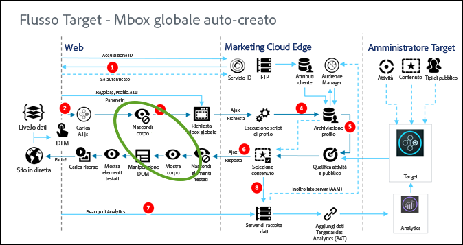

# Gestione at.js della visualizzazione momentanea di altri contenuti{#how-at-js-manages-flicker}

Informazioni su come la libreria JavaScript at.js di Target impedisce la visualizzazione momentanea di altri contenuti durante il caricamento della pagina o dell’app.

La visualizzazione momentanea di altri contenuti si verifica quando il contenuto predefinito viene momentaneamente visualizzato ai visitatori prima che venga sostituito dal contenuto dell’attività. Tale visualizzazione momentanea è da evitare perché può confondere i visitatori.

## Utilizzo di una mbox globale creata automaticamente {#section_C502170D551C4F52AAFD8E82C41BB63A}

Se abiliti l’impostazione [Creazione automatica di una mbox globale](/help/c-implementing-target/c-implementing-target-for-client-side-web/t-mbox-download/c-understanding-global-mbox/understanding-global-mbox.md#concept_76AC0EC995A048238F3220F53773DB13) quando configuri at.js, at.js gestisce la visualizzazione momentanea di altri contenuti modificando l’impostazione di opacità durante il caricamento della pagina. Quando si carica, at.js cambia l’impostazione di opacità dell’elemento `<body>` Su “0”, rendendo la pagina inizialmente invisibile ai visitatori. Dopo aver ricevuto una risposta da Target, o se viene rilevato un errore con la richiesta di Target, at.js reimposta l&#39;opacità su 1. In questo modo il visitatore vede la pagina solo dopo l&#39;applicazione del contenuto delle attività.

Se si abilita l&#39;impostazione, quando si configura at.js, at.js imposta l&#39;elemento HTML “BODY” con un valore di opacità pari a 0. Dopo aver ricevuto una risposta da Target, at.js reimposta su 1 l&#39;opacità dell&#39;elemento HTML “BODY”.

L&#39;opzione opacità impostata su 0 mantiene il contenuto della pagina nascosto per impedire la visualizzazione momentanea di altri contenuti, ma il browser esegue ancora il rendering della pagina e carica tutte le risorse necessarie come CSS, immagini e così via.

Se l&#39;opacità 0 non funziona nell&#39;implementazione, puoi anche gestire la visualizzazione momentanea di altri contenuti personalizzando `bodyHiddenStyle` e impostarlo su `body {visibility:hidden !important}`. You can use either value body `{opacity:0 !important}` or `body {visibility:hidden !important}`, whichever works best for your specific circumstance.

La figura seguente mostra le chiamate per Nascondi corpo e Mostra corpo, sia in at.js 1.*x* che in at.js 2.x.

**at.js 2.x**


**at.js 1.*x***



Per ulteriori informazioni sull’override di `bodyHiddenStyle`, consulta [targetGlobalSettings()](/help/c-implementing-target/c-implementing-target-for-client-side-web/targetgobalsettings.md).

## Gestione della visualizzazione momentanea di altri contenuti durante il caricamento di at.js in modo asincrono

Caricare at.js in modo asincrono è un ottimo modo per evitare di bloccare il rendering del browser; tuttavia, questa tecnica può portare alla visualizzazione momentanea di altri contenuti della pagina web.

È possibile evitare questo fenomeno utilizzando uno snippet per nascondere le pagine che sarà visibile dopo che avrà personalizzato gli elementi HTML rilevanti [!DNL Target].

at.js può essere caricato in modo asincrono, direttamente incorporato nella pagina o tramite un gestore di tag ( Adobe Launch, Dynamic Tag Manager (DTM), ecc.).

Se at.js è incorporato nella pagina, lo snippet deve essere aggiunto prima di caricare at.js. Se caricate at.js tramite un gestore di tag, caricato anche in modo asincrono, dovete aggiungere lo snippet prima di caricare il gestore di tag. Se il gestore di tag viene caricato in modo sincrono, lo script potrebbe essere incluso nel gestore di tag prima di at.js.

Lo snippet di codice per nascondere le pagine è il seguente:

```
;(function(win, doc, style, timeout) {
  var STYLE_ID = 'at-body-style';

  function getParent() {
    return doc.getElementsByTagName('head')[0];
  }

  function addStyle(parent, id, def) {
    if (!parent) {
      return;
    }

    var style = doc.createElement('style');
    style.id = id;
    style.innerHTML = def;
    parent.appendChild(style);
  }

  function removeStyle(parent, id) {
    if (!parent) {
      return;
    }

    var style = doc.getElementById(id);

    if (!style) {
      return;
    }

    parent.removeChild(style);
  }

  addStyle(getParent(), STYLE_ID, style);
  setTimeout(function() {
    removeStyle(getParent(), STYLE_ID);
  }, timeout);
}(window, document, "body {opacity: 0 !important}", 3000));
```

Per impostazione predefinita, lo snippet nasconde l’intera sezione BODY nell’HTML. In alcuni casi, puoi voler nascondere alcuni elementi HTML e non l’intera pagina. Per farlo, puoi personalizzare il parametro di stile. Puoi sostituirlo con qualcosa che nasconde preventivamente solo particolari zone della pagina.

Ad esempio, se hai due aree identificate dagli ID container-1 e container-2, puoi sostituire lo stile come segue:

```
#container-1, #container-2 {opacity: 0 !important}
```

Anziché il valore predefinito:

```
body {opacity: 0 !important}
```

## Gestisci lo sfarfallio in at.js 2.x per triggerView()

Quando si utilizza `triggerView()` per visualizzare contenuti mirati nell’applicazione a pagina singola, la gestione della visualizzazione momentanea di altri contenuti è preconfigurata. Questo significa che non è necessario aggiungere la logica preliminare manualmente. Al contrario, at.js 2.x nasconde preventivamente la posizione in cui la visualizzazione deve essere mostrata prima di applicare il contenuto mirato.

## Gestire lo sfarfallio con getOffer() e applyOffer()

Poiché sia `getOffer()` che `applyOffer()` sono API di basso livello, non è incorporato alcun controllo sulla visualizzazione momentanea di altri contenuti. Puoi passare un selettore o un elemento HTML come opzione ad `applyOffer()`; in questo caso `applyOffer()` aggiunge il contenuto dell’attività a questo particolare elemento; tuttavia, è necessario assicurarsi che l’elemento sia correttamente nascosto prima di richiamare `getOffer()` e `applyOffer()`.

```
document.documentElement.style.opacity = "0";
 
adobe.target.getOffer({
    mbox: 'target-global-mbox',
    success: function(offer) {
        adobe.target.applyOffer({
            mbox: 'target-global-mbox',
            offer: offer
        });
 
        document.documentElement.style.opacity = "1";
    },
    error: function() {
        document.documentElement.style.opacity = "1";        
    }
});
```

## Utilizzo di una mbox regionale con mboxCreate() in at.js 1.x (non supportata in at.js 2.x)

Se utilizzi un’implementazione di mbox regionale, utilizza `mboxCreate()` con il provisioning della pagina configurato in modo simile al seguente codice di esempio:

```
<div class="mboxDefault">
Some default content
</div>
<script>
mboxCreate('some-mbox');
</script>
```

Se il provisioning delle tue pagine viene eseguito correttamente, at.js gestisce la visualizzazione momentanea di altri contenuti cambiando opportunamente la proprietà CSS “visibility” dell’elemento con la classe mboxDefault.