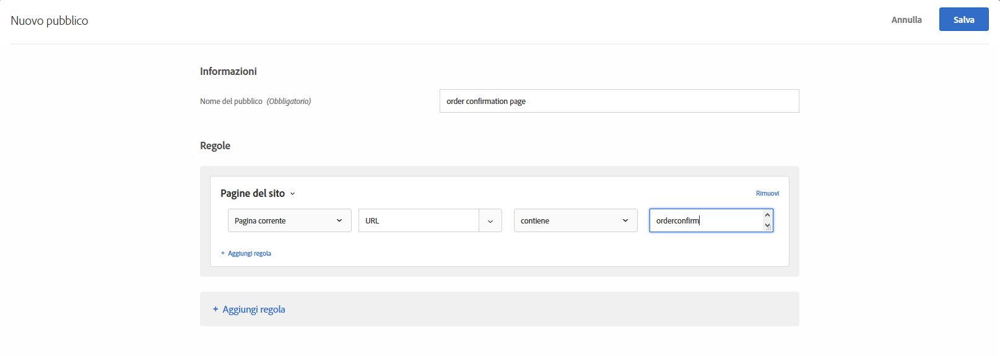

# Domande frequenti sulla mbox globale{#global-mbox-frequently-asked-questions}

Elenco delle domande frequenti sulle mbox globali.

## Posso avere più di una mbox globale se il mio account di Target è impostato su più domini? {#section_B7252BA6C3BB4EF4AE9E53F47FD58ABD}

L&#39;account supporta un&#39;unica mbox globale.

Puoi definire un limite per l&#39;esecuzione delle attività aggiungendo a queste delle regole URL. Per ulteriori informazioni, consulta [Includere la stessa esperienza in pagine simili](../../../c-experiences/c-visual-experience-composer/temtest.md#task_2539D51A18044F82B0D9895636546781).

Puoi anche trasmettere un parametro sulla pagina utilizzando [targetPageParams](/help/c-implementing-target/c-implementing-target-for-client-side-web/targetpageparams.md) e quindi selezionare tali parametri nella sezione &quot;Configura URL&quot; nel [!UICONTROL Compositore esperienza visivo] o aggiungendo i parametri come “perfezionamenti” nel Compositore esperienza basato su modulo.

## Come faccio a trasferire i dati dei ricavi a una mbox globale di Target? {#section_17AEA933BADA4D169CCEDF5833C41306}

Per raccogliere le informazioni su ricavi e ordini in target-global-mbox, è necessario inviare a Target i “parametri mbox”. Questi parametri sono coppie nome/valore utilizzate per inviare ulteriori informazioni a Target. In Target viene eseguita la ricerca automatica di tali parametri (nomi riservati) allo scopo di popolare i dati dei ricavi.

Per `orderConfirmPage`, è necessario trasmettere `orderTotal`, `orderId` e `productPurchasedId`. Per ulteriori informazioni, consulta [Creare una mbox di conferma d’ordine - mbox.js](../../../c-implementing-target/c-implementing-target-for-client-side-web/t-mbox-download/orderconfirm-create.md#task_0036D5F6C062442788BB55E872816D82).

Questi stessi parametri devono essere inviati a target-global-mbox tramite `targetPageParams()`. Per ulteriori informazioni, consulta [Trasmissione di parametri a una mbox globale](../../../c-implementing-target/c-implementing-target-for-client-side-web/t-mbox-download/c-understanding-global-mbox/pass-parameters-to-global-mbox.md#concept_33362A04146C4E3C8E7089B65F38B5E5).

Può essere utile aggiungere il targeting all’elemento di conversione, in modo che quando viene visualizzata la pagina di conferma vengano conteggiate in Target unicamente le conversioni su target-global-mbox, come mostrato di seguito:

Nella sezione Pagine del sito sopra illustrata sono incluse le seguenti selezioni: Pagina corrente, URL, contiene, orderconfirm.

Nelle opzioni dell’illustrazione precedente sono incluse le seguenti impostazioni:

* **Cosa desideri misurare con questa attività:** Ricavi.
* **Vista predefinita per rapporti:** Ricavo per visitatore (RPV).
* **Qual è l&#39;azione intrapresa dal pubblico per indicare che l&#39;obiettivo è stato raggiunto?** Visualizzazione di una Mbox, target-global-mbox