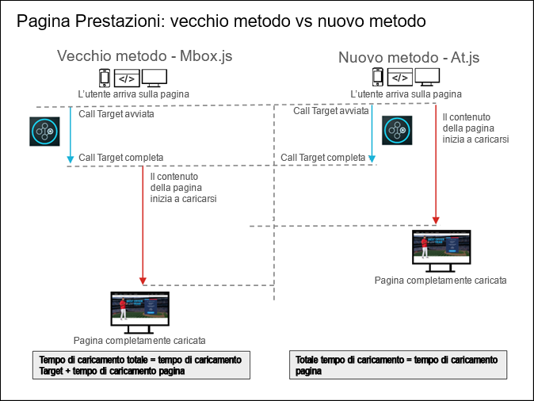

# Domande frequenti su at.js {#at-js-frequently-asked-questions}

Risposte alle domande più frequenti su at.js.

## Quali vantaggi offre at.js rispetto a mbox.js? {#section_FE30D01A577C46ACB0F787B85F5E0F6B}

Anche se [!DNL at.js] sostituisce [!DNL mbox.js], [!DNL mbox.js] continuerà a essere supportato. Tuttavia, per la maggior parte delle persone, [!DNL at.js] offre vantaggi rispetto a [!DNL mbox.js].

Ad esempio, [!DNL at.js] migliora i tempi di caricamento delle pagine per le implementazioni web, migliora la sicurezza e fornisce migliori opzioni di implementazione per le applicazioni a pagina singola.

Nella figura seguente vengono illustrate le prestazioni di caricamento delle pagine utilizzando mbox.js e at.js.



Come illustrato in precedenza, utilizzando mbox.js il contenuto della pagina inizia a caricarsi solo una volta completata la richiesta di [!DNL Target]. Utilizzando at.js, il contenuto della pagina comincia a caricarsi quando viene avviata la richiesta di [!DNL Target], senza attenderne il completamento.

## Qual è l’impatto di at.js e mbox.js sui tempi di caricamento delle pagine? {#page-load}

Molti clienti e consulenti vogliono conoscere l&#39;impatto di [!DNL at.js] e di [!DNL mbox.js] sul tempo di caricamento delle pagine, soprattutto nel contesto di nuovi utenti rispetto a utenti di ritorno. Purtroppo, è difficile misurare e offrire numeri concreti per quanto riguarda l&#39;influenza di [!DNL at.js] o [!DNL mbox.js] sul tempo di caricamento della pagina, a causa delle implementazioni del singolo cliente.

Tuttavia, se sulla pagina è presente l&#39;API dei visitatori, possiamo capire meglio in che modo [!DNL at.js] e [!DNL mbox.js] influenzano il tempo di caricamento delle pagine.

>[!NOTE]
>
>L’API dei visitatori e [!DNL at.js] o [!DNL mbox.js] hanno un impatto sul tempo di caricamento della pagina solo quando si utilizza la mbox globale (a causa della tecnica di celamento del corpo). Le mbox regionali non sono influenzate dall&#39;integrazione delle API dei visitatori.

Le sezioni seguenti illustrano la sequenza di azioni per i visitatori nuovi e per i visitatori di ritorno:

### Visitatori nuovi

1. L&#39;API dei visitatori viene caricata, analizzata ed eseguita.
1. at.js / mbox.js è caricato, analizzato ed eseguito.
1. Se la creazione automatica della mbox globale è abilitata, la libreria JavaScript di Target:

   * Crea un&#39;istanza dell&#39;oggetto Visitatore.
   * La libreria di Target cerca di recuperare i dati dell&#39;ID visitatore di Experience Cloud.
   * Poiché si tratta di un nuovo visitatore, l&#39;API dei visitatori genera una richiesta cross-domain a demdex.net.
   * Dopo il recupero dei dati dell&#39;ID visitatore di Experience Cloud, viene generata una richiesta a Target.

### Visitatori di ritorno

1. L&#39;API dei visitatori viene caricata, analizzata ed eseguita.
1. at.js / mbox.js è caricato, analizzato ed eseguito.
1. Se la creazione automatica della mbox globale è abilitata, la libreria JavaScript di Target:

   * Crea un&#39;istanza dell&#39;oggetto Visitatore.
   * La libreria di Target cerca di recuperare i dati dell&#39;ID visitatore di Experience Cloud.
   * L&#39;API dei visitatori recupera i dati dai cookie.
   * Dopo il recupero dei dati dell&#39;ID visitatore di Experience Cloud, viene generata una richiesta a Target.

>[!NOTE]
>
>Per i nuovi visitatori, quando è presente l&#39;API dei visitatori, Target deve connettersi più volte per assicurare che la richiesta includa i dati dell&#39;ID visitatore di Experience Cloud. Per i visitatori di ritorno, Target si connette solo per recuperare il contenuto personalizzato.

## Perché mi sembra di notare tempi di risposta più lenti dopo l’aggiornamento da una versione precedente di at.js alla versione 1.0.0? {#section_DFBA5854FFD142B49AD87BFAA09896B0}

[!DNL at.js] versione 1.0.0 o successiva attiva tutte le richieste in parallelo. Le versioni precedenti eseguono le richieste in modo sequenziale, ovvero le richieste formano una coda e Target le elabora a turno, aspettando il completamento della richiesta corrente.

Il modo in cui le versioni precedenti di [!DNL at.js] eseguono le richieste è suscettibile al cosiddetto blocco del primo elemento. In [!DNL at.js] 1.0.0 o versione successiva, l’esecuzione delle richieste in Target avviene in parallelo.

Se controlli la cascata delle schede di rete di [!DNL at.js] 0.9.1, ad esempio, vedrai che la successiva richiesta di Target si avvia solo dopo che la precedente è stata completata. Diverso è il caso con [!DNL at.js] 1.0.0 e versioni successive, dove tutte le richieste partono essenzialmente nello stesso momento.

Da una prospettiva di risposta-tempo, si può tradurre matematicamente così

<ul class="simplelist"> 
 <li> at.js 0.9.1: tempo di risposta di tutte le richieste di Target = somma del tempo di risposta delle singole richieste </li> 
 <li> at.js 1.0.0 e versioni successive: tempo di risposta di tutte le richieste di Target = tempo di risposta massimo delle richieste </li> 
</ul>

Come vedi, [!DNL at.js] 1.0.0 completa le richieste più velocemente. Inoltre, le richieste di [!DNL at.js] sono asincrone, pertanto Target non blocca il rendering della pagina. Anche se il completamento delle richieste impiega qualche secondo, visualizzerai comunque la pagina di cui è stato eseguito il rendering; solo alcune parti della pagina resteranno vuote finché Target non avrà ricevuto una risposta da Target Edge.

## È possibile caricare la libreria di Target in modo asincrono? {#section_AB9A0CA30C5440C693413F1455841470}

La release di at.js 1.0.0 permette di caricare la libreria di Target in modo asincrono.

Per caricare at.js in modo asincrono:

* L’approccio consigliato è tramite un gestore tag come Adobe Launch o Adobe Dynamic Tag Manager (DTM). See the [Add Adobe Target](https://docs.adobe.com/content/help/en/experience-cloud/implementing-in-websites-with-launch/implement-solutions/target.html) lesson of the [Implementing the Experience Cloud in Websites with Launch](https://docs.adobe.com/content/help/en/experience-cloud/implementing-in-websites-with-launch/index.html) tutorial for more information.
* Puoi anche caricare at.js in modo asincrono aggiungendo l’attributo async al tag script che carica at.js. Dovresti usare qualcosa del genere:

   ```
   <script src="<URL to at.js>" async></script>
   ```

* Puoi anche caricare at.js in modo asincrono utilizzando questo codice:

   ```
   var script = document.createElement('script'); 
   script.async = true; 
   script.src = "<URL to at.js>"; 
   document.head.appendChild(script);
   ```

Caricare at.js in modo asincrono è un ottimo modo per evitare di bloccare il rendering del browser; tuttavia, questa tecnica può portare alla visualizzazione momentanea di altri contenuti della pagina web.

Puoi evitare sfarfallii utilizzando uno snippet che nasconde preventivamente la pagina (o porzioni specificate), quindi la rivela dopo che at.js e la richiesta globale sono completamente caricate. Lo snippet deve essere aggiunto prima del caricamento di at.js.

If you are deploying at.js through an asynchronous Launch implementation, be sure to include the pre-hiding snippet directly on your pages, before the Launch Embed code, as described in the [Add the Target Pre-Hiding Snippet](https://docs.adobe.com/content/help/en/experience-cloud/implementing-in-websites-with-launch/implement-solutions/target.html#add-the-target-pre-hiding-snippet) section of the [Implementing the Experience Cloud in Websites with Launch tutorial](https://docs.adobe.com/content/help/en/experience-cloud/implementing-in-websites-with-launch/index.html).

Durante l’implementazione di at.js tramite un’implementazione sincrona di DTM, puoi aggiungere lo snippet tramite una regola di caricamento della pagina attivata nella parte superiore della pagina.

Per ulteriori informazioni, consulta [Gestione at.js della visualizzazione momentanea di altri contenuti](/help/c-implementing-target/c-implementing-target-for-client-side-web/c-how-atjs-works/manage-flicker-with-atjs.md).

## at.js è compatibile con l’integrazione Adobe Experience Manager (AEM)? {#section_6177AE10542344239753764C6165FDDC}

[!DNL Adobe Experience Manager] 6.2 con FP-11577 (o versioni successive) supporta ora le implementazioni di [!DNL at.js] con l’integrazione di [!UICONTROL Adobe Target Cloud Services]. Per ulteriori informazioni, consulta [Pacchetti di funzionalità](https://docs.adobe.com/docs/en/aem/6-2/release-notes/feature-packs.html) e [Integrazione con Adobe Target](https://docs.adobe.com/docs/en/aem/6-2/administer/integration/marketing-cloud/target.html) nella documentazione di *Adobe Experience Manager 6.2*.

## Come posso evitare la visualizzazione momentanea di altri contenuti al caricamento pagina, utilizzando at.js? {#section_4D78AAAE73C24E578C974743A3C65919}

Target consente di impedire la visualizzazione momentanea di altri contenuti al caricamento della pagina utilizzando uno dei seguenti metodi. Per ulteriori informazioni, consulta [Impedire la visualizzazione momentanea di altri contenuti con at.js](/help/c-implementing-target/c-implementing-target-for-client-side-web/c-how-atjs-works/manage-flicker-with-atjs.md#concept_AA168574397D4474B993EEAB90865EBA).

## Qual è la dimensione del file di at.js? {#section_6A25C9A14C66441785A7635FEF5C4475}

Il file di at.js che scarichi è approssimativamente 109 KB. Tuttavia, poiché la maggior parte dei server comprime automaticamente i file per renderli di dimensioni più piccole, at.js è circa 34 KB quando è compresso (utilizzando GZIP o un altro metodo) sul server e caricato dagli utenti che visitano il tuo sito. Le impostazioni di compressione sul server in cui è stato installato at.js determinano la dimensione effettiva.

## Perché at.js è più grande di mbox.js? {#section_AA1C43897E46448FA3E26EEC10ED7E51}

Le implementazioni di at.js utilizzano una sola libreria ([!DNL at.js]), mentre quelle di mbox.js usano due librerie ([!DNL mbox.js] e [!DNL target.js]). Quindi un confronto più equo è quello tra at.js e mbox.js *più* `target.js`. Confrontando le dimensioni compresse con GZIP delle due versioni, at.js versione 1.2 è di 34 KB e mbox.js versione 63 è di 26,2 KB. ``

at.js è più grande perché effettua molta più analisi DOM rispetto a mbox.js. Questo è necessario perché at.js ottiene dati “grezzi” dalla risposta JSON e deve interpretarli. mbox.js utilizza `document.write()` ed è il browser a eseguire tutta l’analisi.

Nonostante le dimensioni più grandi del file, i nostri test indicano che le pagine vengono caricate più velocemente con at.js rispetto a mbox.js. Inoltre, at.js è superiore dal punto di vista della sicurezza perché non carica file aggiuntivi in modo dinamico né utilizza `document.write`.

## at.js include jQuery? Posso rimuovere questa parte di at.js se sul mio sito ho già jQuery? {#section_E4604E46E7B34460B8DD6A78D9B476F9}

at.js attualmente utilizza parti di jQuery e quindi vedrai la notifica della licenza MIT nella parte superiore di at.js. jQuery non è esposto e non interferisce con la libreria jQuery che hai già sulla pagina, che potrebbe essere una versione diversa. La rimozione del codice jQuery all’interno di at.js non è supportata.

## at.js supporta Safari e l’attraversamento di più domini impostato su “solo x”?{#section_114EC271A6E045E1B2183B66F1B71285}

No, se l’attraversamento di più domini è impostato su “solo x” e Safari ha i cookie di terze parti disabilitati, allora sia [!DNL mbox.js] che at.js imposteranno un cookie disabilitato e non verranno eseguite richieste mbox per quel particolare dominio del client.

Per supportare i visitatori Safari, un dominio X migliore può essere “disabilitato” (viene impostato solo un cookie di prima parte) o “abilitato” (viene impostato solo un cookie di prima parte su Safari, e cookie di prima e di terze parti su altri browser).

## Posso eseguire in parallelo at.js e mbox.js? {#section_4DCAF38DBAEB430CA486FAEFAE0E0A29}

Non sulla stessa pagina. Tuttavia, durante l’implementazione e il testing di [!DNL at.js], puoi eseguire [!DNL at.js] su alcune pagine e [!DNL mbox.js] su altre fino a quando non avrai completamente convalidato [!DNL at.js].

## È possibile utilizzare il Compositore esperienza visivo di Target nelle applicazioni a pagina singola? {#section_459C1BEABD4B4A1AADA6CF4EC7A70DFB}

Sì, puoi utilizzare il Compositore esperienza visivo se utilizzi at.js 2.x. Per maggiori informazioni, consulta [Compositore esperienza visivo per applicazione a singola pagina (SPA)](/help/c-experiences/spa-visual-experience-composer.md).

## Posso utilizzare il debugger di Adobe Experience Cloud con le implementazioni di at.js? {#section_FF3CF4C5FD2F4DB1BF1A6B39DA161637}

Sì. È inoltre possibile utilizzare mboxTrace per il debug o gli Strumenti per sviluppatori del browser per controllare le richieste di rete, filtrando “mbox” per isolare le chiamate mbox.

## Posso usare caratteri speciali nei nomi delle mbox con at.js? {#section_8E31D2E8A27642098934D7DACFB2A600}

Sì, come con mbox.js.

## Perché le mie mbox non vengono lanciate sulle mie pagine web? {#section_4BA5DA424B734324AAB51E4588FA50F5}

I clienti di Target utilizzano talvolta istanze basate su cloud con [!DNL Target] per test o semplici prove di concetto. Questi domini, e molti altri, fanno parte dell’[elenco dei suffissi pubblici](https://publicsuffix.org/list/public_suffix_list.dat).

I browser moderni non salvano i cookie se si utilizzano questi domini, a meno che non si personalizzi l’impostazione `cookieDomain` utilizzando targetGlobalSettings(). Per ulteriori informazioni, consulta [Utilizzo di istanze basate su Cloud con Target](/help/c-implementing-target/c-implementing-target-for-client-side-web/c-target-debugging-atjs/targeting-using-cloud-based-instances.md#concept_A2077766948F4EA081CE592D8998F566).

## Gli indirizzi IP possono essere utilizzati come dominio dei cookie quando si utilizza at.js? {#section_8BEEC91A3410459D9E442840A3C88AF7}

Sì, se utilizzi [at.js versione 1.2 o successive](/help/c-implementing-target/c-implementing-target-for-client-side-web/target-atjs-versions.md#reference_DBB5EDB79EC44E558F9E08D4774A0F7A). Si consiglia comunque vivamente di utilizzare sempre l’ultima versione.

>[!NOTE]
>
>Gli esempi seguenti non sono necessari se si utilizza at.js versione 1.2 o successiva.

A seconda di come utilizzi [targetGlobalSettings](/help/c-implementing-target/c-implementing-target-for-client-side-web/targetgobalsettings.md), potrebbe essere necessario apportare ulteriori modifiche al codice dopo aver scaricato at.js. Ad esempio, se ti servivano impostazioni leggermente diverse per le tue implementazioni di [!DNL Target] su vari siti web e non hai potuto definirle in modo dinamico con JavaScript personalizzato, apporta tali personalizzazioni manualmente dopo aver scaricato il file e prima di caricarlo sul rispettivo sito web.

Gli esempi seguenti consentono di utilizzare la funzione di at.js `targetGlobalSettings()` per inserire uno snippet di codice per supportare gli indirizzi IP:

Esempio per un solo indirizzo IP:

```
if (window.location.hostname === '123.456.78.9') { 
    window.targetGlobalSettings = window.targetGlobalSettings || {}; 
    window.targetGlobalSettings.cookieDomain = window.location.hostname; 
}
```

Esempio per un intervallo di indirizzi IP:

```
if (/^123\.456\.78\..*/g.test(window.location.hostname)) { 
    window.targetGlobalSettings = window.targetGlobalSettings || {}; 
    window.targetGlobalSettings.cookieDomain = window.location.hostname; 
}
```

## Perché ricevo messaggi di avviso, ad esempio “azioni con selettori mancanti”? {#section_C36BED5B16634361A1BA46FCB731489D}

Questi messaggi non sono legati alla funzionalità [!DNL at.js]. La libreria [!DNL at.js] cerca di segnalare tutto ciò che non si trova nel DOM.

Di seguito sono riportate le possibili cause principali per questo messaggio di avviso:

* La pagina viene creata in modo dinamico e at.js non riesce a trovare l’elemento.
* La pagina viene creata lentamente (a causa di una rete lenta) e at.js non riesce a trovare il selettore nel DOM.
* La struttura di pagina su cui è in esecuzione l’attività è stata modificata. Se riapri l’attività nel Compositore esperienza visivo dovrebbe comparire un messaggio di avviso. È necessario aggiornare l’attività in modo che tutti gli elementi necessari possano essere trovati.
* La pagina sottostante fa parte di un’applicazione a pagina singola (Single Page Application, SPA) oppure la pagina contiene elementi che appaiono più in basso e il “meccanismo di polling selettivo” di [!DNL at.js] non riesce a trovarli. Può essere utile aumentare il valore di `selectorsPollingTimeout`. Per ulteriori informazioni, consulta [targetGlobalSettings()](/help/c-implementing-target/c-implementing-target-for-client-side-web/targetgobalsettings.md).
* Qualsiasi metrica di rilevamento dei clic tenta di aggiungersi a ogni pagina, indipendentemente dall’URL su cui è stata impostata la metrica. Anche se innocua, questa situazione fa apparire molti di questi messaggi.

   Per ottenere i migliori risultati, scarica e utilizza l’ultima versione di [!DNL at.js]. Per ulteriori informazioni, consulta [Dettagli della versione di at.js.](/help/c-implementing-target/c-implementing-target-for-client-side-web/target-atjs-versions.md#reference_DBB5EDB79EC44E558F9E08D4774A0F7A) e [Scaricare at.js](/help/c-implementing-target/c-implementing-target-for-client-side-web/how-to-deployatjs/implementing-target-without-a-tag-manager.md#concept_1E1F958F9CCC4E35AD97581EFAF659E2).

## Le chiamate server di Target sono indirizzate al dominio tt.omtrdc.net: di che si tratta? {#section_999C29940E8B4CAD8A957A6B1D440317}

[!DNL tt.omtrdc.net] è il nome di dominio della rete EDGE di Adobe, utilizzato per ricevere tutte le chiamate server per Target.

## Perché at.js e mbox.js non utilizzano i flag HttpOnly e Secure? {#section_74527E3B41B54B0A83F217C3E664ED1F}

HttpOnly può essere impostato solo tramite codice basato su server. I cookie Target, come mbox, vengono creati e salvati tramite il codice JavaScript, quindi Target non può utilizzare il flag di cookie HttpOnly.

È possibile impostare il flag Secure tramite JavaScript solo se la pagina è stata caricata tramite HTTPS. Se la pagina viene inizialmente caricata tramite HTTP, JavaScript non può impostare questo flag. Inoltre, se viene utilizzato il flag Secure, il cookie sarà disponibile solo nelle pagine HTTPS.

Per garantire che Target possa correttamente tenere traccia degli utenti e per far sì che i cookie vengano generati dal lato del cliente, Target non utilizza nessuno di questi flag.

## Con quale frequenza at.js attiva una richiesta di rete? {#section_57C5235DF7694AF093A845D73EABADFD}

Adobe Target esegue tutte le sue decisioni sul lato server. Ciò significa che at.js at.js genera una richiesta di rete ogni volta che la pagina si ricarica o viene richiamata un&#39;API pubblica di at.js.

## Nel migliore dei casi, possiamo aspettarci che l&#39;utente non verifichi effetti visibili sul caricamento della pagina dovuti al fatto che si nasconde, sostituisce e visualizza il contenuto? {#section_CB3C566AD61F417FAC0EC5AC706723EB}

at.js cerca di evitare di nascondere anticipatamente HTML BODY o altri elementi DOM per un periodo di tempo prolungato, ma ciò dipende dalle condizioni di rete e dalla configurazione dell&#39;attività. at.js offre [impostazioni](/help/c-implementing-target/c-implementing-target-for-client-side-web/targetgobalsettings.md) che è possibile utilizzare per personalizzare lo stile CSS per nascondere il BODY, in modo tale che invece di svuotare l’intero BODY HTML sia possibile nascondere anticipatamente solo alcune parti della pagina. L&#39;aspettativa è che quelle parti contengano elementi DOM che devono essere “personalizzati”.

## Qual è la sequenza di eventi in uno scenario medio in cui un utente si qualifica per un’attività? {#section_56E6F448E901403FB77DF02F44C44452}

La richiesta at.js è un `XMLHttpRequest` asincrono, quindi eseguiamo i seguenti passaggi:

1. La pagina viene caricata.
1. at.js nasconde anticipatamente il BODY HTML. È presente un&#39;impostazione per nascondere anticipatamente un particolare contenitore invece del BODY HTML.
1. La richiesta at.js viene attivata.
1. Dopo aver ricevuto la risposta di Target, Target estrae i selettori CSS.
1. Utilizzando i selettori CSS, Target crea tag STYLE per nascondere anticipatamente gli elementi DOM che saranno personalizzati.
1. Il BODY HTML che nasconde anticipatamente STYLE viene rimosso.
1. Target avvia il polling per gli elementi DOM.
1. Se viene trovato un elemento DOM, Target applica le modifiche DOM e l&#39;elemento che nasconde anticipatamente STYLE viene rimosso.
1. Se gli elementi DOM non vengono trovati, un timeout globale rivela gli elementi per evitare di avere una pagina interrotta.

## Quanto spesso il contenuto della pagina è completamente caricato e visibile quando at.js rivela infine l&#39;elemento che l&#39;attività sta modificando? {#section_01AFF476EFD046298A2E17FE3ED85075}

Considerando lo scenario precedente, quanto spesso il contenuto della pagina è completamente caricato e visibile quando at.js rivela infine l&#39;elemento che l&#39;attività sta modificando? In altre parole, la pagina è completamente visibile ad eccezione del contenuto dell&#39;attività, che viene poi rivelato leggermente dopo il resto del contenuto.

at.js non blocca il rendering della pagina. Un utente potrebbe notare alcune aree vuote nella pagina che rappresentano elementi che verranno personalizzati da Target. Se il contenuto da applicare non contiene molte risorse remote, come SCRIPT o IMG, il rendering dovrebbe essere eseguito rapidamente.

## In che modo una pagina interamente salvata nella cache influirà sullo scenario precedente? Sarebbe più probabile che il contenuto dell’attività diventi visibile notevolmente dopo il caricamento del resto del contenuto della pagina? {#section_CE76335A3E0B41CB8253DEE5E060FCDA}

Se una pagina viene salvata nella cache in una rete CDN vicina alla posizione dell&#39;utente, ma non vicina a Target Edge, l&#39;utente potrebbe vedere alcuni ritardi. I Target Edge sono ben distribuiti in tutto il mondo, quindi nella maggior parte dei casi questo non è un problema.

## È possibile che un’immagine protagonista venga visualizzata e poi scambiata dopo un breve ritardo? {#section_C25B07B25B854AAE8DEE1623D0FA62A3}

Considerando lo scenario seguente:

Il timeout di Target è di cinque secondi. Un utente carica una pagina che ha un&#39;attività per personalizzare un&#39;immagine protagonista. at.js invia la richiesta per determinare se c&#39;è un&#39;attività da applicare, ma non è presente una risposta iniziale. Supponiamo che l&#39;utente veda il contenuto regolare dell&#39;immagine protagonista, perché non è stata ricevuta alcuna risposta da Target sull&#39;esistenza di un&#39;attività associata. Dopo quattro secondi, Target restituisce una risposta con il contenuto dell&#39;attività.

A questo punto, è possibile che la versione alternativa venga mostrata? Perciò dopo quattro secondi, l&#39;immagine protagonista potrebbe essere scambiata e l&#39;utente potrebbe notare questo scambio di immagini?

Inizialmente, l&#39;elemento DOM dell’immagine protagonista è nascosto. Dopo aver ricevuto una risposta da Target, at.js applica le modifiche DOM, come la sostituzione dell&#39;IMG e la visualizzazione dell&#39;immagine protagonista personalizzata.

## Quale doctype HTML richiede at.js?

at.js richiede il doctype HTML5.

La sintassi è:

`<!DOCTYPE html>`

Il doctype HTML5 assicura che la pagina venga caricata in modalità standard. Durante il caricamento in modalità quirks, alcune API JS dalle quali dipende at.js sono disabilitate. Target disabilita at.js in modalità quirks.
