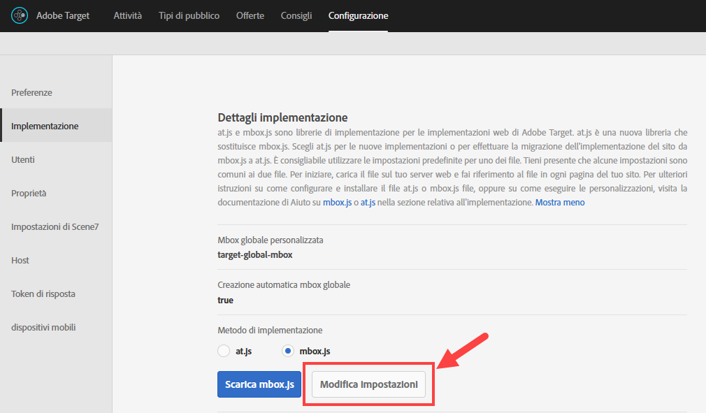
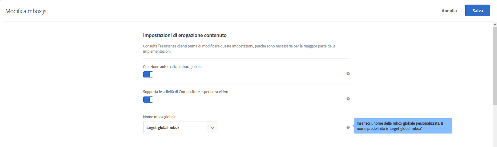
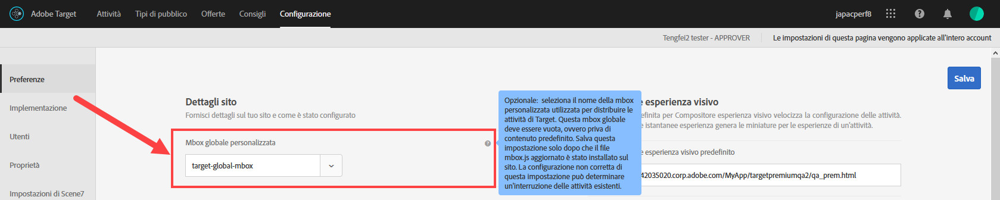

# Personalizzare una mbox globale{#customize-a-global-mbox}

Informazioni su come personalizzare una mbox globale per at.js e mbox.js.

1. Modificare mbox.js.

   Go to **[!UICONTROL Target]** > **[!UICONTROL Administration]** > **[!UICONTROL Implementation]**.

   * Per mbox.js, fai clic su **[!UICONTROL Modifica impostazioni mbox.js]**.
   * Per [!DNL at.js]**[!UICONTROL , seleziona at.js]** sotto il metodo di implementazione, quindi fai clic su **[!UICONTROL Modifica impostazioni mbox.js]**.

   

1. Modificare [!DNL mbox.js] o [!DNL at.js].

   Disabilita **[!UICONTROL Creazione automatica mbox globale]**, quindi aggiungi il nome della mbox globale personalizzata che vuoi utilizzare per fornire attività da [!DNL Target Standard/Premium]. Questa mbox globale personalizzata è utilizzata anche per il monitoraggio dei clic.

   

   Al termine, fai clic su **[!UICONTROL Salva]**.
1. Implementare la libreria [!DNL mbox.js] o [!DNL at.js] sul tuo sito.

* Per mbox. js, consulta [Implementazione di mbox.js](../../../../c-implementing-target/c-implementing-target-for-client-side-web/t-mbox-download/mbox-download.md#task_4EAE26BB84FD4E1D858F411AEDF4B420).
* Per at.js, consulta [Implementazione di at.js](../../../../c-implementing-target/c-implementing-target-for-client-side-web/t-mbox-download/c-target-atjs-implementation/target-atjs-implementation.md#concept_8AC8D169E02944B1A547A0CAD97EAC17).

1. Sincronizza il passaggio con la pubblicazione.

   Non appena sei pronto a utilizzare la tua mbox globale in [!DNL Target Standard/Premium] per tutte le attività che stai portando avanti, puoi procedere con questo passaggio.

   Aggiorna il nome della mbox globale personalizzata in corrispondenza del nome utilizzato nel passaggio 2, sopra.

   

   >[!IMPORTANT]
   >
   >Quando si salva, tutte le attività nel tuo account si sincronizzano con questa mbox. Se il sito non contiene questa mbox, tutte le attività smetteranno di funzionare.

   Fai clic su **[!UICONTROL Salva]**.
