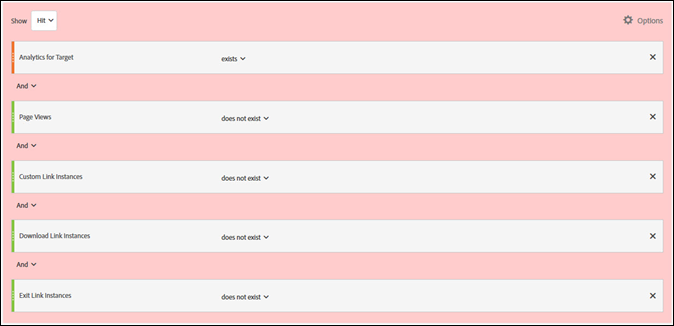

# Minimizzare i conteggi gonfiati per visite e visitatori in A4T{#minimizing-inflated-visit-and-visitor-counts-in-a-t}

Informazioni che consentono di minimizzare gli effetti di conteggia gonfiati per visite e visitatori quando si utilizza Analytics come origine per la generazione di rapporti.

>[!IMPORTANT]
>Il 14 novembre 2016, in Adobe Analytics sonos tate cambiate le modalità di elaborazione di alcuni dati per i clienti che utilizzano le funzioni di reporting di Analytics per Target (A4T). Queste modifiche consentono un migliore allineamento dei dati di Adobe Target con il modello dati di Adobe Analytics. Le suddette modifiche sono state apportate per tutti i clienti che utilizzano A4T. Queste modifiche rispondono specificamente a un problema notato dai clienti, relativo a un conteggio eccessivo dei visitatori quando le attività di Target sono in esecuzione.
>
>Nota: questo cambiamento non è retroattivo. Se i rapporti cronologici mostrano conteggi gonfiati e desideri escluderli, puoi creare una suite di rapporti virtuale, come descritto di seguito.
>
>Inoltre, diverse librerie JavaScript sono state aggiornate per ridurre al minimo i conteggi gonfiati. Si consiglia di eseguire l&#39;aggiornamento alle seguenti versioni della libreria (o successive):
>
>* Servizio ID visitatore di Experience Cloud: visitorAPI.js versione 2.3.0 o successiva.
>* Adobe Analytics: appMeasurement.js versione 2.1.
>* Adobe Target: at.js versione 0.9.6 o successiva (eccetto versione 1.1.0 se si utilizza il reindirizzamento con A4T).

>
>  
La libreria mbox.js non supporta le offerte di reindirizzamento con A4T. L’implementazione deve utilizzare at.js.

## Cosa è cambiato? {#section_9CCF45F5D66D48EBA88F3A178B27D986}

Quando [!DNL Adobe Analytics] viene utilizzato per misurare le attività di [!DNL Target] (A4T), [!DNL Analytics] raccoglie dati aggiuntivi che non sono disponibili se non è presente alcuna attività di [!DNL Target] nella pagina. Ciò è dovuto al fatto che l’attività di [!DNL Target] innesca una chiamata nella parte superiore della pagina, ma solitamente [!DNL Analytics] genera le chiamate di raccolta dati nella parte inferiore della pagina. Nell’implementazione di A4T fino a oggi, abbiamo incluso questi dati aggiuntivi ogni volta che un’attività di [!DNL Target] risultava attiva. In futuro, includeremo questi dati aggiuntivi solo quando vengono generati da i tag di entrambi [!DNL Target] e [!DNL Analytics].

## Perché Adobe ha introdotto questa modifica? {#section_92380A4BD69E4B8886692DD27540C92A}

L&#39;accuratezza e la qualità dei dati sono motivo di orgoglio per Adobe. Quando il tag di [!DNL Target] viene attivato, ma il tag di [!DNL Analytics] no, si registrano dati parziali, che non verrebbero acquisiti da [!DNL Analytics] in assenza di attività di [!DNL Target]. L’inclusione dei dati parziali nella reportistica di [!DNL Analytics] fornisce informazioni aggiuntive, ma genera anche hit incoerenti per i dati precedenti relativi a periodi in cui non vi erano attività di [!DNL Target] in esecuzione. Questo può causare problemi agli utenti di [!DNL Analytics] che analizzano le tendenze nel tempo. Al fine di garantire la coerenza dei dati di [!DNL Analytics], escluderemo tutti i dati parziali.

## Cosa contribuisce ai dati parziali? {#section_C9C906BEAA7D44DAB9D3C03932A2FEB8}

Alcuni clienti presentano tassi molto elevati di dati parziali in [!DNL Analytics]. Questo può dipendere da un&#39;implementazione impropria, ma esistono anche cause legittime.

Le cause identificate dei dati parziali includono le seguenti:

* **ID delle suite di rapporti non allineati (implementazione):** la suite di rapporti specificata durante la configurazione dell’attività non corrisponde alla suite di rapporti nella pagina in cui viene consegnato il test. Questo aspetto è simile ai dati parziali perché i dati non possono essere riconciliati nei server di [!DNL Analytics].
* **Pagine lente:** poiché le chiamate di [!DNL Target] sono nella parte superiore della pagina e quelle di [!DNL Analytics] normalmente sono in fondo alla pagina, se la pagina viene caricata lentamente aumenta la probabilità che un visitatore lasci la pagina dopo che la chiamata di [!DNL Target] è stata generata, ma prima della chiamata di [!DNL Analytics]. Questo può essere particolarmente problematico sui siti web mobili, spesso con connessioni più lente.
* **Errori di pagina:** se ci sono errori JavaScript o altri scenari in cui ciascuno dei punti di contatto non si attiva (servizio Experience Cloud ID, Target e Analytics), si otterranno dei dati parziali.
* **Offerte di reindirizzamento nelle attività di [!DNL Target]:** per le offerte di reindirizzamento nelle attività che utilizzano A4T, l’implementazione deve soddisfare determinati requisiti minimi. Inoltre, è necessario conoscere alcune informazioni importanti. Per ulteriori informazioni, consulta [Offerte di reindirizzamento - Domande frequenti su A4T](/help/c-integrating-target-with-mac/a4t/r-a4t-faq/a4t-faq-redirect-offers.md#section_FA9384C2AA9D41EDBCE263FFFD1D9B58).
* **Versioni precedenti delle librerie:** nel corso degli anni Adobe ha apportato diversi miglioramenti alle nostre librerie JavaScript ([!DNL appMeasurement.js], `at.js/mbox.js` e `visitorAPI.js`) per assicurarsi che i dati vengano inviati nel modo più efficiente possibile. Per ulteriori informazioni sui requisiti di implementazione, consulta [Prima di implementare](/help/c-integrating-target-with-mac/a4t/before-implement.md#concept_046BC89C03044417A30B63CE34C22543).

## Quali sono le best practice per ridurre i dati parziali? {#section_065C38501527451C8058278054A1818D}

Rivedi i seguenti passaggi, in ordine, per ridurre la raccolta parziale dei dati:

| Passaggio | Attività |
| --- | --- |
|  | Assicurati che la suite di rapporti selezionata in [!DNL Target] sia la stessa di quella sulla pagina o sulle pagine in cui verrà presentata l&#39;attività. |
|  | Assicurati che le librerie visitorAPI.js, appMeasurement.js, at.js/mbox.js siano su versioni compatibili con A4T. Per ulteriori informazioni sui requisiti di implementazione, consulta [Prima di implementare](/help/c-integrating-target-with-mac/a4t/before-implement.md). |
|  | Controlla che il SDID sia sempre impostato su tutte le chiamate di [!DNL Target] e [!DNL Analytics] che lasciano la pagina, e che corrispondano. A tale scopo, utilizza un analizzatore di rete o uno strumento di debug per garantire che il parametro `mboxMCSDID` nelle chiamate di [!DNL Target] corrisponda al parametro SDID nella chiamata di [!DNL Analytics]. |
|  | Verifica che le librerie di implementazione nei tuoi siti vengano caricate nell&#39;ordine corretto. Per ulteriori informazioni, consulta [Implementazione di Analytics for Target](/help/c-integrating-target-with-mac/a4t/a4timplementation.md). |

## Come posso vedere quanti dati parziali ci sono? {#section_89B663E2824A4805AB934153508A0F4B}

Sebbene queste informazioni non siano disponibili direttamente in [!DNL Analytics], è possibile contattare l’Assistenza clienti di Adobe per richiedere un rapporto sui dati parziali. Questo rapporto ha lo scopo di facilitare il debug.

## Come posso visualizzare le tendenze della cronologia senza dati parziali? {#section_4C9DED560FAD4428B362DDA2064897C3}

Poiché questa modifica di elaborazione influisce sui dati solo dopo la data di rilascio (14 novembre 2016), se desideri modificare le metriche cronologiche da abbinare, crea un segmento per escludere i dati parziali.

Le informazioni seguenti relative a questo cambiamento includono istruzioni su come definire il segmento e applicarlo a una suite di rapporti virtuale in modo che questo segmento venga sempre applicato alle visualizzazioni di [!DNL Analytics].

Nella maggior parte delle situazioni, un risultato di [!DNL Target] è vincolato a un risultato di [!DNL Analytics] su ogni pagina web. Questo vincolo si verifica se c’è un SDID coerente nella chiamata di [!DNL Target] e in quella di [!DNL Analytics] e un [!DNL Experience Cloud ID] (MCID) nella chiamata di [!DNL Analytics] sulla stessa pagina. Normalmente [!DNL Target] ha anche il MCID, ma se la chiamata a [!DNL Target] si verifica prima che l&#39;ID del visitatore venga restituito, il risultato sarà ancora vincolato a causa dell&#39;SDID. Inoltre, l’utente deve rimanere sulla pagina abbastanza a lungo per generare una chiamata [!DNL Analytics] dopo che è stata attivata una chiamata di [!DNL Target]. Questo è lo scenario ideale.

**Risultati con dati parziali:** gli utenti a volte non rimangono su una pagina abbastanza a lungo per inviare una chiamata di [!DNL Analytics], ma [!DNL Target] ha un MCID corretto. Questo comporta risultati con dati parziali (risultati senza visualizzazioni pagina di [!DNL Analytics]). Se questi utenti tornano sul tuo sito e visualizzano una pagina che contiene codice [!DNL Analytics], verranno conteggiati correttamente come visitatori ritornati. Questi risultati verrebbero persi se sulla pagina fosse presente solo il codice [!DNL Analytics]. Alcuni clienti non desiderano i dati per questi risultati perché gonfiano determinate metriche (visite) e ne riducono altre (visualizzazioni di pagina per visita, durata per visita, ecc.). Inoltre, si vedranno visite senza alcuna visualizzazione di pagina. Tuttavia, esistono anche validi motivi per mantenere questi dati.

Per ridurre al minimo i risultati con dati parziali, velocizza il caricamento della pagina, aggiorna le librerie alle versioni più recenti oppure crea una [suite di rapporti virtuale](https://experienceleague.adobe.com/docs/analytics/components/virtual-report-suites/vrs-workflow/vrs-create.html) che escluda tali risultati. For step-by-step instructions, see [Create virtual report suites](https://experienceleague.adobe.com/docs/analytics/components/virtual-report-suites/vrs-workflow/vrs-create.html) in the *Analytics Components Guide*.

Nell&#39;illustrazione seguente viene mostrata la definizione di un segmento per la suite di rapporti virtuale:

Quando si crea la suite di rapporti virtuale, specificare la seguente configurazione per la definizione del segmento (come mostrato nell&#39;illustrazione precedente):

* **Mostra risultato:**
* Analytics for Target: esiste
* E
* Visualizzazioni pagine: non esiste
* E
* Istanze di collegamento personalizzato: non esiste
* E
* Istanze di collegamento di download: non esiste
* E
* Istanze di collegamento di uscita: non esiste

**Risultati orfani:** in poche situazioni, gli utenti non rimangono sulla pagina abbastanza a lungo per una chiamata Analytics e Target non riceve un MCID corretto. Questi risultati vengono definiti “orfani”. Rappresentano i clienti che ritornano raramente e gonfiano il conteggio delle visite e dei visitatori.

Per ridurre al minimo i risultati orfani, è possibile creare una [suite di rapporti virtuale](https://experienceleague.adobe.com/docs/analytics/components/virtual-report-suites/vrs-workflow/vrs-create.html) che escluda tali risultati, come spiegato in precedenza.

## Che cosa significa questo per i rapporti di [!DNL Target]? {#section_AAD354C722BE46D4875507F0FCBA5E36}

Con questo cambiamento, potresti notare una diminuzione dei nuovi visitatori e delle visite ai test live perché [!DNL Adobe] non elabora i dati parziali in entrata. Le conversioni e i risultati di altre metriche [!DNL Analytics] non cambieranno.
