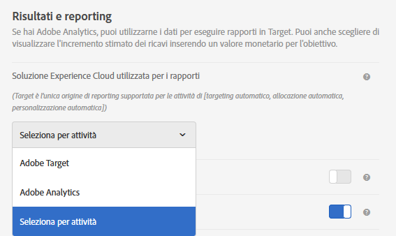

# Impostazioni delle attività - Domande frequenti su A4T

Questo argomento contiene le risposte alle domande frequenti sulla configurazione dell&#39;attività e sull&#39;utilizzo di [!DNL Analytics] come origine di reporting per [!DNL Target] (A4T).

## Quali tipi di attività supportano Analytics come origine per la generazione di rapporti (A4T)? {#section_5E4F58CD25A5424E869E6FE0803968EF}

Per un elenco completo, consulta “Tipi di attività supportati” in [Adobe Analytics come origine per la generazione di rapporti per Adobe Target (A4T)](/help/c-integrating-target-with-mac/a4t/a4t.md#concept_7540C8C04259434AB6EE33B09F47A1DE).

## Durante la configurazione delle metriche obiettivo, perché non è possibile accedere alle impostazioni avanzate?

Per le attività che utilizzano [!DNL Analytics] come origine di reporting (A4T), la metrica di obiettivo utilizzerà sempre le impostazioni &quot;[!UICONTROL Increment Count &amp; Keep User in Activity]&quot; e &quot;[!UICONTROL On Every Impression]&quot;. È possibile configurare *not*.

Per ulteriori informazioni, vedere &quot;Durante la configurazione delle metriche degli obiettivi, perché non è possibile accedere alle opzioni delle impostazioni avanzate?&quot; in [Definizioni metriche - A4T FAQ](/help/c-integrating-target-with-mac/a4t/r-a4t-faq/a4t-faq-metric-definition.md).

## Ho appena creato un’attività. Perché non vedo dati in arrivo? {#section_9F8092BE4225442896F926540292F221}

Quando viene creata un&#39;attività, [!DNL Target] invia un file di classificazione a [!DNL Analytics]. Anche se [!DNL Analytics] sta acquisendo ed elaborando i dati, non viene visualizzata nei rapporti fino a quando il file di classificazione non è stato aggiornato. Questa operazione può richiedere fino a 24 ore. Se dopo 48 ore non vedi i tuoi dati, [contatta l’assistenza clienti](/help/cmp-resources-and-contact-information.md#reference_ACA3391A00EF467B87930A450050077C). In alternativa, se sai che lancerai un’attività, puoi crearla con qualche giorno di anticipo: le classificazioni vengono infatti inviate quando l’attività viene salvata. e in questo modo al momento dell’avvio i dati potranno essere visualizzati nei rapporti. Si prega di notare che ci vogliono 45-90 minuti perché i dati vengano elaborati in [!DNL Analytics].

## Perché non è possibile selezionare Analytics come origine per la generazione di rapporti quando si crea una nuova attività?  {#section_9F4F69C3085F4C2480AF439127EB27CD}

È possibile modificare le opzioni [!UICONTROL Impostazioni di reporting] in [!UICONTROL Amministrazione].

1. In [!DNL Target], fare clic su **[!UICONTROL Amministrazione]**.
1. Nell’elenco a discesa **[!UICONTROL Soluzione Experience Cloud utilizzata per i rapporti]**, fai clic su **[!UICONTROL Seleziona per attività]**.

L’elenco a discesa **[!UICONTROL Origine per i rapporti]** è abilitato nella schermata **[!UICONTROL Obiettivi e impostazioni]** per la creazione e la modifica delle attività.

Per utilizzare sempre [!DNL Analytics] come origine di reporting, selezionare **[!UICONTROL Adobe Analytics]** dall&#39;elenco a discesa in [!UICONTROL Amministrazione].

## Un visitatore può passare da esperienze con targeting a esperienze controllate in visite diverse in un&#39;attività di targeting automatico che utilizza A4T?

Quanto segue è vero se l’ID visitatore non cambia per un visitatore tra una visita e l’altra.

Se la percentuale di allocazione del traffico viene modificata in base all&#39;attività media, è possibile che un visitatore si sposti tra esperienze con targeting e esperienze di controllo.

Se le percentuali non vengono modificate a livello di attività, un visitatore che inizialmente vede il controllo verrà sempre inviato a tale controllo. Un visitatore che viene inviato a esperienze con targeting sarà sempre inviato a esperienze con targeting.

* Dopo essere stato nel &quot;bucket&quot; di traffico di destinazione, il visitatore può essere inviato a un&#39;esperienza diversa da visita a visita se i modelli di machine-learning determinano che una diversa esperienza è rilevante per la nuova visita.
* Dopo essere stato assegnato al &quot;bucket&quot; di controllo del traffico, un visitatore visualizzerà sempre la stessa esperienza perché l&#39;assegnazione dell&#39;esperienza è basata su un hash pseudo-casuale deterministico del visitorId.
