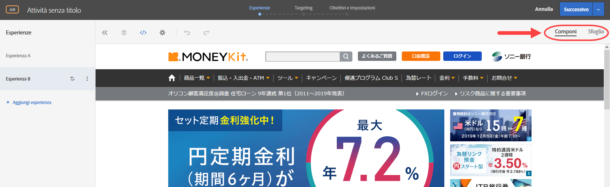

# Domande frequenti sull’ottimizzazione e la personalizzazione di Target

Un elenco di domande frequenti sull’utilizzo delle funzionalità di Adobe Target, oltre a informazioni e collegamenti verso ulteriori informazioni.

## Informazioni generali {#section_CE5713B5AAC341C9A75586C107797FA3}

**Come posso vedere come altri clienti hanno sfruttato Adobe Target per ottenere risultati migliori?**

Qui ci sono solo alcune [storie di successo dei nostri clienti](https://www.adobe.com/it/marketing-cloud/target/resources.html#x). Scopri come altri clienti hanno sfruttato Target per migliorare l&#39;ottimizzazione e la personalizzazione per raggiungere gli obiettivi aziendali.

Si noti che alcuni di questi casi di studio sfruttano le funzionalità di Adobe Target Premium.

**Dove posso scoprire le nuove funzionalità di Target?**

Consulta le [Note sulla versione](/help/r-release-notes/release-notes.md#reference_8FE40B43A5A34DDF8F26A53D55EE036A) per controllare i dettagli dell’ultima versione. Sono inoltre disponibili online informazioni su tutte le [versioni precedenti](/help/r-release-notes/release-notes-for-previous-releases.md).

**Adobe dispone di una community o un forum dove posso trovare risposte e ulteriori informazioni su Target?**

Visita il [forum Target Community](/help/cmp-resources-and-contact-information.md#concept_9C203A8AED054DFFA9A504811DB6BA42), dove aiutiamo i clienti, ma ancora più importante, dove i professionisti di Adobe Target come te si possono aiutare a vicenda. Dopo tutto, il successo di una community e di un forum si basa sulla partecipazione attiva dei suoi membri. Diventa parte della community per contribuire e per cercare le risposte alle tue domande.

**Quali browser supporta Target?**

Per maggiori dettagli, consulta la nostra griglia dei [browser supportati](/help/c-implementing-target/c-considerations-before-you-implement-target/supported-browsers.md#reference_01B4BF99E7D545A7998773202A2F6100). Si noti che sono disponibili due funzioni: il supporto dell&#39;interfaccia Experience Cloud di Target Standard/Premium e il supporto del browser per gli utenti finali su desktop/dispositivi.

## Librerie JavaScript di Target (at.js e mbox.js) {#section_C2AC78DFDAD84981A8C84DF20893E340}

**Quale file JavaScript di implementazione devo utilizzare, at.js o mbox.js?**

at.js è la nostra libreria JavaScript più recente e più grande. mbox.js è la nostra versione precedente. Consulta [Vantaggi di at.js](/help/c-implementing-target/c-implementing-target-for-client-side-web/t-mbox-download/c-target-atjs-implementation/target-atjs-implementation.md#benefits) per comprendere le differenze tra le due librerie. Tutti i nuovi clienti devono utilizzare at.js.

Tutti i clienti mbox.js già esistenti devono migrare a at.js. Ulteriori informazioni sui passaggi [per la migrazione da mbox.js a at.js](/help/c-implementing-target/c-implementing-target-for-client-side-web/t-mbox-download/c-target-atjs-implementation/target-migrate-atjs.md#task_DE55DCE9AC2F49728395665DE1B1E6EA) prima di effettuare la transizione.

## Attività {#section_CB95B3BF9934445DB98E8A7E22FC2CF6}

**È possibile eseguire un&#39;attività statisticamente impegnativa per trovare un&#39;esperienza vincente e perdente mentre si utilizza un&#39;esperienza di controllo?**

Utilizza [Test A/B](/help/c-activities/t-test-ab/test-ab.md#task_05E33EB15C4D4459B5EAFF90A94A7977) (opzione di targeting manuale) insieme al [calcolatore delle dimensioni del campione](/help/c-activities/t-test-ab/sample-size-determination.md#section_286EB6E671184239BB1552F0387DAEB5) per ottenere risultati migliori.

**Come faccio a sapere quando interrompere un&#39;attività?**

Arrestare le attività prematuramente può portare a conclusioni sbagliate. Presta attenzione alle [problematiche comuni e garantire pratiche per evitarle](/help/c-activities/t-test-ab/common-ab-testing-pitfalls.md#section_DF01A97275E44CA5859D825E0DE2F49F). Vedi anche: [Per quanto tempo si deve eseguire un test A/B](/help/c-activities/t-test-ab/sample-size-determination.md)?

**Come posso eseguire un&#39;attività se la finestra temporale è piccola?**

**Posso ottimizzare il mio obiettivo durante il test?**

Utilizza i nostri [rapporti per determinare l’esperienza vincente](/help/c-activities/automated-traffic-allocation/determine-winner.md#concept_5741A89ED7224E1285A3BC34B2CCD0F9).

**È possibile eseguire un&#39;attività con un livello di personalizzazione come parte integrante dell&#39;attività?**

Consulta l’opzione [Targeting automatico](/help/c-activities/auto-target/auto-target-to-optimize.md).

**Come posso sapere quale tipo di attività si adatta meglio alle mie esigenze?**

Leggi la [Guida alle attività di Target](/help/c-activities/target-activities-guide.md#concept_D974B0918EB74B3B8CB07ACD32BF37A1) per scoprire gli scenari adatti per ciascuna delle opzioni fornite da Adobe Target.

Accertati inoltre di prendere in considerazione le [attività Consigli](/help/c-recommendations/recommendations.md#concept_7556C8A4543942F2A77B13A29339C0C0).

**Come faccio a scoprire quali combinazioni di elementi sulla mia pagina contribuiscono al suo successo e il livello di contribuzione di ogni elemento?**

Consulta [Attività fattoriali complete multivariate (MVT)](/help/c-activities/c-multivariate-testing/multivariate-testing.md#concept_628695CDC71B449B8DCC2F5654C11499) con analisi del contributo degli elementi per vedere se soddisfa le tue esigenze.

Tieni presente che il fabbisogno di traffico aumenta con le attività MVT.

**È possibile eseguire un&#39;attività che si estende su più pagine in cui la struttura della pagina è diversa?**

**Posso applicare offerte in luoghi diversi (ad esempio, funnel di checkout)?**

Prova la [funzione di attività multipagina](/help/c-experiences/c-visual-experience-composer/multipage-activity.md#concept_277E096063E14813AC5D8EDFA1D2ED48) che consente di usare più pagine all’interno di esperienze.

**Come posso essere sicuro che, una volta raggiunto un obiettivo (primario o secondario), un utente non entri più nell&#39;attività e veda invece un&#39;attività diversa?**

Questo è possibile utilizzando l&#39;opzione [Impostazioni avanzate](/help/c-activities/t-test-ab/t-test-create-ab/ab-goals-and-settings.md#section_E2FE441AFB324E498793ABB025ED9974) disponibile per ogni obiettivo. Sono disponibili opzioni per decidere cosa accade dopo che l&#39;utente ha raggiunto l&#39;obiettivo e come si desidera che il conteggio venga incrementato.

Quindi, in questo caso, è possibile scegliere “Incrementa il conteggio, rilascia l&#39;utente e impedisci nuovo accesso” insieme a “Predefinito/Altri contenuti attività” per raggiungere la finalità. Consulta anche le altre opzioni.

**Ho creato più obiettivi nella mia attività. Posso creare una catena di obiettivi come funnel per scopi di reporting e analisi?**

**Per esempio, voglio considerare l’obiettivo B quando l’utente ha raggiunto l’obiettivo A in modo che io possa rintracciare i numeri per un funnel specifico.**

Target può raggiungere questo obiettivo in modo preciso grazie alla funzione di Dipendenza delle metriche. È sufficiente [aggiungere dipendenze su altre metriche di successo](/help/c-activities/r-success-metrics/success-metrics.md#section_7CE95A2FA8F5438E936C365A6D43BC5B). Sono disponibili opzioni quali “Raggiunto” e “Non raggiunto”, insieme alla capacità di combinare metriche in più modi per creare qualsiasi combinazione desiderata.

**Come posso essere chiaro su come impostare un&#39;attività per raggiungere le mie finalità?**

Qui è dove entrano in gioco gli [obiettivi](/help/c-activities/t-test-ab/t-test-create-ab/ab-goals-and-settings.md#reference_B25389FD6F3A4989801E740364B089CC).

Per iniziare è importante sapere cosa si desidera ottimizzare. I ricavi, la conversione o il coinvolgimento? Ognuna di queste opzioni è disponibile nella sezione obiettivi. Per ogni obiettivo, è possibile definire l&#39;azione intrapresa dall&#39;utente sul tuo sito per il raggiungimento dell&#39;obiettivo.

Questo è reso possibile dall&#39;impostazione dell&#39;obiettivo primario nel passaggio 3 del flusso di lavoro guidato in tre parti. È possibile aggiungere ulteriori obiettivi, per un reporting migliore

**È possibile programmare l&#39;inizio e la fine di un&#39;attività a un orario fisso?**

Utilizza la [funzionalità di programmazione nel passaggio obiettivi e impostazioni](/help/c-activities/t-test-ab/t-test-create-ab/ab-goals-and-settings.md#section_DCBDC354261F420EBD4B43EA34947BAC) del flusso di lavoro di attività in tre parti specificando le date di inizio e di fine.

Ricordati di attivare l’attività. Solo le attività live aderiscono alla pianificazione specificata. Una volta raggiunta la data di fine, l’attività passa allo stato terminato.

**È possibile apportare una modifica solo al passaggio di destinazione e non passare attraverso l&#39;intero flusso di lavoro guidato in tre passaggi per l&#39;editing?**

Puoi farlo semplicemente [inserendo direttamente il passo desiderato dalla pagina panoramica Attività](/help/c-activities/edit-activity.md#concept_BB064C0D4A194BD1A1AE7CCA1E6BB8F0) e uscendo da quel passaggio utilizzando l’opzione Salva e chiudi.

**Posso rimanere in un particolare passaggio, continuare a modificare l&#39;attività (offerta di testo o codice personalizzato, per esempio), e quindi eseguire il QA in un&#39;altra scheda?**

Anche questo è possibile. Utilizza semplicemente [l&#39;opzione Salva disponibile per apportare modifiche incrementali senza uscire dal passaggio](/help/c-activities/edit-activity.md#concept_BB064C0D4A194BD1A1AE7CCA1E6BB8F0).

**Come posso visualizzare in anteprima ed effettuare il QA di un&#39;attività appena creata?**

Utilizza la nostra [potente funzione di modalità di controllo qualità](/help/c-activities/c-activity-qa/activity-qa.md) per eseguire le attività di QA. Puoi condividere i collegamenti con il tuo team Controllo qualità e testare l&#39;attività end-to-end, compresi i rapporti, per essere sicuri che una volta pubblicata l’attività funzioni come previsto e come testato.

**Come posso utilizzare il potere decisionale di Target per ricevere un&#39;esperienza/offerta che può essere utilizzata nelle applicazioni di singole pagine (SPA) o nelle integrazioni lato server?**

Sfrutta l’efficacia delle [attività basate su moduli](/help/c-experiences/form-experience-composer.md#task_FAC842A6535045B68B4C1AD3E657E56E) con [offerte JSON](/help/c-experiences/c-manage-content/create-json-offer.md#concept_63C7BEE1F0DB4A7596D997219B7C136D) per raggiungere l’obiettivo.

**Ho creato due attività. Come faccio a sapere quale attività vedrà un visitatore?**

**Posso impostare l&#39;ordine prioritario di alcune attività?**

Utilizza l&#39;impostazione di priorità disponibile nel passaggio 3 del flusso di lavoro guidato in tre parti di Target (pagina Obiettivi e impostazioni) per [definire la priorità delle attività](/help/c-activities/t-test-ab/t-test-create-ab/ab-goals-and-settings.md#section_DCBDC354261F420EBD4B43EA34947BAC).

Sono disponibili due opzioni:

* Predefinita, con tre livelli (Bassa/Media/Alta)
* Personalizzata, da 0 a 999. Per personalizzare, abilita la funzione Priorità precise (Amministrazione > Compositore esperienza visivo).

## Tipi di pubblico {#section_FA6314777ABC46D8B198D6F388051460}

**È possibile creare un segmento di un pubblico in un&#39;attività specifica dell&#39;attività? Non credo che un tale pubblico debba essere creato nella libreria Pubblico, perché non verrà riutilizzato.**

Inizia utilizzando la [funzionalità “pubblico per sola attività”](/help/c-target/creating-activity-only-audience.md#concept_A6BADCF530ED4AE1852E677FEBE68483) per definire i tipi di pubblico per una specifica attività.

**Come posso indirizzare gli utenti in base alle loro posizioni?**

Prova la funzione di [geotargeting](/help/c-target/c-audiences/c-target-rules/geo.md#concept_5B4D99DE685348FB877929EE0F942670). Scopri i livelli di accuratezza di questa funzione.

**È possibile indirizzare gli utenti sulla base di alcuni degli attributi della pagina nella sessione?**

Il modo migliore è utilizzare mbox e [tipi di pubblico personalizzati](/help/c-target/c-audiences/c-target-rules/custom-parameters.md#concept_C4C6E00D7C5A4BE9B72D471DB2E3027B) per fornire l’esperienza giusta.

**È possibile fornire esperienze basate sugli attributi dei visitatori in più visite?**

**Posso dividere il traffico in modo casuale in due blocchi?**

Prova la [funzione Script di profilo](/help/c-target/c-visitor-profile/profile-parameters.md#concept_8C07AEAB0A144FECA8B4FEB091AED4D2). È un modo potente per personalizzare le esperienze, anche se richiede di scrivere un codice.

**Posso iniziare un&#39;attività con un minor numero di visitatori?**

Utilizza i controlli di allocazione della percentuale disponibili nel [passaggio 2 del flusso di lavoro guidato in tre parti (pagina di targeting)](/help/c-activities/t-test-ab/t-test-create-ab/ab-audience.md#concept_A268236C1224451DB7844BF67F41A087) per decidere in che modo procedere all’impostazione dell’attività.

**Ho anche Adobe Analytics e lo voglio sfruttare con Target. Quali funzionalità chiave ottengo integrando le due soluzioni?**

Dai un&#39;occhiata alle seguenti funzioni del prodotto:

* [Analytics for Target (A4T)](/help/c-integrating-target-with-mac/a4t/a4t.md#concept_7540C8C04259434AB6EE33B09F47A1DE)
* [Attributi del cliente](/help/c-target/c-visitor-profile/working-with-customer-attributes.md#concept_16C5C434D32D4EB1AD44A71821F3DEE8)
* [Tipi di pubblico](/help/c-integrating-target-with-mac/mmp.md)

## Esperienze {#section_5959536B8D6A4BEA8FAA1273338F3451}

**È possibile eseguire un&#39;attività su più pagine in cui la struttura della pagina è comune?**

Consulta [Regole modello](/help/c-experiences/c-visual-experience-composer/temtest.md#task_2539D51A18044F82B0D9895636546781) per includere molte pagine strutturate simili per l’attività, durante la creazione di esperienza sul singolo URL fornito.

**Sono stanco del messaggio “Consenti al browser di caricare script” quando si tenta di caricare la pagina nel Compositore esperienza visivo. Come posso evitarlo?**

Questo è dovuto al fatto che il sito ha contenuto misto, è un sito che recupera sia le risorse HTTP che HTTPS. Richiedi che il tuo team IT si muova completamente su HTTPS.

In questo caso, segui le istruzioni [Consentire contenuti misti nel browser](/help/c-experiences/c-visual-experience-composer/r-troubleshoot-composer/mixed-content.md#concept_46D022D50280468C9EF6D5DF6EFC911C) per consentire al browser di caricare contenuti misti. Questa è una caratteristica di sicurezza della maggior parte dei browser moderni.

**Posso provare il Compositore esperienza visivo sul mio sito anche se la libreria at.js di Target non è ancora stata distribuita?**

Prova a caricare la pagina con il [Compositore esperienza avanzato](/help/c-experiences/experiences.md#section_34265986611B4AB8A0E4D6ACC25EF91D).

**Perché il mio sito non viene caricato nel Compositore esperienza visivo?**

Prova le informazioni sulla [risoluzione dei problemi](/help/c-experiences/c-visual-experience-composer/r-troubleshoot-composer/troubleshoot-composer.md#reference_77743144F10143A3A89D56E116D296E4) descritte nella nostra pagina di aiuto. Contatta il [Supporto Adobe](/help/cmp-resources-and-contact-information.md#reference_ACA3391A00EF467B87930A450050077C) se non funziona nessuno di questi metodi.

È anche disponibile un [approccio basato su modulo](/help/c-experiences/form-experience-composer.md#task_FAC842A6535045B68B4C1AD3E657E56E) che può essere d’aiuto.

Leggi inoltre le informazioni su quando e perché il [Compositore esperienza avanzato](/help/c-experiences/experiences.md#section_34265986611B4AB8A0E4D6ACC25EF91D) può essere utile. Potrebbe essere necessario contattare il reparto IT per inserire i [anche i proxy server di Adobe nell&#39;elenco Consentiti](/help/c-experiences/c-visual-experience-composer/experience-composer-best-practices.md#concept_E284B3F704C04406B174D9050A2528A6).

**Ho un sito reattivo. Durante la creazione di un&#39;attività, come posso essere sicuro che sto prendendo in considerazione i dispositivi chiave?**

Prova la funzione dei [riquadri di visualizzazione per dispositivi mobili](/help/c-experiences/c-visual-experience-composer/mobile-viewports.md#concept_8E45527C4ABC41D59AA3553BEDC76FA5). Si noti che funziona solo quando il Compositore esperienza avanzato è abilitato.

**Ho più domini. Uno dei domini ha bisogno del Compositore esperienza avanzato, mentre altri hanno bisogno che questo sia disabilitato. Come posso fare?**

È sempre possibile utilizzare l’opzione [Compositore esperienza avanzato a livello di attività](/help/c-experiences/experiences.md#section_34265986611B4AB8A0E4D6ACC25EF91D) per bypassare l’impostazione predefinita (Amministrazione > Compositore esperienza visivo).

**Perché non vedo un&#39;opzione per scambiare le immagini?**

Rivolgiti ad Adobe per [assicurarti di avere l’account configurato per Scene7](/help/administrating-target/scene7-settings.md#task_37AD0768EFBA4E588955FE3D5DD670A5). Una volta impostato, sarai in grado di scambiare un&#39;immagine con un&#39;altra immagine in tutta facilità.

**Voglio testare due esperienze diverse, per esempio sconto forfettario e sconto percentuale, ma voglio indirizzare le esperienze correttamente (mostrare diverso testo locale o valuta diversa per le persone provenienti da paesi diversi). Come posso fare?**

Puoi farlo semplicemente con la [funzionalità Più versioni di esperienza](/help/c-activities/t-test-ab/t-test-create-ab/target-experience-to-multiple-audiences.md#task_0138112E283A4A5B9F8AB9AAF2FBC2FF). Notare le sfumature di consegna in tali test

**Come posso vedere quali modifiche ho apportato nel Compositore esperienza visivo?**

Le modifiche sono sempre visibili nell’[Editor di codice](/help/c-experiences/c-visual-experience-composer/c-vec-code-editor/vec-code-editor.md#concept_B3A6E9EE3A60406DB640E205EA1745B5). La scheda Modifiche mostra il selettore CSS o mbox che hai applicato alla tua offerta.

Il selettore CSS è un selettore sizzle. È possibile utilizzare questa sezione per apportare piccole modifiche o eliminare rapidamente alcune offerte.

**Voglio consegnare JavaScript come parte dell&#39;esperimento/attività per apportare modifiche rapide ad alcuni elementi dinamici o semplicemente per inviare una chiamata a una soluzione di terze parti. Come posso fare?**

Un metodo consiste nell’usare l’[Editor di codice personalizzato](/help/c-experiences/c-visual-experience-composer/c-vec-code-editor/vec-code-editor.md#concept_B3A6E9EE3A60406DB640E205EA1745B5). Devi semplicemente inserire il tuo JavaScript nella sezione e questo verrà consegnato. Hai la possibilità di consegnarlo nella sezione head nella parte superiore della sezione body, a seconda delle tue esigenze.

**Perché non posso andare oltre la pagina di accesso nel Compositore esperienza visivo o a una pagina nascosta per la quale non ho un URL specifico?**

Utilizza le funzioni Componi e Sfoglia per passare alla pagina scelta e iniziare a creare la tua esperienza.

**Come posso passare all&#39;esperienza scelta dal passaggio 2 del flusso di lavoro guidato in tre parti di Target (pagina targeting)?**

Fai clic sulla miniatura di fronte al nome dell’esperienza al passaggio 2 e si aprirà l&#39;esperienza scelta.

**Sono un ex utente di Target Classic. Posso sfruttare le mie mbox per alcuni casi di utilizzo?**

Utilizza l’[approccio basato su moduli](/help/c-experiences/form-experience-composer.md#task_FAC842A6535045B68B4C1AD3E657E56E) per creare attività.

**È possibile garantire che la stessa esperienza venga fornita in modo coerente su tutti i dispositivi di un utente?**

Consulta il nostro servizio [Device Co-op](https://experienceleague.adobe.com/docs/device-co-op/using/home.html?lang=it), che consente di collegare in modo deterministico e probabilistico più dispositivi di un utente attraverso la potenza di una cooperativa.

Se fai parte della Cooperativa, un semplice flag nella pagina Obiettivi e impostazioni abilita la funzione. Inoltre, il reporting cambia per riflettere Persone anziché Visitatori. Contatta Adobe per maggiori informazioni su questa funzione in quanto non è disponibile in tutte le regioni.

**Perché non vedo l&#39;offerta/esperienza desiderata e vedo invece altre attività?**

Utilizza il nostro [debugger](/help/c-activities/c-troubleshooting-activities/content-trouble.md#concept_D2548B486C984B1E97ED7A72075B8EEA) e verifica la presenza di [conflitti tra attività](/help/c-experiences/c-visual-experience-composer/activity-collisions.md#concept_0BC6B929592744DFA7DA01FF4F91052E).

## Offerte {#section_A547B1EAD0B34FD38D3B87AAF62E3963}

**Non voglio provare piccole modifiche, ma desidero testare una pagina nuova, completamente diversa.**

**Voglio indirizzare gli utenti a una pagina di destinazione, per esempio, un nuovo lancio.**

**Come posso fare?**

È disponibile [la funzione URL di reindirizzamento](/help/c-experiences/c-manage-content/offer-redirect.md#task_33C80CD722564303B687948261484F94) che consente di reindirizzare gli utenti alla pagina scelta (con o senza i parametri di query correnti).

**Perché la consegna dei contenuti non avviene nel mio processo QA?**

È possibile che il sito abbia ID dinamici, ID duplicati o classi dinamiche sugli elementi. Potrebbe essere necessario valutare le opzioni di preferenza del sito a livello di account (o a livello di attività se il problema è specifico a un dominio o a una pagina). Consulta [Selettori CSS](/help/administrating-target/visual-experience-composer-set-up.md#css).

**Perché non vedo l&#39;offerta/esperienza desiderata e vedo invece altre attività?**

Utilizza il nostro [debugger](/help/c-activities/c-troubleshooting-activities/content-trouble.md#concept_D2548B486C984B1E97ED7A72075B8EEA) e verifica la presenza di [conflitti tra attività](/help/c-experiences/c-visual-experience-composer/activity-collisions.md#concept_0BC6B929592744DFA7DA01FF4F91052E).

**Posso utilizzare il potere decisionale di Target per ricevere un&#39;esperienza/offerta che può essere utilizzata in applicazioni a pagina singola (SPA) o nelle integrazioni lato server?**

Sfrutta l’efficacia delle [attività basate su moduli](/help/c-experiences/form-experience-composer.md#task_FAC842A6535045B68B4C1AD3E657E56E) con [offerte JSON](/help/c-experiences/c-manage-content/create-json-offer.md#concept_63C7BEE1F0DB4A7596D997219B7C136D) per raggiungere l’obiettivo.

## Rapporti (incluso Analytics for Target — A4T) {#section_8AECC69BEEB7422E894E7EC44A50BA0A}

**Ho anche Adobe Analytics e lo voglio sfruttare con Target. Quali funzionalità chiave ottengo integrando le due soluzioni?**

Dai un&#39;occhiata alle seguenti funzioni del prodotto:

* [Analytics for Target (A4T)](/help/c-integrating-target-with-mac/a4t/a4t.md#concept_7540C8C04259434AB6EE33B09F47A1DE)

* [Attributi del cliente](/help/c-target/c-visitor-profile/working-with-customer-attributes.md#concept_16C5C434D32D4EB1AD44A71821F3DEE8)

* [Tipi di pubblico](/help/c-integrating-target-with-mac/mmp.md)

**Posso suddividere il reporting per più segmenti di utenti?**

Qui entra in gioco la funzionalità di [Tipi di pubblico per i rapporti](/help/c-activities/t-test-ab/t-test-create-ab/ab-goals-and-settings.md#section_13119392051044FBA6387D9B3B1C43CF) disponibile nella pagina Obiettivi e impostazioni nel passaggio 3 del flusso di lavoro guidato in tre parti.

Hai la possibilità di aggiungere 50 segmenti e anche il punto di applicazione (accesso all’attività o una metrica specifica) per poter suddividere la reportistica in base alle tue esigenze.

Tieni presente che Target raccoglie i dati per questo scopo dal momento in cui si aggiungono questi tipi di pubblico; quindi, dovrai aggiungere i segmenti prima di eseguire il test.

**Non posso definire i tipi di pubblico prima di eseguire l’attività. Trovo restrittivo questo aspetto di reporting per i tipi di pubblico nelle attività di Target.**

**Cosa posso fare per semplificare questo processo?**

[Analytics for Target (A4T)](/help/c-integrating-target-with-mac/a4t/a4t.md#concept_7540C8C04259434AB6EE33B09F47A1DE) è molto comodo a tale scopo. Se disponi di Adobe Analytics, per evitare questa restrizione è sufficiente scegliere Analytics come origine. Ora è possibile eseguire analisi su qualsiasi pubblico in qualsiasi punto e non è necessario definire a priori i tipi di pubblico per i rapporti.

**È possibile eseguire calcoli di reporting offline?**

Usa le opzioni [Esporta rapporti in formato CSV e Scarica i dettagli dell’ordine in formato CSV](/help/c-reports/downloading-data-in-csv-file.md#concept_3F276FF2BBB2499388F97451D6DE2E75) nella pagina Rapporti per scaricare i dati di reporting desiderati.

**Posso cambiare l’esperienza di controllo per valutare i rapporti o cambiare la metodologia di conteggio da visitatori a visite?**

Per apportare queste modifiche utilizza le [Impostazioni nella pagina Rapporti](/help/c-reports/c-report-settings/report-settings.md#concept_4BB6A7FDAB6F4806A632F9CD989B8BFA). Scopri di più su queste impostazioni per capire come variano i calcoli.

**Come devo interpretare i rapporti?**

Abbiamo cercato di rendere i rapporti più intuitivi possibile con caratteristiche come [barre di intervallo di affidabilità, limiti di incremento, significatività/affidabilità e selezioni di più metriche, visualizzazioni a tabella e grafico, medie correnti e altro ancora](/help/c-reports/c-report-settings/report-settings.md#concept_4BB6A7FDAB6F4806A632F9CD989B8BFA) per consentire un&#39;analisi dei rapporti potente, ma facile. Ovviamente, se utilizzi [Analytics for Target (A4T)](/help/c-integrating-target-with-mac/a4t/a4t.md#concept_7540C8C04259434AB6EE33B09F47A1DE) puoi cercare attività per ulteriori analisi sui tipi di pubblico.

## Token di risposta {#section_C2A7118B4B62482A9D630C2212112A3D}

**È possibile eseguire un&#39;integrazione con un sistema di terze parti, ad esempio Google Analytics o ClickTale, per passare le informazioni sull&#39;attività consegnate a un utente finale, per l&#39;analisi?**

Abbiamo una soluzione anche per questo grazie alla [funzionalità Token di risposta](/help/administrating-target/response-tokens.md#concept_2B21B222F6A344D68CA5929817E836C4).

## Risoluzione dei problemi {#section_6B8B4DC62AE34066A8C55915E9EC6C19}

**Come posso conoscere lo stato di disponibilità di Adobe Target?**

Utilizza la pagina [Stato del sistema di Adobe](/help/r-release-notes/system-status-updates.md#concept_5CBDF506BEFA40E483CC7DE0DA915EAD) per visualizzare lo stato dei prodotti Adobe e delle soluzioni Experience Cloud, incluso Target. Questa pagina è utile per determinare se eventuali problemi riscontrati sono dovuti a un aggiornamento del sistema o a un intervento di manutenzione ordinaria.

**Avete una guida alla risoluzione dei problemi?**

Siamo spiacenti di sapere che stai avendo dei problemi. Consulta [Risoluzione dei problemi di Target](/help/r-troubleshooting-target/troubleshooting-target.md#reference_A9DB82675D044BD8861F6752A4EE6839) per collegamenti verso molti argomenti utili per la risoluzione dei problemi.

## App di Target Mobile {#section_07BA89F2C38747158ECD5B153274AEAF}

**Abbiamo una SKU Mobile. Posso creare attività mobili?**

Per ottimizzare e personalizzare su dispositivi mobili, devi utilizzare le [attività basate su moduli](/help/c-experiences/form-experience-composer.md#task_FAC842A6535045B68B4C1AD3E657E56E) e l’[SDK Adobe](/help/c-target-mobile-app/mobile-enable-target-in-sdk.md#task_FCA99AD0785A44E995468776AE76FE91). Scopri ulteriori dettagli su [Target per le app per dispositivi mobili](/help/c-target-mobile-app/target-mobile-app.md#concept_80126FF457724DE788CE37264A047559).

## API di Target {#section_714E85EFF6E3400389EF2E40D538E1DA}

**Dove posso saperne di più sulle API di Target?**

È disponibile una documentazione completa sulle API. Consulta [Documentazione di API di distribuzione, SDK di NodeJS e API Consigli](/help/c-implementing-target/c-api-and-sdk-overview/api-and-sdk-overview.md).
