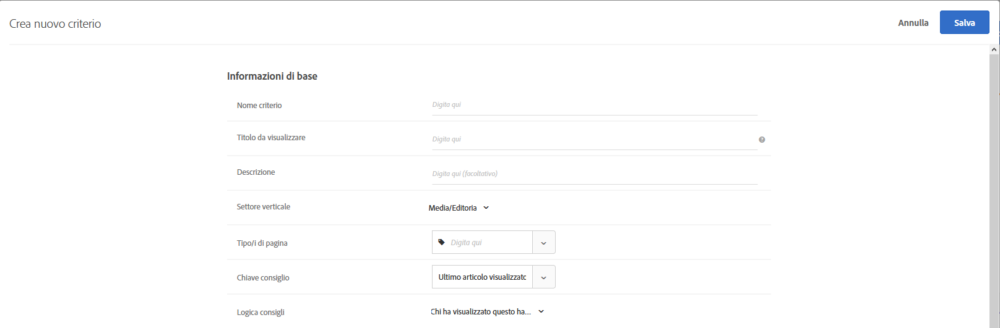

#  Criteri

Criteri in [!DNL Adobe Target] [!DNL Recommendations] sono regole che determinano quali prodotti o contenuti consigliare in base a un set predeterminato di comportamenti dei visitatori. I criteri possono essere basati sulle tendenze popolari, sui comportamenti attuali e passati di un visitatore o su prodotti e contenuti simili. È possibile sottoporre e test più tipi di consigli tra loro aggiungendo più criteri.

Nelle sezioni seguenti vengono illustrate ulteriori informazioni sulle chiavi dei criteri e sulla logica dei consigli che è possibile utilizzare per ogni chiave. Fai clic sui collegamenti per ulteriori informazioni.

## Settore verticale {#section_936BCFCF234C49A2BEC1C38AAC2D71AF}

Durante la creazione di un criterio, seleziona un settore verticale in base agli obiettivi dell’attività di consigli.

| Settore verticale | Obiettivo |
|--- |--- |
| Retail/E-commerce | Conversione con conseguente acquisto |
| Generazione di lead/B2B/servizi finanziari | Conversione senza acquisto |
| Media/Editoria | Coinvolgimento |

Altre opzioni di criteri cambiano in base al verticale di settore selezionato. Puoi impostare il settore verticale predefinito sul **[!UICONTROL Recommendations > Impostazioni]** oppure puoi specificare il settore verticale per ciascun criterio.

## Tipo di algoritmo {#section_885B3BB1B43048A88A8926F6B76FC482}

Il tipo di algoritmo selezionato determina gli algoritmi disponibili. Esistono diversi tipi di algoritmi, che vengono rappresentati come schede di criteri quando imposti un [!DNL Recommendations] attività.

La tabella seguente spiega i vari tipi di algoritmi e i relativi algoritmi.

| Tipo di algoritmo | Quando utilizzare | Algoritmi disponibili |
| --- | --- | --- |
| [!UICONTROL Basato sul carrello] | Effettua i consigli in base al contenuto del carrello dell’utente. | <ul><li>Chi ha visualizzato questi ha visualizzato quelli</li><li>Chi li ha visti, li ha comprati</li><li>Chi ha comprato questi ha acquistato quelli</li></ul>Per ulteriori informazioni, consulta [Basato sul carrello](/help/c-recommendations/c-algorithms/base-the-recommendation-on-a-recommendation-key.md#cart-based) in *Basare il consiglio su una chiave consiglio*. |
| [!UICONTROL Basato sulla popolarità] | Puoi formulare consigli in base alla popolarità complessiva di un elemento all’interno del tuo sito o in base alla popolarità degli articoli all’interno della categoria, del marchio, del genere e così via preferiti o più visualizzati da un utente. | <ul><li>Più visualizzati nel sito</li><li>Più visualizzate per categoria</li><li>Più visualizzato per attributo articolo</li><li>Articoli più venduti in tutto il sito</li><li>Più venduti per categoria</li><li>Principali venduti per attributo articolo</li><li>Metrica di Analytics in alto</li></ul> |
| [!UICONTROL Basato su articolo] | formulare raccomandazioni in base al risultato di elementi simili a un elemento che l’utente sta visualizzando o ha visualizzato di recente. | <ul><li>Chi ha visualizzato questo ha visualizzato anche quello</li><li>Chi ha visualizzato questo ha acquistato anche quello</li><li>Chi ha comprato questo ha acquistato anche quello</li><li>Articoli con attributi simili</li></ul> |
| [!UICONTROL Basato su utente] | Eseguite raccomandazioni in base al comportamento dell&#39;utente. | <ul><li>Articoli visualizzati di recente</li><li>Consigliato per te</li></ul> |
| [!UICONTROL Criteri personalizzati] | Crea consigli in base a un file personalizzato caricato. | <ul><li>Algoritmo personalizzato</li></ul> |

Per ulteriori informazioni su ciascun algoritmo, consulta [Basare il consiglio su una chiave consiglio](/help/c-recommendations/c-algorithms/base-the-recommendation-on-a-recommendation-key.md).

## Utilizzo di una chiave di consiglio personalizzata {#custom-key}

Puoi anche basare i consigli sul valore di un attributo di profilo personalizzato.

>[!NOTE]
>
>I parametri di profilo personalizzati possono essere passati a [!DNL Target] tramite JavaScript, API o integrazioni. Per ulteriori informazioni sugli attributi di profilo personalizzati, consulta [Profili dei visitatori](/help/c-target/c-visitor-profile/visitor-profile.md).

Ad esempio, si supponga di voler visualizzare filmati consigliati in base al filmato che un utente ha aggiunto più di recente alla coda.

1. Fai clic su **[!UICONTROL Recommendations]** > **[!UICONTROL Criteri]**.

1. Fai clic su **[!UICONTROL Creare criteri]** > **[!UICONTROL Creare criteri]**.

1. Compila le informazioni nel [Sezione Informazioni di base](/help/c-recommendations/c-algorithms/create-new-algorithm.md#info).

1. In [Algoritmo consigliato](/help/c-recommendations/c-algorithms/create-new-algorithm.md#rec-algo) sezione , seleziona **[!UICONTROL Basato su articolo]** dal **[!UICONTROL Tipo di algoritmo]** elenco.

1. Seleziona **[!UICONTROL Chi ha visualizzato questo ha visualizzato anche quello]** dal **[!UICONTROL Algoritmo]** elenco.

1. Seleziona l’attributo di profilo personalizzato dal **[!UICONTROL Chiave dei consigli]** elenco (ad esempio, [!UICONTROL Ultima visualizzazione aggiunta alla lista di controllo]).

   

## Visualizzazione delle informazioni sui criteri {#section_7162DE58E4594FD688A4D7FDB829FD8B}

Per visualizzare i dettagli dei criteri su una scheda a comparsa, passa il mouse su una scheda e fai clic sull&#39;icona Informazioni sulla scheda dei criteri, senza aprirli.

Fai clic sulla scheda **[!UICONTROL Informazioni algoritmo]** per visualizzare le informazioni generali sui criteri selezionati, tra cui Nome, Descrizione, Verticale, Tipo di pagina/e, Chiave/i, Logica Consiglio e ID algoritmo.

Fai clic sulla scheda **[!UICONTROL Uso dell&#39;Algoritmo]** per visualizzare un elenco di attività che fanno riferimento ai criteri selezionati. Nella scheda sono elencate le attività attive, inattive e bozze. Fai clic sugli elenchi a discesa Attività live/Attività inattive/Attività bozza per visualizzare l’intero elenco di attività che fanno riferimento a tali criteri. Puoi fare clic sul link dell&#39;attività per aprire quella da modificare.

>[!NOTE]
>
>La [!UICONTROL Utilizzo dell’algoritmo] al momento è supportata solo per le attività Recommendations. Questa funzione non è attualmente supportata per le attività di test A/B, allocazione automatica, targeting automatico e targeting delle esperienze (XT) che includono [consigli come offerta](/help/c-recommendations/recommendations-as-an-offer.md).
