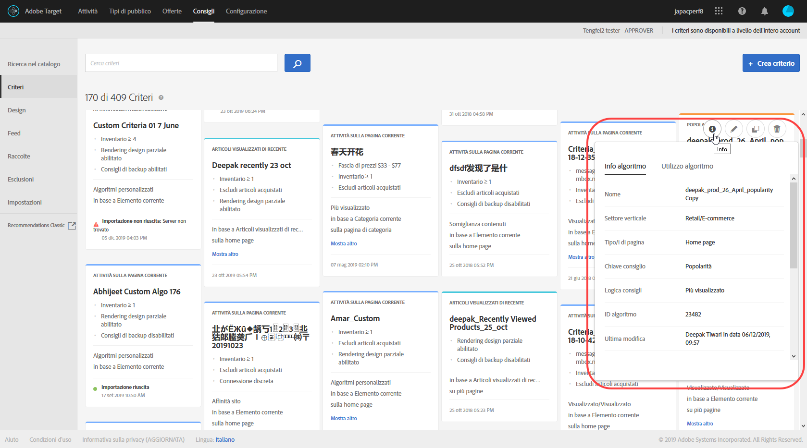
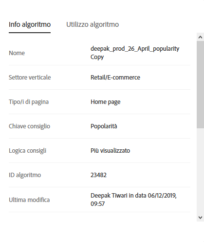
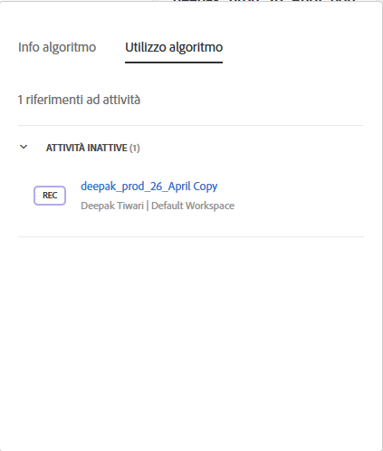
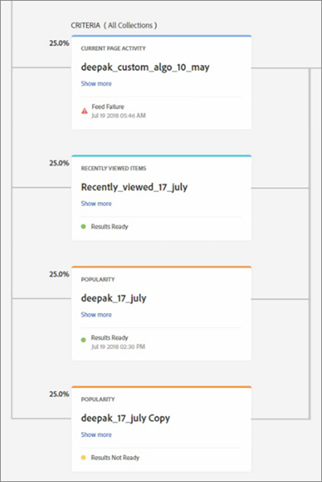

#  Criteri{#criteria}

I criteri sono regole che determinano i prodotti da consigliare in base a un set predeterminato di comportamenti dei visitatori.

## Criteri {#concept_4BD01DC437F543C0A13621C93A302750}

I criteri sono regole che determinano i prodotti da consigliare in base a un set predeterminato di comportamenti dei visitatori.

I criteri determinano quale azione provocherà quale consiglio. È possibile sottoporre e test più tipi di consigli tra loro aggiungendo più criteri.

## Settore verticale {#section_936BCFCF234C49A2BEC1C38AAC2D71AF}

Seleziona un settore verticale in base agli obiettivi dell&#39;attività consigliata:

| Settore verticale | Obiettivo |
|--- |--- |
| Retail/E-commerce | Conversione con conseguente acquisto |
| Generazione di lead/B2B/servizi finanziari | Conversione senza acquisto |
| Media/Editoria | Coinvolgimento |

## Chiave dei consigli {#section_885B3BB1B43048A88A8926F6B76FC482}

La chiave dei consigli selezionata determina il tipo di criterio. Esistono diversi tipi di criteri che vengono rappresentati come schede di criteri quando imposti un’attività di [!DNL Recommendations].

| Tipo di criteri | Chiavi |
|--- |--- |
| Attività sulla pagina corrente | Consiglia gli elementi o articoli in base alle azioni degli utenti sulla pagina corrente. Ad esempio, i visitatori che visualizzano un particolare elemento potrebbero volerne consultare altri della stessa categoria.<ul><li>Elemento corrente</li><li>Categoria corrente</li></ul> |
| Personalizzato | Consiglia gli elementi o articoli in base agli attributi personalizzati.<ul><li>Attributo personalizzato</li></ul>Quando basi i consigli su attributi personalizzati, seleziona l&#39;attributo personalizzato, quindi il tipo di consiglio. Puoi eseguire il filtro in tempo reale all&#39;inizio dell&#39;output di criteri personalizzati. Ad esempio, puoi limitare gli articoli consigliati a quelli della categoria o del marchio preferito dal visitatore. Così puoi combinare calcoli offline e filtri in tempo reale. Grazie a questa funzionalità è possibile utilizzare Target per aggiungere la personalizzazione ai consigli calcolati offline o agli elenchi personalizzati. Permette infatti di unire le compenze del personale addetto ai dati alle tecnonologie comprovate di Adobe per la distribuzione, l&#39;applicazione di filtri al momento dell&#39;esecuzione, i test A/B, il targeting, la generazione di rapporti, le integrazioni e altro. Con l’aggiunta delle regole di inclusione ai Criteri personalizzati, i consigli non sono più statici ma diventano dinamici, in base agli interessi del visitatore.<ul><li>I criteri personalizzati sono configurabili, come altri criteri nei consigli.</li><li>È possibile utilizzare [raccolte](/help/c-recommendations/c-products/collections.md), [esclusioni](/help/c-recommendations/c-products/exclusions.md) e [inclusioni](/help/c-recommendations/c-algorithms/use-dynamic-and-static-inclusion-rules.md) (incluse le regole speciali per Prezzo e Inventario) proprio come per tutti gli altri criteri.</li></ul>Eventuali casi di utilizzo includono:<ul><li>Vuoi consigliare film da una lista personalizzata, ma solo se il visitatore non li ha già guardati.</li><li>Vuoi eseguire un algoritmo offline e utilizzare i risultati per la definizione dei consigli, ma vuoi anche che vengano sempre esclusi gli articoli non disponibili.</li><li>Vuoi includere solo gli articoli appartenenti alla categoria preferita del visitatore.</li></ul> |
| Comportamento passato | Consiglia gli articoli in base alle reazioni passate dei visitatori a un articolo. Per esempio, chi ha già acquistato un articolo di una data marca sarà più propenso ad acquistare un altro articolo della stessa marca.<ul><li>Ultimo articolo acquistato</li><li>Ultimo articolo visualizzato</li><li>Articolo più visualizzato</li><li>Categoria preferita</li></ul> |
| Popolarità | Consiglia gli articoli più popolari, ad esempio i video più popolari in una categoria correlata o i prodotti visualizzati più spesso sul sito.<ul><li>Popolarità</li></ul> |
| Articoli visualizzati di recente | Consiglia gli articoli che un visitatore ha visto più di recente, ad esempio gli articoli che ha guardato l&#39;ultima volta che ha visitato il tuo sito o gli articoli di tendenza in questo momento. L’algoritmo di visualizzazione degli elementi visualizzati di recente restituisce i risultati specifici dell’attività di un visitatore in un [ambiente](/help/administrating-target/hosts.md). Se due siti appartengono a ambienti diversi e un visitatore passa tra i due siti, l&#39;algoritmo restituisce solo gli elementi visualizzati di recente dal sito appropriato. Questo tipo di criteri non è limitato dalle raccolte.<ul><li>Articoli visualizzati di recente</li></ul>**Nota:** non è possibile utilizzare il criterio Articoli visualizzati di recente per i consigli di backup. Puoi filtrare gli articoli o i file multimediali visualizzati di recente in modo che vengano visualizzati solo quelli con uno specifico attributo.<ul><li>I criteri “visualizzati di recente” sono configurabili, come altri criteri nei consigli.</li><li>È possibile utilizzare [raccolte](/help/c-recommendations/c-products/collections.md), [esclusioni](/help/c-recommendations/c-products/exclusions.md) e [inclusioni](/help/c-recommendations/c-algorithms/use-dynamic-and-static-inclusion-rules.md) (incluse le regole speciali per Prezzo e Inventario) proprio come per tutti gli altri criteri.</li></ul>Eventuali casi di utilizzo includono:<ul><li>Una società multinazionale con più business potrebbe avere un visitatore che visualizza elementi in più proprietà digitali. In questo caso, puoi limitare gli articoli visualizzati di recente al solo sito su cui sono stati visualizzati. In tal modo gli articoli visualizzati di recente non saranno visualizzati sugli altri siti della stessa società.</li></ul> |

## Criteri/algoritmi {#section_DC4E38A00B9744959F05F8E10A0087A1}

[!DNL Target Recommendations]In sono utilizzati algoritmi sofisticati per determinare quando le azioni di un visitatore soddisfano i criteri impostati nell&#39;attività. La Chiave consiglio determina le opzioni di logica disponibili.

| Criteri | Descrizione |
|--- |--- |
| Articoli/Media con attributi simili | Consiglia articoli o media simili in base all’attività corrente o al comportamento passato del visitatore. **Nota:** se selezioni Articoli/Media con attributi simili, avrai la possibilità di impostare regole di somiglianza del contenuto. |
| Chi ha visualizzato questo ha visualizzato anche quello | Consiglia gli elementi che vengono visualizzati più spesso nella stessa sessione in cui viene visualizzato l’elemento specificato. |
| Chi ha visualizzato questo ha acquistato anche quello | Consiglia gli articoli che vengono acquistati più spesso nella stessa sessione in cui viene visualizzato l’articolo specificato. Questo criterio restituisce gli altri prodotti acquistati dopo la visualizzazione dell’articolo corrente; il prodotto specificato non è incluso nell’insieme di risultati. |
| Chi ha comprato questo ha acquistato anche quello | Consiglia gli articoli che sono acquistati più spesso dai clienti contemporaneamente all’articolo specificato. |
| Affinità sito | Consiglia gli articoli in base alla certezza di una relazione tra articoli diversi. È possibile configurare questo criterio per determinare la quantità di dati necessari prima che venga presentato un consiglio utilizzando il cursore delle Regole di inclusione. Per esempio, se selezioni molto forte, vengono consigliati i prodotti con una maggiore certezza di corrispondenza. Ad esempio, se imposti un’affinità molto forte e il progetto include cinque elementi, tre dei quali soddisfano il livello di soglia di connessione, i due elementi che non soddisfano i requisiti di forza minima non vengono visualizzati nei suggerimenti e vengono sostituiti dagli elementi di backup definiti. Gli elementi con affinità più elevata vengono visualizzati per primi. Alcuni clienti con varie raccolte di prodotti e comportamenti diversi sui siti potrebbero ottenere risultati ottimali impostando un’affinità di sito debole. |
| Articoli più venduti | Articoli inclusi nella maggioranza degli ordini completati. Più unità dello stesso articolo in un unico ordine vengono conteggiate come un ordine. |
| Articoli più visualizzati | Articoli o elementi multimediali visualizzati più spesso. |
| Articoli/Media visualizzati di recente | Articoli che sono stati visualizzati di recente dal visitatore. Quando si utilizza questo criterio, è necessario aggiornare la progettazione di Target in modo da gestire i casi di visualizzazione di raccomandazioni vuote laddove gli elementi visualizzati in precedenza non siano sufficienti. |

>[!NOTE] {class=“- topic/note ”}
>
>Se modifichi i criteri di un consiglio attivo, i dati di rapporto relativi andranno persi.

Puoi anche utilizzare informazioni conosciute aggiuntive su un visitatore per migliorare i consigli.

Tutti i criteri di un giorno vengono eseguiti due volte al giorno. Tutti i criteri di una settimana e più vengono eseguiti una volta al giorno. I criteri di affinità per sito vengono eseguiti una volta al giorno. I criteri di backup vengono eseguiti due volte al giorno.

## Informazioni sui Criteri di Visualizzazione {#section_7162DE58E4594FD688A4D7FDB829FD8B}

Per visualizzare i dettagli dei criteri su una scheda a comparsa, passa il mouse su una scheda e fai clic sull&#39;icona Informazioni sulla scheda dei criteri, senza aprirli.

Fai clic sulla scheda **[!UICONTROL Informazioni Algoritmo]** per visualizzare le informazioni generali sui criteri selezionati, tra cui Nome, Descrizione, Verticale, Tipo di pagina/e, Chiave/i, Logica Consiglio e ID algoritmo.

Fai clic sulla scheda **[!UICONTROL Uso dell&#39;Algoritmo]** per visualizzare un elenco di attività che fanno riferimento ai criteri selezionati. La scheda elenca le attività attive e inattive. Fai clic sugli elenchi a discesa Attività o Inattività per visualizzare l&#39;intero elenco di attività che fanno riferimento a tali criteri. Puoi fare clic sul link dell&#39;attività per aprire quella da modificare.

## Determinare il momento in cui i risultati dei criteri sono pronti per la visualizzazione {#section_03F328C07F234692B6D996DF745584B3}

Dal diagramma attività, le schede Criteri ora indicano quando i risultati sono pronti per essere visualizzati. Sapere se i risultati sono pronti per essere visualizzati ti aiuta a determinare se l&#39;attività è pronta per l&#39;attivazione in diretta. Comprendere se i risultati sono pronti per essere visualizzati ti permette di sapere se ci sono problemi con i criteri.

>[!NOTE]
>
>Per una discussione sui tempi di caricamento, vedi “Tempo di elaborazione dei criteri previsto” in [Creazione di criteri](../../c-recommendations/c-algorithms/create-new-algorithm.md#task_8A9CB465F28D44899F69F38AD27352FE).

La figura seguente mostra il diagramma dell&#39;attività nella pagina Panoramica di un&#39;attività di Consigli. Nel secondo passaggio del processo di creazione di un&#39;attività, puoi anche vedere il diagramma dell&#39;attività coni risultati dello Status dei criteri.

I risultati dello Status includono Risultati Pronti, Risultati Non Pronti e Feed non riuscito, come illustrato nel diagramma seguente:

