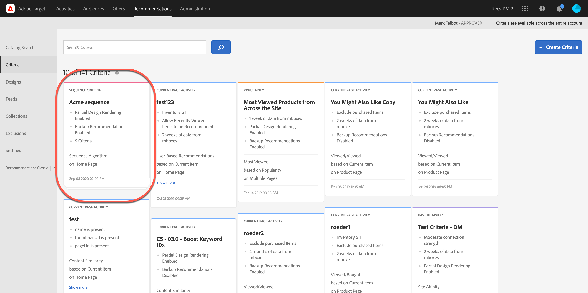

#  Creare sequenze di criteri{#create-criteria-sequences}

Utilizza le sequenze di criteri (fino a cinque criteri per sequenza) per esercitare un maggiore controllo sugli elementi da visualizzare nelle attività Consigli.

>[!NOTE]
>
>Le sequenze di criteri non possono essere utilizzate con le attività [!UICONTROL Consigli] create prima del rilascio di [!DNL Target Premium] in ottobre 2016.

Per creare una sequenza di criteri, è necessario innanzitutto creare i criteri da includere nella sequenza. Consulta [Creazione di sequenze di criteri](../../c-recommendations/c-algorithms/create-new-algorithm.md#task_8A9CB465F28D44899F69F38AD27352FE) per ulteriori informazioni.

Utilizzando una sequenza di criteri, è possibile fornire ulteriori consigli mirati, anziché utilizzare consigli di backup più generici, quando un criterio non fornisce abbastanza risultati per completare il progetto. In genere, una sequenza di criteri andrà da targeting più specifico, che può restituire meno risultati, a targeting più generale, che di solito restituisce più risultati.

Ad esempio, una sequenza di criteri di pagina prodotto potrebbe seguire questo ordine:

1. In base all&#39;articolo corrente, della stessa marca
1. In base all&#39;articolo corrente, di tutte le marche
1. In base a somiglianza del contenuto
1. In base agli articoli più venduti
1. In base agli articoli più visualizzati di tutto il sito

Una sequenza di criteri della pagina iniziale potrebbe seguire questo ordine:

1. In base all’ultimo acquisto del visitatore
1. In base all’articolo preferito del visitatore
1. In base alla categoria preferita del visitatore
1. In base agli articoli più venduti
1. In base agli articoli più visualizzati di tutto il sito

Esistono diversi modi per arrivare alla schermata [!UICONTROL Crea sequenza criteri]. Alcune opzioni dipendono dal modo in cui si raggiunge la schermata.

* Quando crei un&#39;attività di [!UICONTROL Consigli], fai clic su **[!UICONTROL Crea nuovo]** > **[!UICONTROL Crea sequenza criteri]** nella schermata [!UICONTROL Seleziona criteri]. Potrai salvare la nuova sequenza di criteri da utilizzare con altre attività di [!UICONTROL Consigli].
* Quando modifichi un’attività [!UICONTROL Consigli], fai clic su una casella di [!UICONTROL Posizione consigli] nella pagina e seleziona **[!UICONTROL Cambia criteri]**. Nella schermata [!UICONTROL Seleziona criteri], fai clic su **[!UICONTROL Crea nuovo]** > **[!UICONTROL Crea sequenza criteri]**. Sarà possibile salvare i nuovi criteri da utilizzare per altre attività di [!UICONTROL Consigli].
* Su **[!UICONTROL Consigli]** > **[!UICONTROL Criteri]**, fai clic su **[!UICONTROL Crea criterio]** > **[!UICONTROL Crea sequenza criteri]**. I criteri creati vengono automaticamente resi disponibili per tutte le attività di [!UICONTROL Consigli].

1. Fai clic su **[!UICONTROL Crea criterio]** o **[!UICONTROL Crea nuovo]**.

   

1. Seleziona **[!UICONTROL Crea sequenza criteri]**.

   

1. Digita un **[!UICONTROL Nome]** per la sequenza.

   Si tratta del nome “interno” usato per descrivere la sequenza di criteri. I visitatori del sito non vedranno questo nome.
1. Digita un **[!UICONTROL Titolo di visualizzazione generico rivolto al pubblico]** in modo che sia visualizzato nella pagina nel caso in cui vengano utilizzati più criteri nella sequenza per riempire la progettazione dei [!UICONTROL Consigli].

   Ad esempio, si potrebbe desiderare di sostituire “I clienti che hanno visualizzato questo hanno visto anche...” con “Consigliato per te”, nel caso in cui la progettazione possa includere elementi in base a più di un codice [!UICONTROL Consigli].
1. Digita una breve **[!UICONTROL Descrizione]** della sequenza di criteri.

   La descrizione deve consentire di identificare la sequenza di criteri e può includere informazioni sul relativo scopo.
1. Seleziona un **[!UICONTROL Settore verticale]**.

   Il settore verticale predefinito appare automaticamente.
1. Seleziona un **[!UICONTROL tipo di pagina]**.

   Puoi selezionare più tipi di pagina.

   Insieme, i tipi di pagina e i settori verticali vengono utilizzati per categorizzare la sequenza di criteri salvati, semplificando il riutilizzo delle sequenze per altre attività di [!UICONTROL Consigli].
1. Imposta le regole di **[!UICONTROL contenuto]**.

   Quando si crea una sequenza di criteri, le impostazioni di backup e di rendering parziale della progettazione vengono ignorate per i singoli criteri che costituiscono la sequenza. Per utilizzare i consigli di backup e il rendering parziale della progettazione, è necessario abilitarli per la sequenza. Seleziona i pulsanti appropriati. Se si sceglie di consentire i consigli di backup, è altresì possibile scegliere se applicare le regole di inclusione ai backup.
1. Imposta l&#39;ordine di sequenza.

1. Fai clic su **[!UICONTROL Aggiungi criteri]**.
1. Nella schermata Aggiungi criteri, seleziona un criterio.
1. Fai clic su **[!UICONTROL Aggiungi]**.

   È possibile aggiungere fino a cinque criteri a una sequenza.
1. Fai clic su **[!UICONTROL Salva]**.

   La sequenza di criteri verrà visualizzata nell&#39;elenco criteri.

   

   Per ulteriori informazioni sulle opzioni di logica per i consigli, consulta [Criteri](../../c-recommendations/c-algorithms/algorithms.md#concept_4BD01DC437F543C0A13621C93A302750).

## Video di formazione: Creare i criteri in Recommendations (12:33) 

Questo video contiene le seguenti informazioni:

* Creare criteri
* Creare sequenze di criteri
* Caricare criteri personalizzati

>[!VIDEO](https://video.tv.adobe.com/v/27694?quality=12)
