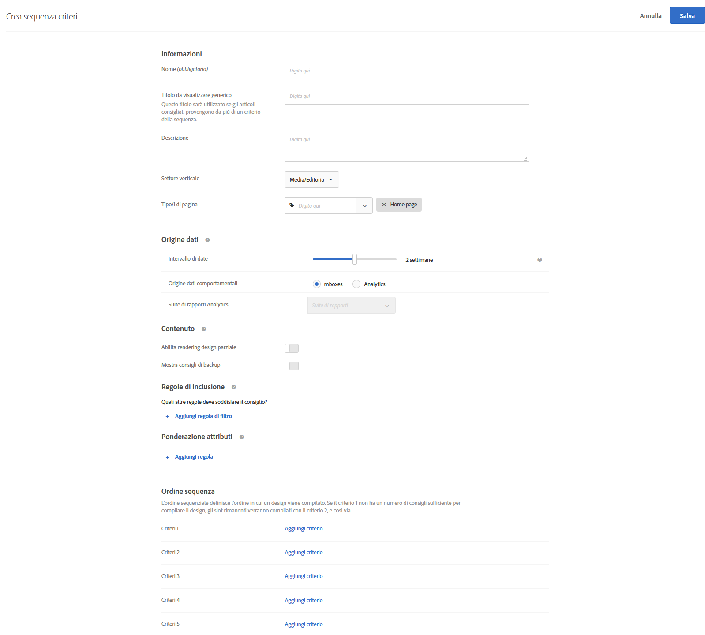

#  Creare sequenze di criteri

Utilizza le sequenze di criteri (fino a cinque criteri per sequenza) per esercitare un maggiore controllo sugli elementi da visualizzare nelle attività [!UICONTROL Consigli. ] È inoltre possibile limitare il numero di elementi restituiti (talvolta denominati &quot;controllo del livello degli slot&quot;).

>[!NOTE]
>
>Le sequenze di criteri non possono essere utilizzate con le attività [!UICONTROL Consigli] create prima del rilascio di [!DNL Target Premium] in ottobre 2016.

Per creare una sequenza di criteri, è necessario innanzitutto creare i criteri da includere nella sequenza. Consulta [Creare criteri](/help/c-recommendations/c-algorithms/create-new-algorithm.md) per ulteriori informazioni.

Utilizzando una sequenza di criteri, è possibile fornire ulteriori consigli mirati, anziché utilizzare consigli di backup più generici, quando un criterio non fornisce abbastanza risultati per completare il progetto. In genere, una sequenza di criteri passa da un targeting più specifico, che potrebbe restituire meno risultati, a un targeting più generale, che in genere restituisce più risultati.

Le sequenze di criteri possono variare in base al tipo di pagina, come illustrato negli esempi seguenti:

| Tipo pagina | Possibile ordine di sequenza |
| --- | --- |
| Pagina prodotto | <ol><li>In base all&#39;articolo corrente, della stessa marca</li><li>In base all&#39;articolo corrente, di tutte le marche</li><li>In base a somiglianza del contenuto</li><li>In base agli articoli più venduti</li><li>In base agli articoli più visualizzati di tutto il sito</li></ol> |
| Home page | <ol><li>In base all’ultimo acquisto del visitatore </li><li>In base all’articolo preferito del visitatore</li><li>In base alla categoria preferita del visitatore</li><li>In base agli articoli più venduti</li><li>In base agli articoli più visualizzati di tutto il sito</li></ol> |

## Creare una sequenza di criteri

Potete creare le sequenze di criteri dalla schermata [!UICONTROL Crea sequenza] criteri.

Esistono diversi modi per arrivare alla schermata [!UICONTROL Crea sequenza criteri]. Alcune opzioni dipendono dal modo in cui si raggiunge la schermata.

* Su **[!UICONTROL Consigli]** > **[!UICONTROL Criteri]**, fai clic su **[!UICONTROL Crea criterio]** > **[!UICONTROL Crea sequenza criteri]**. I criteri creati vengono automaticamente resi disponibili per tutte le attività di [!UICONTROL Consigli].
* Quando create un&#39;attività [!UICONTROL Recommendations] , nella schermata Seleziona criteri fate clic su **[!UICONTROL Crea nuovo]** > **[!UICONTROL Crea sequenza]** criteri. Potrai salvare la nuova sequenza di criteri da utilizzare con altre attività di [!UICONTROL Consigli].
* When you are editing a [!UICONTROL Recommendations] activity, click in a [!UICONTROL Recommendations Location] box on your page, then select **[!UICONTROL Change Criteria]**. Nella schermata [!UICONTROL Seleziona criteri], fai clic su **[!UICONTROL Crea nuovo]** > **[!UICONTROL Crea sequenza criteri]**. Sarà possibile salvare i nuovi criteri da utilizzare per altre attività di [!UICONTROL Consigli].

Nella procedura seguente si presuppone che sia possibile accedere alla schermata [!UICONTROL Crea sequenza] criteri utilizzando il primo metodo: nella schermata Libreria **[!UICONTROL Recommendations]** > **[!UICONTROL Criteri]** .

1. Fate clic su **[!UICONTROL Recommendations]** > **[!UICONTROL Criteri]**.

1. Fate clic su **[!UICONTROL Crea criteri]** > **[!UICONTROL Crea sequenza]** criteri.

   

1. Fill in the information in the [Basic Information](/help/c-recommendations/c-algorithms/create-new-algorithm.md#info) section.

1. Nella sezione Sequenza **** criteri, fare clic su **[!UICONTROL Aggiungi criteri]**.

   L’ordine di sequenza definisce l’ordine in cui la progettazione viene riempita. Se i criteri 1 non dispongono di un numero sufficiente di raccomandazioni per completare la progettazione, gli slot rimanenti verranno compilati con i criteri 2 e così via.

   

1. Nella schermata [!UICONTROL Seleziona criteri] , selezionate un criterio, quindi fate clic su **[!UICONTROL Aggiungi]**.

   Potete usare la casella di ricerca e i menu a discesa dei filtri per individuare i criteri desiderati.

   

1. (Facoltativo) Fate scorrere il **[!UICONTROL limite del numero di elementi restituiti]** per passare alla posizione &quot;on&quot;, quindi specificate il numero di elementi (tra 1 e 50).

   

   Per comprendere meglio il valore dell&#39;opzione [!UICONTROL Limita il numero di elementi restituiti] (talvolta denominata &quot;controllo del livello di slot&quot;), prendere in considerazione i seguenti casi di utilizzo:

   * **Caso d’uso 1**: Desiderate disporre di diversi tipi di elementi in un unico vassoio delle raccomandazioni. Ad esempio, si desidera mostrare un mix di abbigliamento (giacca) e top (camicie, T-shirt). A tal fine, utilizzate una raccolta per l&#39;attività che include tutti i potenziali tipi di prodotti che desiderate in qualsiasi slot del vostro progetto. Quindi, impostate il primo criterio con un filtro statico che limiti i criteri in modo che includano solo l&#39;uso esterno e il secondo criterio con un filtro statico che limiti i criteri in modo da includere solo i piani. Infine, aggiungete entrambi i criteri a una sequenza di criteri e limitate i primi criteri a 2 slot.

      Il vassoio delle raccomandazioni potrebbe essere simile al seguente sul sito:

      

   * **Caso d’uso 2**: Desiderate un mix di articoli alternativi e complementari. Impostate un criterio per utilizzare un algoritmo visualizzato/visualizzato e utilizzate un filtro dinamico che limiti gli elementi raccomandati alla categoria dell&#39;elemento corrente. Impostate il secondo criterio per utilizzare un algoritmo visualizzato/acquistato e utilizzate un filtro dinamico che includa solo gli elementi consigliati che non corrispondono alla categoria dell&#39;elemento corrente. Infine, aggiungete entrambi i criteri a una sequenza e limitate i primi criteri a 2 slot.

1. Continuate ad aggiungere altri criteri alla sequenza. È possibile aggiungere fino a cinque criteri a una sequenza.

1. Abilitare le opzioni [di](/help/c-recommendations/c-algorithms/create-new-algorithm.md#content)backup del contenuto.

1. Fai clic su **[!UICONTROL Salva]**.

   La sequenza di criteri verrà visualizzata nell&#39;elenco criteri.

   Per ulteriori informazioni sulle opzioni di logica per i consigli, consulta [Criteri](/help/c-recommendations/c-algorithms/algorithms.md).

## Video di formazione: Creare i criteri in Recommendations (12:33) 

Questo video contiene le seguenti informazioni:

* Creare criteri
* Creare sequenze di criteri
* Caricare criteri personalizzati

>[!VIDEO](https://video.tv.adobe.com/v/27694?quality=12)
