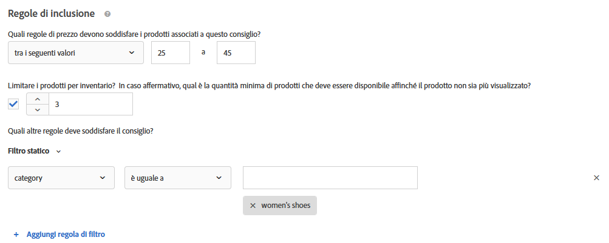

#  Creare criteri{#create-criteria}

I criteri controllano il contenuto delle attività [!UICONTROL Consigli]. Crea dei criteri per visualizzare i consigli più appropriati per l’attività.

## Creare nuovi criteri

Nelle sezioni seguenti viene illustrato come creare un nuovo criterio.

### Accedere alla schermata Crea nuovo criterio

Esistono diversi modi per raggiungere la schermata [!UICONTROL Crea nuovo criterio]. Alcune opzioni dipendono dal modo in cui si raggiunge la schermata.

* On the **[!UICONTROL Recommendations]** > **[!UICONTROL Criteria]** library screen, click **[!UICONTROL Create Criteria]** > **[!UICONTROL Create Criteria]**. I criteri creati vengono automaticamente resi disponibili per tutte le attività di [!DNL Recommendations].
* When you are creating a [!DNL Recommendations] activity, click **[!UICONTROL Create Criteria]** on the [!UICONTROL Select Criteria] screen. Sarà possibile salvare i nuovi criteri da utilizzare per altre attività di [!DNL Recommendations].
* Quando modifichi un’attività di [!DNL Recommendations], fai clic su una casella di [!UICONTROL Posizione Consigli] nella pagina e seleziona **[!UICONTROL Cambia criteri]**. On the [!UICONTROL Select Criteria] screen, click **[!UICONTROL Create Criteria]**. Sarà possibile salvare i nuovi criteri da utilizzare per altre attività di [!DNL Recommendations].

Nella procedura seguente si presuppone che sia possibile accedere alla schermata [!UICONTROL Crea nuovo criterio] utilizzando il primo metodo: nella schermata Libreria **[!UICONTROL Recommendations]** > **[!UICONTROL Criteri]** .

1. Fate clic su **[!UICONTROL Recommendations]** > **[!UICONTROL Criteri]**.

1. Fate clic su **[!UICONTROL Crea criteri]** > **[!UICONTROL Crea criteri]**.

   

### Compila la sezione Informazioni di base {#info}

1. Inserisci un **[!UICONTROL Nome criterio]**.

   Si tratta del nome “interno” usato per descrivere i criteri. Ad esempio, potresti voler chiamare i tuoi criteri “prodotti di margine più alto”, ma non vuoi che questo titolo venga visualizzato pubblicamente. Vedi il passo successivo per impostare il titolo visualizzato dal pubblico.

   

1. Inserisci un **[!UICONTROL Titolo da visualizzare]**, che verrà mostrato nella pagina per i consigli che utilizzano questo criterio.

   Ad esempio, potresti voler visualizzare “Le persone che hanno visto questo, hanno visto anche” o “Prodotti simili”, quando utilizzi questo criterio per mostrare i consigli.

1. Inserisci una breve **[!UICONTROL descrizione]** dei criteri.

   La descrizione dovrebbe facilitare l&#39;identificazione dei criteri e potrebbe includere informazioni sullo scopo dei criteri.

1. Seleziona un **[!UICONTROL Settore verticale]**:

   * [!UICONTROL Retail/E-commerce]
   * [!UICONTROL Generazione di lead/B2B/servizi finanziari]
   * [!UICONTROL Media/Editoria]

   Altre opzioni di criteri cambieranno in base al verticale di settore selezionato.

1. Seleziona un **[!UICONTROL tipo di pagina]**.

   Puoi selezionare più tipi di pagina.

   Insieme, tipi di pagina e verticali del settore vengono utilizzati per categorizzare i criteri salvati, semplificandone il riutilizzo per altre attività di [!DNL Recommendations].

1. Seleziona una **[!UICONTROL Chiave consiglio]**.

   Per ulteriori informazioni sui criteri basati su una chiave, consulta [Basare il consiglio su una Chiave consiglio](#task_2B0ED54AFBF64C56916B6E1F4DC0DC3B).

1. Seleziona la **[!UICONTROL Logica consigli]**.

   Per ulteriori informazioni sulle opzioni di logica per i consigli, consulta [Criteri](../../c-recommendations/c-algorithms/algorithms.md).

   >[!NOTE]
   >
   >If you select **[!UICONTROL Items]**/ **[!UICONTROL Media with Similar Attributes]**, you will have the option to set [content similarity rules](#similarity).

### Specificare le opzioni dell&#39;origine dati

1. Imposta l’**[!UICONTROL Intervallo di dati]** per determinare l’intervallo di tempo dei dati cronologici disponibili sul comportamento dell’utente da utilizzare per determinare quali consigli visualizzare.

   

   Se il sito genera molto traffico e i comportamenti si modificano spesso, scegli una finestra dati più breve. Una finestra più breve consente a [!DNL Recommendations] di essere più reattivo alle modifiche all’interno del mercato e della tua attività. Ad esempio, una finestra più breve implica che [!DNL Recommendations] rileverà le modifiche nel comportamento dei visitatori quando questi iniziano lo shopping stagionale, ad esempio quello natalizio o per il rientro a scuola, raccomandando gli articoli appropriati.

   In presenza di un volume limitato di dati, o se il comportamento dei visitatori non si modifica di frequente, puoi selezionare una finestra più ampia. Tuttavia, per molti siti, una finestra più breve determinerà i consigli migliori.

   Gli intervalli di dati disponibili sono:

   * Due giorni
   * Una settimana
   * Due settimane
   * Un mese
   * Due mesi

1. (Conditional) Select the desired **[!UICONTROL Behavioral Data Source]**: [!UICONTROL mboxes] or [!UICONTROL Analytics].

   >[!NOTE]
   >
   >La sezione Origine [!UICONTROL dati] comportamentali viene visualizzata solo se l&#39;implementazione utilizza [Analytics per Target](/help/c-integrating-target-with-mac/a4t/a4t.md) (A4T).

   

   Se si sceglie [!UICONTROL Analytics], selezionare la suite di rapporti desiderata.

   If the criteria uses [!DNL Adobe Analytics] as the behavioral data source, once created, the time for criteria availability depends on whether the selected report suite and lookback window has been used for any other criteria, as explained below:

   * **Configurazione una tantum della suite di rapporti**: la prima volta che una suite di rapporti viene utilizzata con una specifica finestra di lookback dei dati, [!DNL Target Recommendations] può richiedere da due a sette giorni per scaricare completamente i dati comportamentali della suite di rapporti selezionata da [!DNL Analytics]. This time frame is dependent on the [!DNL Analytics] system load.
   * **Criteri nuovi o modificati che utilizzano una suite di rapporti già disponibile**: se crei un nuovo criterio o ne modifichi uno esistente e la suite di rapporti selezionata è già utilizzata per [!DNL Target Recommendations] con un intervallo di dati uguale o inferiore a quello selezionato, i dati diventano subito disponibili e non è richiesta alcuna configurazione una tantum. In questo caso, oppure se le impostazioni di un algoritmo vengono modificate senza che si modifichi la suite di rapporti o l’intervallo di dati selezionato, l’algoritmo viene eseguito o rieseguito entro 12 ore.
   * **Viene eseguito un algoritmo continuo**: i dati scorrono da [!DNL Analytics] a [!DNL Target Recommendations] su base giornaliera. Ad esempio, per un consiglio di tipo [!UICONTROL Affinità per articoli visualizzati], quando un utente visualizza un prodotto, a [!DNL Analytics] viene trasmessa una chiamata di tracciamento per visualizzazione prodotto quasi in tempo reale. I dati [!DNL Analytics] vengono inviati a [!DNL Target] all’inizio del giorno successivo e [!DNL Target] esegue l’algoritmo in meno di 12 ore.

   Per ulteriori informazioni, consultate [Usare  Adobe Analytics con Target Recommendations](/help/c-recommendations/c-algorithms/use-adobe-analytics-with-recommendations.md).

### Specificare le impostazioni del contenuto {#content}

Le regole di contenuto determinano ciò che accade se il numero di elementi consigliati non riempie la progettazione. È possibile che i criteri della funzione Consigli restituiscano un numero minore di consigli rispetto alla progettazione. Ad esempio, se la progettazione dispone di spazio per cinque elementi, ma i criteri consigliano solo tre elementi, potete lasciare vuoto lo spazio rimanente oppure utilizzare le raccomandazioni di backup per riempire lo spazio supplementare.

1. (Facoltativo) Fate scorrere l&#39;interruttore di rendering **[!UICONTROL della struttura]** parziale nella posizione &quot;attivato&quot;.

   Verranno compilati tutti gli slot possibili, ma il modello di progettazione potrebbe includere spazio vuoto per gli slot rimanenti.

1. (Facoltativo) Fate scorrere l’opzione **[!UICONTROL Mostra Recommendations]** backup nella posizione &quot;attivato&quot;.

   Riempite tutti gli slot vuoti rimanenti nel progetto con una selezione casuale di prodotti più visualizzati da tutto il sito.

   Per ulteriori informazioni, consultate [Utilizzare una raccomandazione](/help/c-recommendations/c-algorithms/backup-recs.md)di backup.

1. (Condizionale) Se avete selezionato **[!UICONTROL Mostra Recommendations]** di backup nel passaggio precedente, potete abilitare **[!UICONTROL Applica regole di inclusione alle raccomandazioni]** di backup.

   Le regole di inclusione determinano quali articoli verranno inclusi nei consigli. Le opzioni disponibili dipendono dal tuo settore verticale.

   Per ulteriori dettagli consulta [Specificate le regole](#inclusion) di inclusione di seguito.

1. (Facoltativo) Fate scorrere il **[!UICONTROL suggerimento Articoli]** acquistati in precedenza nella posizione &quot;attivato&quot;.

   Questa impostazione è basata su `productPurchasedId`. Il comportamento predefinito è quello di sconsigliare gli articoli acquistati in precedenza. Nella maggior parte dei casi non si desidera promuovere articoli che un cliente ha recentemente acquistato. È utile se si vendono oggetti che le persone solitamente acquistano una sola volta, ad esempio nel caso di un kayak. Se vendete gli articoli che le persone tornano ad acquistare nuovamente su base ripetuta, come shampoo o altri articoli personali, dovreste abilitare questa opzione.

La seguente matrice mostra il risultato che osserverete quando utilizzate le opzioni [!UICONTROL Parziale Design Rendering] e [!UICONTROL Backup Recommendations] :

| Rendering parziale della progettazione | Consigli di backup | Risultato |
|--- |--- |--- |
| Disabilitato | Disabilitato | Se vengono restituiti meno consigli rispetto alle richieste di progettazione, la progettazione dei consigli viene sostituita dal contenuto predefinito e non vengono visualizzate indicazioni. |
| Abilitato | Disabilitato | La progettazione viene sottoposta a rendering, ma può includere spazio vuoto se vengono restituite meno consigli rispetto al numero richiesto dalla progettazione. |
| Abilitato | Abilitato | I consigli di backup riempiranno le “posizioni” disponibili della progettazione, eseguendone il rendering completo. Se l&#39;applicazione di regole di inclusione ai consigli di backup limita il numero di quelle qualificate al punto che la progettazione non può essere riempita, la progettazione viene parzialmente sottoposta a rendering. Se i criteri non restituiscono alcun consiglio e le regole di inclusione limitano i consigli di backup a zero, la progettazione viene sostituita con il contenuto predefinito. |
| Disabilitato | Abilitato | I consigli di backup riempiranno le “posizioni” disponibili della progettazione, eseguendone il rendering completo. Se l&#39;applicazione di regole di inclusione limita il numero di consigli di backup qualificate al punto che la progettazione non può essere riempita, la progettazione viene sostituita dal contenuto predefinito e non vengono visualizzati consigli. |

### Specify content similarity rules {#similarity}

Utilizza le regole di [!UICONTROL somiglianza del contenuto] per formulare consigli basati su attributi di elemento o file multimediale.

>[!NOTE]
>
>If you selected **[!UICONTROL Items]**/ **[!UICONTROL Media with Similar Attributes]** as your [recommendation logic](#info), you will have the option to set content similarity rules.

Le regole di somiglianza del contenuto confrontano le parole chiave dell&#39;attributo dell&#39;elemento e formulano consigli basati su quante parole chiave hanno in comune diversi elementi. I consigli basati sulla somiglianza del contenuto non richiedono dati precedenti per fornire risultati significativi.

Utilizzare la somiglianza di contenuto per generare consigli è particolarmente efficace per i nuovi elementi, i quali non possono essere mostrati nei consigli utilizzando il criterio *Le persone che hanno visto questo, hanno visto anche* e altre logiche basate sul comportamento precedente. È inoltre possibile utilizzare la somiglianza del contenuto per generare consigli utili per i nuovi visitatori, che non hanno effettuato acquisti in precedenza o non possiedono altri dati storici.

Quando si selezionano **[!UICONTROL elementi]**/**[!UICONTROL supporti con attributi simili]**, è possibile creare regole per aumentare o diminuire l&#39;importanza degli attributi di elementi specifici nella determinazione dei consigli. Per gli articoli quali i libri, si potrebbe voler aumentare l&#39;importanza di attributi come *genere*, *autore*, *serie*, e così via, per consigliare libri simili.

Poiché la somiglianza del contenuto utilizza parole chiave per confrontare elementi, alcuni attributi, ad esempio *messaggio* o *descrizione*, possono introdurre “rumore” nel confronto. È possibile creare regole per ignorare questi attributi.

Per impostazione predefinita, tutti gli attributi sono impostati su *Riferimento*. Non è necessario creare una regola a meno che non si desideri modificare questa impostazione.

>[!NOTE]
>
>L&#39;algoritmo di similarità del contenuto potrebbe utilizzare il campionamento casuale nel calcolo della similarità tra gli elementi. Di conseguenza, le valutazioni delle similarità tra gli elementi potrebbero variare a seconda dell&#39;esecuzione dell&#39;algoritmo.

### Specificare le regole di inclusione {#inclusion}

Varie opzioni consentono di limitare gli articoli visualizzati nei consigli. Puoi utilizzare le regole di inclusione durante la creazione di criteri o promozioni.

Le regole di inclusione sono facoltative. Tuttavia, l&#39;impostazione di questi dettagli consente un maggiore controllo sugli elementi visualizzati nei consigli. Ogni dettaglio configurato restringe ulteriormente i criteri di visualizzazione.

Ad esempio, è possibile scegliere di visualizzare solo le scarpe da donna con una disponibilità di oltre 50 pezzi e un prezzo tra 25 $ e 45 $. È anche possibile ponderare ogni attributo in modo che la probabilità di comparire sia maggiore per gli elementi più importanti per la tua attività.

Per fornire un altro esempio, puoi scegliere di mostrare le posizioni di lavoro disponibili ai visitatori che accedono al sito soltanto da determinate città e che possiedono i titoli universitari richiesti.

Le opzioni di regola di inclusione variano secondo il settore verticale. Per impostazione predefinita, le regole di inclusione vengono applicate ai consigli di backup.

>[!IMPORTANT]
>
>È consigliabile utilizzare le regole di inclusione con cautela. Questi criteri sono utili se, ad esempio, all&#39;interno dell&#39;organizzazione sono utilizzate regole che richiedano di evitare la visualizzazione di un marchio quando ne viene visualizzato un altro. Tuttavia, questa funzione comporta un costo opportunità. Potresti perdere una percentuale di incremento limitando la visualizzazione di alcuni elementi che verrebbero visualizzati normalmente in base ai criteri dell&#39;attività.

Le regole di inclusione sono unite con l&#39;operatore “AND” (E). Gli articoli verranno inclusi in un consiglio solo se vengono soddisfatte tutte le regole.

Per creare una semplice regola di inclusione, come accennato in precedenza, per visualizzare solo le scarpe da donna con una disponibilità di oltre 50 pezzi e un prezzo tra 25 $ e 45 $, attieniti alla seguente procedura:

1. Imposta la fascia di prezzo per i prodotti da consigliare.
1. Imposta la quantità di disponibilità minima i prodotti da consigliare.
1. Configura il consiglio perché mostri gli articoli solo quando sono soddisfatti determinati criteri.

   

   Puoi specificare che gli articoli siano inclusi solo quando uno degli attributi nell&#39;elenco viene soddisfatto o non corrisponde a uno o più condizioni specificate.

   I valutatori disponibili dipendono dal valore scelto nel primo elenco a discesa. È possibile elencare più elementi. Questi elementi sono valutati con l&#39;operatore “OR”.

   Più regole sono collegate tra loro mediante l&#39;operatore “AND” (E).

   >[!NOTE]
   >
   >Questa opzione limita gli elementi visualizzati nel consiglio. Non interessa le pagine in cui viene visualizzato il consiglio. Per limitare le posizioni di visualizzazione per il consiglio, seleziona le pagine in Compositore esperienza.

For more information, see [Use dynamic and static inclusion rules](/help/c-recommendations/c-algorithms/use-dynamic-and-static-inclusion-rules.md).

### Specificare la ponderazione dell&#39;attributo

Potete aggiungere più regole per &quot;indirizzare&quot; l’algoritmo in base a descrizioni importanti o metadati relativi al catalogo dei contenuti, in modo che alcuni elementi possano essere visualizzati con maggiore probabilità.

Ad esempio, è possibile applicare una ponderazione più elevata agli articoli in vendita in modo che vengano visualizzati più spesso nei consigli. Gli articoli non in offerta non vengono esclusi del tutto, ma sono visualizzati con minore frequenza. È possibile applicare più attributi di ponderazione allo stesso algoritmo, e sottoporli a test con traffico suddiviso nel consiglio.

1. Scegli un valore.

   Il valore determina il tipo di elemento che è più probabile visualizzare, in base a uno dei diversi criteri disponibili.

1. Scegli un valutatore.

1. Inserisci la parola chiave per completare gli attributi della regola.

   Ad esempio, la regola completa potrebbe essere &quot;Category contains substring shoes&quot; (Categoria contiene le sottostringhe).

   

1. Selezionare il peso da assegnare alla regola.

   Le opzioni variano da 0 a 100 con incrementi di 25.

1. Se desiderato, aggiungi ulteriori regole.

Al termine, fai clic su **[!UICONTROL Salva]**.

Se stai creando una nuova attività di [!UICONTROL Consigli] o ne stai modificando una esistente, per impostazione predefinita viene selezionata la casella di controllo **[!UICONTROL Salva criteri per un&#39;altra volta]**. Se non desideri utilizzare i criteri in altre attività, deseleziona la casella di controllo prima di salvarla.

## Basare il consiglio su una chiave consiglio {#task_2B0ED54AFBF64C56916B6E1F4DC0DC3B}

I consigli basati su chiavi utilizzano il contesto comportamentale dei visitatori per mostrare i risultati rilevanti.

Esistono due tipi di consigli:

* **Popolarità:** elenca gli elementi in base ai più visualizzati, i più venduti, e alla metrica migliore. La chiave dei criteri di popolarità è vuota.
* **Basato su chiave:** comprende il resto dei criteri. I consigli offrono una serie diversificata di scelte per quanto riguarda il tipo di chiave. Le opzioni variano da “elemento corrente” a “parametri profilo” e consentono di impostare la chiave dei valori da consigliare in modo sistematico. È possibile sottoporre a test più criteri confrontandoli uno con l&#39;altro e basando ogni criterio su una chiave diversa.

Ogni criterio è definito nella relativa scheda. Il traffico è suddiviso in modo uniforme tra i diversi test di criteri. In altre parole, in presenza di due criteri, il traffico viene suddiviso in modo uniforme tra di essi. In presenza di due criteri e di due progettazioni, il traffico viene suddiviso in modo uniforme tra le quattro combinazioni. Puoi inoltre specificare una percentuale di visitatori del sito che visualizzano il contenuto predefinito, a scopo di confronto. In tal caso, la percentuale specificata di visitatori visualizza il contenuto predefinito e gli altri sono suddivisi tra i criteri e le combinazioni di progettazione.

1. Crea un nuovo consiglio e seleziona un consiglio esistente e fai clic su **[!UICONTROL Modifica]**.
1. Per modificare la chiave di consigli, seleziona la nuova chiave dall’elenco a discesa [!UICONTROL Chiave consiglio], quindi fai clic su **[!UICONTROL Salva]**.

   Poiché diverse logiche sono associate a diverse chiavi di consigli, diversi consigli si prestano a posizionarsi su diversi tipi di pagine. Per ulteriori informazioni su ciascuna chiave, fai riferimento alle sezioni seguenti.

### Elemento corrente

Il consiglio è determinato dall&#39;elemento attualmente visualizzato dal visitatore.

Il consiglio visualizzano altri elementi che potrebbero interessare i visitatori interessati all&#39;elemento specificato.

Quando questa opzione è selezionata, il valore `entity.id` deve essere trasmesso come parametro alla mbox di visualizzazione.

#### Logica (criteri)

* [!UICONTROL Articoli con attributi simili]
* [!UICONTROL Chi ha visualizzato questo ha visualizzato anche quello]
* [!UICONTROL Chi ha visualizzato questo ha acquistato anche quello]
* [!UICONTROL Chi ha comprato questo ha acquistato anche quello]
* [!UICONTROL Affinità sito]

#### Dove utilizzare nel sito

Pagine a elemento singolo, ad esempio le pagine del prodotto.

NON utilizzare nelle pagine dei risultati di ricerca nulli.

### Categoria corrente

Il consiglio è determinato dalla categoria di prodotto attualmente visualizzata dal visitatore.

I consigli mostrano gli elementi nella categoria di prodotto specificata.

Quando questa opzione è selezionata, il valore `entity.categoryId` deve essere trasmesso come parametro alla mbox di visualizzazione.

#### Logica (criteri)

* Articoli più venduti
* Articoli più visualizzati

#### Dove utilizzare nel sito

Pagine a categoria singola.

NON utilizzare nelle pagine dei risultati di ricerca nulli.

### Attributo personalizzato {#custom}

Il consiglio è determinato da un elemento memorizzato nel profilo di un visitatore, utilizzando uno degli utenti.*x* o profilo.Attributi *x*.

Quando questa opzione è selezionata, il valore `entity.id` deve essere presente nell&#39;attributo profilo.

#### Logica (criteri)

* [!UICONTROL Chi ha visualizzato questo ha visualizzato anche quello]
* [!UICONTROL Chi ha visualizzato questo ha acquistato anche quello]
* [!UICONTROL Chi ha comprato questo ha acquistato anche quello]
* [!UICONTROL Comportamento globale]
* [!UICONTROL Articoli più visualizzati]
* [!UICONTROL Articoli più venduti]

Se la chiave è un attributo di profilo personalizzato e il tipo di algoritmo è “Elementi più visualizzati o i più venduti”, viene visualizzato un nuovo elenco a discesa denominato “Raggruppa per valore univoco di” che dispone di una lista di attributi di entità noti (ad eccezione di ID, categoria, margine, valore, inventario e ambiente). Questo campo è obbligatorio.

#### Dove utilizzare nel sito

Può essere utilizzato su qualsiasi pagina.

#### Utilizzare una chiave di consiglio personalizzata

Puoi basare i consigli sul valore di un attributo di profilo personalizzato. Ad esempio, supponi di voler visualizzare filmati consigliati in base all’ultimo filmato che un visitatore ha aggiunto alla sua coda.

1. Seleziona l’attributo di profilo personalizzato dall’elenco a discesa **[!UICONTROL Chiave consigliata]** (ad esempio, “Ultimo filmato aggiunto alla watchlist”).
1. Seleziona quindi la **[!UICONTROL Logica consigliata]** (ad esempio “Persone che hanno visualizzato questo, hanno visualizzato anche quello”).

   

Se l’attributo di profilo personalizzato non corrisponde direttamente a un singolo ID entità, devi spiegare a [!DNL Recommendations] come desideri che avvenga la corrispondenza a un’entità. Ad esempio, supponi di voler visualizzare gli articoli più venduti della marca preferita di un visitatore.

1. Seleziona l’attributo di profilo personalizzato dall’elenco a discesa **[!UICONTROL Chiave consiglio]** (ad esempio, “Marchio preferito”).

1. Quindi seleziona la **[!UICONTROL Logica consigli]** che desideri utilizzare con questa chiave (ad esempio, “Più venduti”).

   Viene visualizzata l’opzione [!UICONTROL Raggruppa per valore univoco di].

1. Seleziona l’attributo di entità che corrisponde alla chiave scelta. In questo caso “Marchio preferito” corrisponde a `entity.brand`.

   [!DNL Recommendations] ora genera un elenco “Più venduti” per ogni marchio e mostra al visitatore l’elenco “Più venduti” appropriato in base al valore memorizzato nell’attributo di profilo Marchio preferito del visitatore.

   

### Ultimo articolo acquistato

Il consiglio è determinato in base all&#39;ultimo articolo acquistato da ogni visitatore. Tale dato viene acquisito automaticamente, quindi non è necessario trasmettere alcun valore alla pagina.

#### Logica (criteri)

* [!UICONTROL Articoli con attributi simili]
* [!UICONTROL Chi ha visualizzato questo ha visualizzato anche quello]
* [!UICONTROL Chi ha visualizzato questo ha acquistato anche quello]
* [!UICONTROL Chi ha comprato questo ha acquistato anche quello]
* [!UICONTROL Affinità sito]

#### Dove utilizzare nel sito

Pagina principale, pagina account, annunci fuori sede.

NON utilizzare su pagine di prodotti o pagine rilevanti per gli acquisti.

### Ultimo articolo visualizzato

Il consiglio è determinato dall&#39;ultimo articolo visualizzato da ogni visitatore univoco. Tale dato viene acquisito automaticamente, quindi non è necessario trasmettere alcun valore alla pagina.

#### Logica (criteri)

* [!UICONTROL Articoli con attributi simili]
* [!UICONTROL Chi ha visualizzato questo ha visualizzato anche quello]
* [!UICONTROL Chi ha visualizzato questo ha acquistato anche quello]
* [!UICONTROL Chi ha comprato questo ha acquistato anche quello]
* [!UICONTROL Affinità sito]

#### Dove utilizzare nel sito

Pagina principale, pagina account, annunci fuori sede.

NON utilizzare su pagine di prodotti o pagine rilevanti per gli acquisti.

### Articolo più visualizzato

Il consiglio è determinata in base all&#39;articolo visualizzato più frequentemente, attraverso lo stesso metodo impiegato per la categoria preferita.

Tale metodo si basa sul criterio di attualità/frequenza, che si comporta come segue:

* 10 punti per la prima visualizzazione del prodotto
* 5 punti per ogni visualizzazione successiva
* Alla fine della sessione tutti i valori vengono divisi per 2

Ad esempio, la visualizzazione di “tavola da surf A” e poi di “tavola da surf B” in una sessione restituisce come risultato A: 10, B: 5. Al termine della sessione, si otterrà A: 5, B: 2,5. Se si visualizzano gli stessi elementi nella sessione successiva, i valori si modificano in A: 15 B: 7,5.

#### Logica (criteri)

* [!UICONTROL Articoli con attributi simili]
* [!UICONTROL Chi ha visualizzato questo ha visualizzato anche quello]
* [!UICONTROL Chi ha visualizzato questo ha acquistato anche quello]
* [!UICONTROL Chi ha comprato questo ha acquistato anche quello]
* [!UICONTROL Affinità sito]

#### Dove utilizzare nel sito

Pagine generali, come la pagina principale o le pagine di destinazione e gli annunci offsite.

### Categoria preferita

Il consiglio è determinato dalla categoria destinataria della maggioranza dell&#39;attività, con lo stesso metodo utilizzato per “articolo più visualizzato”, il punteggio però viene attribuito alle categorie anziché ai prodotti.

Tale metodo si basa sul criterio di attualità/frequenza, che si comporta come segue:

* 10 punti per la prima visualizzazione della categoria
* 5 punti per ogni visualizzazione successiva

Alle categorie visitate per la prima volta sono attribuiti 10 punti. Per le visite successive alla stessa categoria sono attribuiti 5 punti. A ogni visita, viene sottratto 1 punto alle categorie non correnti che sono state visualizzate in precedenza.

Ad esempio, la visualizzazione di “Categoria A” e poi di “Categoria B” in una sessione restituisce come risultato A: 9, B: 10. Se si visualizzano gli stessi elementi nella sessione successiva, i valori cambiano in A: 20, B: 9.

#### Logica (criteri)

* [!UICONTROL Articoli più venduti]
* [!UICONTROL Articoli più visualizzati]

#### Dove utilizzare nel sito

Pagine generali, come la pagina principale o le pagine di destinazione e gli annunci offsite.

### Popolarità

Il consiglio è determinata dalla popolarità degli elementi sul sito. Il consiglio di tipo popolarità include gli elementi più venduti e i più visualizzati secondo i dati mbox e, se si utilizza Adobe Analytics, tutte le metriche disponibili nel rapporto del prodotto. Gli elementi vengono classificati in base alla logica del consiglio selezionato.

#### Logica (criteri)

* [!UICONTROL Articoli più venduti]
* [!UICONTROL Articoli più visualizzati]
* Metrica del rapporto del prodotto (se si utilizza Adobe Analytics)

#### Dove utilizzare nel sito

Pagine generali, come la pagina principale o le pagine di destinazione e gli annunci offsite.

### Articoli visualizzati di recente {#recently-viewed}

Utilizza la cronologia del visitatore (nell&#39;arco delle sessioni) per presentare gli ultimi elementi *x* visualizzati, in base al numero di posizioni nella progettazione.

Il criterio Articoli visualizzati di recente ora restituisce risultati specifici per un dato [ambiente](/help/administrating-target/hosts.md). Se due siti appartengono ad ambienti diversi e un visitatore passa da un sito all’altro, ciascun sito mostra solo gli articoli visualizzati di recente per il sito appropriato. Se due siti si trovano nello stesso ambiente e un visitatore passa tra di essi, il visitatore vedrà gli stessi elementi visualizzati di recente per entrambi i siti.

#### Dove utilizzare nel sito

Pagine generali, come la pagina principale o le pagine di destinazione e gli annunci offsite.

>[!NOTE]
>
>“Articoli visualizzati di recente” rispetta sia le impostazioni globali Esclusioni sia l’impostazione Raccolta selezionata per l’attività. Se un elemento è escluso da un’esclusione globale, o non è incluso nella raccolta selezionata, non verrà visualizzato; di conseguenza, quando si utilizza il criterio “Articoli visualizzati di recente”, viene solitamente utilizzata l’impostazione “Tutte le raccolte”.

## Training video: Create criteria in Recommendations (12:33) 

Questo video contiene le seguenti informazioni:

* Creare criteri
* Creare sequenze di criteri
* Caricare criteri personalizzati

>[!VIDEO](https://video.tv.adobe.com/v/27694?quality=12)
