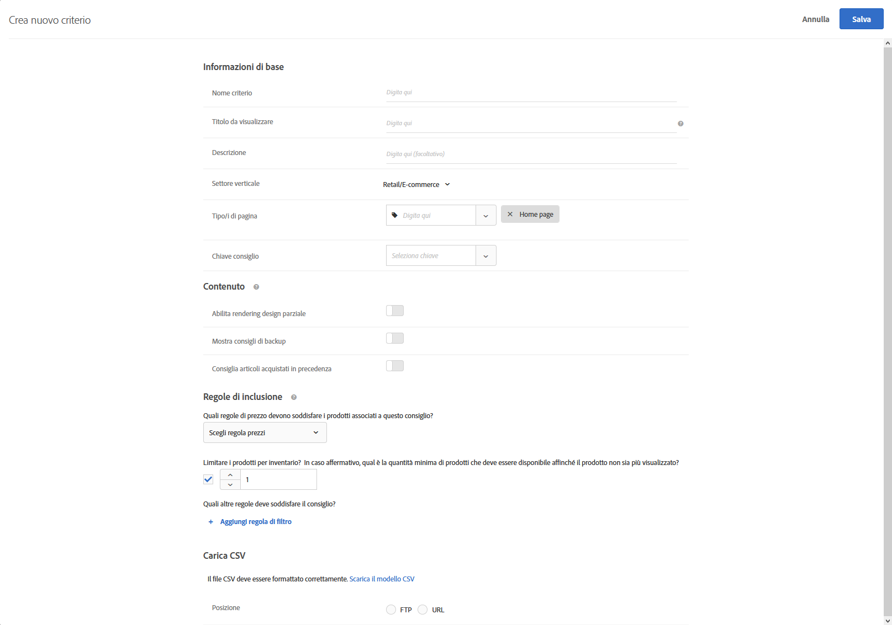

#  Caricare criteri personalizzati{#upload-custom-criteria}

Carica un file CSV per personalizzare i consigli.

Esistono diversi modi per raggiungere la schermata [!UICONTROL Crea nuovo criterio]. Alcune opzioni dipendono dal modo in cui si raggiunge la schermata.

* Quando crei un’attività di [!UICONTROL Consigli], fai clic su **[!UICONTROL Crea nuovo]** nella schermata [!UICONTROL Seleziona criteri]. Sarà possibile salvare i nuovi criteri da utilizzare per altre attività di [!UICONTROL Consigli].
* Quando modifichi un’attività [!UICONTROL Consigli], fai clic su una casella di [!UICONTROL Posizione consigli] nella pagina e seleziona **[!UICONTROL Cambia criteri]**. Nella schermata [!UICONTROL Seleziona criteri], fai clic su **[!UICONTROL Crea nuovo]**. Sarà possibile salvare i nuovi criteri da utilizzare per altre attività di [!UICONTROL Consigli].
* Nella schermata della libreria **[!UICONTROL Consigli]** > **[!UICONTROL Criteri]**, fai clic su **[!UICONTROL Crea criterio]**. I criteri creati vengono automaticamente resi disponibili per tutte le attività di [!UICONTROL Consigli].

1. Fai clic su **[!UICONTROL Crea criterio]**.

   

1. Seleziona **[!UICONTROL Carica criteri personalizzati]**.

   

1. Inserisci un **[!UICONTROL Nome criterio]**.

   Si tratta del nome “interno” usato per descrivere i criteri.  Ad esempio, potresti voler chiamare i tuoi criteri “prodotti di margine più alto”, ma non vuoi che questo titolo venga visualizzato pubblicamente. Vedi il passo successivo per impostare il titolo visualizzato dal pubblico.
1. Inserisci un **[!UICONTROL Titolo da visualizzare]**, che verrà mostrato nella pagina per i consigli che utilizzano questo criterio.

   Ad esempio, potresti voler visualizzare “Le persone che hanno visto questo, hanno visto anche” o “Prodotti simili”, quando utilizzi questo criterio per mostrare i consigli.
1. Inserisci una breve **[!UICONTROL descrizione]** dei criteri.

   La descrizione dovrebbe aiutare a identificare i criteri e potrebbe includere informazioni sul loro scopo.
1. Seleziona un **[!UICONTROL Settore verticale]**.

   Altre opzioni di criteri potrebbero variare a seconda della verticale di settore selezionata.

1. Seleziona un **[!UICONTROL tipo di pagina]**.

   Puoi selezionare più tipi di pagina.

   Insieme, tipi di pagina e verticali del settore vengono utilizzati per categorizzare i criteri salvati, semplificandone il riutilizzo per altre attività di [!UICONTROL Consigli].
1. Seleziona una **[!UICONTROL Chiave consiglio]**.

   Per ulteriori informazioni sui criteri basati su una chiave, consultate [Basare il consiglio su una Chiave consiglio](../../c-recommendations/c-algorithms/create-new-algorithm.md#task_2B0ED54AFBF64C56916B6E1F4DC0DC3B).
1. Imposta le regole di **[!UICONTROL contenuto]**.

   Le regole di contenuto determinano ciò che accade se il numero di elementi consigliati non riempie la progettazione. Ad esempio, se la progettazione dispone di spazio per cinque elementi, ma i criteri determinano solo tre elementi da consigliare, puoi lasciare vuoto lo spazio rimanente oppure utilizzare i consigli di backup per riempirlo. Seleziona i pulsanti appropriati. Consulta [Impostazioni di contenuto](../../c-recommendations/c-algorithms/create-new-algorithm.md#concept_BC16005C7A1E4F1A87E33D16221F4A96).
1. Imposta le **[!UICONTROL regole di inclusione]**.

   Le regole di inclusione consentono di restringere gli elementi visualizzati nei consigli. Consulta [Regole di inclusione](../../c-recommendations/c-algorithms/create-new-algorithm.md#task_28DB20F968B1451481D8E51BAF947079). 1. Seleziona la **[!UICONTROL posizione]** del file CSV.

   Il file CSV deve essere formattato correttamente per essere caricato con successo. Fai clic su **[!UICONTROL Scarica il modello CSV]** per ottenere un file CSV formattato correttamente.

   Puoi scegliere tra due opzioni di posizione:

   * **FTP:** per caricare il file CSV da un server FTP, seleziona **[!UICONTROL FTP]**, quindi inserisci le informazioni richieste. Hai la possibilità di scegliere SSL, che utilizza il protocollo FTPS per trasferire il file CSV in modo sicuro.
   * **URL:** per caricare il file CSV da un URL, seleziona **[!UICONTROL URL]**, quindi inserisci un URL di feed.

1. Fai clic su **[!UICONTROL Salva]**.

   >[!NOTE]
   >
   >Le entità di criteri personalizzati (righe) possono contenere fino a 1.000 elementi consigliati (colonne).

Gli aggiornamenti dei criteri personalizzati sono per impostazione predefinita “cumulativi”. Le nuove coppie chiave-valore specificate nel file di caricamento CSV sovrascrivono le coppie chiave-valore esistenti. Le coppie chiave-valore esistenti prive di chiavi specificate nel file CSV caricato continueranno a essere disponibili per la consegna e scadranno dopo 31 giorni, a partire dal momento in cui sono state caricate con il file CSV.

Contatta l&#39;assistenza clienti per consentire l&#39;eliminazione dei risultati esistenti non inclusi nel successivo caricamento CSV. Se questa impostazione è attivata, solo i tasti presenti nel file di feed CSV personalizzato saranno disponibili per la distribuzione. Questa impostazione si applica a tutti i criteri personalizzati.

I criteri personalizzati vengono aggiornati ogni 24 ore.

Puoi visualizzare lo stato di caricamento e sincronizzazione dei criteri personalizzati caricati nella parte inferiore di ogni scheda criteri nella pagina Consigli > Criteri. Puoi inoltre visualizzare lo stato nella finestra di dialogo Modifica durante la modifica dei criteri personalizzati.

Il flusso in caso di caricamento senza errori dovrebbe essere Programmato > Scarica file feed > Importazione > Corretto.

Di seguito sono riportati i possibili messaggi di errore che si potrebbero ricevere nel caso in cui Target abbia un problema durante il caricamento:

| Messaggio di errore | Dettagli |
|--- |--- |
| Errore sconosciuto | Indica un errore tecnico interno. |
| Errore di analisi | Probabilmente si è verificato un problema con il formato di file feed. Correggere il formato di file e salvare nuovamente l&#39;algoritmo, che riavvierà il processo di download dei file. |
| Server non trovato | Fornisci un IP o un nome host visibile su Internet. |
| Errore di credenziali | Fornisci un nome utente e una password validi per un account attivo sul server. |
| Directory non trovata | Fornisci una directory esistente sul server. |
| File non trovato | Fornisci il nome di un file sul server nella directory indicata. |

## Video di formazione: Creare i criteri in Recommendations (12:33) 

Questo video contiene le seguenti informazioni (i dettagli sul caricamento dei criteri personalizzati iniziano alle 11:43):

* Creare criteri
* Creare sequenze di criteri
* Caricare criteri personalizzati

>[!VIDEO](https://video.tv.adobe.com/v/27694?quality=12)