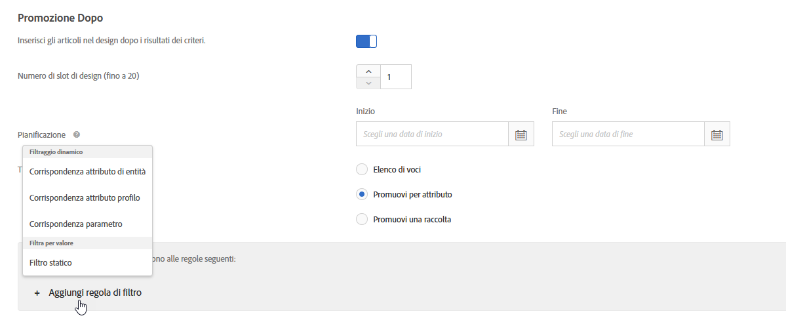

#  Utilizzare regole di inclusione dinamiche e statiche{#use-dynamic-and-static-inclusion-rules}

Informazioni su come creare regole di inclusione per criteri e promozioni e come aggiungere regole di filtro dinamiche o statiche per ottenere migliori risultati.

Le regole di inclusione per i criteri e le promozioni possono essere create e utilizzate con processi simili, così come sono simili i rispettivi casi ed esempi di utilizzo. Questo argomento tratta i criteri e le promozioni, nonché l’utilizzo delle regole di inclusione.

## Aggiunta di regole di filtro ai criteri {#section_CD0D74B8D3BE4A75A78C36CF24A8C57F}

Durante la [creazione di criteri](../../c-recommendations/c-algorithms/create-new-algorithm.md#task_8A9CB465F28D44899F69F38AD27352FE), fai clic su **[!UICONTROL Aggiungi regola di filtro]** in **[!UICONTROL Regole di inclusione]**.


Le opzioni disponibili dipendono dal settore verticale selezionato e della chiave consiglio.

## Aggiunta di regole di filtro alle promozioni {#section_D59AFB62E2EE423086281CF5D18B1076}

Durante la [creazione di una promozione](../../c-recommendations/t-create-recs-activity/adding-promotions.md#task_CC5BD28C364742218C1ACAF0D45E0E14), seleziona **[!UICONTROL Promuovi per attributo]**, quindi fai clic su **[!UICONTROL Aggiungi regola filtro]**.



## Tipi di filtro {#section_0125F1ED10A84C0EB45325122460EBCD}

Nella tabella seguente sono elencati i tipi di opzioni di filtro per criteri e promozioni:

| Tipo | Opzione | Operatori disponibili |
|--- |--- |--- |
| **Filtraggio dinamico** | **Corrispondenza attributo di entità:** consente di filtrare in modo dinamico confrontando un pool di potenziali articoli consigliati con un articolo specifico con cui gli utenti hanno interagito.<br>Ad esempio, per consigliare solo gli articoli con lo stesso marchio dell’articolo corrente. | uguale a<br>non uguale a<br>compreso tra<br>contiene<br>non contiene<br>inizia con<br>termina con<br>valore presente<br>valore non presente<br>maggiore o uguale a<br>minore o uguale a |
|  | **Corrispondenza attributo profilo:** consente di filtrare dinamicamente confrontando gli articoli (entità) con un valore presente nel profilo dell’utente.<br>Ad esempio, per consigliare solo gli articoli del marchio preferito del visitatore. | uguale a<br> non uguale a<br>contiene<br>non contiene<br>inizia con<br>termina con<br>maggiore o uguale a<br>minore o uguale a<br>compreso tra |
|  | **Corrispondenza parametro:** consente di filtrare dinamicamente confrontando gli articoli (entità) con un valore nella richiesta (API o mbox).<br>Ad esempio, per consigliare solo i contenuti che corrispondono al parametro di pagina “settore”.<br>**Importante:**se l’attività è stata creata prima del 31 ottobre 2016, la sua consegna avrà esito negativo se si utilizza il filtro “Corrispondenza parametro”. Per risolvere questo problema:<ul><li>Crea una nuova attività e aggiungi i relativi criteri.</li><li>Utilizza un criterio che non contenga il filtro “Corrispondenza parametro”.</li><li>Rimuovi il filtro “Corrispondenza parametro” dai criteri.</li></ul> | è uguale a<br>non uguale a<br>contiene<br>non contiene<br>inizia con<br>termina con<br>maggiore o uguale a<br>minore o uguale a<br>compreso tra |
| **Filtra per valore** | **Filtro statico:** consente di immettere manualmente uno o più valori statici da utilizzare come filtro.<br>Ad esempio, per consigliare solo i contenuti con una classificazione MPAA di “G” o “PG”. | uguale a<br>non uguale a<br>contiene<br>non contiene<br>inizia con<br>termina con<br>valore presente<br>valore non presente<br>maggiore o uguale a<br>minore o uguale a |

>[!NOTE]
>
>Se hai dimestichezza con la configurazione delle regole di inclusione prima della versione di Target 17.6.1 (giugno 2017), noterai che alcune delle opzioni e degli operatori sono cambiati. Vengono visualizzati solo gli operatori applicabili all’opzione selezionata; alcuni altri operatori sono stati rinominati (“corrisponde a” è ora “è uguale a”), per maggiore coerenza e intuitività. Tutte le regole di esclusione esistenti create prima di questa versione sono state automaticamente convertite nella nuova struttura. Non è necessaria alcuna modifica da parte dell’utente.

È possibile creare tutte le regole di inclusione necessarie. Le regole di inclusione vengono collegate mediante un operatore E. Gli articoli verranno inclusi in un consiglio solo se vengono soddisfatte tutte le regole.

I criteri e le promozioni dinamici sono molto più potenti dei criteri e delle promozioni statici; producono risultati migliore e un maggiore coinvolgimento del visitatore. I seguenti esempi ti daranno idee su come utilizzare le promozioni dinamiche nelle tue attività di marketing:

**È uguale a:** utilizzando l&#39;operatore “è uguale a” nelle promozioni dinamiche, quando un visitatore sta visualizzando un articolo sul tuo sito web (ad esempio un prodotto, un articolo o un filmato), puoi promuovere altri oggetti appartenenti a:

* lo stesso marchio
* la stessa categoria
* la stessa categoria E lo stesso marchio
* lo stesso store

**È diverso da:** utilizzando l&#39;operatore “è diverso da” nelle promozioni dinamiche, quando un visitatore sta visualizzando un articolo sul tuo sito web (ad esempio un prodotto, un articolo o un filmato), puoi promuovere altri articoli appartenenti a:

* una serie TV diversa
* un genere diverso
* una serie di prodotti diversi
* un ID di stile diverso

**È tra:** utilizzando l&#39;operatore “è tra” nelle promozioni dinamiche, quando un visitatore sta visualizzando un articolo sul tuo sito web (ad esempio un prodotto, un articolo o un filmato), puoi promuovere altri articoli che sono:

* più costosi
* meno costosi
* più o meno costosi del 30%
* episodi successivi nella stessa stagione
* libri precedenti in una collana

## Gestione dei valori vuoti durante l’applicazione di filtri per corrispondenza attributo entità, attributo profilo e parametri {#section_7D30E04116DB47BEA6FF840A3424A4C8}

È possibile scegliere diverse opzioni per gestire i valori vuoti durante l&#39;applicazione di filtri per corrispondenza attributo entità, corrispondenza attributo profilo e corrispondenza parametro per i criteri e le promozioni di uscita.

In precedenza, non veniva restituito alcun risultato se un valore era vuoto. L&#39;elenco a discesa “Se *x* è vuoto” consente di scegliere l&#39;azione da eseguire se i criteri hanno valori vuoti, come illustrato di seguito:


Per selezionare l’azione desiderata, passa il puntatore sull’icona ingranaggio (), quindi scegli l’azione desiderata:

| Azione | Disponibile per | Dettagli |
|--- |--- |--- |
| Ignora questa regola di filtro | Corrispondenza attributo profilo<br>Corrispondenza parametro | Questa è l&#39;azione predefinita per Corrispondenza attributo profilo e Corrispondenza parametro.<br>Questa opzione specifica che la regola viene ignorata. Ad esempio, se sono presenti tre regole di filtro e la terza regola non passa alcun valore, invece di non restituire alcun risultato si può semplicemente ignorare la terza regola con valori vuoti. |
| Non mostrare alcun risultato per questo criterio | Corrispondenza attributo entità<br>Corrispondenza attributo profilo<br>Corrispondenza parametro | Questa è l&#39;azione predefinita per Corrispondenza attributo entità.<br>Corrisponde al modo in cui Target gestiva i valori vuoti prima dell’aggiunta di questa opzione, ossia non verrà visualizzato alcun risultato per questo criterio. |
| Usa un valore statico | Corrispondenza attributo entità<br>Corrispondenza attributo profilo<br>Corrispondenza parametro | Se un valore è vuoto, è possibile scegliere di utilizzare un valore statico. |

## Esempi di corrispondenza attributi profilo {#section_9873E2F22E094E479569D05AD5BB1D40}

[!UICONTROL La corrispondenza] attributi profilo consente di consigliare solo gli elementi che corrispondono a un attributo del profilo del visitatore, come negli esempi seguenti.

**Esempio 1: Consigliando gli elementi dal marchio** preferito dell&#39;utente. Ad esempio, potete utilizzare l&#39;opzione Corrispondenza [!UICONTROL attributi] profilo per creare una regola che consiglia gli elementi solo se il marchio è uguale al valore o al testo memorizzato in `profile.favoritebrand`. Con tale regola, se un visitatore cerca dei pantaloncini da corsa di una data marca, i consigli che verranno visualizzati proporranno articoli della marca preferita dell’utente (in base al valore memorizzato in `profile.favoritebrand` nel profilo del visitatore).

```
Profile Attribute Matching
brand - equals - the value/text stored in - profile.favoritebrand
```

**Esempio 2: Associare i lavori a chi cerca** lavoro Supponiamo che tu stia cercando di abbinare i lavori a chi cerca lavoro. Si consiglia solo i lavori che si trovano nella stessa città di chi cerca lavoro.

Potete utilizzare le regole di inclusione per far corrispondere la posizione di un cercatore di lavoro dal profilo del visitatore a un elenco di processi, come nell&#39;esempio seguente:

```
Profile Attribute Matching
jobCity - equals - the value/text stored in - profile.usersCity
```

## Esempi di corrispondenza attributi entità

[!UICONTROL La corrispondenza] attributi entità consente di consigliare solo gli elementi che corrispondono a un attributo dell&#39;elemento che l&#39;utente sta visualizzando, l&#39;elemento visualizzato più di recente dall&#39;utente, l&#39;elemento acquistato più di recente dall&#39;utente, l&#39;elemento visualizzato più di frequente dall&#39;utente o da un elemento memorizzato in un attributo personalizzato nel profilo del visitatore, come negli esempi seguenti.

**Esempio 3: Rivendita a un prodotto** più costoso Supponiamo che tu sia un rivenditore di abbigliamento e che desideri incoraggiare gli utenti a considerare articoli più costosi e quindi più redditizi. È possibile utilizzare gli operatori &quot;uguale&quot; e &quot;è tra&quot; per promuovere elementi più costosi appartenenti alla stessa categoria e allo stesso marchio. Ad esempio, un visitatore che vede un&#39;azienda in esecuzione può promuovere scarpe da corsa più costose nel tentativo di vendere un visitatore che guarda scarpe da corsa.

```
Entity Attribute Matching
category - equals - current item's - category 
And 
Entity Attribute Matching
brand - equals - current item's - brand 
And 
Entity Attribute Matching
value - is between - 100% and 1000% of - current item's - value
```

**Esempio 4: Promozione dei prodotti** con etichette privateÈ possibile combinare filtri dinamici e statici per promuovere i prodotti con etichette private. Ad esempio, una società di fornitura di uffici può promuovere le cartucce toner del marchio della casa dell&#39;azienda per condurre una vendita più redditizia per un visitatore che guarda il toner — e promuovere penne del marchio della casa dell&#39;azienda per guidare una vendita più redditizia per un visitatore che guarda le penne.

```
Entity Attribute Matching
category - equals - current item's - category 
And
Static Filter
IsHouseBrand - equals - true
```

## Avvertenze {#section_A889FAF794B7458CA074DEE06DD0E345}

>[!IMPORTANT]
>
>Gli attributi di tipi di dati diversi potrebbero non essere compatibili nelle promozioni o nei criteri dinamici in fase di esecuzione con gli operatori “è uguale a” e “è diverso da”. Si consiglia di utilizzare con attenzione i valori Valore, Margine, Inventario e Ambiente sul lato destro se a sinistra sono presenti attributi predefiniti o personalizzati.


Nella tabella seguente vengono mostrate regole efficaci e regole che potrebbero invece non essere compatibili in fase di esecuzione:

| Regole compatibili | Regole potenzialmente non compatibili |
|--- |--- |
| value - è tra - 90% e 110% dell’articolo corrente - salesValue | salesValue - è tra - 90% e 110% dell’articolo corrente - value |
| value - è tra - 90% e 110% dell’articolo corrente - value | clearancePrice - è tra - 90% e 110% dell’articolo corrente - margin |
| margin - è tra - 90% e 110% dell’articolo corrente - margin | storeInventory - è uguale a - dell’articolo corrente - inventory |
| inventory - è uguale a - dell’articolo corrente - inventory |  |
