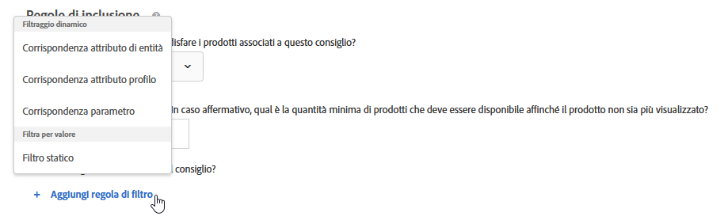
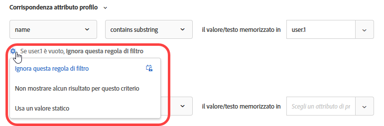
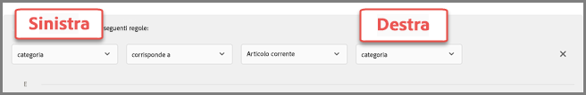

#  Utilizzare regole di inclusione dinamiche e statiche{#use-dynamic-and-static-inclusion-rules}

Information about creating inclusion rules for criteria and promotions in [!DNL Adobe Target] and adding additional dynamic or static filtering rules to achieve better results for your recommendations.

Le regole di inclusione per i criteri e le promozioni possono essere create e utilizzate con processi simili, così come sono simili i rispettivi casi ed esempi di utilizzo. Sia i criteri che le promozioni e l&#39;uso delle regole di inclusione sono trattati in questa sezione.

## Aggiunta di regole di filtro ai criteri {#section_CD0D74B8D3BE4A75A78C36CF24A8C57F}

Durante la [creazione di criteri](../../c-recommendations/c-algorithms/create-new-algorithm.md#task_8A9CB465F28D44899F69F38AD27352FE), fai clic su **[!UICONTROL Aggiungi regola di filtro]** in **[!UICONTROL Regole di inclusione]**.

Le opzioni disponibili dipendono dal settore verticale selezionato e della chiave consiglio.

## Aggiunta di regole di filtro alle promozioni {#section_D59AFB62E2EE423086281CF5D18B1076}

Durante la [creazione di una promozione](../../c-recommendations/t-create-recs-activity/adding-promotions.md#task_CC5BD28C364742218C1ACAF0D45E0E14), seleziona **[!UICONTROL Promuovi per attributo]**, quindi fai clic su **[!UICONTROL Aggiungi regola filtro]**.

## Tipi di filtro {#section_0125F1ED10A84C0EB45325122460EBCD}

Nelle sezioni seguenti sono elencati i tipi di opzioni di filtro per criteri e promozioni, Filtro dinamico e Filtro per valore:

### Filtraggio dinamico

Le regole di inclusione dinamica sono più potenti delle regole di inclusione statica e producono risultati e coinvolgimento migliori. Considera i seguenti aspetti:

* Le regole di inclusione dinamica distribuiscono le raccomandazioni facendo corrispondere un attributo nel parametro di profilo di un utente o in una chiamata mbox.

   Ad esempio, potete creare una raccomandazione &quot;Most Popular Criteria&quot; (Criteri più comuni) e quindi del set di raccomandazioni restituite, escluderne una in tempo reale rispetto a un attributo passato quando l&#39;utente accede a una pagina in cui vengono visualizzate le raccomandazioni.

* Utilizzate le regole statiche per limitare gli elementi inclusi nella raccomandazione (invece delle raccolte).

* Potete creare tutte le regole di inclusione dinamica necessarie. Le regole di inclusione vengono collegate mediante un operatore E. Gli articoli verranno inclusi in un consiglio solo se vengono soddisfatte tutte le regole.

Per il filtro dinamico sono disponibili le seguenti opzioni:

| Filtro dinamico, opzione | Dettagli |
| --- | --- |
| [Corrispondenza attributo entità](/help/c-recommendations/c-algorithms/entity-attribute-matching.md) | Filtrare in modo dinamico confrontando un insieme di potenziali elementi delle raccomandazioni con un elemento specifico con cui gli utenti hanno interagito. Utilizzate Corrispondenza attributi entità per mostrare le raccomandazioni più probabili per il visitatore, ad esempio il marchio preferito del visitatore. |
| [Corrispondenza attributo profilo](/help/c-recommendations/c-algorithms/profile-attribute-matching.md) | Filtrare in modo dinamico confrontando elementi (entità) con un valore nel profilo dell&#39;utente. Utilizzate la corrispondenza [!UICONTROL attributo] profilo per mostrare le raccomandazioni che corrispondono a un valore memorizzato nel profilo del visitatore, ad esempio dimensione o marchio preferito. |
| [Corrispondenza parametro](/help/c-recommendations/c-algorithms/parameter-matching.md) | Filtrare in modo dinamico confrontando elementi (entità) con un valore nella richiesta (API o mbox). Utilizzate la corrispondenza dei parametri per raccomandare il contenuto che corrisponda ai parametri della pagina o dei visitatori, come le dimensioni del dispositivo o la geolocalità. |

### Filtra per valore

L&#39;opzione seguente è disponibile per filtrare in base al valore:

| Opzione Filtraggio per valore | Dettagli |
| --- | --- |
| [Filtro statico](/help/c-recommendations/c-algorithms/static-value.md) | Immettere manualmente uno o più valori statici da filtrare. |

## Criteri dinamici ed esempi di promozione

I criteri e le promozioni dinamici sono molto più potenti dei criteri e delle promozioni statici; producono risultati migliore e un maggiore coinvolgimento del visitatore.

Gli esempi seguenti illustrano come utilizzare le promozioni dinamiche nelle attività di marketing:

### È uguale a

Utilizzando l&#39;operatore &quot;uguale&quot; nelle promozioni dinamiche, quando un visitatore visualizza un elemento sul sito Web (ad esempio un prodotto, un articolo o un filmato) potete promuovere altri elementi da:

* lo stesso marchio
* la stessa categoria
* la stessa categoria E lo stesso marchio
* lo stesso store

### Non uguale

Utilizzando l&#39;operatore &quot;non uguale&quot; nelle promozioni dinamiche, quando un visitatore visualizza un elemento sul sito Web (ad esempio un prodotto, un articolo o un filmato) potete promuovere altri elementi da:

* una serie TV diversa
* un genere diverso
* una serie di prodotti diversi
* un ID di stile diverso

### È tra

Utilizzando l&#39;operatore &quot;è compreso&quot; nelle promozioni dinamiche, quando un visitatore visualizza un elemento sul sito Web (ad esempio un prodotto, un articolo o un filmato) potete promuovere altri elementi:

* più costosi
* meno costosi
* più o meno costosi del 30%
* episodi successivi nella stessa stagione
* libri precedenti in una collana

## Handling empty values when filtering by Entity Attribute Matching, Profile Attribute Matching, and Parameter Matching {#section_7D30E04116DB47BEA6FF840A3424A4C8}

You can choose several options to handle empty values when filtering by [!UICONTROL Entity Attribute Matching], [!UICONTROL Profile Attribute Matching], and [!UICONTROL Parameter Matching] for exit criteria and promotions.

In precedenza, non veniva restituito alcun risultato se un valore era vuoto. L&#39;elenco a discesa “Se *x* è vuoto” consente di scegliere l&#39;azione da eseguire se i criteri hanno valori vuoti, come illustrato di seguito:

Per selezionare l’azione desiderata, passa il puntatore sull’icona ingranaggio (), quindi scegli l’azione desiderata:

| Azione | Disponibile per | Dettagli |
|--- |--- |--- |
| Ignora questa regola di filtro | Corrispondenza attributo profilo Corrispondenza parametro | Questa è l&#39;azione predefinita per Corrispondenza attributo profilo e Corrispondenza parametro. Questa opzione specifica che la regola viene ignorata. Ad esempio, se sono presenti tre regole di filtro e la terza regola non passa alcun valore, invece di non restituire alcun risultato si può semplicemente ignorare la terza regola con valori vuoti. |
| Non promuovere alcun elemento | Corrispondenza attributo di entità con attributo di profilo di profilo | Questa è l&#39;azione predefinita per Corrispondenza attributo entità. [!DNL Target]Corrisponde al modo in cui gestiva i valori vuoti prima dell’aggiunta di questa opzione, ossia non verrà visualizzato alcun risultato per questo criterio. |
| Usa un valore statico | Corrispondenza attributo entità Corrispondenza attributo profilo Corrispondenza parametro | Se un valore è vuoto, è possibile scegliere di utilizzare un valore statico. |

## Avvertenze {#section_A889FAF794B7458CA074DEE06DD0E345}

>[!IMPORTANT]
>
>Gli attributi di tipi di dati diversi potrebbero non essere compatibili nelle promozioni o nei criteri dinamici in fase di esecuzione con gli operatori “è uguale a” e “è diverso da”. You should use [!UICONTROL Value], [!UICONTROL Margin], [!UICONTROL Inventory], and [!UICONTROL Environment] values wisely on the right hand side if the left hand side has predefined attributes or custom attributes.

Nella tabella seguente vengono mostrate regole efficaci e regole che potrebbero invece non essere compatibili in fase di esecuzione:

| Regole compatibili | Regole potenzialmente non compatibili |
|--- |--- |
| value - è tra - 90% e 110% dell’articolo corrente - salesValue | salesValue - è tra - 90% e 110% dell’articolo corrente - value |
| value - è tra - 90% e 110% dell’articolo corrente - value | clearancePrice - è tra - 90% e 110% dell’articolo corrente - margin |
| margin - è tra - 90% e 110% dell’articolo corrente - margin | storeInventory - è uguale a - dell’articolo corrente - inventory |
| inventory - è uguale a - dell’articolo corrente - inventory |  |
